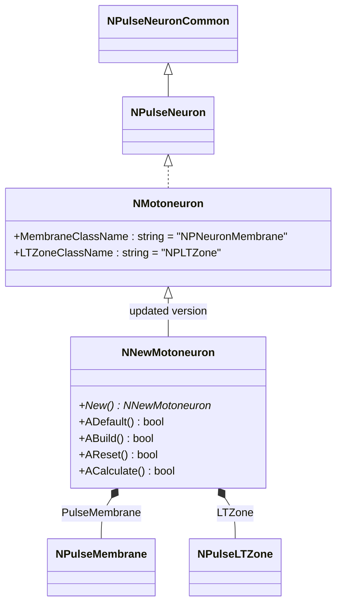
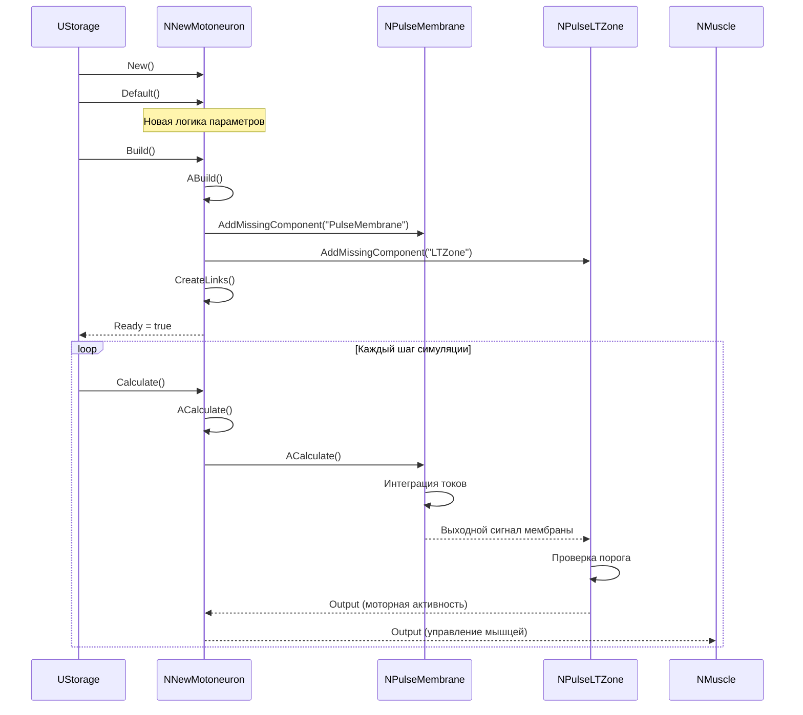
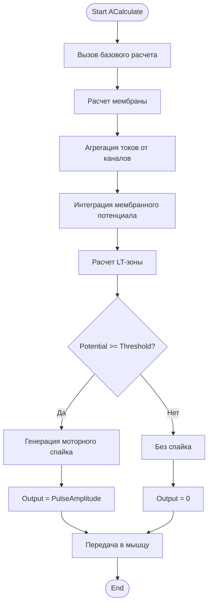
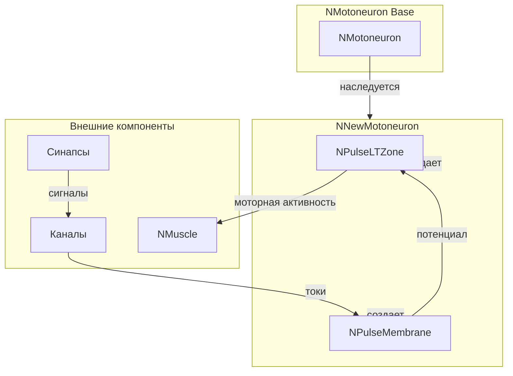
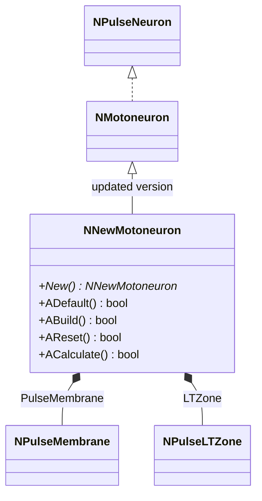
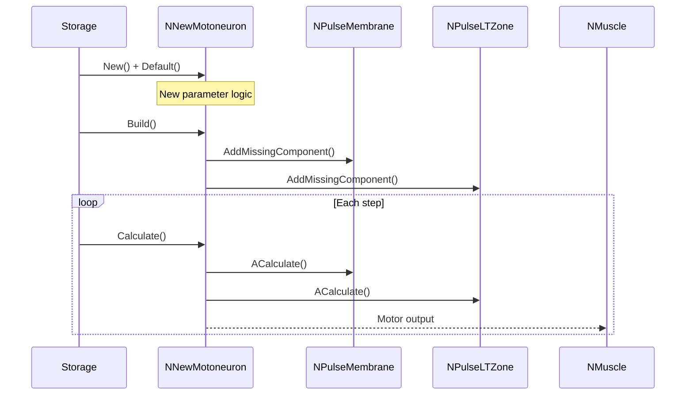
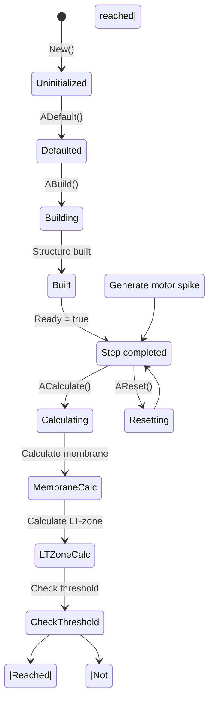
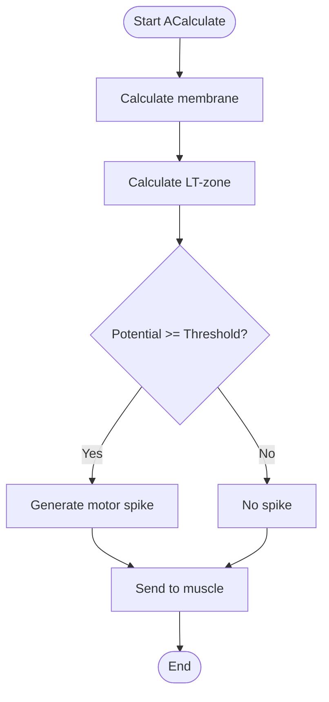
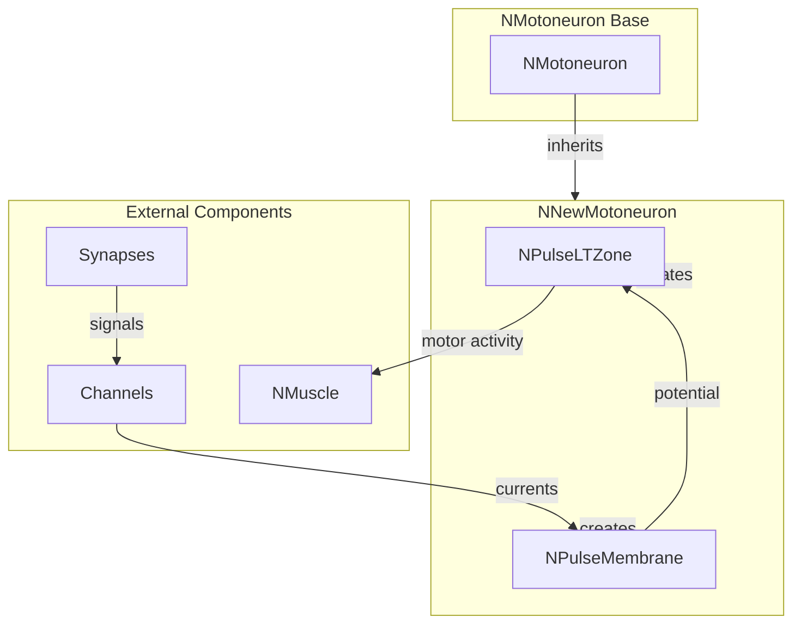

# NNewMotoneuron — новая версия мотонейрона

## RU

### Назначение

**Класс**: `NNewMotoneuron` — обновлённая модель мотонейрона с улучшенной архитектурой.  
**Регистрация**: `NPulseLibrary.cpp` → `UploadClass("NNewMotoneuron", ...)`.  
**Storage-инстансы**: `ClassName = "NNewMotoneuron"` в `Bin/Configs/*/Model_*.xml`.

`NNewMotoneuron` является обновлённой версией базового класса `NMotoneuron` для моделирования мотонейронов (двигательных нейронов) с улучшенной логикой и архитектурой. Наследуется от `NMotoneuron` и предоставляет обновлённую реализацию мотонейрона с оптимизированными параметрами.

Мотонейроны преобразуют входные сигналы в моторную активность для управления мышцами и движениями.

**Использование:** Моделирование двигательных систем, управление мышцами с улучшенной архитектурой

### UML-диаграмма классов



**Иерархия наследования:**
- `NPulseNeuronCommon` — общий импульсный нейрон
- `NPulseNeuron` — импульсный нейрон с параметрами структурирования
- `NMotoneuron` — базовый мотонейрон
- `NNewMotoneuron` — обновлённая версия мотонейрона

**Внутренняя структура:**
- **PulseMembrane** (`NPulseMembrane`) — мембрана нейрона
- **LTZone** (`NPulseLTZone`) — LT-зона для генерации спайков

### UML-диаграмма последовательности



**Жизненный цикл:**
1. **Инициализация**: `ADefault()` — установка параметров мотонейрона с новой логикой
2. **Сборка**: `ABuild()` — подключение входов/синапсов
3. **Расчет**: `ACalculate()` — расчёт моторной активности
4. **Сброс**: `AReset()` — сброс состояния

### UML-диаграмма состояний

```mermaid
stateDiagram-v2
    [*] --> Uninitialized: New()
    Uninitialized --> Defaulted: ADefault()
    Note over Defaulted: Новая логика параметров
    Defaulted --> Building: ABuild()
    Building --> CreatingMembrane: Создание мембраны
    CreatingMembrane --> CreatingLTZone: Создание LT-зоны
    CreatingLTZone --> Linking: Подключение входов/синапсов
    Linking --> Built: Структура построена
    Built --> Ready: Ready = true
    Ready --> Calculating: ACalculate()
    Calculating --> MembraneCalc: Расчет мембраны
    MembraneCalc --> LTZoneCalc: Расчет LT-зоны
    LTZoneCalc --> CheckThreshold: Проверка порога
    CheckThreshold -->|Порог достигнут| MotorSpike: Генерация моторного спайка
    CheckThreshold -->|Порог не достигнут| Ready: Шаг завершен
    MotorSpike --> Ready
    Ready --> Resetting: AReset()
    Resetting --> Ready: Состояния сброшены
```

**Состояния:**
- **Uninitialized** — создан, но не инициализирован
- **Defaulted** — параметры установлены с новой логикой
- **Building** — выполняется сборка структуры
- **CreatingMembrane** — создание мембраны
- **CreatingLTZone** — создание LT-зоны
- **Linking** — подключение входов/синапсов
- **Built** — структура мотонейрона построена
- **Ready** — готов к выполнению расчетов
- **Calculating** — выполняется расчет мотонейрона
- **MembraneCalc** — расчет мембраны (интеграция токов)
- **LTZoneCalc** — расчет LT-зоны
- **CheckThreshold** — проверка достижения порога
- **MotorSpike** — генерация моторного спайка
- **Resetting** — выполняется сброс состояний

### UML-диаграмма активности



**Алгоритм расчета:**
1. Вызов базового расчета
2. Расчет мембраны: агрегация токов от каналов, интеграция потенциала
3. Расчет LT-зоны: проверка порога генерации спайка
4. Генерация моторного спайка при достижении порога
5. Передача моторной активности мышцам для управления движением

### UML-диаграмма компонентов



**Зависимости:**
- **Базовый класс**: `NMotoneuron` (обновлённая версия)
- **Внутренние компоненты**: `NPulseMembrane` (мембрана), `NPulseLTZone` (LT-зона)
- **Внешние компоненты**: каналы (`NPulseChannel*`), синапсы (`NPulseSynapse*`), мышцы (`NMuscle`)

### Свойства

`NNewMotoneuron` наследует все свойства базового класса `NMotoneuron` с обновлённой логикой инициализации.

**Публичные свойства:**
- `ActivePosInputs` (MDMatrix<double>) — матрица активных положительных входов
- `ActiveNegInputs` (MDMatrix<double>) — матрица активных отрицательных входов
- `ActiveOutputs` (MDMatrix<double>) — матрица активных выходов
- `Activity` (double) — активность нейрона
- `Output` (MDMatrix<double>) — выходной сигнал (моторная активность)

### Методы

#### Публичные методы

- **`New()`** → `NNewMotoneuron*` — создает новый экземпляр класса

#### Защищенные методы

- **`ADefault()`** → `bool` — инициализирует параметры мотонейрона с новой логикой
- **`ABuild()`** → `bool` — строит структуру нейрона, подключает входы/синапсы
- **`AReset()`** → `bool` — сбрасывает состояния нейрона
- **`ACalculate()`** → `bool` — выполняет расчёт моторной активности на одном шаге

### Примеры использования

#### Пример 1: Создание нового мотонейрона в коде C++

```cpp
// Создание нового мотонейрона
auto motoneuron = storage->CreateComponent("NNewMotoneuron");
motoneuron->SetName("NewMotoneuron1");

// Инициализация (использует новую логику параметров)
motoneuron->Default();

// Сборка
motoneuron->Build();

// Использование
for (int step = 0; step < 1000; step++) {
    motoneuron->Calculate();
    double motorOutput = motoneuron->Output(0, 0);
    // Передача моторной активности мышце
}
```

#### Пример 2: Конфигурация XML

```xml
<NewMotoneuron1 Class="NNewMotoneuron">
    <Parameters>
        <!-- Параметры наследуются от NMotoneuron -->
    </Parameters>
</NewMotoneuron1>
```

### Использование в конфигурациях

`NNewMotoneuron` используется в экспериментах с двигательными системами:

- **Мотонейроны**: `Bin/Configs/!OldConfigs/OldExperiments/Motoneuron/`
- **Управление движением**: `Bin/Configs/!OldConfigs/OldExperiments/MotionControl/`

**Особенности:**
- Обновлённая логика: улучшенная инициализация параметров
- Оптимизированная архитектура: более эффективная обработка сигналов
- Совместимость: наследует функциональность базового `NMotoneuron`

### См. также

- [`NMotoneuron`](NMotoneuron.md) — базовый мотонейрон
- [`NPulseNeuron`](NPulseNeuron.md) — импульсный нейрон с параметрами структурирования
- [`NMuscle`](NMuscle.md) — мышца (получатель моторной активности)
- [Architecture.md](../Architecture.md) — архитектура библиотеки

---

## EN

### Purpose

**Class**: `NNewMotoneuron` — updated motor neuron model with improved architecture.  
**Registration**: `NPulseLibrary.cpp` → `UploadClass("NNewMotoneuron", ...)`.  
**Instances**: `ClassName = "NNewMotoneuron"` in `Bin/Configs/*/Model_*.xml`.

`NNewMotoneuron` is an updated version of the base class `NMotoneuron` for modeling motor neurons with improved logic and architecture. Inherits from `NMotoneuron` and provides an updated implementation of motor neuron with optimized parameters.

Motor neurons convert input signals into motor activity for controlling muscles and movements.

**Usage:** Modeling motor systems, muscle control with improved architecture

### UML Class Diagram



### UML Sequence Diagram



### UML State Diagram



### UML Activity Diagram



### UML Component Diagram



### Properties

`NNewMotoneuron` inherits all properties of base class `NMotoneuron` with updated initialization logic.

**Public properties:**
- `ActivePosInputs` (MDMatrix<double>) — matrix of active positive inputs
- `ActiveNegInputs` (MDMatrix<double>) — matrix of active negative inputs
- `ActiveOutputs` (MDMatrix<double>) — matrix of active outputs
- `Activity` (double) — neuron activity
- `Output` (MDMatrix<double>) — output signal (motor activity)

### Methods

#### Public methods

- **`New()`** → `NNewMotoneuron*` — creates new instance of the class

#### Protected methods

- **`ADefault()`** → `bool` — initializes motor neuron parameters with new logic
- **`ABuild()`** → `bool` — builds neuron structure, connects inputs/synapses
- **`AReset()`** → `bool` — resets neuron states
- **`ACalculate()`** → `bool` — calculates motor activity for one step

### Usage in configurations

`NNewMotoneuron` is used in motor system experiments:

- **Motor neurons**: `Bin/Configs/!OldConfigs/OldExperiments/Motoneuron/`
- **Motion control**: `Bin/Configs/!OldConfigs/OldExperiments/MotionControl/`

**Features:**
- Updated logic: improved parameter initialization
- Optimized architecture: more efficient signal processing
- Compatibility: inherits functionality from base `NMotoneuron`

### See Also

- [`NMotoneuron`](NMotoneuron.md) — base motor neuron
- [`NPulseNeuron`](NPulseNeuron.md) — spiking neuron with structuring parameters
- [`NMuscle`](NMuscle.md) — muscle (receiver of motor activity)
- [Architecture.md](../Architecture.md) — library architecture
