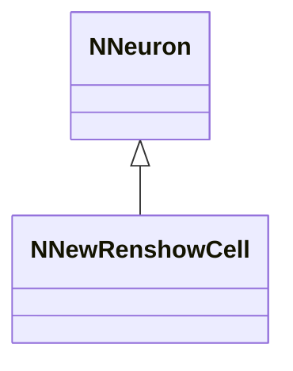
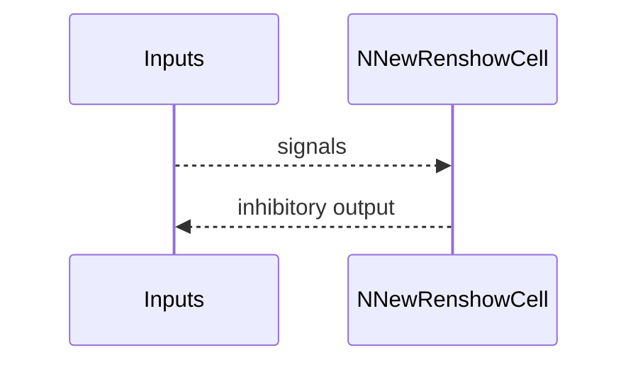
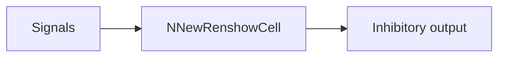

## NNewRenshowCell — новая клетка Реншоу

**Класс**: `NNewRenshowCell` — обновлённая модель клетки Реншоу (ингибирующий интернейрон).  
**Регистрация**: `NPulseLibrary.cpp` → `UploadClass("NNewRenshowCell", ...)`.  
**Storage**: `ClassName = "NNewRenshowCell"`.

### Lifecycle
- **ADefault**: параметры клетки Реншоу (новая реализация).
- **ABuild**: подключение входов/синапсов.
- **AReset**: сброс состояния.
- **ACalculate**: расчёт тормозного ответа.

### I/O
- Вход: сигналы/токи.
- Выход: ингибирующая активность/спайк.



Пояснение: диаграмма классов показывает место компонента в иерархии и ключевые связи.



Пояснение: диаграмма последовательности показывает типовой сценарий взаимодействия и порядок вызовов.



Пояснение: блок-схема показывает поток данных/сигналов (входы → компонент → выходы).

### Config snippet

```ini
[Component]
ClassName = NNewRenshowCell
Name = NewRenshow1
```

---

## NNewRenshowCell — new Renshaw cell (EN)

Updated Renshaw cell variant producing inhibitory output.


Description: this class diagram shows the component position in the type hierarchy and key relations.


Description: this sequence diagram shows a typical runtime interaction and call order.


Description: this flowchart shows the data/signal flow (inputs → component → outputs).
