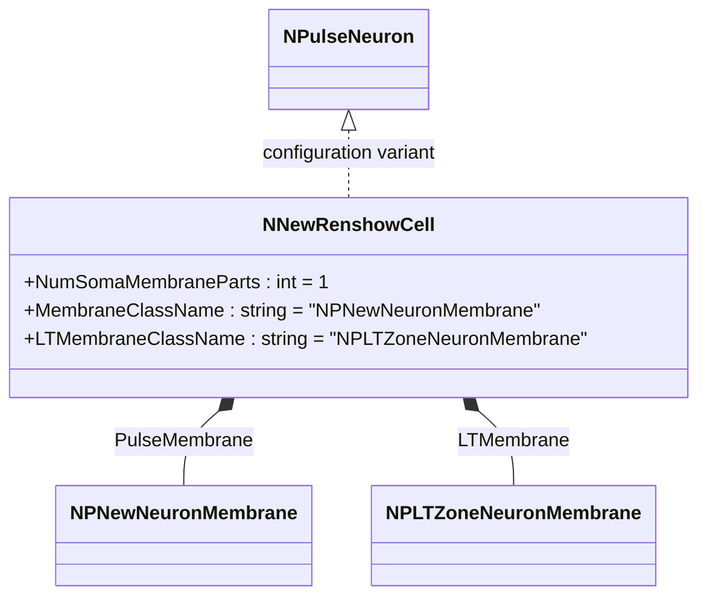
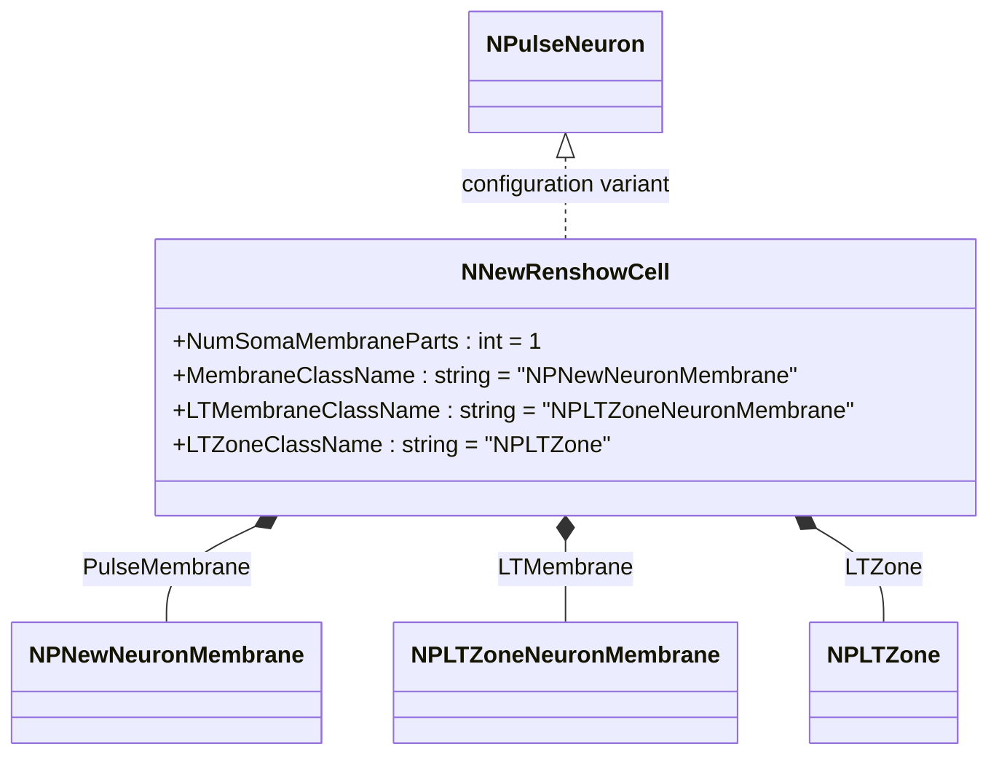
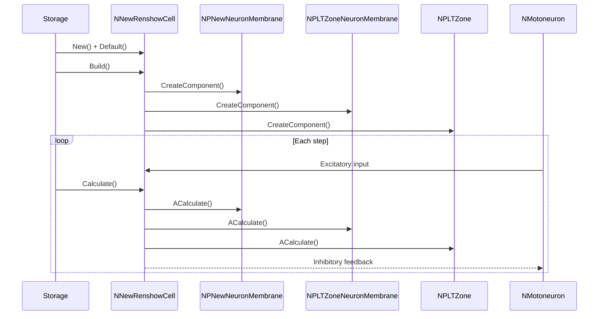
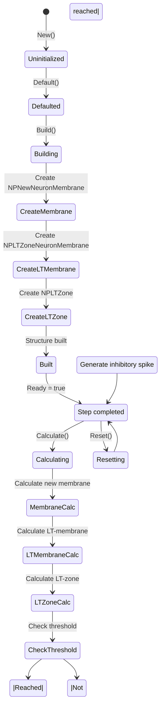
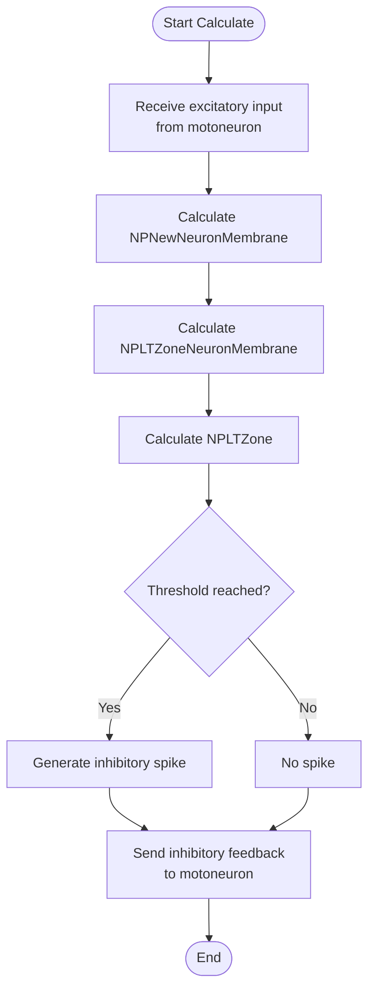
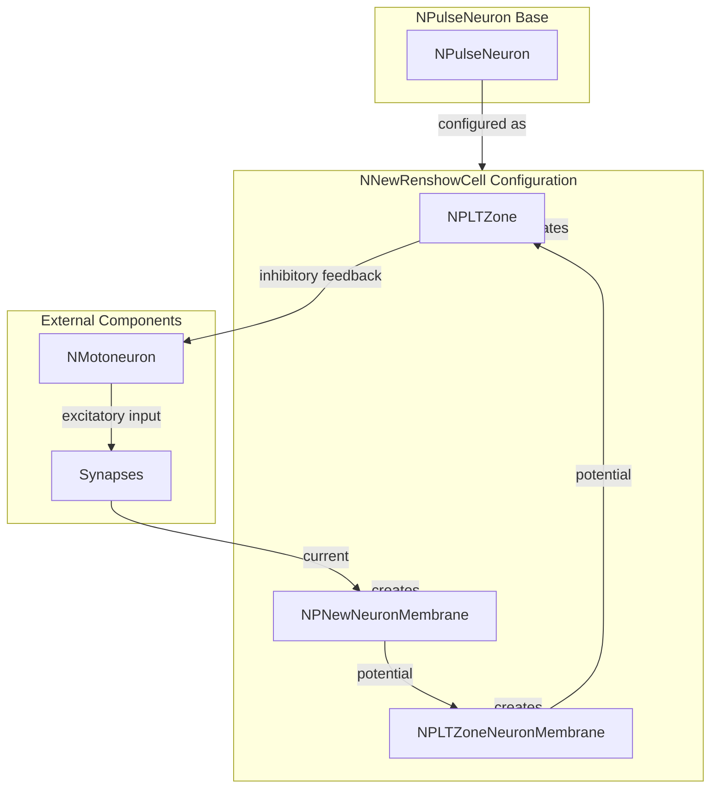

# NNewRenshowCell — новая клетка Реншоу

## RU

### Назначение

**Класс**: `NNewRenshowCell` — конфигурационный вариант новой клетки Реншоу (ингибирующий интернейрон) с улучшенной архитектурой.  
**Регистрация**: `NPulseLibrary.cpp` → `UploadClass("NNewRenshowCell", ...)`.  
**Storage-инстансы**: `ClassName = "NNewRenshowCell"` в `Bin/Configs/*/Model_*.xml`.

`NNewRenshowCell` является конфигурационным вариантом базового класса `NPulseNeuron` для моделирования клеток Реншоу — ингибирующих интернейронов, которые обеспечивают реципрокное торможение мотонейронов. Создается из `NPulseNeuron` с настройками:
- `NumSomaMembraneParts = 1` — одна часть сомы
- `MembraneClassName = "NPNewNeuronMembrane"` — новая мембрана нейрона
- `LTMembraneClassName = "NPLTZoneNeuronMembrane"` — новая LT-мембрана нейрона
- `LTZoneClassName = "NPLTZone"` — стандартная LT-зона

Клетки Реншоу получают возбуждающие входы от мотонейронов и обеспечивают ингибирующую обратную связь.

**Использование:** Моделирование реципрокного торможения, двигательных систем

### UML-диаграмма классов

### Свойства

`NNewRenshowCell` использует все свойства базового класса `NPulseNeuron` с параметрами:
- `NumSomaMembraneParts = 1`
- `MembraneClassName = "NPNewNeuronMembrane"`
- `LTMembraneClassName = "NPLTZoneNeuronMembrane"`
- `LTZoneClassName = "NPLTZone"`

### Методы

`NNewRenshowCell` использует все методы базового класса `NPulseNeuron`.

## Источники

См. [Literature-References.md](../Literature-References.md): **19**, **20**, **21**, **22**, **28**, **31**.

### См. также

- [`NPulseNeuron`](NPulseNeuron.md) — импульсный нейрон
- [`NRenshowCell`](NRenshowCell.md) — базовая клетка Реншоу
- [`NNewMotoneuron`](NNewMotoneuron.md) — новый мотонейрон
- [Architecture.md](../Architecture.md) — архитектура библиотеки

---

## EN

### Purpose

**Class**: `NNewRenshowCell` — configuration variant of new Renshaw cell (inhibitory interneuron) with improved architecture.  
**Registration**: `NPulseLibrary.cpp` → `UploadClass("NNewRenshowCell", ...)`.  
**Instances**: `ClassName = "NNewRenshowCell"` in `Bin/Configs/*/Model_*.xml`.

`NNewRenshowCell` is a configuration variant of the base class `NPulseNeuron` for modeling Renshaw cells — inhibitory interneurons that provide reciprocal inhibition of motor neurons. Created from `NPulseNeuron` with settings:
- `NumSomaMembraneParts = 1` — one soma part
- `MembraneClassName = "NPNewNeuronMembrane"` — new neuron membrane
- `LTMembraneClassName = "NPLTZoneNeuronMembrane"` — new neuron LT-membrane
- `LTZoneClassName = "NPLTZone"` — standard LT-zone

Renshaw cells receive excitatory inputs from motor neurons and provide inhibitory feedback.

**Usage:** Modeling reciprocal inhibition, motor systems

### UML Class Diagram

### UML Sequence Diagram

### UML State Diagram

### UML Activity Diagram

### UML Component Diagram

### Properties

`NNewRenshowCell` uses all properties of base class `NPulseNeuron` with parameters:
- `NumSomaMembraneParts = 1` — one soma part
- `MembraneClassName = "NPNewNeuronMembrane"` — new neuron membrane
- `LTMembraneClassName = "NPLTZoneNeuronMembrane"` — new neuron LT-membrane
- `LTZoneClassName = "NPLTZone"` — standard LT-zone

### Methods

`NNewRenshowCell` uses all methods of base class `NPulseNeuron`.

### Usage in configurations

`NNewRenshowCell` is used in reciprocal inhibition experiments:

- **Reciprocal inhibition**: `Bin/Configs/!OldConfigs/*/Model_*.xml` (where Renshaw cells are required)

**Typical parameter values:**
- **NumSomaMembraneParts**: 1 (one soma part)
- **MembraneClassName**: "NPNewNeuronMembrane" (new membrane)
- **LTMembraneClassName**: "NPLTZoneNeuronMembrane" (new LT-membrane)
- **LTZoneClassName**: "NPLTZone" (standard LT-zone)

**Features:**
- Reciprocal inhibition: provides inhibitory feedback to motor neurons
- New architecture: uses improved membranes for more accurate modeling
- Interneuron: acts as inhibitory interneuron in motor circuits
- LT-membrane: separate membrane for LT-zone with optimized channels

### References

See [Literature-References.md](../Literature-References.md): **19**, **20**, **21**, **22**, **28**, **31**.

### See Also

- [`NPulseNeuron`](NPulseNeuron.md) — spiking neuron
- [`NRenshowCell`](NRenshowCell.md) — base Renshaw cell
- [`NNewMotoneuron`](NNewMotoneuron.md) — new motor neuron
- [Architecture.md](../Architecture.md) — library architecture
