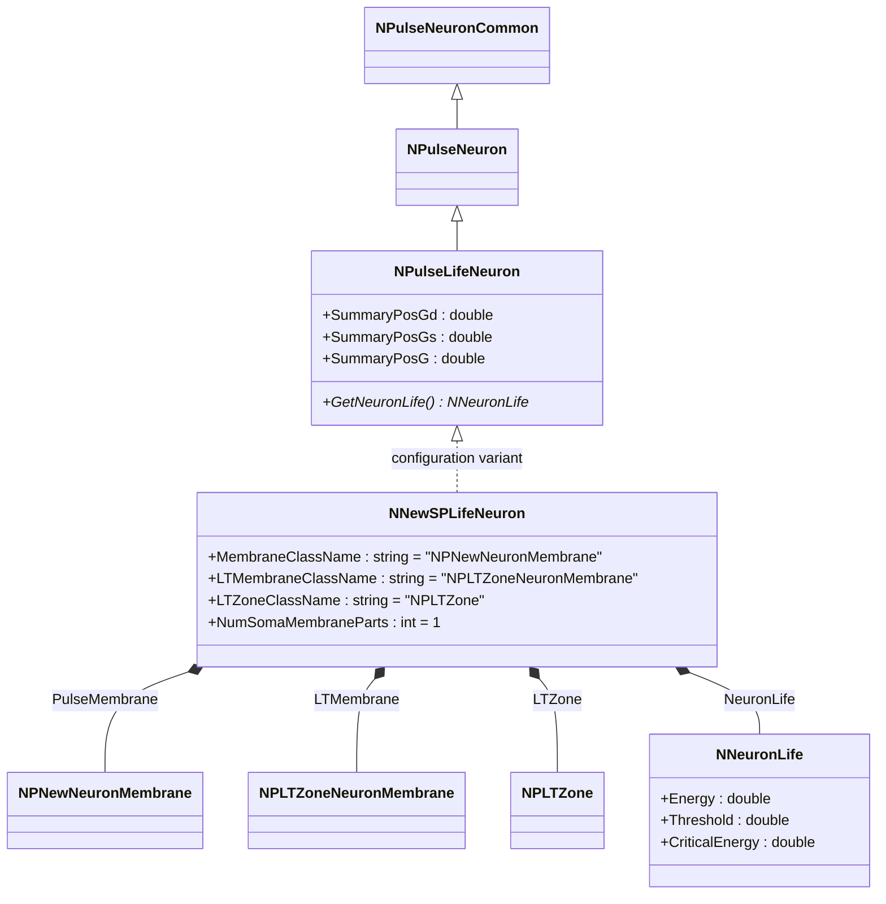
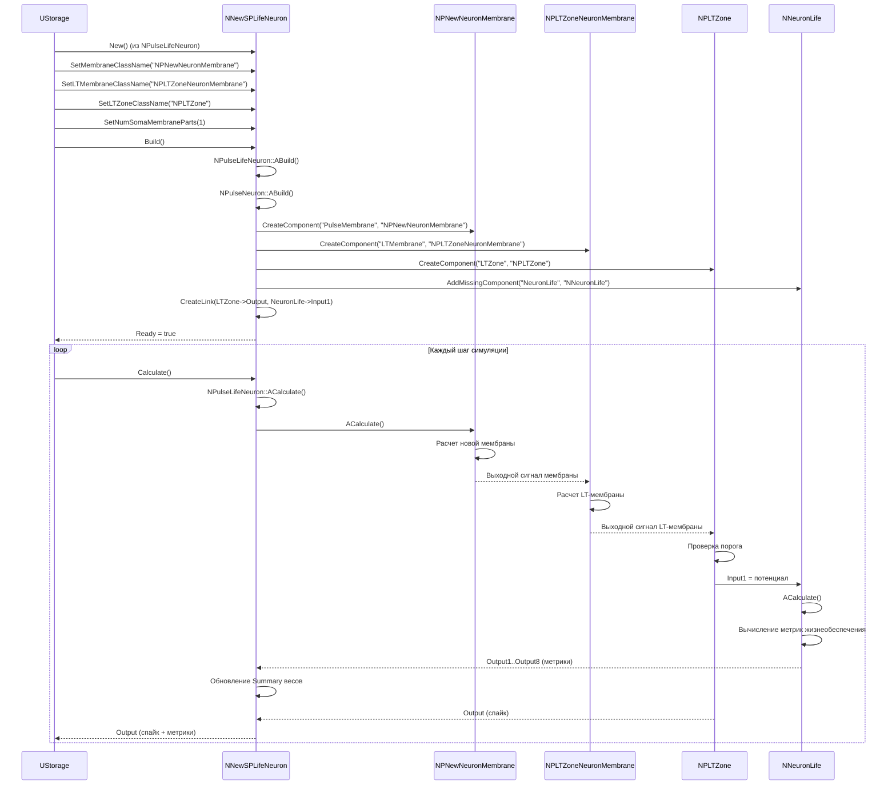
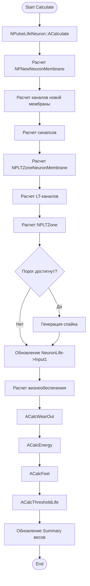
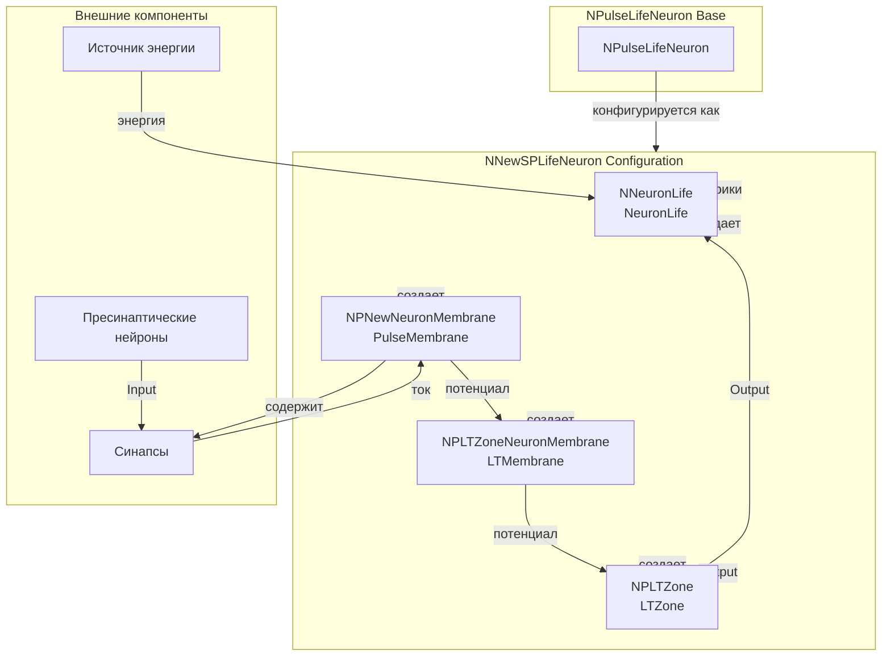
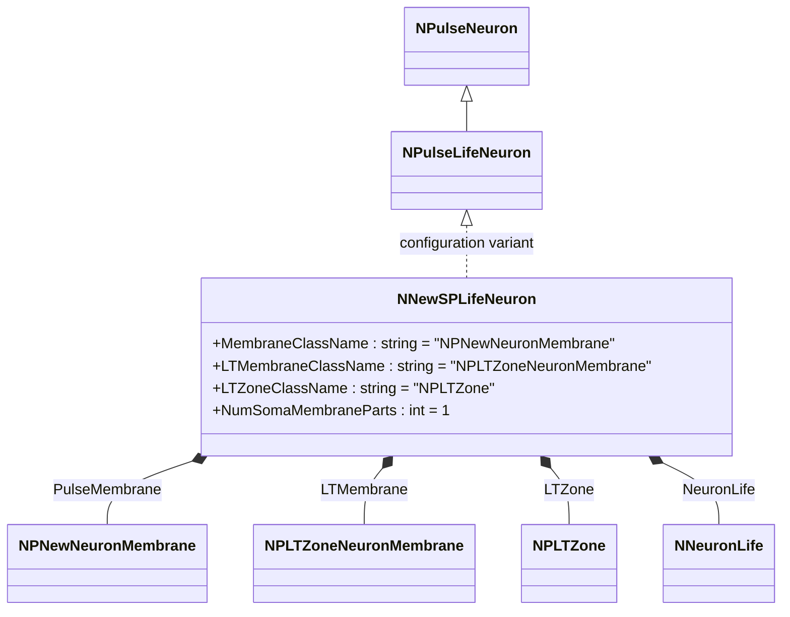
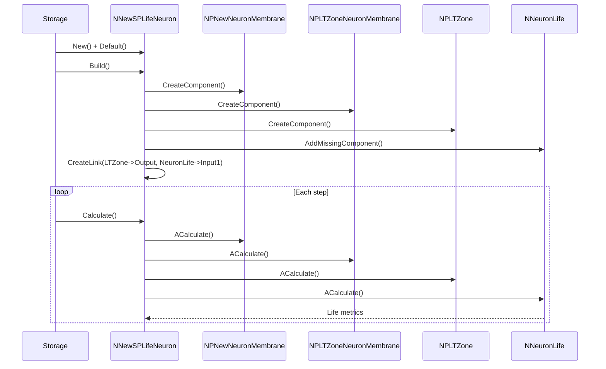
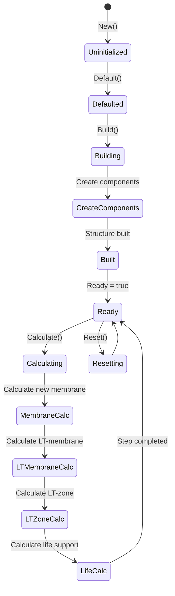
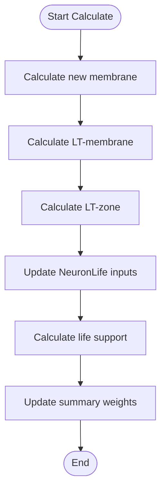
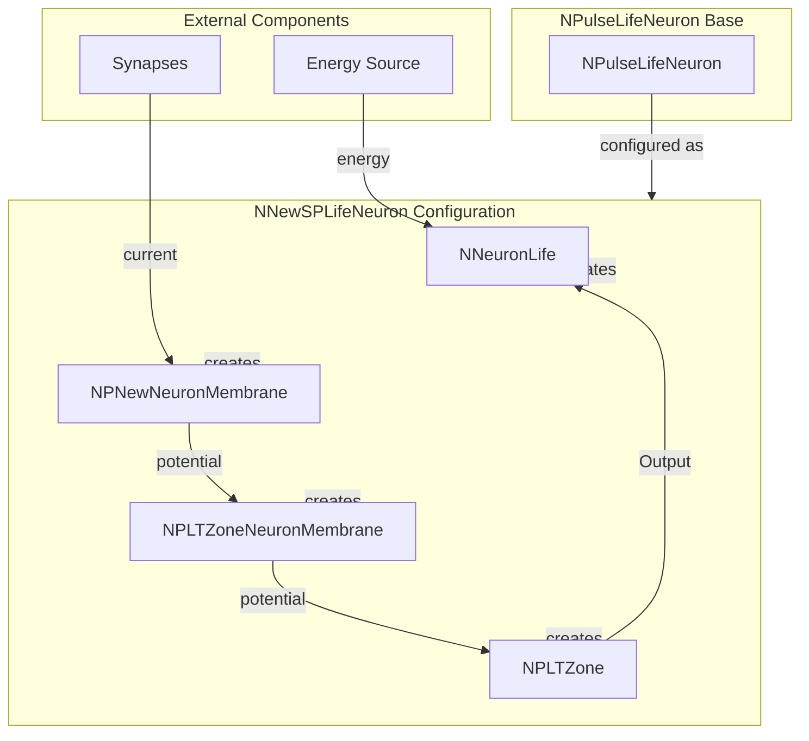

# NNewSPLifeNeuron — новый мелкий живой импульсный нейрон

## RU

### Назначение

**Класс**: `NNewSPLifeNeuron` — конфигурационный вариант нового мелкого живого импульсного нейрона с улучшенной архитектурой и поддержкой жизнеобеспечения.
**Регистрация**: `NPulseLibrary.cpp` → `UploadClass("NNewSPLifeNeuron", ...)`.
**Storage-инстансы**: `ClassName = "NNewSPLifeNeuron"` в `Bin/Configs/*/Model_*.xml`.

`NNewSPLifeNeuron` является конфигурационным вариантом базового класса `NPulseLifeNeuron` с новой архитектурой мембраны и LT-зоны. Создается из `NPulseLifeNeuron` с настройками:
- `NumSomaMembraneParts = 1` — одна часть сомы
- `MembraneClassName = "NPNewNeuronMembrane"` — новая мембрана нейрона
- `LTMembraneClassName = "NPLTZoneNeuronMembrane"` — новая LT-мембрана нейрона
- `LTZoneClassName = "NPLTZone"` — стандартная LT-зона

Комбинирует возможности новой архитектуры (улучшенные мембраны) и жизнеобеспечения (модель жизнедеятельности).

**Использование:** Эксперименты с улучшенной архитектурой живых нейронов

### UML-диаграмма классов



**Иерархия наследования:**
- `NPulseNeuronCommon` — общий импульсный нейрон
- `NPulseNeuron` — импульсный нейрон с параметрами структурирования
- `NPulseLifeNeuron` — живой импульсный нейрон с поддержкой жизнеобеспечения
- `NNewSPLifeNeuron` — конфигурационный вариант с новой архитектурой и жизнеобеспечением

**Внутренняя структура:**
- **PulseMembrane** (`NPNewNeuronMembrane`) — новая мембрана нейрона
- **LTMembrane** (`NPLTZoneNeuronMembrane`) — новая LT-мембрана нейрона
- **LTZone** (`NPLTZone`) — стандартная LT-зона
- **NeuronLife** (`NNeuronLife`) — модель жизнеобеспечения

### UML-диаграмма последовательности



**Жизненный цикл:**
1. **Создание**: `NNewSPLifeNeuron` создается из `NPulseLifeNeuron` с настройкой параметров
2. **Настройка**: Устанавливается новая архитектура мембраны и LT-зоны, одна часть сомы
3. **Сборка**: Автоматически создается структура нейрона с новой мембраной, LT-мембраной, LT-зоной и моделью жизнеобеспечения
4. **Расчет**: На каждом шаге рассчитываются новая мембрана, LT-мембрана, LT-зона и модель жизнеобеспечения

### UML-диаграмма состояний

```mermaid
stateDiagram-v2
    [*] --> Uninitialized: New()
    Uninitialized --> Defaulted: Default()
    Defaulted --> Configuring: Настройка New + Life архитектуры
    Configuring --> SetNewParams: SetMembraneClassName("NPNewNeuronMembrane")<br/>SetLTMembraneClassName("NPLTZoneNeuronMembrane")<br/>SetNumSomaMembraneParts(1)
    SetNewParams --> Building: Build()
    Building --> BuildBase: NPulseLifeNeuron::ABuild()
    BuildBase --> CreateMembrane: Создание NPNewNeuronMembrane
    CreateMembrane --> CreateLTMembrane: Создание NPLTZoneNeuronMembrane
    CreateLTMembrane --> CreateLTZone: Создание NPLTZone
    CreateLTZone --> CreateLife: Создание NNeuronLife
    CreateLife --> LinkLife: CreateLink(LTZone->Output, NeuronLife->Input1)
    LinkLife --> Built: Структура создана
    Built --> Ready: Ready = true
    Ready --> Calculating: Calculate()
    Calculating --> MembraneCalc: Расчет новой мембраны
    MembraneCalc --> LTMembraneCalc: Расчет LT-мембраны
    LTMembraneCalc --> LTZoneCalc: Расчет LT-зоны
    LTZoneCalc --> LifeCalc: Расчет жизнеобеспечения
    LifeCalc --> UpdateSummary: Обновление Summary весов
    UpdateSummary --> Ready: Шаг завершен
    Ready --> Resetting: Reset()
    Resetting --> Ready: Состояния сброшены
```

**Состояния:**
- **Uninitialized** — создан, но не инициализирован
- **Defaulted** — параметры установлены по умолчанию
- **Configuring** — настройка параметров для новой архитектуры и жизнеобеспечения
- **SetNewParams** — установка параметров (новая мембрана, LT-мембрана, одна часть сомы)
- **Building** — выполняется сборка структуры
- **BuildBase** — сборка базовой структуры нейрона
- **CreateMembrane** — создание новой мембраны
- **CreateLTMembrane** — создание LT-мембраны
- **CreateLTZone** — создание LT-зоны
- **CreateLife** — создание модели жизнеобеспечения
- **LinkLife** — связывание LT-зоны с моделью жизнеобеспечения
- **Built** — структура нейрона построена
- **Ready** — готов к выполнению расчетов
- **Calculating** — выполняется расчет нейрона
- **MembraneCalc** — расчет новой мембраны
- **LTMembraneCalc** — расчет LT-мембраны
- **LTZoneCalc** — расчет LT-зоны
- **LifeCalc** — расчет жизнеобеспечения
- **UpdateSummary** — обновление суммарных весов
- **Resetting** — выполняется сброс состояний

### UML-диаграмма активности



**Алгоритм расчета:**
1. Вызов базового расчета нейрона (`NPulseLifeNeuron::ACalculate`)
2. Расчет новой мембраны (`NPNewNeuronMembrane`) с каналами и синапсами
3. Расчет LT-мембраны (`NPLTZoneNeuronMembrane`) с LT-каналами
4. Расчет LT-зоны (`NPLTZone`) и проверка порога
5. Обновление входов модели жизнеобеспечения
6. Расчет метрик жизнеобеспечения (износ, энергия, чувство, пороги)
7. Обновление суммарных весов и выходов

### UML-диаграмма компонентов



**Зависимости:**
- **Базовый класс**: `NPulseLifeNeuron` (конфигурационный вариант)
- **Внутренние компоненты**: `NPNewNeuronMembrane` (новая мембрана), `NPLTZoneNeuronMembrane` (LT-мембрана), `NPLTZone` (LT-зона), `NNeuronLife` (модель жизнеобеспечения)
- **Внешние компоненты**: синапсы, пресинаптические нейроны, источник энергии

### Свойства

`NNewSPLifeNeuron` использует все свойства базового класса `NPulseLifeNeuron` с параметрами:
- `MembraneClassName = "NPNewNeuronMembrane"` — новая мембрана нейрона
- `LTMembraneClassName = "NPLTZoneNeuronMembrane"` — новая LT-мембрана нейрона
- `LTZoneClassName = "NPLTZone"` — стандартная LT-зона
- `NumSomaMembraneParts = 1` — одна часть сомы

**Наследуемые свойства от NPulseLifeNeuron:**
- `SummaryPosGd`, `SummaryPosGs`, `SummaryPosG` (double) — суммарные положительные веса
- `SummaryNegGd`, `SummaryNegGs`, `SummaryNegG` (double) — суммарные отрицательные веса
- `OutputSummaryPosGd`, `OutputSummaryPosGs`, `OutputSummaryPosG` (MDMatrix<double>) — выходные сигналы положительных весов
- `OutputSummaryNegGd`, `OutputSummaryNegGs`, `OutputSummaryNegG` (MDMatrix<double>) — выходные сигналы отрицательных весов
- Все нормализованные выходы (`*Norm`)

**Параметры жизнеобеспечения (в NeuronLife):**
- `Energy` (double) — текущая энергия нейрона
- `Threshold` (double) — порог жизнедеятельности
- `CriticalEnergy` (double) — критический уровень энергии
- `WearOut` (double) — износ нейрона
- `Feel` (double) — чувство нейрона

### Методы

`NNewSPLifeNeuron` использует все методы базового класса `NPulseLifeNeuron`:
- `GetNeuronLife()` → `NNeuronLife*` — получение модели жизнеобеспечения

### Примеры использования

#### Пример 1: Создание нового живого SP-нейрона в коде C++

```cpp
// Создание нового мелкого живого нейрона
auto neuron = storage->CreateComponent("NNewSPLifeNeuron");
neuron->SetName("NewSPLifeNeuron");

// Инициализация (использует параметры по умолчанию)
neuron->Default();

// Сборка (автоматически создает NPNewNeuronMembrane, NPLTZoneNeuronMembrane, NPLTZone, NNeuronLife)
neuron->Build();

// Получение модели жизнеобеспечения
auto neuronLife = neuron->GetNeuronLife();
if (neuronLife) {
    // Настройка параметров жизнеобеспечения
    neuronLife->Threshold = 0.001;
    neuronLife->CriticalEnergy = 0.5;
}

// Использование
for (int step = 0; step < 1000; step++) {
    neuron->Calculate();
    // Веса и метрики жизнеобеспечения обновляются автоматически
}
```

#### Пример 2: Конфигурация XML

```xml
<NewSPLifeNeuron1 Class="NNewSPLifeNeuron">
    <Parameters>
        <!-- Параметры наследуются от NPulseLifeNeuron -->
    </Parameters>
</NewSPLifeNeuron1>
```

### Использование в конфигурациях

`NNewSPLifeNeuron` используется в экспериментах с улучшенной архитектурой живых нейронов:

- **Новая архитектура + жизнеобеспечение**: `Bin/Configs/!OldConfigs/*/Model_*.xml` (где используется комбинация новой архитектуры и жизнеобеспечения)
- **Улучшенное моделирование**: эксперименты с более точными мембранами и метриками жизнедеятельности

**Типичные значения параметров:**
- **MembraneClassName**: "NPNewNeuronMembrane" (новая мембрана)
- **LTMembraneClassName**: "NPLTZoneNeuronMembrane" (новая LT-мембрана)
- **LTZoneClassName**: "NPLTZone" (стандартная LT-зона)
- **NumSomaMembraneParts**: 1 (одна часть сомы для мелких нейронов)

**Особенности:**
- Новая архитектура: использует улучшенные мембраны для более точного моделирования
- LT-мембрана: отдельная мембрана для LT-зоны с оптимизированными каналами
- Модель жизнеобеспечения: автоматически создается и связывается с LT-зоной
- Комбинированная функциональность: объединяет возможности новой архитектуры и жизнеобеспечения

## Источники

См. [Literature-References.md](../Literature-References.md): **neuromodeler.ru** (жизнеобеспечение), **15**, **4**.

### См. также

- [`NPulseLifeNeuron`](NPLifeNeuron.md) — живой импульсный нейрон (базовый класс)
- [`NNewSPNeuron`](NNewSPNeuron.md) — новый мелкий нейрон
- [`NSPLifeNeuron`](NSPLifeNeuron.md) — мелкий живой нейрон
- [`NPNewNeuronMembrane`](NPNewNeuronMembrane.md) — новая мембрана нейрона
- [`NPLTZoneNeuronMembrane`](NPLTZoneNeuronMembrane.md) — мембрана нейрона с LT-зоной
- [`NNeuronLife`](NNeuronLife.md) — модель жизнеобеспечения
- [Architecture.md](../Architecture.md) — архитектура библиотеки

---

## EN

### Purpose

**Class**: `NNewSPLifeNeuron` — configuration variant of new small living spiking neuron with improved architecture and life support.
**Registration**: `NPulseLibrary.cpp` → `UploadClass("NNewSPLifeNeuron", ...)`.
**Instances**: `ClassName = "NNewSPLifeNeuron"` in `Bin/Configs/*/Model_*.xml`.

`NNewSPLifeNeuron` is a configuration variant of the base class `NPulseLifeNeuron` with new membrane and LT-zone architecture. Created from `NPulseLifeNeuron` with settings:
- `NumSomaMembraneParts = 1` — one soma part
- `MembraneClassName = "NPNewNeuronMembrane"` — new neuron membrane
- `LTMembraneClassName = "NPLTZoneNeuronMembrane"` — new neuron LT-membrane
- `LTZoneClassName = "NPLTZone"` — standard LT-zone

Combines capabilities of new architecture (improved membranes) and life support (life metrics model).

**Usage:** Experiments with improved architecture of living neurons

### UML Class Diagram



### UML Sequence Diagram



### UML State Diagram



### UML Activity Diagram



### UML Component Diagram



### Properties

`NNewSPLifeNeuron` uses all properties of base class `NPulseLifeNeuron` with parameters:
- `MembraneClassName = "NPNewNeuronMembrane"` — new neuron membrane
- `LTMembraneClassName = "NPLTZoneNeuronMembrane"` — new neuron LT-membrane
- `LTZoneClassName = "NPLTZone"` — standard LT-zone
- `NumSomaMembraneParts = 1` — one soma part

**Life support parameters (in NeuronLife):**
- `Energy` (double) — current neuron energy
- `Threshold` (double) — life threshold
- `CriticalEnergy` (double) — critical energy level
- `WearOut` (double) — neuron wear out

### Methods

`NNewSPLifeNeuron` uses all methods of base class `NPulseLifeNeuron`:
- `GetNeuronLife()` → `NNeuronLife*` — get life support model

### Usage in configurations

`NNewSPLifeNeuron` is used in experiments with improved architecture of living neurons:

- **New architecture + life support**: `Bin/Configs/!OldConfigs/*/Model_*.xml` (where combination of new architecture and life support is used)
- **Improved modeling**: experiments with more accurate membranes and life metrics

**Typical parameter values:**
- **MembraneClassName**: "NPNewNeuronMembrane" (new membrane)
- **LTMembraneClassName**: "NPLTZoneNeuronMembrane" (new LT-membrane)
- **LTZoneClassName**: "NPLTZone" (standard LT-zone)
- **NumSomaMembraneParts**: 1 (one soma part for small neurons)

**Features:**
- New architecture: uses improved membranes for more accurate modeling
- LT-membrane: separate membrane for LT-zone with optimized channels
- Life support model: automatically created and linked with LT-zone
- Combined functionality: combines capabilities of new architecture and life support

### References

See [Literature-References.md](../Literature-References.md): **neuromodeler.ru** (life support), **15**, **4**.

### See Also

- [`NPulseLifeNeuron`](NPLifeNeuron.md) — living spiking neuron (base class)
- [`NNewSPNeuron`](NNewSPNeuron.md) — new small neuron
- [`NSPLifeNeuron`](NSPLifeNeuron.md) — small living neuron
- [`NPNewNeuronMembrane`](NPNewNeuronMembrane.md) — new neuron membrane
- [`NPLTZoneNeuronMembrane`](NPLTZoneNeuronMembrane.md) — neuron membrane with LT-zone
- [`NNeuronLife`](NNeuronLife.md) — life support model
- [Architecture.md](../Architecture.md) — library architecture
