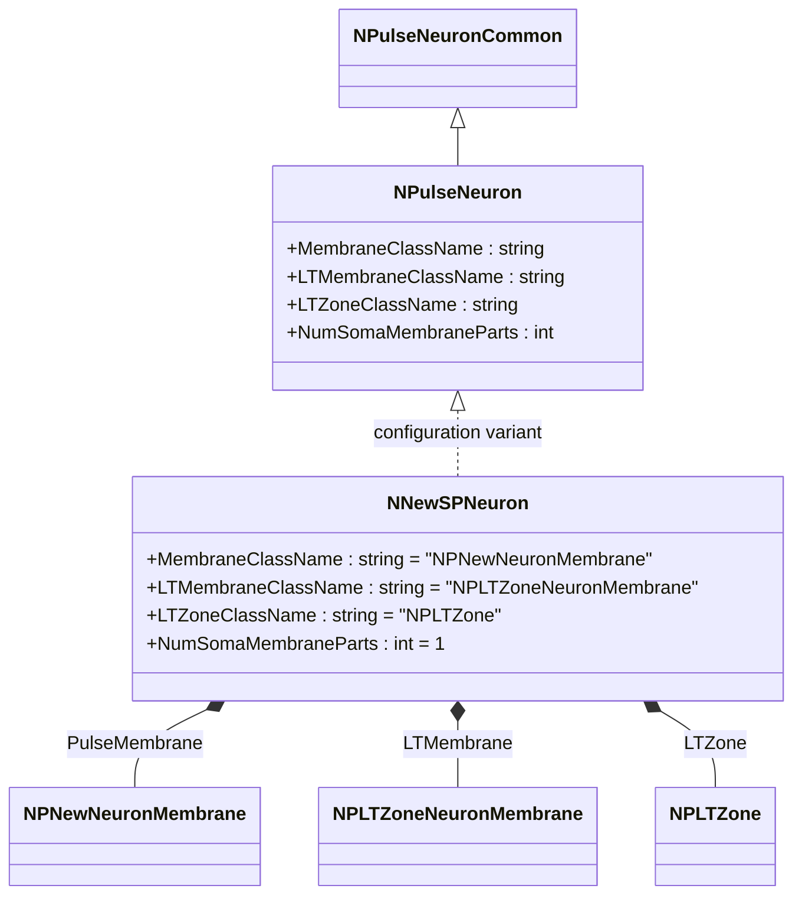
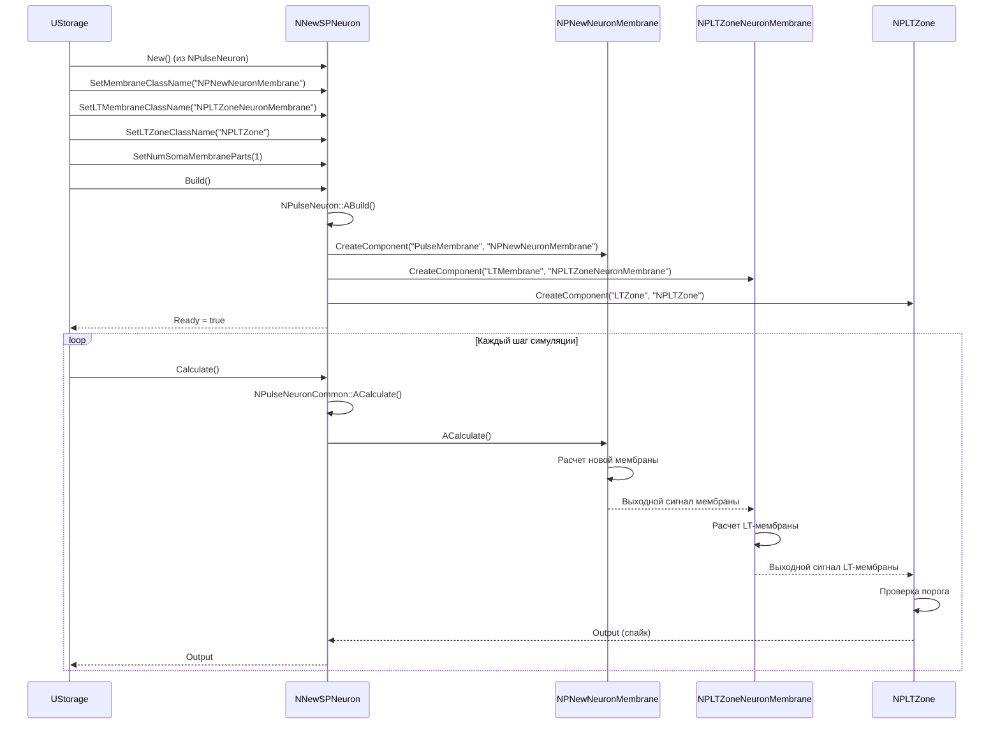
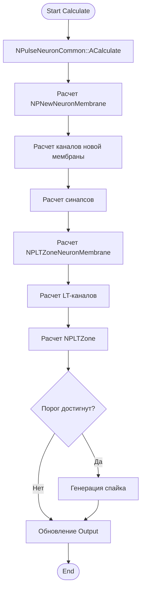
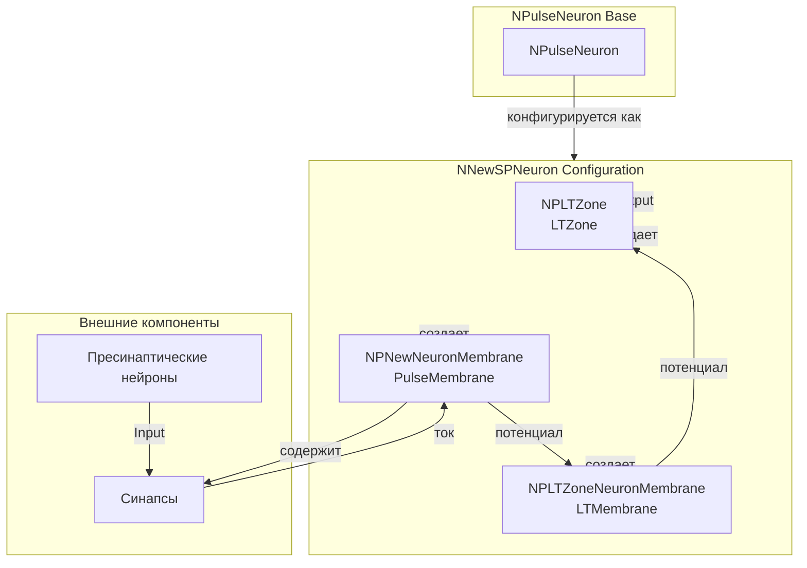
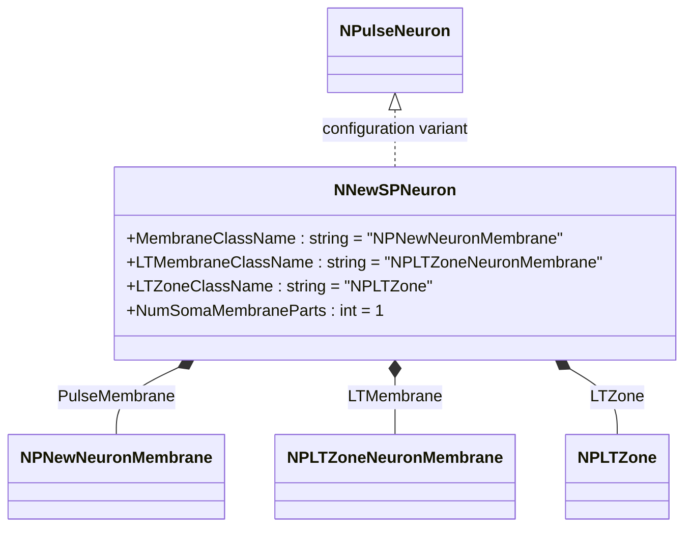
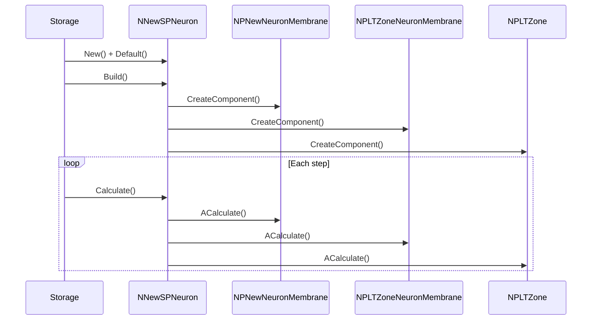
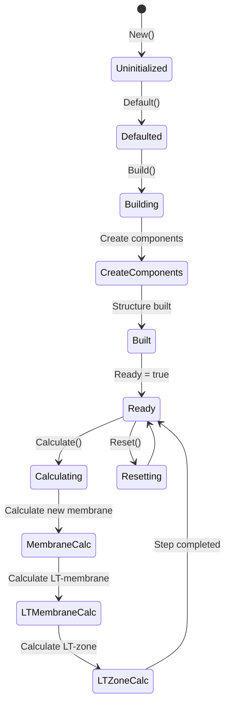
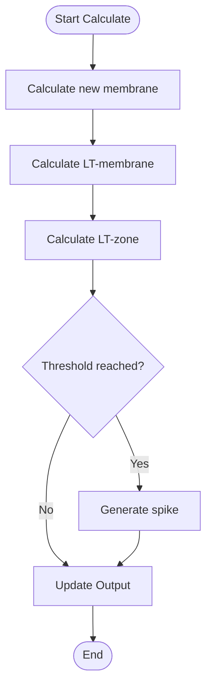
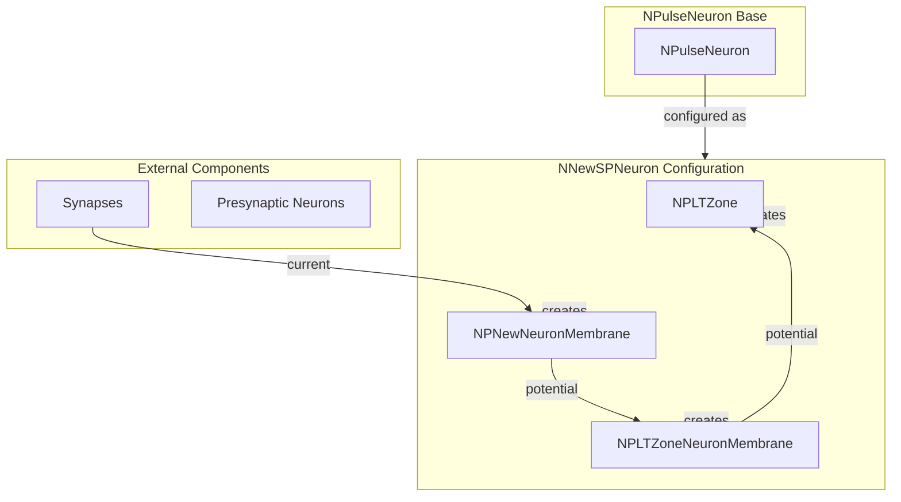

# NNewSPNeuron — новый мелкий импульсный нейрон

## RU

### Назначение

**Класс**: `NNewSPNeuron` — конфигурационный вариант нового мелкого импульсного нейрона с улучшенной архитектурой.  
**Регистрация**: `NPulseLibrary.cpp` → `UploadClass("NNewSPNeuron", ...)`.  
**Storage-инстансы**: `ClassName = "NNewSPNeuron"` в `Bin/Configs/*/Model_*.xml`.

`NNewSPNeuron` является конфигурационным вариантом базового класса `NPulseNeuron` с новой архитектурой мембраны и LT-зоны. Создается из `NPulseNeuron` с настройками:
- `NumSomaMembraneParts = 1` — одна часть сомы
- `MembraneClassName = "NPNewNeuronMembrane"` — новая мембрана нейрона
- `LTMembraneClassName = "NPLTZoneNeuronMembrane"` — новая LT-мембрана нейрона
- `LTZoneClassName = "NPLTZone"` — стандартная LT-зона

Новая архитектура использует улучшенные мембраны для более точного моделирования нейронов.

**Использование:** Эксперименты с улучшенной архитектурой мелких нейронов

### UML-диаграмма классов



**Иерархия наследования:**
- `NPulseNeuronCommon` — общий импульсный нейрон
- `NPulseNeuron` — импульсный нейрон с параметрами структурирования
- `NNewSPNeuron` — конфигурационный вариант с новой архитектурой

**Внутренняя структура:**
- **PulseMembrane** (`NPNewNeuronMembrane`) — новая мембрана нейрона
- **LTMembrane** (`NPLTZoneNeuronMembrane`) — новая LT-мембрана нейрона
- **LTZone** (`NPLTZone`) — стандартная LT-зона

### UML-диаграмма последовательности



**Жизненный цикл:**
1. **Создание**: `NNewSPNeuron` создается из `NPulseNeuron` с настройкой параметров
2. **Настройка**: Устанавливается новая архитектура мембраны и LT-зоны, одна часть сомы
3. **Сборка**: Автоматически создается структура нейрона с новой мембраной, LT-мембраной и LT-зоной
4. **Расчет**: На каждом шаге рассчитываются новая мембрана, LT-мембрана и LT-зона

### UML-диаграмма состояний

```mermaid
stateDiagram-v2
    [*] --> Uninitialized: New()
    Uninitialized --> Defaulted: Default()
    Defaulted --> Configuring: Настройка New архитектуры
    Configuring --> SetNewParams: SetMembraneClassName("NPNewNeuronMembrane")<br/>SetLTMembraneClassName("NPLTZoneNeuronMembrane")<br/>SetNumSomaMembraneParts(1)
    SetNewParams --> Building: Build()
    Building --> BuildBase: NPulseNeuron::ABuild()
    BuildBase --> CreateMembrane: Создание NPNewNeuronMembrane
    CreateMembrane --> CreateLTMembrane: Создание NPLTZoneNeuronMembrane
    CreateLTMembrane --> CreateLTZone: Создание NPLTZone
    CreateLTZone --> Built: Структура создана
    Built --> Ready: Ready = true
    Ready --> Calculating: Calculate()
    Calculating --> MembraneCalc: Расчет новой мембраны
    MembraneCalc --> LTMembraneCalc: Расчет LT-мембраны
    LTMembraneCalc --> LTZoneCalc: Расчет LT-зоны
    LTZoneCalc --> Ready: Шаг завершен
    Ready --> Resetting: Reset()
    Resetting --> Ready: Состояния сброшены
```

**Состояния:**
- **Uninitialized** — создан, но не инициализирован
- **Defaulted** — параметры установлены по умолчанию
- **Configuring** — настройка параметров для новой архитектуры
- **SetNewParams** — установка параметров (новая мембрана, LT-мембрана, одна часть сомы)
- **Building** — выполняется сборка структуры
- **BuildBase** — сборка базовой структуры нейрона
- **CreateMembrane** — создание новой мембраны
- **CreateLTMembrane** — создание LT-мембраны
- **CreateLTZone** — создание LT-зоны
- **Built** — структура нейрона построена
- **Ready** — готов к выполнению расчетов
- **Calculating** — выполняется расчет нейрона
- **MembraneCalc** — расчет новой мембраны
- **LTMembraneCalc** — расчет LT-мембраны
- **LTZoneCalc** — расчет LT-зоны
- **Resetting** — выполняется сброс состояний

### UML-диаграмма активности



**Алгоритм расчета:**
1. Вызов базового расчета нейрона (`NPulseNeuronCommon::ACalculate`)
2. Расчет новой мембраны (`NPNewNeuronMembrane`) с каналами и синапсами
3. Расчет LT-мембраны (`NPLTZoneNeuronMembrane`) с LT-каналами
4. Расчет LT-зоны (`NPLTZone`) и проверка порога
5. Генерация спайка при достижении порога

### UML-диаграмма компонентов



**Зависимости:**
- **Базовый класс**: `NPulseNeuron` (конфигурационный вариант)
- **Внутренние компоненты**: `NPNewNeuronMembrane` (новая мембрана), `NPLTZoneNeuronMembrane` (LT-мембрана), `NPLTZone` (LT-зона)
- **Внешние компоненты**: синапсы, пресинаптические нейроны

### Свойства

`NNewSPNeuron` использует все свойства базового класса `NPulseNeuron` с параметрами:
- `MembraneClassName = "NPNewNeuronMembrane"` — новая мембрана нейрона
- `LTMembraneClassName = "NPLTZoneNeuronMembrane"` — новая LT-мембрана нейрона
- `LTZoneClassName = "NPLTZone"` — стандартная LT-зона
- `NumSomaMembraneParts = 1` — одна часть сомы

### Методы

`NNewSPNeuron` использует все методы базового класса `NPulseNeuron`.

### Примеры использования

#### Пример 1: Создание нового SP-нейрона в коде C++

```cpp
// Создание нового мелкого нейрона
auto neuron = storage->CreateComponent("NNewSPNeuron");
neuron->SetName("NewSPNeuron");

// Инициализация (использует параметры по умолчанию)
neuron->Default();

// Сборка (автоматически создает NPNewNeuronMembrane, NPLTZoneNeuronMembrane, NPLTZone)
neuron->Build();

// Использование
for (int step = 0; step < 1000; step++) {
    neuron->Calculate();
}
```

#### Пример 2: Конфигурация XML

```xml
<NewSPNeuron1 Class="NNewSPNeuron">
    <Parameters>
        <!-- Параметры наследуются от NPulseNeuron -->
    </Parameters>
</NewSPNeuron1>
```

### Использование в конфигурациях

`NNewSPNeuron` используется в экспериментах с улучшенной архитектурой:

- **Новая архитектура**: `Bin/Configs/!OldConfigs/*/Model_*.xml` (где используется новая архитектура мембран)
- **Улучшенное моделирование**: эксперименты с более точными мембранами

**Типичные значения параметров:**
- **MembraneClassName**: "NPNewNeuronMembrane" (новая мембрана)
- **LTMembraneClassName**: "NPLTZoneNeuronMembrane" (новая LT-мембрана)
- **LTZoneClassName**: "NPLTZone" (стандартная LT-зона)
- **NumSomaMembraneParts**: 1 (одна часть сомы для мелких нейронов)

**Особенности:**
- Новая архитектура: использует улучшенные мембраны для более точного моделирования
- LT-мембрана: отдельная мембрана для LT-зоны с оптимизированными каналами
- Совместимость: совместим с существующими конфигурациями

### См. также

- [`NPulseNeuron`](NPulseNeuron.md) — импульсный нейрон с параметрами структурирования
- [`NSPNeuron`](NSPNeuron.md) — базовый SP-нейрон
- [`NNewLPNeuron`](NNewLPNeuron.md) — новый крупный нейрон
- [`NPNewNeuronMembrane`](NPNewNeuronMembrane.md) — новая мембрана нейрона
- [`NPLTZoneNeuronMembrane`](NPLTZoneNeuronMembrane.md) — мембрана нейрона с LT-зоной
- [Architecture.md](../Architecture.md) — архитектура библиотеки

---

## EN

### Purpose

**Class**: `NNewSPNeuron` — configuration variant of new small spiking neuron with improved architecture.  
**Registration**: `NPulseLibrary.cpp` → `UploadClass("NNewSPNeuron", ...)`.  
**Instances**: `ClassName = "NNewSPNeuron"` in `Bin/Configs/*/Model_*.xml`.

`NNewSPNeuron` is a configuration variant of the base class `NPulseNeuron` with new membrane and LT-zone architecture. Created from `NPulseNeuron` with settings:
- `NumSomaMembraneParts = 1` — one soma part
- `MembraneClassName = "NPNewNeuronMembrane"` — new neuron membrane
- `LTMembraneClassName = "NPLTZoneNeuronMembrane"` — new neuron LT-membrane
- `LTZoneClassName = "NPLTZone"` — standard LT-zone

New architecture uses improved membranes for more accurate neuron modeling.

**Usage:** Experiments with improved architecture of small neurons

### UML Class Diagram



### UML Sequence Diagram



### UML State Diagram



### UML Activity Diagram



### UML Component Diagram



### Properties

`NNewSPNeuron` uses all properties of base class `NPulseNeuron` with parameters:
- `MembraneClassName = "NPNewNeuronMembrane"` — new neuron membrane
- `LTMembraneClassName = "NPLTZoneNeuronMembrane"` — new neuron LT-membrane
- `LTZoneClassName = "NPLTZone"` — standard LT-zone
- `NumSomaMembraneParts = 1` — one soma part

### Methods

`NNewSPNeuron` uses all methods of base class `NPulseNeuron`.

### Usage in configurations

`NNewSPNeuron` is used in experiments with improved architecture:

- **New architecture**: `Bin/Configs/!OldConfigs/*/Model_*.xml` (where new membrane architecture is used)
- **Improved modeling**: experiments with more accurate membranes

**Typical parameter values:**
- **MembraneClassName**: "NPNewNeuronMembrane" (new membrane)
- **LTMembraneClassName**: "NPLTZoneNeuronMembrane" (new LT-membrane)
- **LTZoneClassName**: "NPLTZone" (standard LT-zone)
- **NumSomaMembraneParts**: 1 (one soma part for small neurons)

**Features:**
- New architecture: uses improved membranes for more accurate modeling
- LT-membrane: separate membrane for LT-zone with optimized channels
- Compatibility: compatible with existing configurations

### See Also

- [`NPulseNeuron`](NPulseNeuron.md) — spiking neuron with structuring parameters
- [`NSPNeuron`](NSPNeuron.md) — base SP-neuron
- [`NNewLPNeuron`](NNewLPNeuron.md) — new large neuron
- [`NPNewNeuronMembrane`](NPNewNeuronMembrane.md) — new neuron membrane
- [`NPLTZoneNeuronMembrane`](NPLTZoneNeuronMembrane.md) — neuron membrane with LT-zone
- [Architecture.md](../Architecture.md) — library architecture
