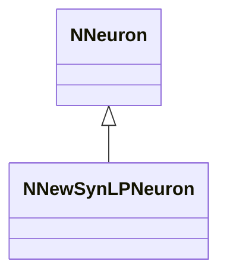
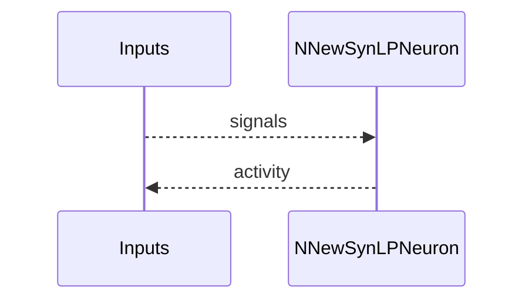
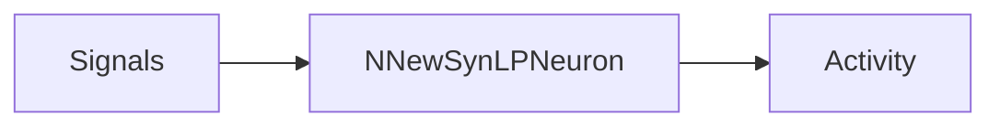

## NNewSynLPNeuron — новая син. LP модель

**Класс**: `NNewSynLPNeuron` — новая LP-нейрон в син. семействе.  
**Регистрация**: `NPulseLibrary.cpp` → `UploadClass("NNewSynLPNeuron", ...)`.  
**Storage**: `ClassName = "NNewSynLPNeuron"`.

### Lifecycle
- **ADefault**: параметры LP.
- **ABuild**: подключение входов/синапсов.
+- **AReset**: сброс.
- **ACalculate**: LP-активация (новая реализация).

### I/O
- Вход: сигналы/токи.
- Выход: активность/спайк.



Пояснение: диаграмма классов показывает место компонента в иерархии и ключевые связи.



Пояснение: диаграмма последовательности показывает типовой сценарий взаимодействия и порядок вызовов.



Пояснение: блок-схема показывает поток данных/сигналов (входы → компонент → выходы).

### Config snippet

```ini
[Component]
ClassName = NNewSynLPNeuron
Name = NewSynLP1
```

---

## NNewSynLPNeuron — new synaptic LP neuron (EN)

New LP neuron variant in synaptic family.


Description: this class diagram shows the component position in the type hierarchy and key relations.


Description: this sequence diagram shows a typical runtime interaction and call order.


Description: this flowchart shows the data/signal flow (inputs → component → outputs).
