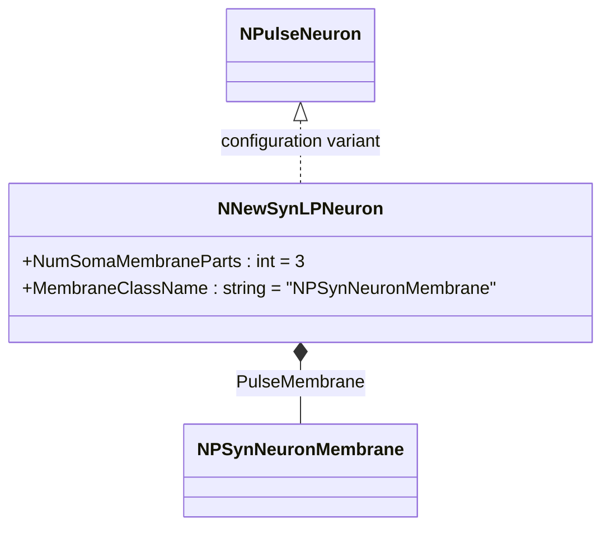
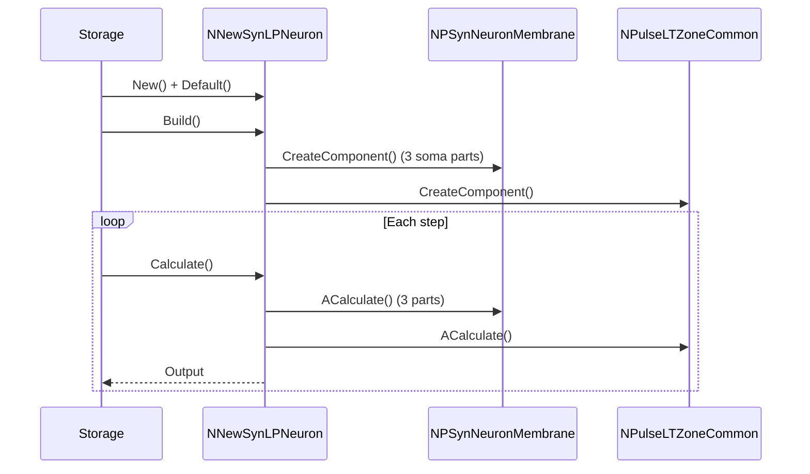
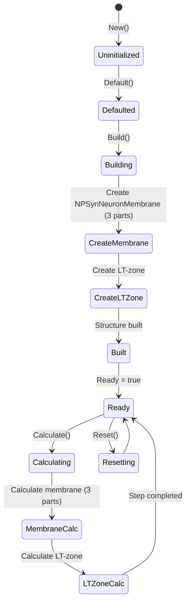
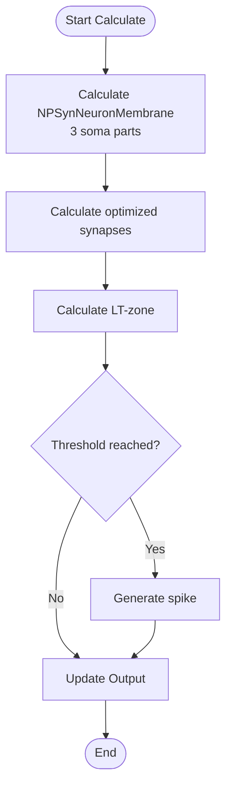
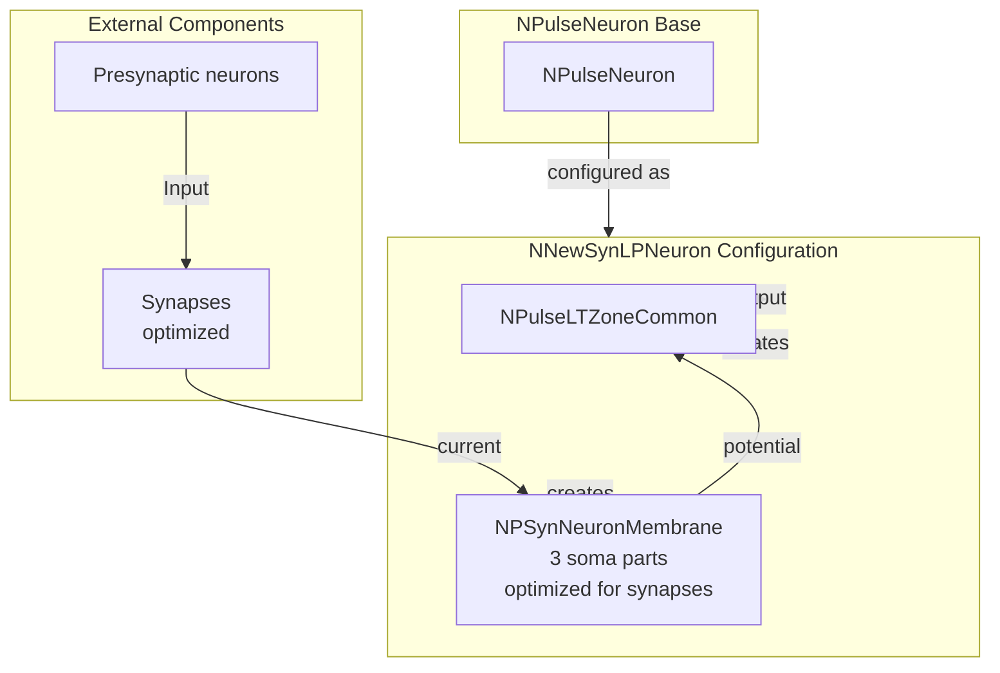

# NNewSynLPNeuron — новый крупный син-нейрон

## RU

### Назначение

**Класс**: `NNewSynLPNeuron` — конфигурационный вариант нового крупного импульсного нейрона с оптимизированными синапсами.  
**Регистрация**: `NPulseLibrary.cpp` → `UploadClass("NNewSynLPNeuron", ...)`.  
**Storage-инстансы**: `ClassName = "NNewSynLPNeuron"` в `Bin/Configs/*/Model_*.xml`.

`NNewSynLPNeuron` является конфигурационным вариантом базового класса `NPulseNeuron` с мембраной, оптимизированной для синапсов. Создается из `NPulseNeuron` с настройками:
- `NumSomaMembraneParts = 3` — три части сомы
- `MembraneClassName = "NPSynNeuronMembrane"` — мембрана, оптимизированная для синапсов

**Использование:** Эксперименты с оптимизированными синапсами для крупных нейронов

### UML-диаграмма классов

### Свойства

`NNewSynLPNeuron` использует все свойства базового класса `NPulseNeuron` с параметрами:
- `NumSomaMembraneParts = 3`
- `MembraneClassName = "NPSynNeuronMembrane"`

### Методы

`NNewSynLPNeuron` использует все методы базового класса `NPulseNeuron`.

## Источники

См. [Literature-References.md](../Literature-References.md): **[A]**, **4**, **25**, **29**.

### См. также

- [`NPulseNeuron`](NPulseNeuron.md) — импульсный нейрон
- [`NNewLPNeuron`](NNewLPNeuron.md) — новый крупный нейрон
- [`NPSynNeuronMembrane`](NPSynNeuronMembrane.md) — мембрана, оптимизированная для синапсов
- [Architecture.md](../Architecture.md) — архитектура библиотеки

---

## EN

### Purpose

**Class**: `NNewSynLPNeuron` — configuration variant of new large spiking neuron with optimized synapses.  
**Registration**: `NPulseLibrary.cpp` → `UploadClass("NNewSynLPNeuron", ...)`.  
**Instances**: `ClassName = "NNewSynLPNeuron"` in `Bin/Configs/*/Model_*.xml`.

`NNewSynLPNeuron` is a configuration variant of the base class `NPulseNeuron` with membrane optimized for synapses. Created from `NPulseNeuron` with settings:
- `NumSomaMembraneParts = 3` — three soma parts
- `MembraneClassName = "NPSynNeuronMembrane"` — membrane optimized for synapses

**Usage:** Experiments with optimized synapses for large neurons

### UML Class Diagram

### UML Sequence Diagram

### UML State Diagram

### UML Activity Diagram

### UML Component Diagram

### Properties

`NNewSynLPNeuron` uses all properties of base class `NPulseNeuron` with parameters:
- `NumSomaMembraneParts = 3` — three soma parts
- `MembraneClassName = "NPSynNeuronMembrane"` — membrane optimized for synapses

### Methods

`NNewSynLPNeuron` uses all methods of base class `NPulseNeuron`.

### Usage in configurations

`NNewSynLPNeuron` is used in experiments with optimized synapses for large neurons:

- **Optimized synapses for large neurons**: `Bin/Configs/!OldConfigs/*/Model_*.xml` (where synapse-optimized large neurons are required)

**Typical parameter values:**
- **NumSomaMembraneParts**: 3 (three soma parts for large neurons)
- **MembraneClassName**: "NPSynNeuronMembrane" (membrane optimized for synapses)

**Features:**
- Synapse optimization: membrane is specifically optimized for efficient synapse processing
- Large neuron: uses three soma parts for extended structure
- Efficient processing: optimized membrane provides better performance for synaptic inputs in large neurons

### References

See [Literature-References.md](../Literature-References.md): **[A]**, **4**, **25**, **29**.

### See Also

- [`NPulseNeuron`](NPulseNeuron.md) — spiking neuron
- [`NNewLPNeuron`](NNewLPNeuron.md) — new large neuron
- [`NPSynNeuronMembrane`](NPSynNeuronMembrane.md) — membrane optimized for synapses
- [Architecture.md](../Architecture.md) — library architecture
