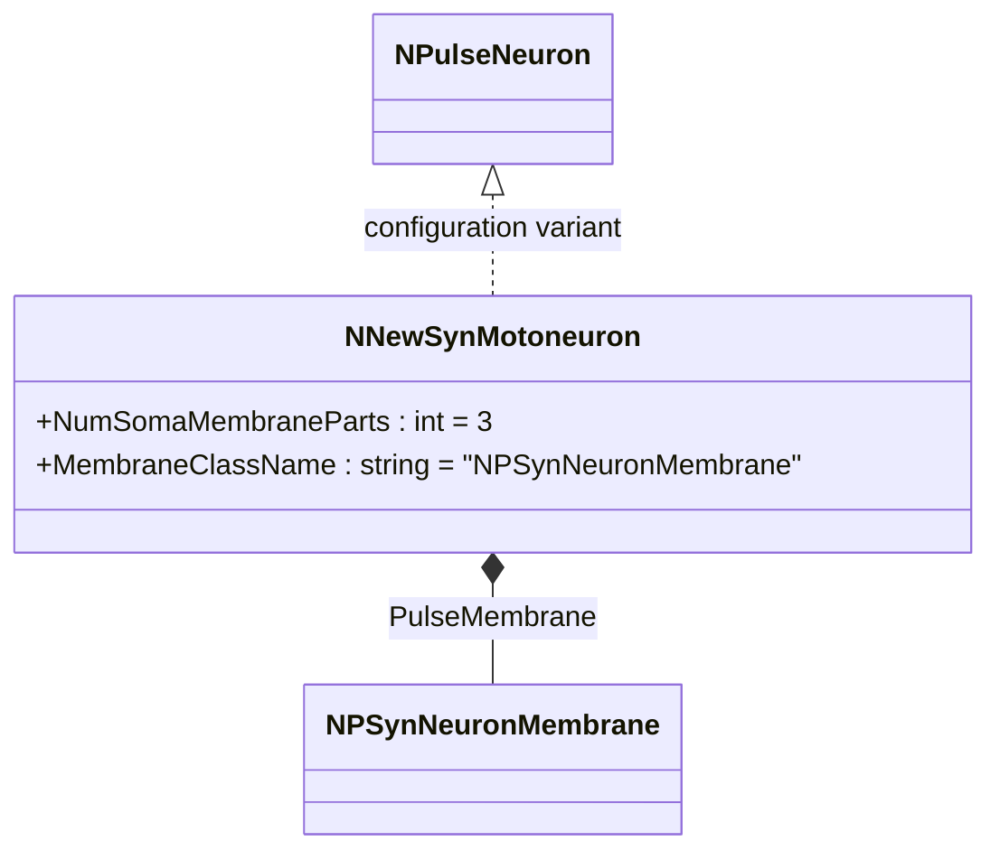
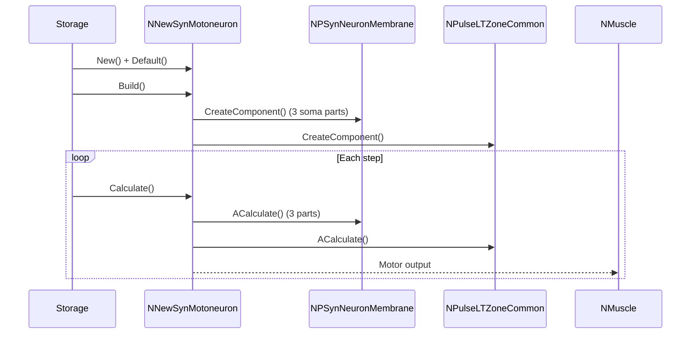
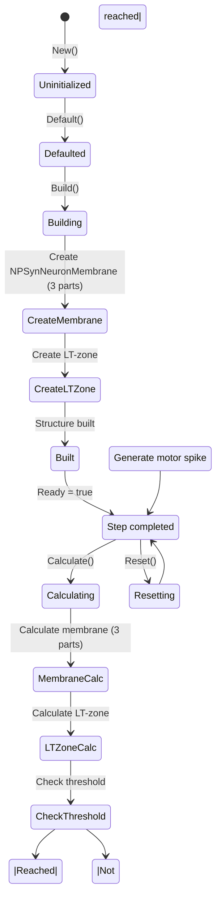
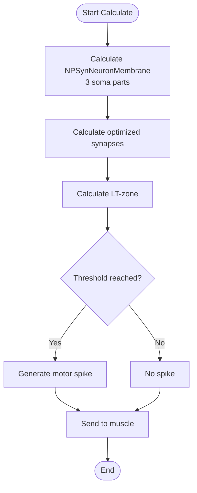
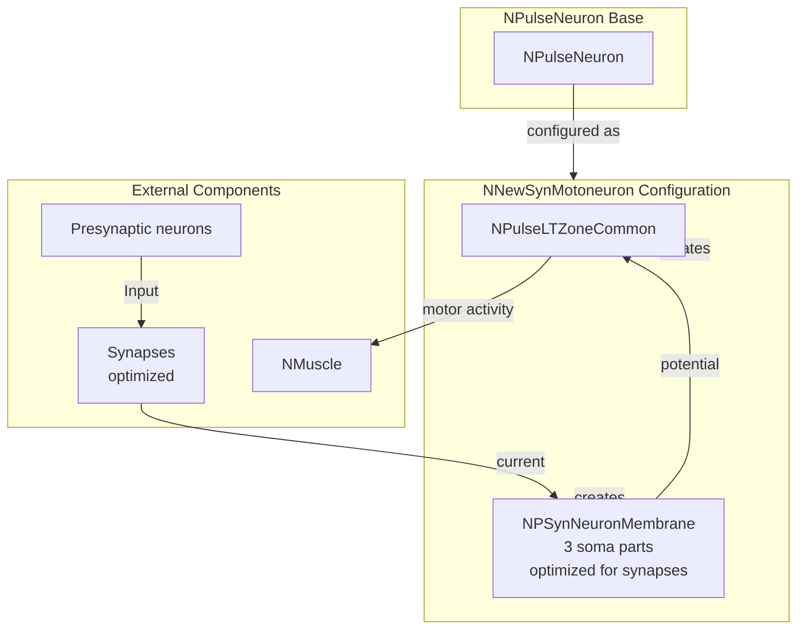

# NNewSynMotoneuron — новый син-мотонейрон

## RU

### Назначение

**Класс**: `NNewSynMotoneuron` — конфигурационный вариант нового мотонейрона с оптимизированными синапсами.  
**Регистрация**: `NPulseLibrary.cpp` → `UploadClass("NNewSynMotoneuron", ...)`.  
**Storage-инстансы**: `ClassName = "NNewSynMotoneuron"` в `Bin/Configs/*/Model_*.xml`.

`NNewSynMotoneuron` является конфигурационным вариантом базового класса `NPulseNeuron` для моделирования мотонейронов с оптимизированными синапсами. Создается из `NPulseNeuron` с настройками:
- `NumSomaMembraneParts = 3` — три части сомы
- `MembraneClassName = "NPSynNeuronMembrane"` — мембрана, оптимизированная для синапсов

**Использование:** Моделирование двигательных систем с оптимизированными синапсами

### UML-диаграмма классов

### Свойства

`NNewSynMotoneuron` использует все свойства базового класса `NPulseNeuron` с параметрами:
- `NumSomaMembraneParts = 3`
- `MembraneClassName = "NPSynNeuronMembrane"`

### Методы

`NNewSynMotoneuron` использует все методы базового класса `NPulseNeuron`.

### См. также

- [`NPulseNeuron`](NPulseNeuron.md) — импульсный нейрон
- [`NNewMotoneuron`](NNewMotoneuron.md) — новый мотонейрон
- [`NPSynNeuronMembrane`](NPSynNeuronMembrane.md) — мембрана, оптимизированная для синапсов
- [Architecture.md](../Architecture.md) — архитектура библиотеки

---

## EN

### Purpose

**Class**: `NNewSynMotoneuron` — configuration variant of new motor neuron with optimized synapses.  
**Registration**: `NPulseLibrary.cpp` → `UploadClass("NNewSynMotoneuron", ...)`.  
**Instances**: `ClassName = "NNewSynMotoneuron"` in `Bin/Configs/*/Model_*.xml`.

`NNewSynMotoneuron` is a configuration variant of the base class `NPulseNeuron` for modeling motor neurons with optimized synapses. Created from `NPulseNeuron` with settings:
- `NumSomaMembraneParts = 3` — three soma parts
- `MembraneClassName = "NPSynNeuronMembrane"` — membrane optimized for synapses

**Usage:** Modeling motor systems with optimized synapses

### UML Class Diagram

### UML Sequence Diagram

### UML State Diagram

### UML Activity Diagram

### UML Component Diagram

### Properties

`NNewSynMotoneuron` uses all properties of base class `NPulseNeuron` with parameters:
- `NumSomaMembraneParts = 3` — three soma parts
- `MembraneClassName = "NPSynNeuronMembrane"` — membrane optimized for synapses

### Methods

`NNewSynMotoneuron` uses all methods of base class `NPulseNeuron`.

### Usage in configurations

`NNewSynMotoneuron` is used in motor system experiments with optimized synapses:

- **Motor systems with optimized synapses**: `Bin/Configs/!OldConfigs/*/Model_*.xml` (where motor neurons with optimized synapses are required)

**Typical parameter values:**
- **NumSomaMembraneParts**: 3 (three soma parts)
- **MembraneClassName**: "NPSynNeuronMembrane" (membrane optimized for synapses)

**Features:**
- Synapse optimization: membrane is specifically optimized for efficient synapse processing
- Motor neuron: converts neural signals into motor activity
- Large structure: uses three soma parts for complex motor control

### See Also

- [`NPulseNeuron`](NPulseNeuron.md) — spiking neuron
- [`NNewMotoneuron`](NNewMotoneuron.md) — new motor neuron
- [`NPSynNeuronMembrane`](NPSynNeuronMembrane.md) — membrane optimized for synapses
- [Architecture.md](../Architecture.md) — library architecture
