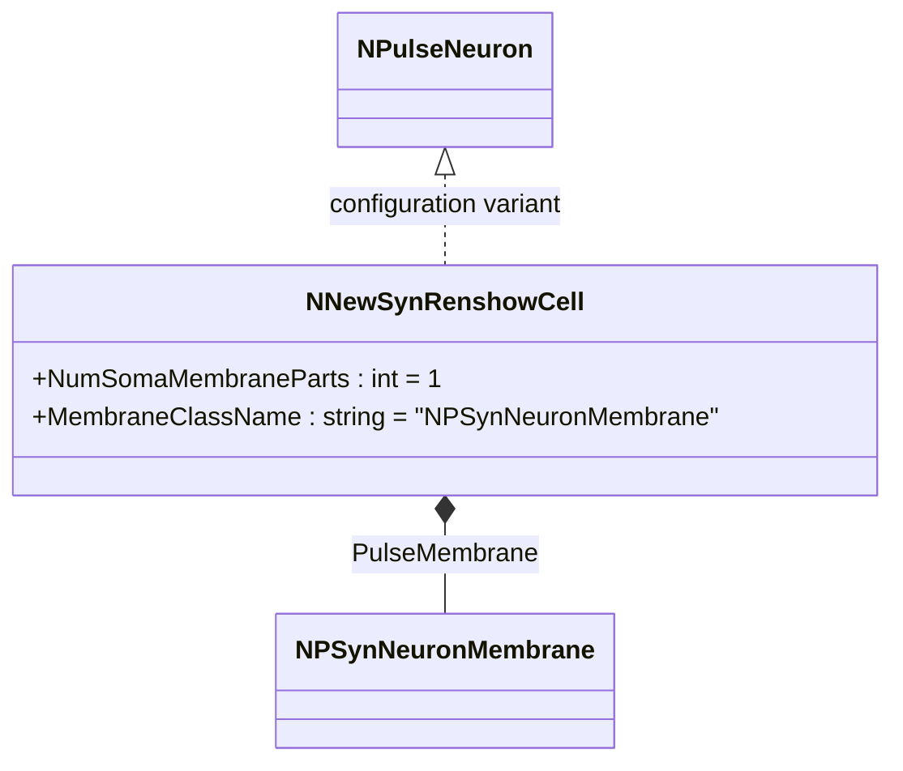
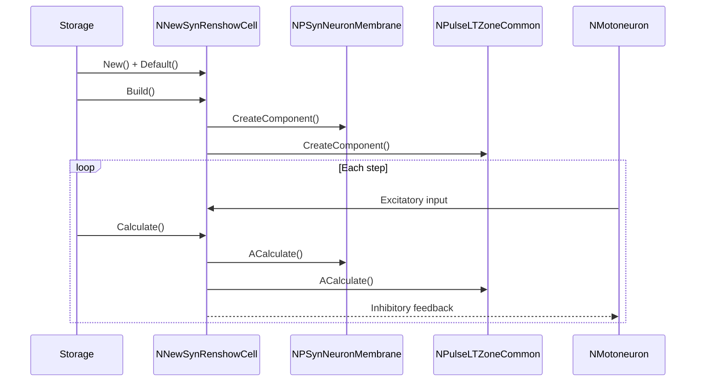
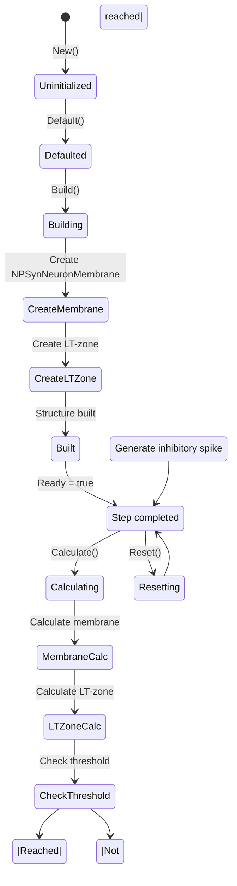
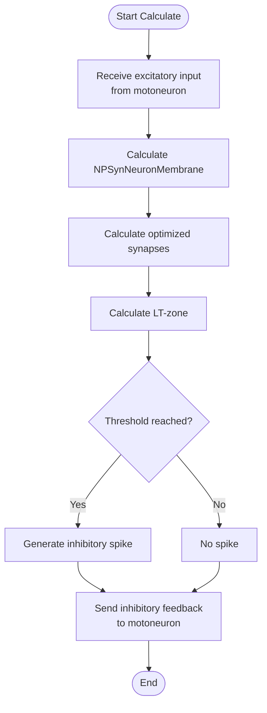
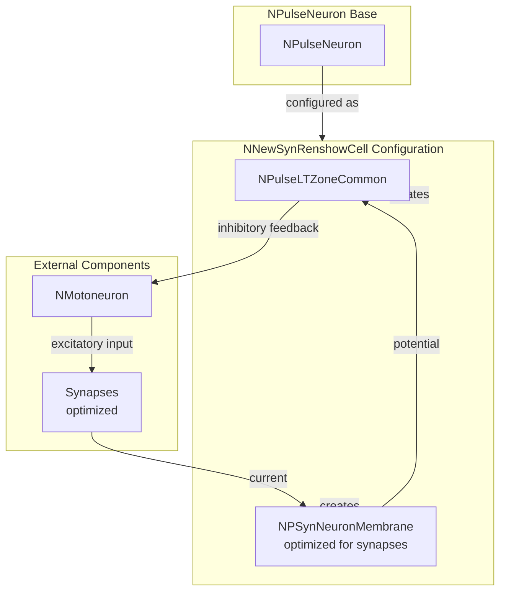

# NNewSynRenshowCell — новая син-клетка Реншоу

## RU

### Назначение

**Класс**: `NNewSynRenshowCell` — конфигурационный вариант новой клетки Реншоу с оптимизированными синапсами.  
**Регистрация**: `NPulseLibrary.cpp` → `UploadClass("NNewSynRenshowCell", ...)`.  
**Storage-инстансы**: `ClassName = "NNewSynRenshowCell"` в `Bin/Configs/*/Model_*.xml`.

`NNewSynRenshowCell` является конфигурационным вариантом базового класса `NPulseNeuron` для моделирования клеток Реншоу с оптимизированными синапсами. Создается из `NPulseNeuron` с настройками:
- `NumSomaMembraneParts = 1` — одна часть сомы
- `MembraneClassName = "NPSynNeuronMembrane"` — мембрана, оптимизированная для синапсов

**Использование:** Моделирование реципрокного торможения с оптимизированными синапсами

### UML-диаграмма классов

### Свойства

`NNewSynRenshowCell` использует все свойства базового класса `NPulseNeuron` с параметрами:
- `NumSomaMembraneParts = 1`
- `MembraneClassName = "NPSynNeuronMembrane"`

### Методы

`NNewSynRenshowCell` использует все методы базового класса `NPulseNeuron`.

## Источники

См. [Literature-References.md](../Literature-References.md): **19**, **20**, **21**, **22**, **28**, **31**.

### См. также

- [`NPulseNeuron`](NPulseNeuron.md) — импульсный нейрон
- [`NNewRenshowCell`](NNewRenshowCell.md) — новая клетка Реншоу
- [`NPSynNeuronMembrane`](NPSynNeuronMembrane.md) — мембрана, оптимизированная для синапсов
- [Architecture.md](../Architecture.md) — архитектура библиотеки

---

## EN

### Purpose

**Class**: `NNewSynRenshowCell` — configuration variant of new Renshaw cell with optimized synapses.  
**Registration**: `NPulseLibrary.cpp` → `UploadClass("NNewSynRenshowCell", ...)`.  
**Instances**: `ClassName = "NNewSynRenshowCell"` in `Bin/Configs/*/Model_*.xml`.

`NNewSynRenshowCell` is a configuration variant of the base class `NPulseNeuron` for modeling Renshaw cells with optimized synapses. Created from `NPulseNeuron` with settings:
- `NumSomaMembraneParts = 1` — one soma part
- `MembraneClassName = "NPSynNeuronMembrane"` — membrane optimized for synapses

**Usage:** Modeling reciprocal inhibition with optimized synapses

### UML Class Diagram

### UML Sequence Diagram

### UML State Diagram

### UML Activity Diagram

### UML Component Diagram

### Properties

`NNewSynRenshowCell` uses all properties of base class `NPulseNeuron` with parameters:
- `NumSomaMembraneParts = 1` — one soma part
- `MembraneClassName = "NPSynNeuronMembrane"` — membrane optimized for synapses

### Methods

`NNewSynRenshowCell` uses all methods of base class `NPulseNeuron`.

### Usage in configurations

`NNewSynRenshowCell` is used in reciprocal inhibition experiments:

- **Reciprocal inhibition**: `Bin/Configs/!OldConfigs/*/Model_*.xml` (where Renshaw cells with optimized synapses are required)

**Typical parameter values:**
- **NumSomaMembraneParts**: 1 (one soma part)
- **MembraneClassName**: "NPSynNeuronMembrane" (membrane optimized for synapses)

**Features:**
- Reciprocal inhibition: provides inhibitory feedback to motor neurons
- Synapse optimization: membrane optimized for efficient synapse processing
- Interneuron: acts as inhibitory interneuron in motor circuits

### References

See [Literature-References.md](../Literature-References.md): **19**, **20**, **21**, **22**, **28**, **31**.

### See Also

- [`NPulseNeuron`](NPulseNeuron.md) — spiking neuron
- [`NNewRenshowCell`](NNewRenshowCell.md) — new Renshaw cell
- [`NPSynNeuronMembrane`](NPSynNeuronMembrane.md) — membrane optimized for synapses
- [Architecture.md](../Architecture.md) — library architecture
