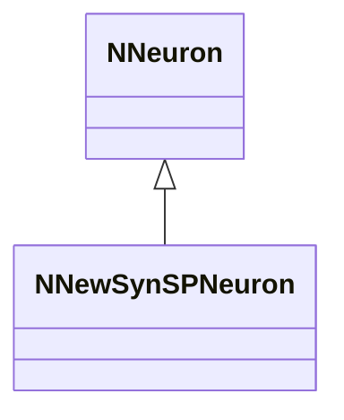
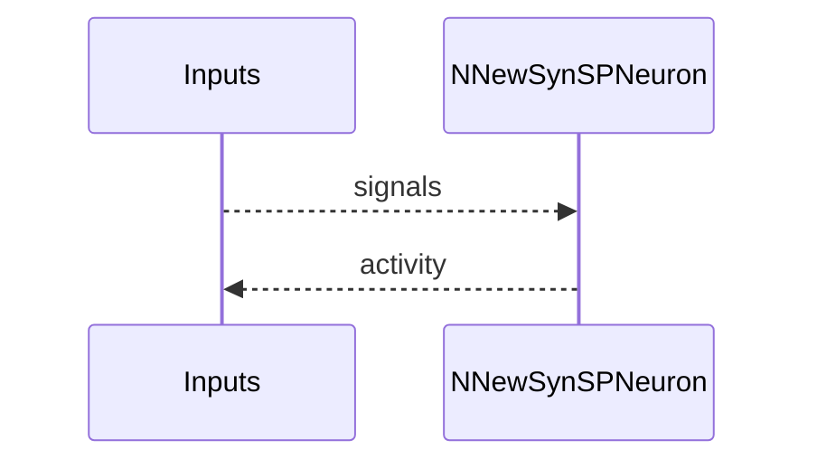
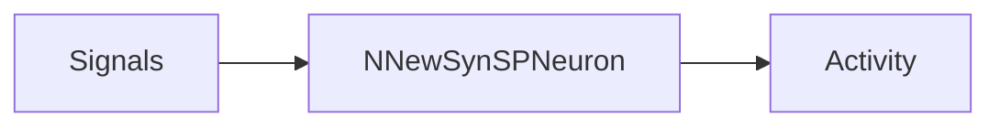

## NNewSynSPNeuron — новая син. SP модель

**Класс**: `NNewSynSPNeuron` — новая SP-нейрон в син. семействе.  
**Регистрация**: `NPulseLibrary.cpp` → `UploadClass("NNewSynSPNeuron", ...)`.  
**Storage**: `ClassName = "NNewSynSPNeuron"`.

### Lifecycle
- **ADefault**: параметры SP.
- **ABuild**: подключение входов/синапсов.
- **AReset**: сброс.
- **ACalculate**: SP-активация.

### I/O
- Вход: сигналы/токи.
- Выход: активность/спайк.



Пояснение: диаграмма классов показывает место компонента в иерархии и ключевые связи.



Пояснение: диаграмма последовательности показывает типовой сценарий взаимодействия и порядок вызовов.



Пояснение: блок-схема показывает поток данных/сигналов (входы → компонент → выходы).

### Config snippet

```ini
[Component]
ClassName = NNewSynSPNeuron
Name = NewSynSP1
```

---

## NNewSynSPNeuron — new synaptic SP neuron (EN)

New SP neuron variant in synaptic family.


Description: this class diagram shows the component position in the type hierarchy and key relations.


Description: this sequence diagram shows a typical runtime interaction and call order.


Description: this flowchart shows the data/signal flow (inputs → component → outputs).
