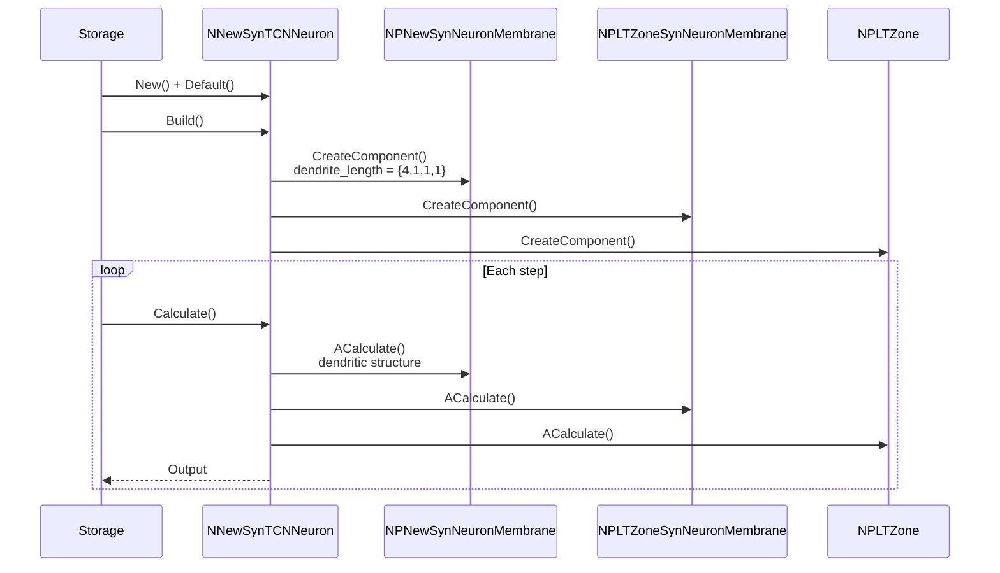
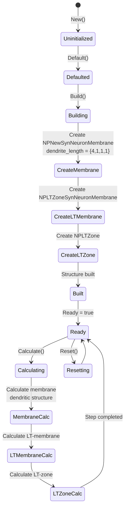
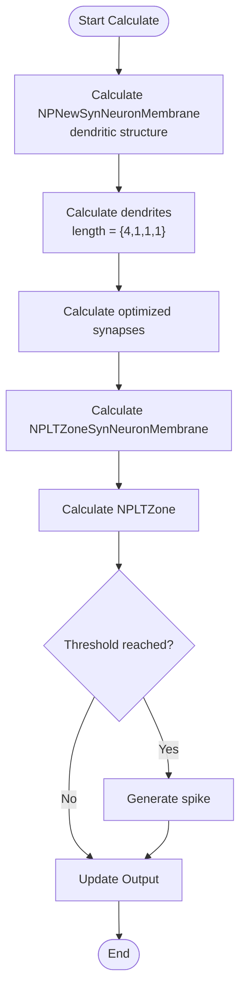
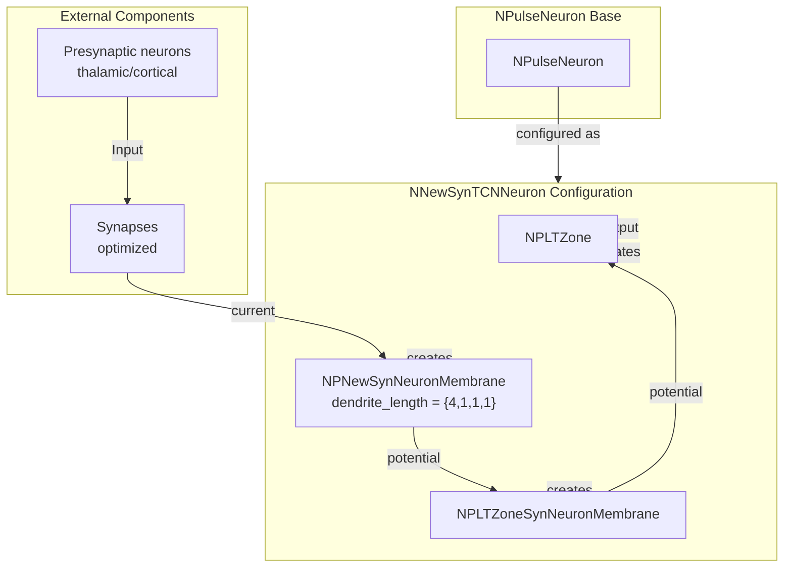

# NNewSynTCNNeuron — новый син-TCN-нейрон

## RU

### Назначение

**Класс**: `NNewSynTCNNeuron` — конфигурационный вариант нового TCN-нейрона (Thalamocortical Neuron) с оптимизированными синапсами.  
**Регистрация**: `NPulseLibrary.cpp` → `UploadClass("NNewSynTCNNeuron", ...)`.  
**Storage-инстансы**: `ClassName = "NNewSynTCNNeuron"` в `Bin/Configs/*/Model_*.xml`.

`NNewSynTCNNeuron` является конфигурационным вариантом базового класса `NPulseNeuron` для моделирования таламо-кортикальных нейронов с оптимизированными синапсами. Создается из `NPulseNeuron` с настройками:
- `MembraneClassName = "NPNewSynNeuronMembrane"` — новая мембрана, оптимизированная для синапсов
- `LTMembraneClassName = "NPLTZoneSynNeuronMembrane"` — новая LT-мембрана, оптимизированная для синапсов
- `LTZoneClassName = "NPLTZone"` — стандартная LT-зона
- Дендритная структура с параметрами `dendrite_length = {4,1,1,1}`

TCN-нейроны моделируют таламо-кортикальные связи в нейронных сетях.

**Использование:** Моделирование таламо-кортикальных систем, эксперименты с TCN-нейронами

### UML-диаграмма классов

```mermaid
classDiagram
    NPulseNeuron <|.. NNewSynTCNNeuron : configuration variant
    NNewSynTCNNeuron *-- NPNewSynNeuronMembrane : PulseMembrane
    NNewSynTCNNeuron *-- NPLTZoneSynNeuronMembrane : LTMembrane
    class NNewSynTCNNeuron {
        +MembraneClassName : string = "NPNewSynNeuronMembrane"
        +LTMembraneClassName : string = "NPLTZoneSynNeuronMembrane"
        +LTZoneClassName : string = "NPLTZone"
        +NumDendriteMembranePartsVec : vector~int~ = {4,1,1,1}
    }
```

### Свойства

`NNewSynTCNNeuron` использует все свойства базового класса `NPulseNeuron` с параметрами:
- `MembraneClassName = "NPNewSynNeuronMembrane"`
- `LTMembraneClassName = "NPLTZoneSynNeuronMembrane"`
- `LTZoneClassName = "NPLTZone"`
- `NumDendriteMembranePartsVec = {4,1,1,1}`

### Методы

`NNewSynTCNNeuron` использует все методы базового класса `NPulseNeuron`.

## Источники

См. [Literature-References.md](../Literature-References.md): **[A]**, **4**, **25**, **29**.

### См. также

- [`NPulseNeuron`](NPulseNeuron.md) — импульсный нейрон
- [`NNewSynSPNeuron`](NNewSynSPNeuron.md) — новый син-SP-нейрон
- [`NPNewSynNeuronMembrane`](NPNewNeuronMembrane.md) — новая мембрана, оптимизированная для синапсов
- [Architecture.md](../Architecture.md) — архитектура библиотеки

---

## EN

### Purpose

**Class**: `NNewSynTCNNeuron` — configuration variant of new TCN neuron (Thalamocortical Neuron) with optimized synapses.  
**Registration**: `NPulseLibrary.cpp` → `UploadClass("NNewSynTCNNeuron", ...)`.  
**Instances**: `ClassName = "NNewSynTCNNeuron"` in `Bin/Configs/*/Model_*.xml`.

`NNewSynTCNNeuron` is a configuration variant of the base class `NPulseNeuron` for modeling thalamocortical neurons with optimized synapses. Created from `NPulseNeuron` with settings:
- `MembraneClassName = "NPNewSynNeuronMembrane"` — new membrane optimized for synapses
- `LTMembraneClassName = "NPLTZoneSynNeuronMembrane"` — new LT-membrane optimized for synapses
- `LTZoneClassName = "NPLTZone"` — standard LT-zone
- Dendritic structure with parameters `dendrite_length = {4,1,1,1}`

TCN neurons model thalamocortical connections in neural networks.

**Usage:** Modeling thalamocortical systems, experiments with TCN neurons

### UML Class Diagram

```mermaid
classDiagram
    NPulseNeuron <|.. NNewSynTCNNeuron : configuration variant
    NNewSynTCNNeuron *-- NPNewSynNeuronMembrane : PulseMembrane
    NNewSynTCNNeuron *-- NPLTZoneSynNeuronMembrane : LTMembrane
    NNewSynTCNNeuron *-- NPLTZone : LTZone
    class NNewSynTCNNeuron {
        +MembraneClassName : string = "NPNewSynNeuronMembrane"
        +LTMembraneClassName : string = "NPLTZoneSynNeuronMembrane"
        +LTZoneClassName : string = "NPLTZone"
        +NumDendriteMembranePartsVec : vector~int~ = {4,1,1,1}
    }
```

### UML Sequence Diagram



### UML State Diagram



### UML Activity Diagram



### UML Component Diagram



### Properties

`NNewSynTCNNeuron` uses all properties of base class `NPulseNeuron` with parameters:
- `MembraneClassName = "NPNewSynNeuronMembrane"` — new membrane optimized for synapses
- `LTMembraneClassName = "NPLTZoneSynNeuronMembrane"` — new LT-membrane optimized for synapses
- `LTZoneClassName = "NPLTZone"` — standard LT-zone
- `NumDendriteMembranePartsVec = {4,1,1,1}` — dendritic structure with specified lengths

### Methods

`NNewSynTCNNeuron` uses all methods of base class `NPulseNeuron`.

### Usage in configurations

`NNewSynTCNNeuron` is used in thalamocortical system experiments:

- **Thalamocortical systems**: `Bin/Configs/!OldConfigs/*/Model_*.xml` (where TCN neurons are required)

**Typical parameter values:**
- **MembraneClassName**: "NPNewSynNeuronMembrane" (new membrane optimized for synapses)
- **LTMembraneClassName**: "NPLTZoneSynNeuronMembrane" (new LT-membrane optimized for synapses)
- **LTZoneClassName**: "NPLTZone" (standard LT-zone)
- **NumDendriteMembranePartsVec**: {4,1,1,1} (dendritic structure)

**Features:**
- Thalamocortical modeling: specifically designed for thalamocortical connections
- Dendritic structure: includes dendritic compartments with specified lengths
- Synapse optimization: membranes optimized for efficient synapse processing
- New architecture: uses improved membranes for more accurate modeling

### References

See [Literature-References.md](../Literature-References.md): **[A]**, **4**, **25**, **29**.

### See Also

- [`NPulseNeuron`](NPulseNeuron.md) — spiking neuron
- [`NNewSynSPNeuron`](NNewSynSPNeuron.md) — new synaptic SP-neuron
- [`NPNewSynNeuronMembrane`](NPNewNeuronMembrane.md) — new membrane optimized for synapses
- [Architecture.md](../Architecture.md) — library architecture
