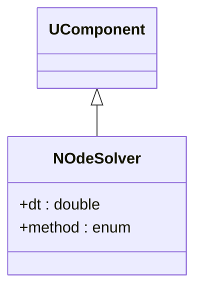
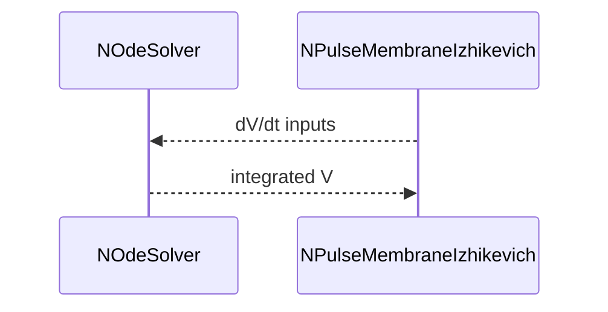

## NOdeSolver — численный решатель ОДУ

**Класс**: `NOdeSolver` — интегратор ОДУ для нейронных моделей.  
**Регистрация**: `NPulseLibrary.cpp` → `UploadClass("NOdeSolver", ...)`.  
**Storage-инстансы**: `ClassName = "NOdeSolver"`; параметры шага интегрирования, метода, точности.

### Входы/выходы
- Вход: функции/состояния для интегрирования (обычно мембранные уравнения).
- Выход: обновлённые состояния.

Пояснение: блок-схема показывает поток данных/сигналов (входы → компонент → выходы).

Пояснение: диаграмма последовательности показывает типовой сценарий взаимодействия и порядок вызовов.

---

## NOdeSolver — ODE solver

Numerical integrator for membrane/state equations; configured with step and method.
