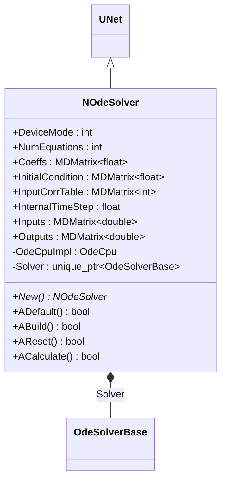
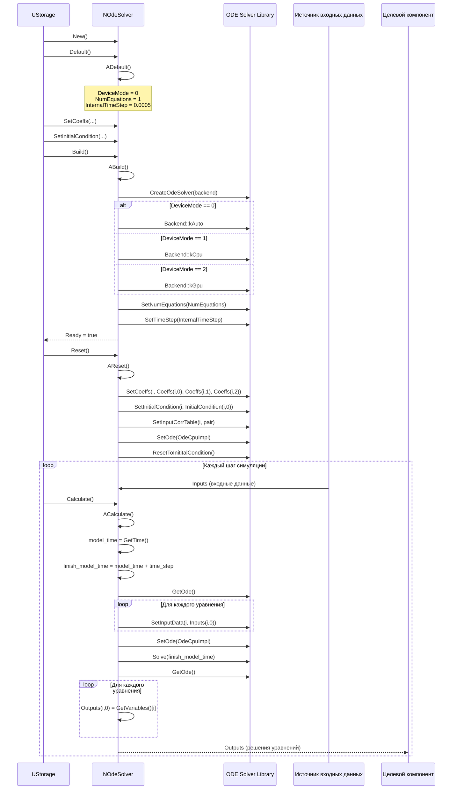
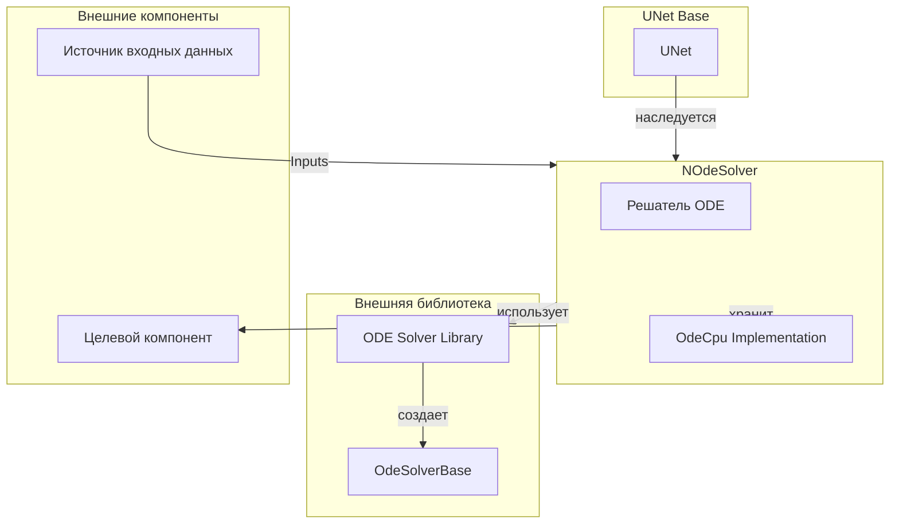
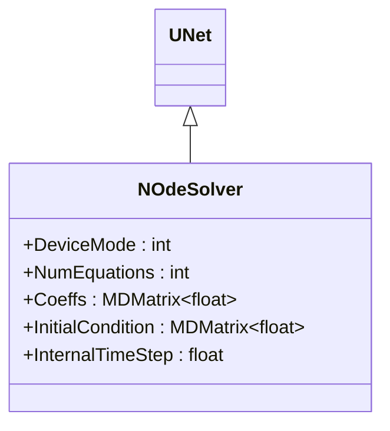
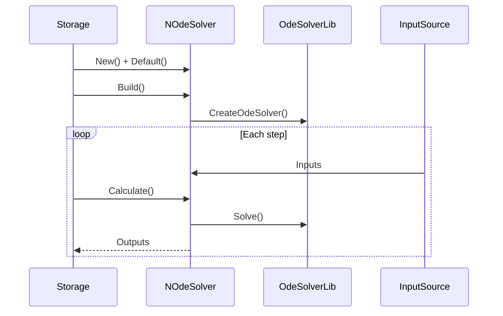
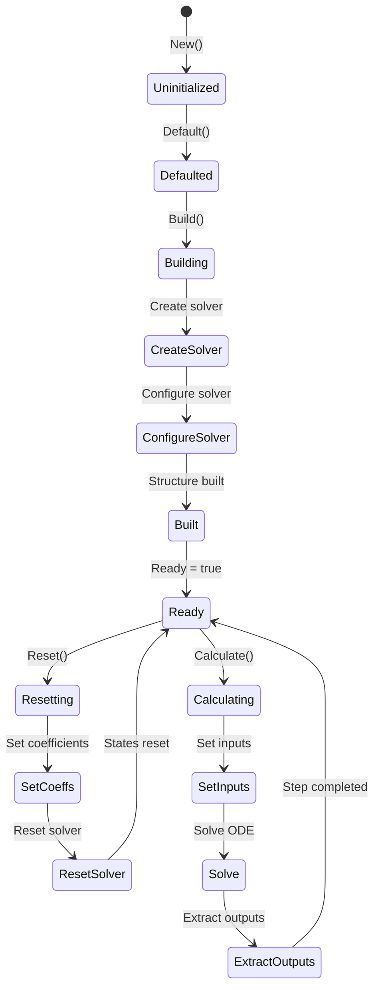
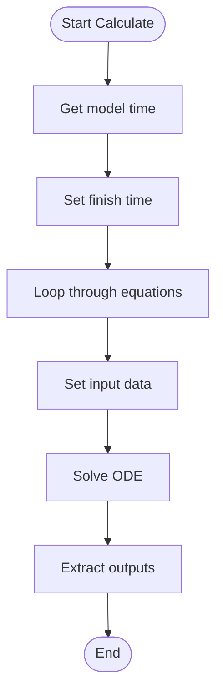

# NOdeSolver — решатель ODE

## RU

### Назначение

**Класс**: `NOdeSolver` — компонент для решения систем обыкновенных дифференциальных уравнений (ODE).  
**Регистрация**: `NPulseLibrary.cpp` → `UploadClass("NOdeSolver", ...)`.  
**Storage-инстансы**: `ClassName = "NOdeSolver"` в `Bin/Configs/*/Model_*.xml`.

`NOdeSolver` реализует решатель ODE, который использует внешнюю библиотеку ODE Solver для численного решения систем дифференциальных уравнений. Компонент поддерживает работу на CPU и GPU (если доступно) и может решать системы уравнений с заданными коэффициентами (`Coeffs`) и начальными условиями (`InitialCondition`).

**Использование:** Решение систем ODE, численное интегрирование

### UML-диаграмма классов



**Иерархия наследования:**
- `UNet` — базовая сеть Rdk Framework
- `NOdeSolver` — решатель ODE

**Связи:**
- Использует внешнюю библиотеку ODE Solver (`OdeSolverBase`, `OdeCpu`)

### UML-диаграмма последовательности



**Жизненный цикл:**
1. **Инициализация**: Установка параметров по умолчанию (`DeviceMode=0`, `NumEquations=1`)
2. **Сборка**: Создание решателя ODE (CPU или GPU), настройка количества уравнений и шага времени
3. **Сброс**: Установка коэффициентов, начальных условий, таблицы соответствия входов
4. **Расчет**: Передача входных данных, выполнение численного интегрирования, получение решений

### UML-диаграмма состояний

```mermaid
stateDiagram-v2
    [*] --> Uninitialized: New()
    Uninitialized --> Defaulted: Default()
    Defaulted --> Building: Build()
    Building --> CheckDeviceMode{DeviceMode?}
    CheckDeviceMode -->|0| CreateAutoSolver: CreateOdeSolver(kAuto)
    CheckDeviceMode -->|1| CreateCpuSolver: CreateOdeSolver(kCpu)
    CheckDeviceMode -->|2| CreateGpuSolver: CreateOdeSolver(kGpu)
    CreateAutoSolver --> ConfigureSolver: SetNumEquations, SetTimeStep
    CreateCpuSolver --> ConfigureSolver
    CreateGpuSolver --> ConfigureSolver
    ConfigureSolver --> ResizeMatrices: Resize Coeffs, InitialCondition, InputCorrTable
    ResizeMatrices --> Built: Структура создана
    Built --> Ready: Ready = true
    Ready --> Resetting: Reset()
    Resetting --> SetCoeffs: Установка коэффициентов для каждого уравнения
    SetCoeffs --> SetInitialConditions: Установка начальных условий
    SetInitialConditions --> SetInputCorrTable: Установка таблицы соответствия входов
    SetInputCorrTable --> ResetSolver: ResetToInititalCondition()
    ResetSolver --> Ready: Состояния сброшены
    Ready --> Calculating: Calculate()
    Calculating --> GetModelTime: model_time = GetTime()
    GetModelTime --> SetFinishTime: finish_model_time = model_time + time_step
    SetFinishTime --> GetOde: GetOde()
    GetOde --> LoopEquations: Цикл по уравнениям
    LoopEquations --> SetInputData: SetInputData(i, Inputs(i,0))
    SetInputData --> CheckMoreEquations: Есть еще уравнения?
    CheckMoreEquations -->|Да| LoopEquations
    CheckMoreEquations -->|Нет| SetOde: SetOde(OdeCpuImpl)
    SetOde --> Solve: Solve(finish_model_time)
    Solve --> GetOdeResult: GetOde()
    GetOdeResult --> ExtractOutputs: Outputs(i,0) = GetVariables()[i]
    ExtractOutputs --> Ready: Шаг завершен
```

**Состояния:**
- **Uninitialized** — создан, но не инициализирован
- **Defaulted** — параметры установлены по умолчанию
- **Building** — выполняется сборка
- **CheckDeviceMode** — проверка режима устройства
- **CreateAutoSolver** — создание решателя с автоматическим выбором
- **CreateCpuSolver** — создание CPU-решателя
- **CreateGpuSolver** — создание GPU-решателя
- **ConfigureSolver** — настройка решателя
- **ResizeMatrices** — изменение размеров матриц
- **Built** — структура решателя построена
- **Ready** — готов к выполнению расчетов
- **Resetting** — выполняется сброс
- **SetCoeffs** — установка коэффициентов
- **SetInitialConditions** — установка начальных условий
- **SetInputCorrTable** — установка таблицы соответствия входов
- **ResetSolver** — сброс решателя к начальным условиям
- **Calculating** — выполняется расчет решателя
- **GetModelTime** — получение текущего времени модели
- **SetFinishTime** — установка времени завершения шага
- **GetOde** — получение объекта ODE
- **LoopEquations** — цикл по уравнениям
- **SetInputData** — установка входных данных
- **CheckMoreEquations** — проверка наличия еще уравнений
- **SetOde** — установка объекта ODE в решатель
- **Solve** — выполнение численного интегрирования
- **GetOdeResult** — получение результата ODE
- **ExtractOutputs** — извлечение выходных значений

### UML-диаграмма активности

```mermaid
flowchart TD
    Start([Start Calculate]) --> GetModelTime[model_time = GetTime()]
    GetModelTime --> SetFinishTime[finish_model_time = model_time + time_step]
    SetFinishTime --> GetOde[GetOde()]
    GetOde --> LoopEquations[Цикл по уравнениям i = 0..NumEquations-1]
    LoopEquations --> SetInputData[SetInputData(i, Inputs(i,0))]
    SetInputData --> CheckMoreEquations{Есть еще уравнения?}
    CheckMoreEquations -->|Да| LoopEquations
    CheckMoreEquations -->|Нет| SetOde[SetOde(OdeCpuImpl)]
    SetOde --> Solve[Solve(finish_model_time)]
    Solve --> GetOdeResult[GetOde()]
    GetOdeResult --> LoopOutputs[Цикл по уравнениям i = 0..NumEquations-1]
    LoopOutputs --> ExtractOutput[Outputs(i,0) = GetVariables()[i]]
    ExtractOutput --> CheckMoreOutputs{Есть еще уравнения?}
    CheckMoreOutputs -->|Да| LoopOutputs
    CheckMoreOutputs -->|Нет| End([End])
```

**Алгоритм расчета:**
1. Получение текущего времени модели
2. Вычисление времени завершения шага: `finish_model_time = model_time + time_step`
3. Получение объекта ODE из решателя
4. Цикл по уравнениям: установка входных данных для каждого уравнения
5. Установка объекта ODE в решатель
6. Выполнение численного интегрирования: `Solve(finish_model_time)`
7. Получение результатов: извлечение переменных для каждого уравнения

### UML-диаграмма компонентов



**Зависимости:**
- **Базовый класс**: `UNet`
- **Внутренние компоненты**: решатель ODE, реализация OdeCpu (`OdeCpuImpl`)
- **Внешняя библиотека**: ODE Solver Library (`OdeSolverBase`, `OdeCpu`, `OdeGpu`)
- **Внешние компоненты**: источник входных данных (источник `Inputs`), целевой компонент (получатель `Outputs`)

### Свойства

#### Параметры (ptPubParameter)

- **`DeviceMode`** (int) — режим устройства:
  - 0 — автоматический (GPU, если возможно)
  - 1 — CPU
  - 2 — GPU
  Значение по умолчанию: 0

- **`NumEquations`** (int) — количество уравнений в системе. Значение по умолчанию: 1

- **`Coeffs`** (MDMatrix<float>) — матрица коэффициентов уравнений (NumEquations x 3). Значение по умолчанию: матрица 1x3, все элементы = 1.0

- **`InitialCondition`** (MDMatrix<float>) — начальные условия (NumEquations x 1). Значение по умолчанию: матрица 1x1, элемент = 0.0

- **`InputCorrTable`** (MDMatrix<int>) — таблица соответствия входов уравнениям (NumEquations x 2). Значение по умолчанию: матрица 1x2, все элементы = 1

- **`InternalTimeStep`** (float) — внутренний шаг времени для решателя ODE. Значение по умолчанию: 0.0005

#### Входные свойства (ptInput | ptPubState)

- **`Inputs`** (MDMatrix<double>) — входные сигналы для уравнений. Значение по умолчанию: матрица 1x1, элемент = 0.0

#### Выходные свойства (ptOutput | ptPubState)

- **`Outputs`** (MDMatrix<double>) — выходные сигналы (решения уравнений). Значение по умолчанию: матрица 1x1, элемент = 0.0

### Методы

- **`ABuild()`** → `bool` — строит структуру решателя:
  1. Создает решатель ODE (CPU или GPU в зависимости от `DeviceMode`)
  2. Настраивает количество уравнений
  3. Настраивает размеры матриц

- **`AReset()`** → `bool` — сбрасывает решатель:
  1. Устанавливает коэффициенты для каждого уравнения
  2. Устанавливает начальные условия
  3. Устанавливает таблицу соответствия входов
  4. Сбрасывает решатель к начальным условиям

- **`ACalculate()`** → `bool` — выполняет расчет решателя:
  1. Передает входные сигналы в решатель
  2. Выполняет один шаг численного интегрирования
  3. Выдает решения как выходные сигналы

### Примеры использования

#### Пример 1: Создание решателя в коде C++

```cpp
// Создание решателя ODE
auto solver = storage->CreateComponent<NOdeSolver>();
solver->SetName("OdeSolver");

// Инициализация
solver->Default();

// Настройка параметров
solver->NumEquations = 2;
solver->DeviceMode = 0;  // Автоматический выбор
solver->InternalTimeStep = 0.0005f;

// Настройка коэффициентов (2 уравнения, 3 коэффициента каждое)
MDMatrix<float> coeffs(2, 3);
coeffs(0, 0) = 1.0f; coeffs(0, 1) = 0.0f; coeffs(0, 2) = 0.0f;
coeffs(1, 0) = 0.0f; coeffs(1, 1) = 1.0f; coeffs(1, 2) = 0.0f;
solver->Coeffs = coeffs;

// Начальные условия
MDMatrix<float> initCond(2, 1);
initCond(0, 0) = 0.0f;
initCond(1, 0) = 0.0f;
solver->InitialCondition = initCond;

// Сборка
solver->Build();
```

### См. также

- [Architecture.md](../Architecture.md) — архитектура библиотеки

---

## EN

### Purpose

**Class**: `NOdeSolver` — component for solving systems of ordinary differential equations (ODE).  
**Registration**: `NPulseLibrary.cpp` → `UploadClass("NOdeSolver", ...)`.  
**Instances**: `ClassName = "NOdeSolver"` in `Bin/Configs/*/Model_*.xml`.

`NOdeSolver` implements ODE solver that uses external ODE Solver library for numerical solution of differential equation systems. Component supports CPU and GPU operation (if available) and can solve equation systems with specified coefficients (`Coeffs`) and initial conditions (`InitialCondition`).

**Usage:** Solving ODE systems, numerical integration

### UML Class Diagram



### UML Sequence Diagram



### UML State Diagram



### UML Activity Diagram



### See Also

- [Architecture.md](../Architecture.md) — library architecture
