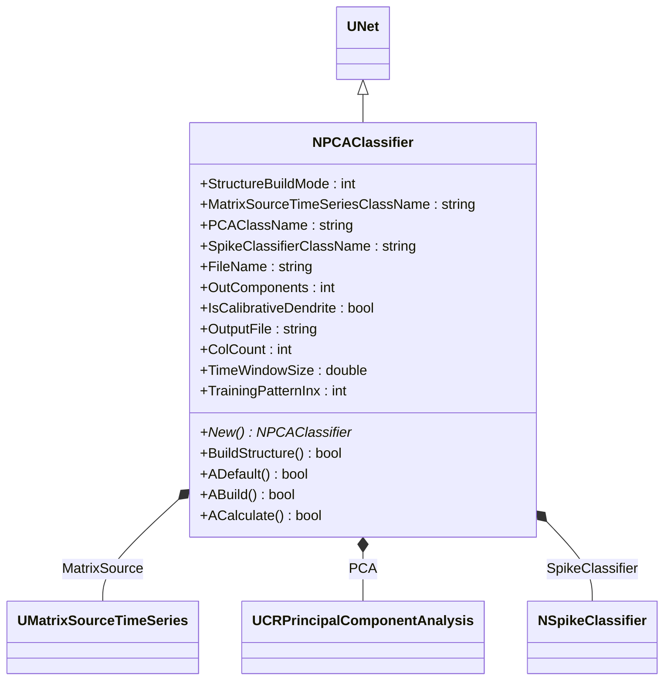
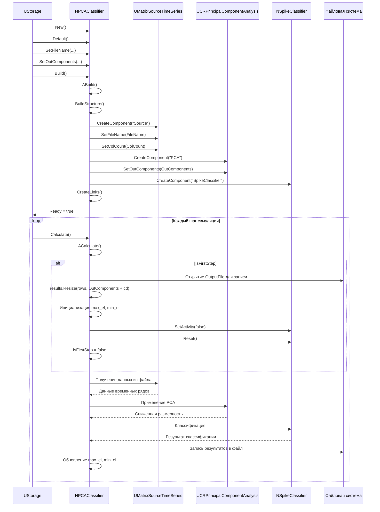
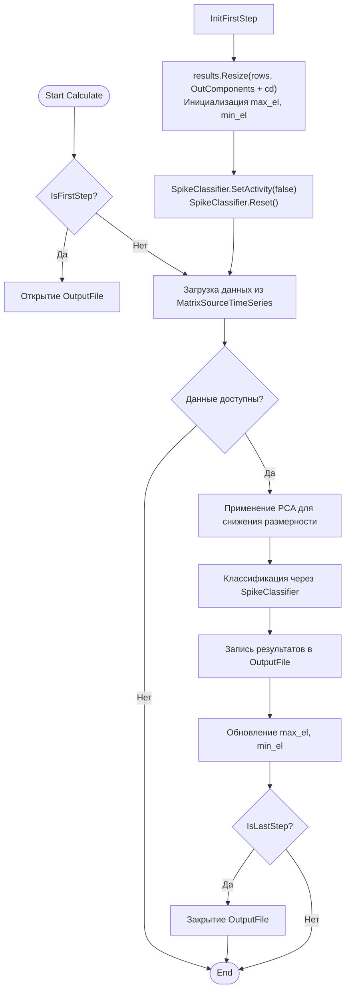
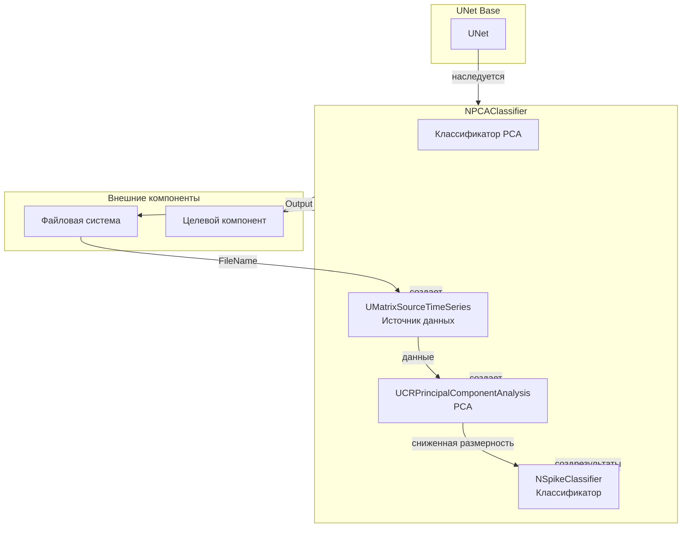
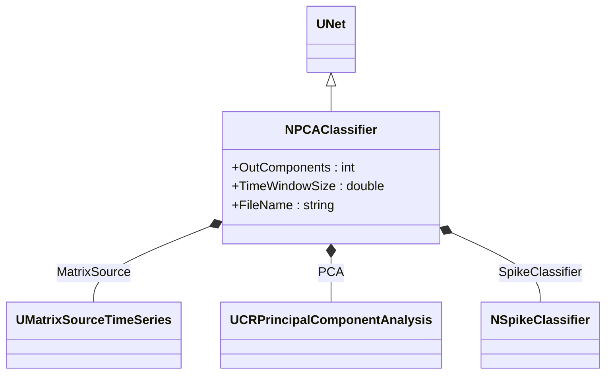
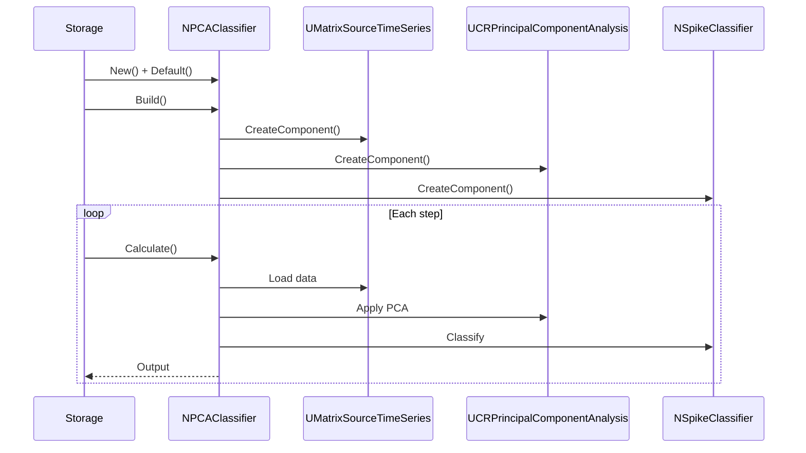
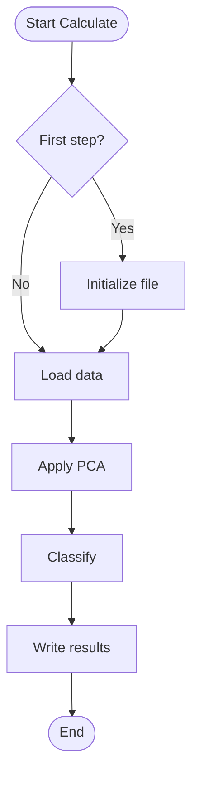
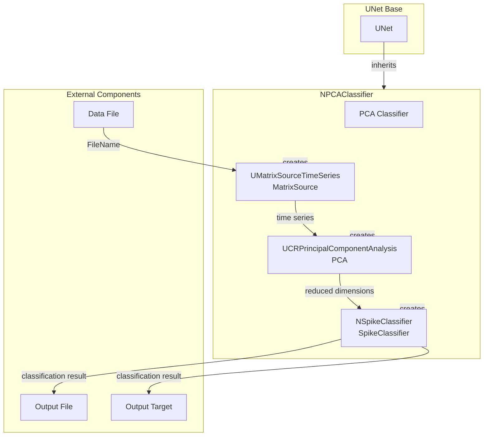

# NPCAClassifier — классификатор PCA

## RU

### Назначение

**Класс**: `NPCAClassifier` — классификатор на основе PCA (Principal Component Analysis).  
**Регистрация**: `NPulseLibrary.cpp` → `UploadClass("NPCAClassifier", ...)`.  
**Storage-инстансы**: `ClassName = "NPCAClassifier"` в `Bin/Configs/*/Model_*.xml`.

`NPCAClassifier` реализует классификатор, который использует PCA для снижения размерности признаков и последующей классификации. Наследуется от `UNet` и интегрирует компоненты: `UMatrixSourceTimeSeries` (источник временных рядов), `UCRPrincipalComponentAnalysis` (PCA), и `NSpikeClassifier` (классификатор по спайкам).

**Использование:** Классификация с PCA, снижение размерности признаков

### UML-диаграмма классов



**Иерархия наследования:**
- `UNet` — базовая сеть Rdk Framework
- `NPCAClassifier` — классификатор PCA

**Связи:**
- Использует `UMatrixSourceTimeSeries` для загрузки временных рядов
- Использует `UCRPrincipalComponentAnalysis` для PCA-анализа
- Использует `NSpikeClassifier` для классификации

**Внутренняя структура:**
- **MatrixSourceTimeSeries** (`UMatrixSourceTimeSeries`) — источник временных рядов
- **PCA** (`UCRPrincipalComponentAnalysis`) — компонент PCA-анализа
- **SpikeClassifier** (`NSpikeClassifier`) — классификатор по спайкам

### UML-диаграмма последовательности



**Жизненный цикл:**
1. **Инициализация**: Установка параметров классификатора PCA
2. **Сборка структуры**: Создание источника временных рядов, PCA-компонента, классификатора по спайкам
3. **Расчет**: Загрузка данных, применение PCA, классификация, запись результатов

### UML-диаграмма состояний

```mermaid
stateDiagram-v2
    [*] --> Uninitialized: New()
    Uninitialized --> Defaulted: Default()
    Defaulted --> Building: Build()
    Building --> CreatingMatrixSource: Создание MatrixSourceTimeSeries
    CreatingMatrixSource --> CreatingPCA: Создание PCA
    CreatingPCA --> CreatingSpikeClassifier: Создание SpikeClassifier
    CreatingSpikeClassifier --> Linking: Создание связей
    Linking --> Built: Структура построена
    Built --> Ready: Ready = true
    Ready --> Calculating: Calculate()
    Calculating --> CheckFirstStep{IsFirstStep?}
    CheckFirstStep -->|Да| InitFile: Открытие OutputFile
    CheckFirstStep -->|Нет| LoadData: Загрузка данных
    InitFile --> InitMatrices: Инициализация results, max_el, min_el
    InitMatrices --> ResetClassifier: Reset SpikeClassifier
    ResetClassifier --> LoadData
    LoadData --> ApplyPCA: Применение PCA
    ApplyPCA --> Classify: Классификация через SpikeClassifier
    Classify --> WriteResults: Запись результатов в файл
    WriteResults --> UpdateMinMax: Обновление max_el, min_el
    UpdateMinMax --> CheckLastStep{IsLastStep?}
    CheckLastStep -->|Нет| Ready: Шаг завершен
    CheckLastStep -->|Да| CloseFile: Закрытие файла
    CloseFile --> Ready: Шаг завершен
    Ready --> Resetting: Reset()
    Resetting --> Ready: Состояния сброшены
```

**Состояния:**
- **Uninitialized** — создан, но не инициализирован
- **Defaulted** — параметры установлены по умолчанию
- **Building** — выполняется сборка структуры
- **CreatingMatrixSource** — создание источника временных рядов
- **CreatingPCA** — создание PCA-компонента
- **CreatingSpikeClassifier** — создание классификатора по спайкам
- **Linking** — создание связей между компонентами
- **Built** — структура классификатора построена
- **Ready** — готов к выполнению расчетов
- **Calculating** — выполняется расчет классификатора
- **CheckFirstStep** — проверка первого шага
- **InitFile** — инициализация файла вывода
- **InitMatrices** — инициализация матриц результатов
- **ResetClassifier** — сброс классификатора
- **LoadData** — загрузка данных из источника
- **ApplyPCA** — применение PCA для снижения размерности
- **Classify** — классификация данных
- **WriteResults** — запись результатов в файл
- **UpdateMinMax** — обновление минимумов и максимумов
- **CheckLastStep** — проверка последнего шага
- **CloseFile** — закрытие файла
- **Resetting** — выполняется сброс состояний

### UML-диаграмма активности



**Алгоритм расчета:**
1. Проверка первого шага: инициализация файла вывода и матриц результатов
2. Загрузка данных из источника временных рядов
3. Применение PCA: снижение размерности признаков
4. Классификация: использование классификатора по спайкам для классификации данных
5. Запись результатов: сохранение результатов в файл
6. Обновление статистики: обновление минимумов и максимумов для нормализации

### UML-диаграмма компонентов



**Зависимости:**
- **Базовый класс**: `UNet`
- **Внутренние компоненты**: источник временных рядов (`UMatrixSourceTimeSeries`), PCA (`UCRPrincipalComponentAnalysis`), классификатор по спайкам (`NSpikeClassifier`)
- **Внешние компоненты**: файловая система (источник данных и получатель результатов), целевой компонент (получатель `Output`)

### Свойства

#### Параметры (ptPubParameter)

- **`MatrixSourceTimeSeriesClassName`** (string) — имя класса источника временных рядов. Значение по умолчанию: зависит от реализации

- **`PCAClassName`** (string) — имя класса PCA. Значение по умолчанию: зависит от реализации

- **`SpikeClassifierClassName`** (string) — имя класса классификатора по спайкам. Значение по умолчанию: зависит от реализации

- **`FileName`** (string) — путь к файлу с данными. Значение по умолчанию: зависит от реализации

- **`OutComponents`** (int) — количество выходных компонент PCA. Значение по умолчанию: зависит от реализации

- **`IsCalibrativeDendrite`** (bool) — флаг калибровочного дендрита. Значение по умолчанию: зависит от реализации

- **`OutputFile`** (string) — путь к файлу для вывода результатов. Значение по умолчанию: зависит от реализации

- **`ColCount`** (int) — количество столбцов данных. Значение по умолчанию: зависит от реализации

- **`TimeWindowSize`** (double) — размер временного окна (сек). Значение по умолчанию: зависит от реализации

- **`TrainingPatternInx`** (int) — индекс обучающего паттерна. Значение по умолчанию: зависит от реализации

### Методы

- **`BuildStructure()`** → `bool` — строит структуру классификатора:
  1. Создает источник временных рядов
  2. Создает PCA-компонент
  3. Создает классификатор по спайкам
  4. Настраивает связи между компонентами

- **`ACalculate()`** → `bool` — выполняет расчет классификатора:
  1. Загружает данные из источника временных рядов
  2. Применяет PCA для снижения размерности
  3. Классифицирует данные с помощью классификатора по спайкам

### Использование в конфигурациях

`NPCAClassifier` используется в экспериментах с классификацией с использованием PCA:

- **PCA-классификация**: `Bin/Configs/!OldConfigs/PCATest/` (классификация с PCA)

**Типичные значения параметров:**
- **StructureBuildMode**: 1 (пересобрать структуру)
- **MatrixSourceTimeSeriesClassName**: имя класса источника временных рядов
- **PCAClassName**: имя класса PCA
- **SpikeClassifierClassName**: "NSpikeClassifier" (классификатор по спайкам)
- **FileName**: путь к файлу с данными
- **OutComponents**: количество выходных компонент PCA (обычно 2-10)
- **IsCalibrativeDendrite**: false (без калибровочного дендрита), true (с калибровочным дендритом)
- **ColCount**: количество столбцов данных
- **TimeWindowSize**: размер временного окна
- **TrainingPatternInx**: индекс обучающего паттерна

**Особенности:**
- PCA-анализ: снижение размерности признаков перед классификацией
- Классификация по спайкам: использование `NSpikeClassifier` для финальной классификации
- Запись результатов: автоматическая запись результатов классификации в файл

## Источники

См. [Literature-References.md](../Literature-References.md): **1**, **6**, **8**, **9**, **10**.

### См. также

- [`NClassifier`](NClassifier.md) — базовый классификатор
- [`NSpikeClassifier`](NSpikeClassifier.md) — классификатор по спайкам
- [Architecture.md](../Architecture.md) — архитектура библиотеки

---

## EN

### Purpose

**Class**: `NPCAClassifier` — PCA-based classifier.  
**Registration**: `NPulseLibrary.cpp` → `UploadClass("NPCAClassifier", ...)`.  
**Instances**: `ClassName = "NPCAClassifier"` in `Bin/Configs/*/Model_*.xml`.

`NPCAClassifier` implements classifier that uses PCA for feature dimensionality reduction and subsequent classification. Inherits from `UNet` and integrates components: `UMatrixSourceTimeSeries`, `UCRPrincipalComponentAnalysis`, and `NSpikeClassifier`.

**Usage:** Classification with PCA, feature dimensionality reduction

### UML Class Diagram



### UML Sequence Diagram



### UML State Diagram

```mermaid
stateDiagram-v2
    [*] --> Uninitialized: New()
    Uninitialized --> Defaulted: Default()
    Defaulted --> Building: Build()
    Building --> CreatingComponents: Create components
    CreatingComponents --> Built: Structure built
    Built --> Ready: Ready = true
    Ready --> Calculating: Calculate()
    Calculating --> CheckFirstStep{First step?}
    CheckFirstStep -->|Yes| InitFile: Initialize file
    CheckFirstStep -->|No| LoadData: Load data
    InitFile --> LoadData
    LoadData --> ApplyPCA: Apply PCA
    ApplyPCA --> Classify: Classify
    Classify --> WriteResults: Write results
    WriteResults --> Ready: Step completed
    Ready --> Resetting: Reset()
    Resetting --> Ready
```

### UML Activity Diagram



### UML Component Diagram



### Properties

- `StructureBuildMode` — режим пересборки структуры
- `MatrixSourceTimeSeriesClassName` — имя класса источника временных рядов
- `PCAClassName` — имя класса PCA
- `SpikeClassifierClassName` — имя класса классификатора по спайкам
- `FileName` — имя файла с данными
- `OutComponents` — количество выходных компонентов PCA
- `IsCalibrativeDendrite` — калибровочный дендрит
- `OutputFile` — имя выходного файла
- `ColCount` — количество столбцов
- `TimeWindowSize` — размер временного окна
- `TrainingPatternInx` — индекс обучающего паттерна

### Methods

- `ADefault()` — установка параметров по умолчанию
- `ABuild()` — сборка структуры PCA-классификатора
- `ACalculate()` — выполнение шага PCA и классификации
- `BuildStructure()` — построение структуры компонентов

### Usage in configurations

`NPCAClassifier` is used for classification with PCA:

- **PCA classification**: `Bin/Configs/*/Model_*.xml` (where PCA-based classification is required)
- **Dimensionality reduction**: experiments with reducing feature dimensionality
- **Pattern classification**: classification after PCA transformation

**Features:**
- PCA integration: uses PCA for dimensionality reduction
- Time series processing: processes time series data
- Spike classification: uses spike classifier after PCA
- File I/O: supports data loading from files and result writing

**Typical parameter values:**
- **MatrixSourceTimeSeriesClassName**: "UMatrixSourceTimeSeries" (time series source)
- **PCAClassName**: "UCRPrincipalComponentAnalysis" (PCA component)
- **SpikeClassifierClassName**: "NSpikeClassifier" (spike classifier)

### References

See [Literature-References.md](../Literature-References.md): **1**, **6**, **8**, **9**, **10**.

### See Also

- [`NClassifier`](NClassifier.md) — base classifier
- [`NSpikeClassifier`](NSpikeClassifier.md) — spike-based classifier
- [Architecture.md](../Architecture.md) — library architecture
