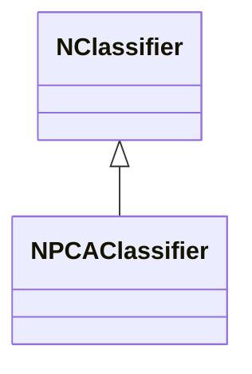
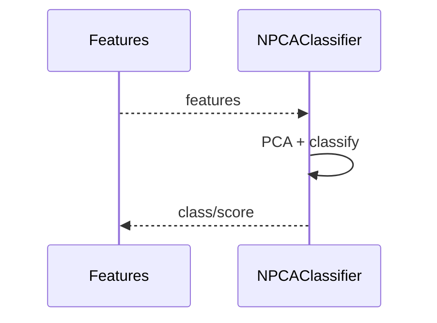
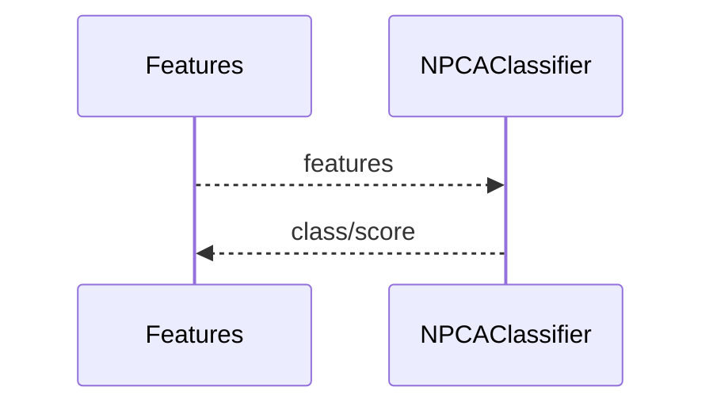

## NPCAClassifier — классификатор PCA (Nmsdk-PulseLib)

**Класс**: `NPCAClassifier` — классификатор на основе PCA (Principal Component Analysis).  
**Регистрация**: `NPulseLibrary.cpp` → `UploadClass("NPCAClassifier", ...)`.  
**Storage**: `ClassName = "NPCAClassifier"`.

### Lifecycle
- **ADefault**: параметры PCA (число компонент).
- **ABuild**: обучение PCA на данных/загрузка модели.
- **AReset**: сброс классификатора.
- **ACalculate**: проекция признаков и классификация.

### I/O
- Вход: признаки/векторы.
- Выход: класс/скор.



Пояснение: диаграмма классов показывает место компонента в иерархии и ключевые связи.



Пояснение: диаграмма последовательности показывает типовой сценарий взаимодействия и порядок вызовов.


Пояснение: блок-схема показывает поток данных/сигналов (входы → компонент → выходы).

### Config snippet

```ini
[Component]
ClassName = NPCAClassifier
Name = PCACls1
```

---

## NPCAClassifier — PCA-based classifier (EN)

Classifier using PCA for feature reduction/classification.


Description: this class diagram shows the component position in the type hierarchy and key relations.



Description: this sequence diagram shows a typical runtime interaction and call order.


Description: this flowchart shows the data/signal flow (inputs → component → outputs).
