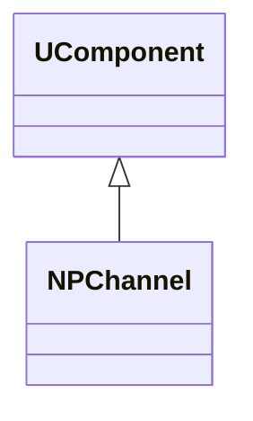
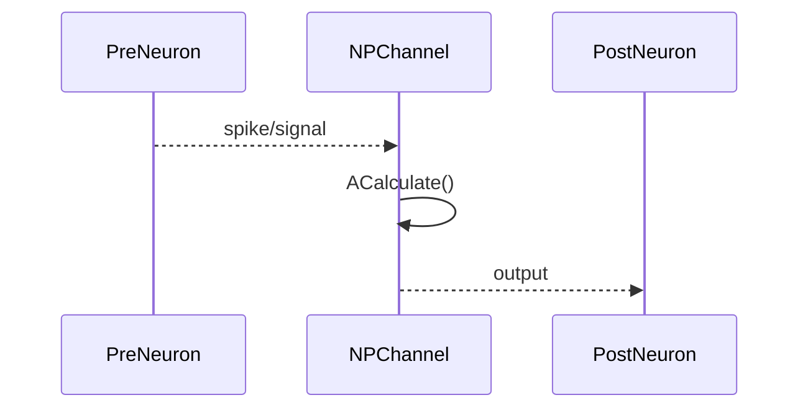
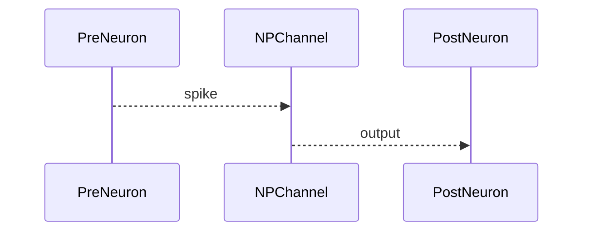

## NPChannel — импульсный канал (Nmsdk-PulseLib)

**Класс**: `NPChannel` — базовый канал передачи импульсов.  
**Регистрация**: `NPulseLibrary.cpp` → `UploadClass("NPChannel", ...)`.  
**Storage**: `ClassName = "NPChannel"`.

### Lifecycle
- **ADefault**: параметры передачи/задержки.
- **ABuild**: подключение pre/post.
- **AReset**: сброс буферов.
- **ACalculate**: передача импульса/сигнала.

### I/O
- Вход: импульс/сигнал от pre.
- Выход: переданный/обработанный сигнал к post.



Пояснение: диаграмма классов показывает место компонента в иерархии и ключевые связи.



Пояснение: диаграмма последовательности показывает типовой сценарий взаимодействия и порядок вызовов.


Пояснение: блок-схема показывает поток данных/сигналов (входы → компонент → выходы).

### Config snippet

```ini
[Component]
ClassName = NPChannel
Name = PCh1
```

---

## NPChannel — pulse channel (EN)

Base pulse/spike transmission channel.


Description: this class diagram shows the component position in the type hierarchy and key relations.



Description: this sequence diagram shows a typical runtime interaction and call order.


Description: this flowchart shows the data/signal flow (inputs → component → outputs).
