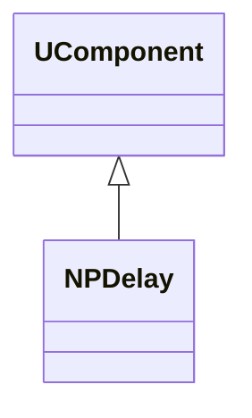
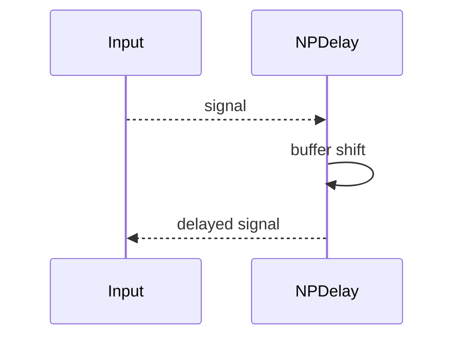
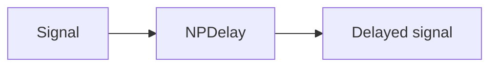
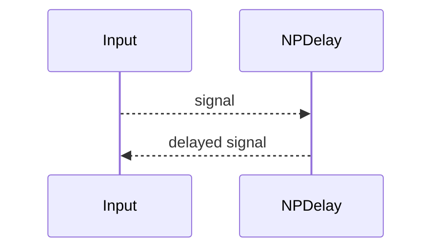

## NPDelay — задержка импульсов (Nmsdk-PulseLib)

**Класс**: `NPDelay` — компонент задержки спайков/сигналов.  
**Регистрация**: `NPulseLibrary.cpp` → `UploadClass("NPDelay", ...)`.  
**Storage**: `ClassName = "NPDelay"`.

### Lifecycle
- **ADefault**: установка величины задержки.
- **ABuild**: подготовка буфера.
- **AReset**: очистка буфера.
- **ACalculate**: сдвиг/выдача задержанного сигнала.

### I/O
- Вход: спайки/сигнал.
- Выход: тот же сигнал с задержкой.



Пояснение: диаграмма классов показывает место компонента в иерархии и ключевые связи.



Пояснение: диаграмма последовательности показывает типовой сценарий взаимодействия и порядок вызовов.



Пояснение: блок-схема показывает поток данных/сигналов (входы → компонент → выходы).

### Config snippet

```ini
[Component]
ClassName = NPDelay
Name = Delay1
```

---

## NPDelay — delay component (EN)

Delays incoming spikes/signals by configured time.


Description: this class diagram shows the component position in the type hierarchy and key relations.



Description: this sequence diagram shows a typical runtime interaction and call order.


Description: this flowchart shows the data/signal flow (inputs → component → outputs).
