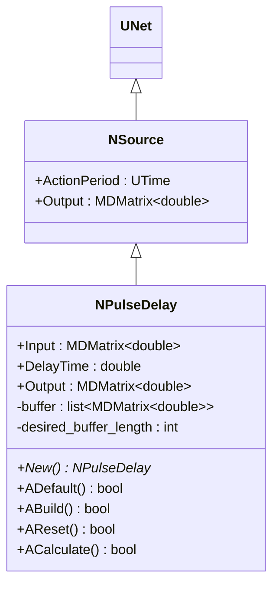
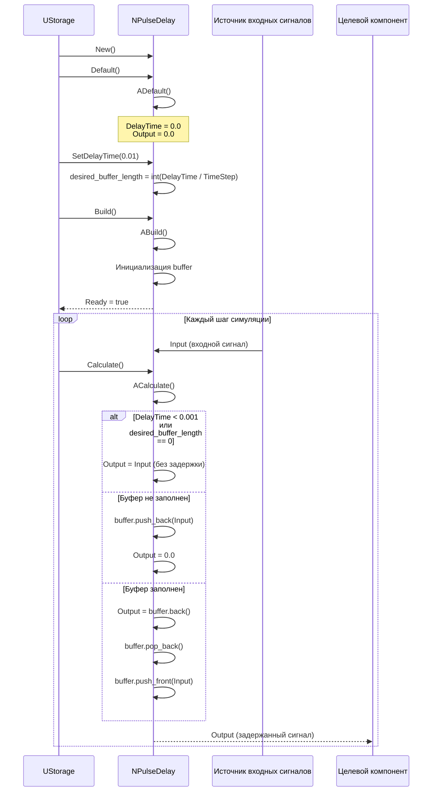
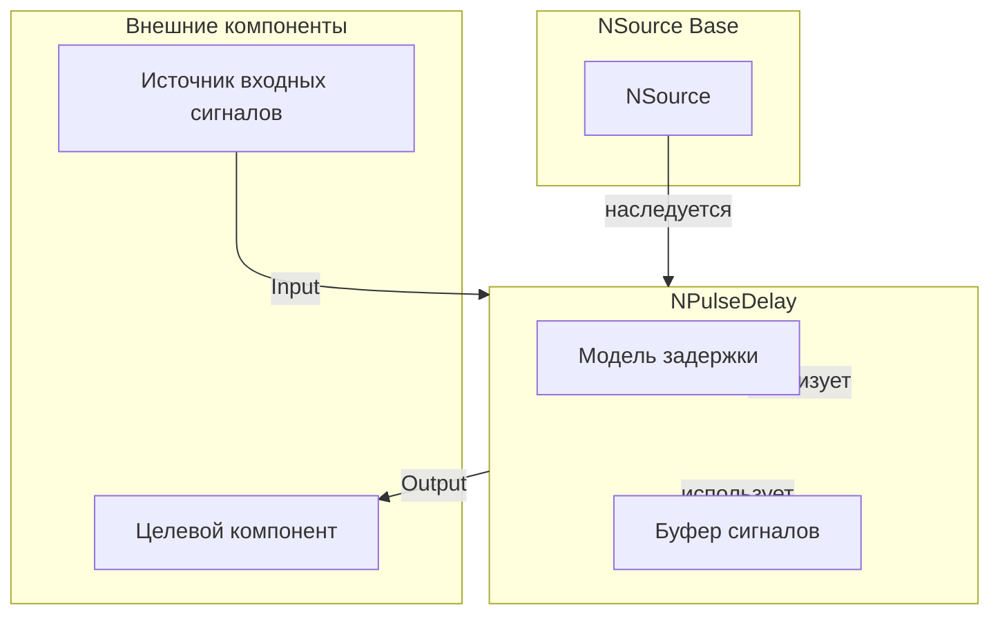
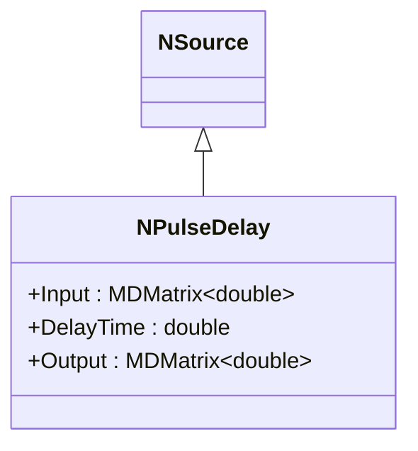
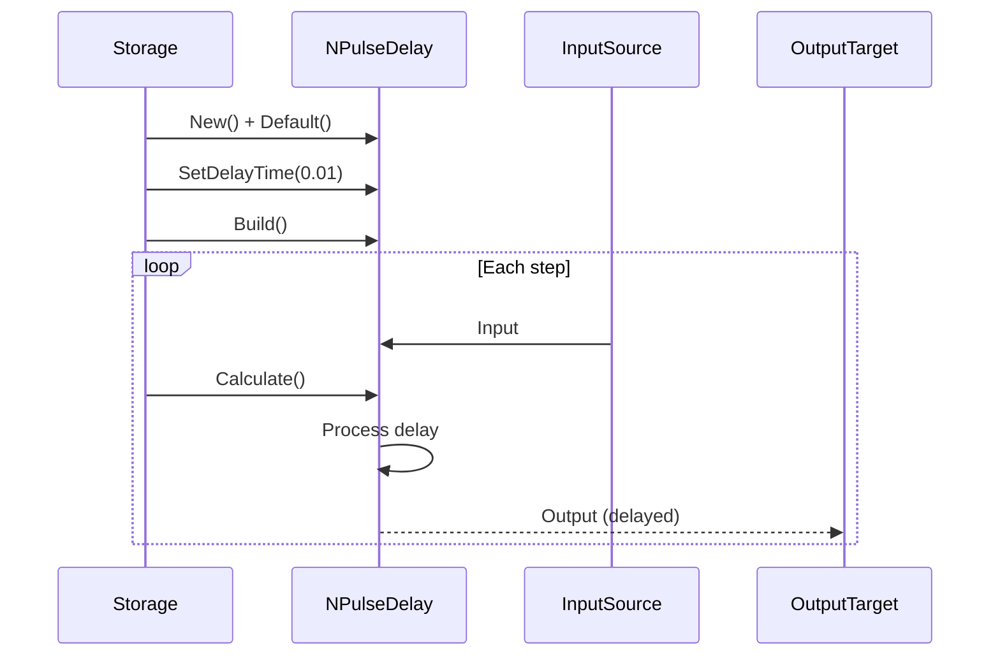
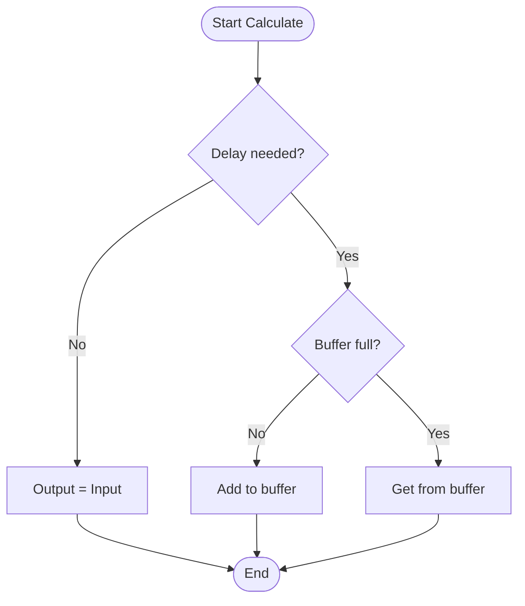
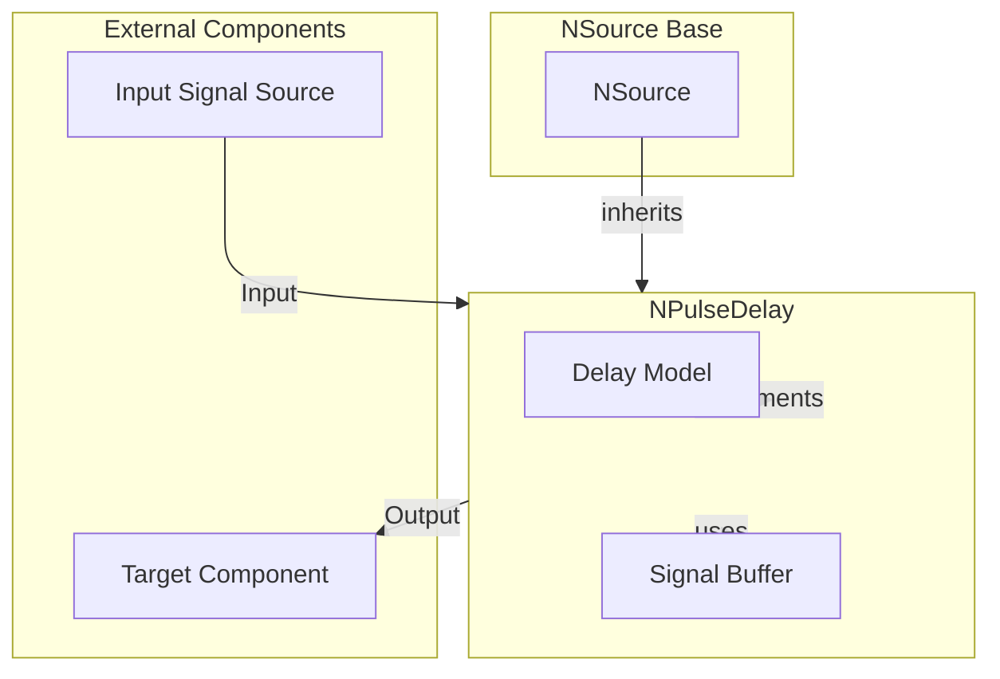

# NPDelay — задержка импульсов

## RU

### Назначение

**Класс**: `NPDelay` — компонент для задержки импульсов/сигналов на заданное время.  
**Регистрация**: `NPulseLibrary.cpp` → `UploadClass("NPDelay", ...)`.  
**Storage-инстансы**: `ClassName = "NPDelay"` в `Bin/Configs/*/Model_*.xml`.

`NPDelay` реализует задержку импульсов, которая задерживает входной сигнал (`Input`) на заданное время (`DelayTime`) и выдает его как выходной сигнал (`Output`). Компонент использует буфер (`buffer`) для хранения истории сигналов и выдает сигнал с задержкой.

**Использование:** Задержка импульсов, моделирование задержек передачи

### UML-диаграмма классов



**Иерархия наследования:**
- `UNet` — базовая сеть Rdk Framework
- `NSource` — базовый источник сигналов
- `NPulseDelay` — задержка импульсов

### UML-диаграмма последовательности



**Жизненный цикл:**
1. **Инициализация**: Установка параметров по умолчанию (`DelayTime = 0.0`)
2. **Сборка**: Вычисление `desired_buffer_length`, инициализация буфера
3. **Расчет**: Добавление входного сигнала в буфер, выдача задержанного сигнала

### UML-диаграмма состояний

```mermaid
stateDiagram-v2
    [*] --> Uninitialized: New()
    Uninitialized --> Defaulted: Default()
    Defaulted --> Building: Build()
    Building --> CalcBufferLength: Вычисление desired_buffer_length
    CalcBufferLength --> InitBuffer: Инициализация buffer
    InitBuffer --> Built: Структура создана
    Built --> Ready: Ready = true
    Ready --> Resetting: Reset()
    Resetting --> ClearBuffer: Очистка buffer
    ClearBuffer --> Ready: Состояния сброшены
    Ready --> Calculating: Calculate()
    Calculating --> CheckDelay["DelayTime < 0.001<br/>или<br/>desired_buffer_length == 0?"]
    CheckDelay -->|Да| NoDelay: Output = Input
    CheckDelay -->|Нет| CheckBufferFull{Буфер заполнен?}
    CheckBufferFull -->|Нет| AddToBuffer: buffer.push_back(Input), Output = 0.0
    CheckBufferFull -->|Да| GetFromBuffer: Output = buffer.back(), buffer.pop_back()
    GetFromBuffer --> AddToFront: buffer.push_front(Input)
    NoDelay --> Ready: Шаг завершен
    AddToBuffer --> Ready: Шаг завершен
    AddToFront --> Ready: Шаг завершен
```

**Состояния:**
- **Uninitialized** — создан, но не инициализирован
- **Defaulted** — параметры установлены по умолчанию
- **Building** — выполняется сборка
- **CalcBufferLength** — вычисление желаемой длины буфера
- **InitBuffer** — инициализация буфера
- **Built** — структура задержки построена
- **Ready** — готов к выполнению расчетов
- **Resetting** — выполняется сброс
- **ClearBuffer** — очистка буфера
- **Calculating** — выполняется расчет задержки
- **CheckDelay** — проверка необходимости задержки
- **NoDelay** — задержка не требуется
- **CheckBufferFull** — проверка заполненности буфера
- **AddToBuffer** — добавление в буфер
- **GetFromBuffer** — получение из буфера
- **AddToFront** — добавление в начало буфера

### UML-диаграмма активности

```mermaid
flowchart TD
    Start([Start Calculate]) --> CheckDelay["DelayTime < 0.001<br/>или<br/>desired_buffer_length == 0?"]
    CheckDelay -->|Да| NoDelay[Output = Input]
    CheckDelay -->|Нет| CheckBufferFull{Буфер заполнен?}
    CheckBufferFull -->|Нет| AddToBuffer["buffer.push_back(Input)<br/>Output = 0.0"]
    CheckBufferFull -->|Да| GetFromBuffer["Output = buffer.back()<br/>buffer.pop_back()"]
    GetFromBuffer --> AddToFront[buffer.push_front(Input)]
    NoDelay --> End([End])
    AddToBuffer --> End
    AddToFront --> End
```

**Алгоритм расчета:**
1. Проверка необходимости задержки: если `DelayTime < 0.001` или `desired_buffer_length == 0`, выдача входного сигнала без задержки
2. Если буфер не заполнен: добавление входного сигнала в буфер, выдача нулевого выходного сигнала
3. Если буфер заполнен: выдача сигнала из конца буфера, удаление из буфера, добавление нового входного сигнала в начало буфера

### UML-диаграмма компонентов



**Зависимости:**
- **Базовый класс**: `NSource`
- **Внутренние компоненты**: модель задержки, буфер сигналов (`buffer`)
- **Внешние компоненты**: источник входных сигналов (источник `Input`), целевой компонент (получатель `Output`)

### Свойства

#### Параметры (ptPubParameter)

- **`DelayTime`** (double) — время задержки (сек). Определяет, на сколько времени задерживается входной сигнал. Значение по умолчанию: 0.0

#### Входные свойства (ptInput | ptPubState)

- **`Input`** (MDMatrix<double>) — входной сигнал для задержки. Значение по умолчанию: зависит от реализации

#### Выходные свойства (ptOutput | ptPubState)

- **`Output`** (MDMatrix<double>) — выходной сигнал (задержанный входной сигнал). Значение по умолчанию: 0.0

#### Внутренние состояния

- **`buffer`** (list<MDMatrix<double>>) — буфер для хранения истории сигналов. Хранит сигналы для выдачи с задержкой.

- **`desired_buffer_length`** (int) — желаемая длина буфера (в шагах). Вычисляется как `int(DelayTime * TimeStep)`.

### Методы

- **`SetDelayTime(const double &value)`** → `bool` — устанавливает время задержки. Вычисляет `desired_buffer_length` и очищает буфер.

- **`AReset()`** → `bool` — сбрасывает состояния задержки. Очищает буфер и обнуляет выходной сигнал.

- **`ACalculate()`** → `bool` — выполняет расчет задержки:
  1. Если `DelayTime < 0.001` или `desired_buffer_length == 0`, выдает входной сигнал без задержки
  2. Если буфер не заполнен, добавляет входной сигнал в буфер и выдает нулевой выход
  3. Если буфер заполнен, выдает сигнал из конца буфера и добавляет новый входной сигнал в начало буфера

### Примеры использования

#### Пример 1: Создание задержки в коде C++

```cpp
// Создание задержки
auto delay = storage->CreateComponent<NPulseDelay>();
delay->SetName("Delay");

// Инициализация
delay->Default();

// Настройка параметров
delay->DelayTime = 0.01;  // Задержка 10 мс

// Сборка
delay->Build();
```

### Использование в конфигурациях

`NPDelay` используется в экспериментах с задержкой импульсов:

- **Задержка импульсов**: `Bin/Configs/!OldConfigs/*/Model_*.xml` (где требуется задержка передачи сигналов)

**Типичные значения параметров:**
- **DelayTime**: 0.01 (10 мс, типичная задержка), 0.001 (1 мс, минимальная задержка)

**Особенности:**
- Буфер: хранит историю сигналов для выдачи с задержкой
- Длина буфера: вычисляется как `int(DelayTime / TimeStep)`
- Без задержки: если `DelayTime < 0.001` или `desired_buffer_length == 0`, сигнал выдается без задержки

## Источники

См. [Literature-References.md](../Literature-References.md): **14**, **25**.

### См. также

- [`NSource`](NSource.md) — базовый источник сигналов
- [`NPulseGenerator`](NPulseGenerator.md) — генератор импульсов
- [Architecture.md](../Architecture.md) — архитектура библиотеки

---

## EN

### Purpose

**Class**: `NPDelay` — component for delaying pulses/signals by specified time.  
**Registration**: `NPulseLibrary.cpp` → `UploadClass("NPDelay", ...)`.  
**Instances**: `ClassName = "NPDelay"` in `Bin/Configs/*/Model_*.xml`.

`NPDelay` implements pulse delay that delays input signal (`Input`) by specified time (`DelayTime`) and outputs it as output signal (`Output`). Component uses buffer (`buffer`) to store signal history and outputs signal with delay.

**Usage:** Pulse delay, transmission delay modeling

### UML Class Diagram



### UML Sequence Diagram



### UML State Diagram

```mermaid
stateDiagram-v2
    [*] --> Uninitialized: New()
    Uninitialized --> Defaulted: Default()
    Defaulted --> Building: Build()
    Building --> CalcBufferLength: Calculate buffer length
    CalcBufferLength --> InitBuffer: Initialize buffer
    InitBuffer --> Built: Structure built
    Built --> Ready: Ready = true
    Ready --> Calculating: Calculate()
    Calculating --> CheckDelay{Delay needed?}
    CheckDelay -->|No| NoDelay: Output = Input
    CheckDelay -->|Yes| CheckBufferFull{Buffer full?}
    CheckBufferFull -->|No| AddToBuffer: Add to buffer
    CheckBufferFull -->|Yes| GetFromBuffer: Get from buffer
    NoDelay --> Ready: Step completed
    AddToBuffer --> Ready: Step completed
    GetFromBuffer --> Ready: Step completed
    Ready --> Resetting: Reset()
    Resetting --> Ready
```

### UML Activity Diagram



### UML Component Diagram



### Properties

- `Input` — input signal (delayed)
- `DelayTime` — delay time (sec)
- `Output` — output signal (delayed)
- `buffer` — signal buffer (internal state, stores signal history)
- `desired_buffer_length` — desired buffer length (computed as `int(DelayTime / TimeStep)`)

### Methods

- `SetDelayTime(value)` — setting delay time (computes desired_buffer_length and clears buffer)
- `ADefault()` — setting default parameters
- `ABuild()` — building delay structure (buffer initialization)
- `AReset()` — resetting delay state (clear buffer, zero output)
- `ACalculate()` — delay step:
  - If `DelayTime < 0.001` or `desired_buffer_length == 0`, passes input signal without delay
  - If buffer not full, adds input signal to buffer and outputs zero
  - If buffer full, outputs signal from buffer end and prepends new input signal

### Usage in configurations

`NPDelay` is used in pulse delay experiments:

- **Pulse delay**: `Bin/Configs/!OldConfigs/*/Model_*.xml` (where signal transmission delay is required)

**Typical parameter values:**
- **DelayTime**: 0.01 (10 ms, typical delay), 0.001 (1 ms, minimum delay)

**Features:**
- Buffer: stores signal history for delayed output
- Buffer length: calculated as `int(DelayTime / TimeStep)`
- No delay: if `DelayTime < 0.001` or `desired_buffer_length == 0`, signal is output without delay

### References

See [Literature-References.md](../Literature-References.md): **14**, **25**.

### See Also

- [`NSource`](NSource.md) — base signal source
- [`NPulseGenerator`](NPulseGenerator.md) — pulse generator
- [Architecture.md](../Architecture.md) — library architecture
