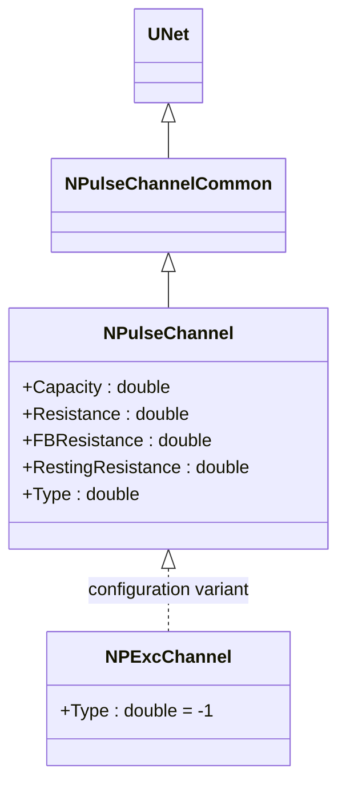
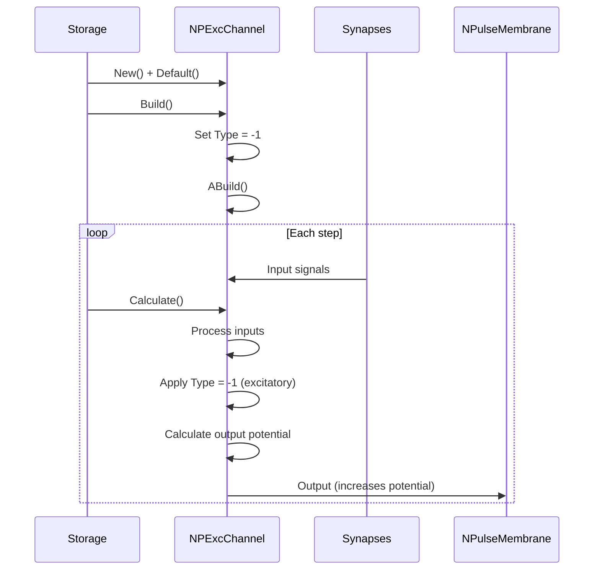
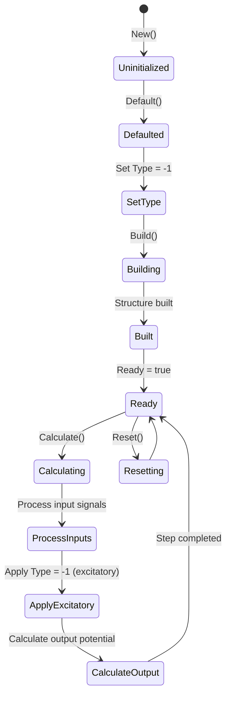
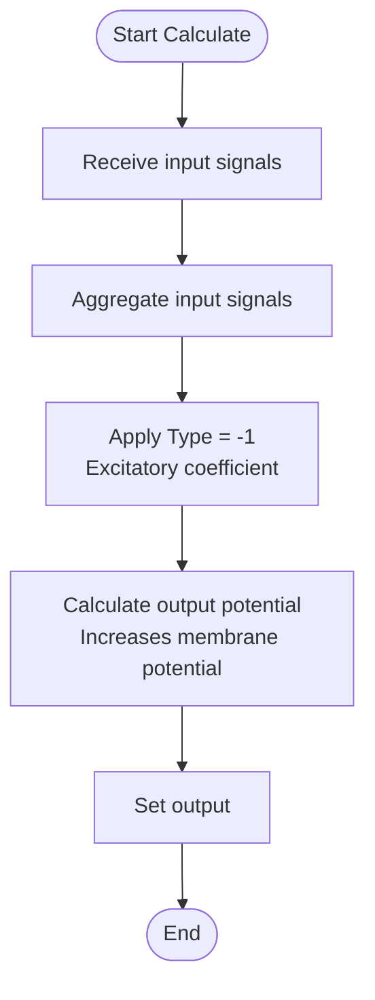
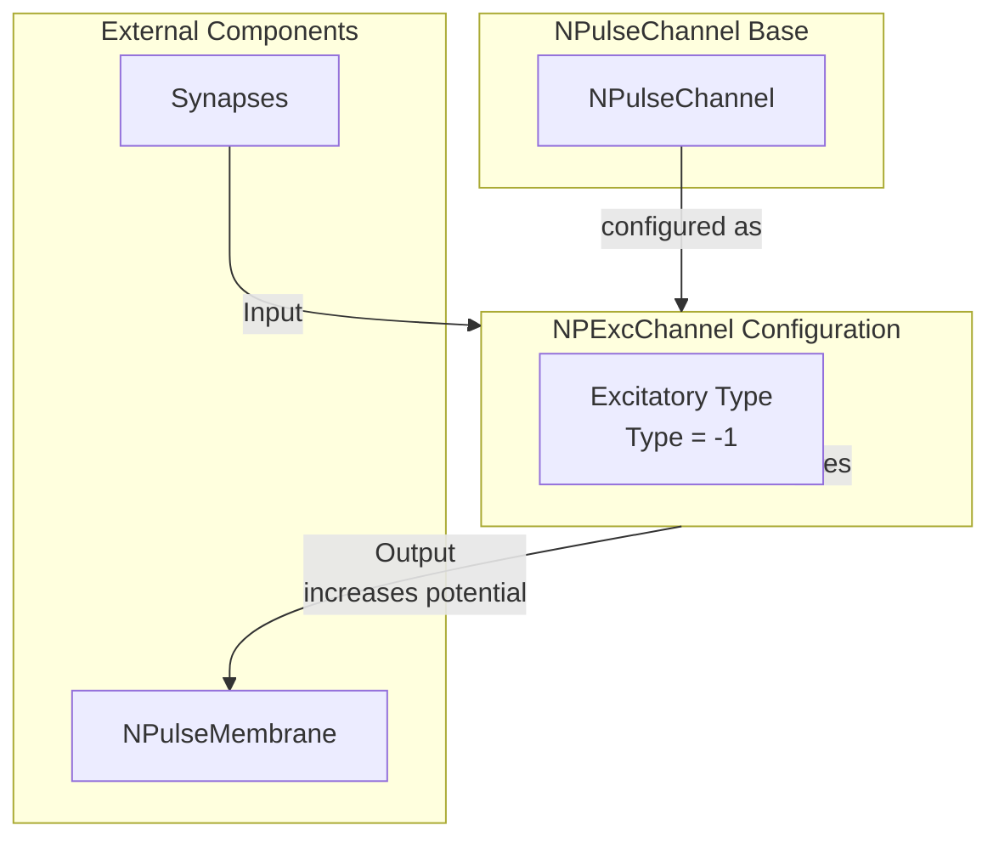

# NPExcChannel — возбуждающий канал

## RU

### Назначение

**Класс**: `NPExcChannel` — конфигурационный вариант возбуждающего канала.  
**Аббревиатура**: `Exc` — **Exc**itatory (возбуждающий).  
**Регистрация**: `NPulseLibrary.cpp` → `UploadClass("NPExcChannel", ...)`.  
**Storage-инстансы**: `ClassName = "NPExcChannel"` в `Bin/Configs/*/Model_*.xml`.

`NPExcChannel` является конфигурационным вариантом класса `NPulseChannel` с параметрами для возбуждающего канала. При создании компонента с `ClassName = "NPExcChannel"` создается экземпляр `NPulseChannel` с параметром `Type = -1` (возбуждающий).

**Использование:** Возбуждающий канал, упрощенное именование при конфигурации

### UML-диаграмма классов



**Иерархия наследования:**
- `UNet` — базовая сеть Rdk Framework
- `NPulseChannelCommon` — общий импульсный канал
- `NPulseChannel` — базовый импульсный канал
- `NPExcChannel` — конфигурационный вариант возбуждающего канала

**Параметры конфигурации:**
- `Type = -1` — возбуждающий канал

### Свойства

`NPExcChannel` использует все свойства базового класса `NPulseChannel` с параметром:
- `Type = -1` (возбуждающий)

### Методы

`NPExcChannel` использует все методы базового класса `NPulseChannel`.

### Примеры использования

#### Пример 1: Создание канала в коде C++

```cpp
// Создание возбуждающего канала
auto channel = storage->CreateComponent("NPExcChannel");
channel->SetName("ExcChannel");

// Инициализация (использует параметры по умолчанию)
channel->Default();

// Использование
channel->Build();
```

### См. также

- [`NPulseChannel`](NPulseChannel.md) — базовый импульсный канал (базовый класс)
- [`NPExcChannelBio`](NPExcChannelBio.md) — возбуждающий биоинспирированный канал
- [`NPInhChannel`](NPInhChannel.md) — тормозной канал
- [Architecture.md](../Architecture.md) — архитектура библиотеки

---

## EN

### Purpose

**Class**: `NPExcChannel` — configuration variant of excitatory channel.  
**Registration**: `NPulseLibrary.cpp` → `UploadClass("NPExcChannel", ...)`.  
**Instances**: `ClassName = "NPExcChannel"` in `Bin/Configs/*/Model_*.xml`.

`NPExcChannel` is a configuration variant of `NPulseChannel` class with parameters for excitatory channel. When creating a component with `ClassName = "NPExcChannel"`, an instance of `NPulseChannel` is created with parameter `Type = -1` (excitatory).

**Usage:** Excitatory channel, simplified naming in configurations

### UML Class Diagram


### UML Sequence Diagram



### UML State Diagram



### UML Activity Diagram



### UML Component Diagram



### Properties

`NPExcChannel` uses all properties of base class `NPulseChannel` with preset value:

**Parameters:**
- `Type = -1` — excitatory channel

**Inherited properties:**
- `Capacity` (double) — channel capacity
- `Resistance` (double) — channel resistance
- `FBResistance` (double) — feedback resistance
- `RestingResistance` (double) — resting resistance

### Methods

`NPExcChannel` uses all methods of base class `NPulseChannel`.

### Usage in configurations

`NPExcChannel` is used in experiments with excitatory channels:

- **Excitatory channels**: Modeling excitatory channels in neural networks
- **Simplified naming**: Used for simplified naming in configurations

**Features:**
- Automatically configured as excitatory channel (`Type = -1`)
- Increases membrane potential when input signals are present
- Simplified configuration: Channel type is preset

**Typical parameter values:**
- **Type**: -1 (excitatory channel type)

### See Also

- [`NPulseChannel`](NPulseChannel.md) — base spiking channel (base class)
- [`NPExcChannelBio`](NPExcChannelBio.md) — excitatory bio channel
- [`NPInhChannel`](NPInhChannel.md) — inhibitory channel
- [Architecture.md](../Architecture.md) — library architecture
