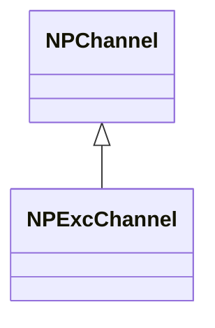
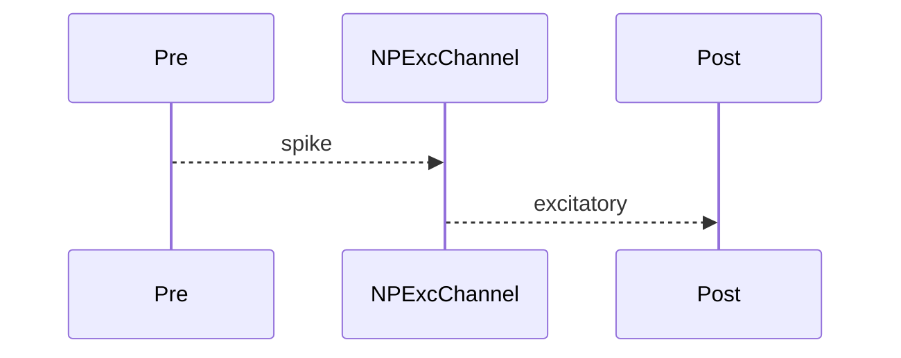

## NPExcChannel — возбуждающий канал

**Класс**: `NPExcChannel` — возбуждающий импульсный канал.  
**Регистрация**: `NPulseLibrary.cpp` → `UploadClass("NPExcChannel", ...)`.  
**Storage**: `ClassName = "NPExcChannel"`.

### Lifecycle
- **ADefault**: параметры усиления/передачи.
- **ABuild**: подключение pre/post.
- **AReset**: сброс.
- **ACalculate**: передача возбуждающего импульса.

### I/O
- Вход: импульс от pre.
- Выход: возбудительный сигнал к post.



Пояснение: диаграмма классов показывает место компонента в иерархии и ключевые связи.



Пояснение: диаграмма последовательности показывает типовой сценарий взаимодействия и порядок вызовов.


Пояснение: блок-схема показывает поток данных/сигналов (входы → компонент → выходы).

### Config snippet

```ini
[Component]
ClassName = NPExcChannel
Name = ExcCh1
```

---

## NPExcChannel — excitatory channel (EN)

Excitatory pulse channel.


Description: this class diagram shows the component position in the type hierarchy and key relations.


Description: this sequence diagram shows a typical runtime interaction and call order.


Description: this flowchart shows the data/signal flow (inputs → component → outputs).
