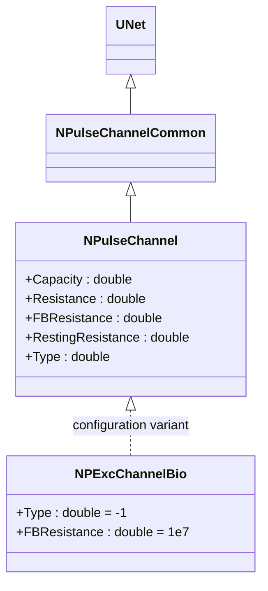
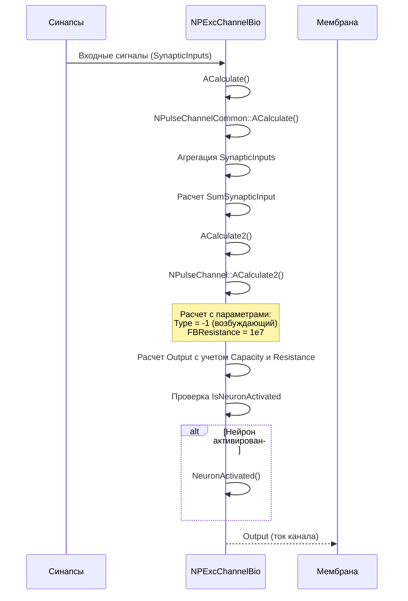
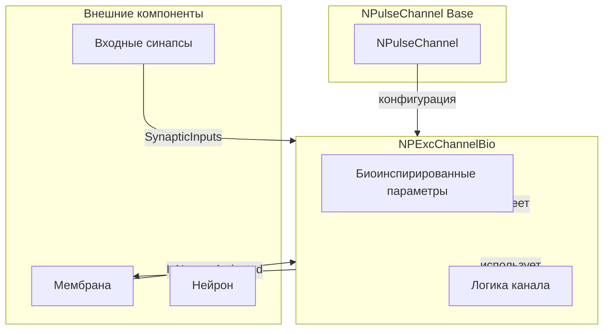
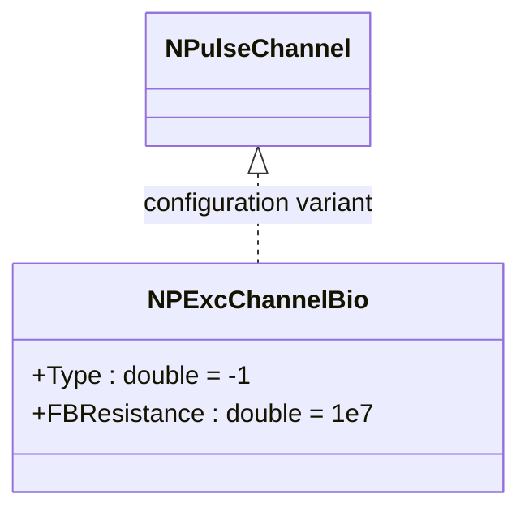
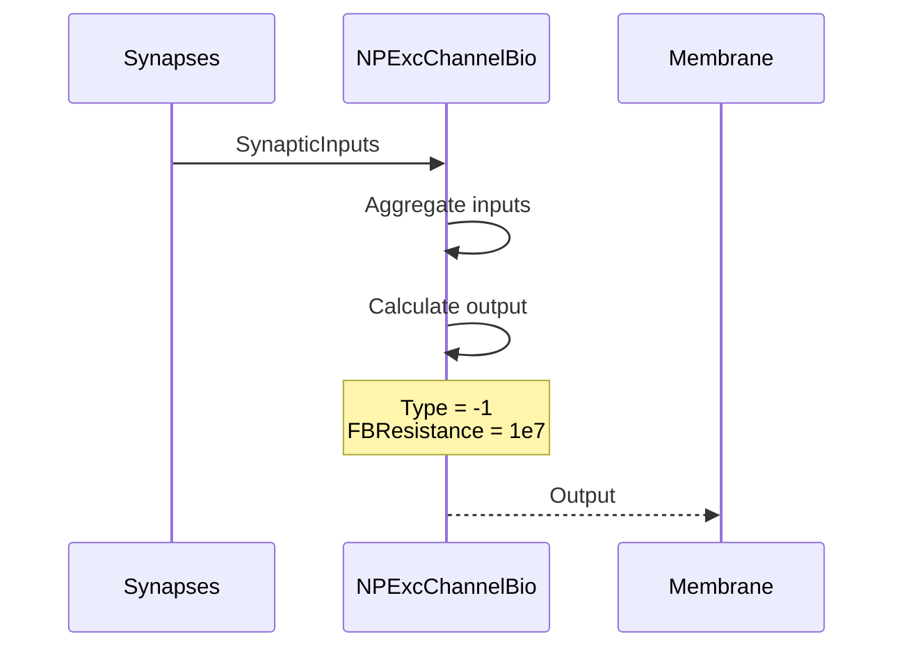
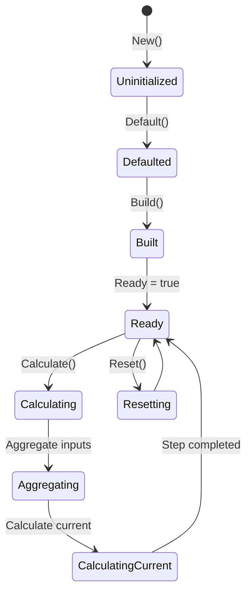
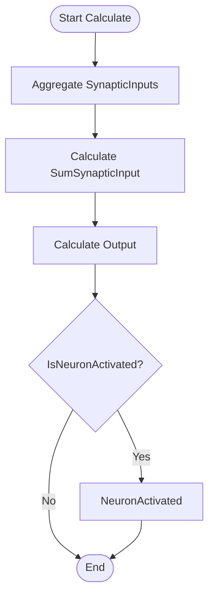

# NPExcChannelBio — возбуждающий биоинспирированный канал

## RU

### Назначение

**Класс**: `NPExcChannelBio` — конфигурационный вариант возбуждающего канала с биологическими параметрами.  
**Аббревиатуры**: `Exc` — **Exc**itatory (возбуждающий); `Bio` — **Bio**logical (биологическая модель).  
**Регистрация**: `NPulseLibrary.cpp` → `UploadClass("NPExcChannelBio", ...)`.  
**Storage-инстансы**: `ClassName = "NPExcChannelBio"` в `Bin/Configs/*/Model_*.xml`.

`NPExcChannelBio` является конфигурационным вариантом класса `NPulseChannel` с параметрами, оптимизированными для биологических моделей. При создании компонента с `ClassName = "NPExcChannelBio"` создается экземпляр `NPulseChannel` с параметрами: `Type = -1` (возбуждающий), `FBResistance = 1e7` (10 МОм).

**Использование:** Возбуждающий канал для биологических моделей, оптимизированные параметры

### UML-диаграмма классов



**Иерархия наследования:**
- `UNet` — базовая сеть Rdk Framework
- `NPulseChannelCommon` — общий импульсный канал
- `NPulseChannel` — базовый импульсный канал
- `NPExcChannelBio` — конфигурационный вариант для биологических моделей

**Параметры конфигурации:**
- `Type = -1` — возбуждающий канал
- `FBResistance = 1e7` — сопротивление обратной связи (10 МОм)

### UML-диаграмма последовательности



**Жизненный цикл:**
1. **Инициализация**: Установка биоинспирированных параметров (Type = -1, FBResistance = 1e7)
2. **Агрегация входов**: Сбор входных сигналов от синапсов
3. **Расчет тока**: Расчет выходного тока с учетом емкости и сопротивления
4. **Активация**: Обработка активации нейрона при необходимости

### UML-диаграмма состояний

```mermaid
stateDiagram-v2
    [*] --> Uninitialized: New()
    Uninitialized --> Defaulted: Default()
    Note over Defaulted: Type = -1<br/>FBResistance = 1e7
    Defaulted --> Built: Build()
    Built --> Ready: Ready = true
    Ready --> Calculating: Calculate()
    Calculating --> Aggregating: Агрегация входов
    Aggregating --> CalculatingCurrent: Расчет тока
    CalculatingCurrent --> CheckingActivation: Проверка активации
    CheckingActivation -->|Активирован| NeuronActivated: NeuronActivated()
    CheckingActivation -->|Не активирован| Ready: Шаг завершен
    NeuronActivated --> Ready
    Ready --> Resetting: Reset()
    Resetting --> Ready: Состояния сброшены
```

**Состояния:**
- **Uninitialized** — создан, но не инициализирован
- **Defaulted** — биоинспирированные параметры установлены по умолчанию
- **Built** — структура канала построена
- **Ready** — готов к обработке сигналов
- **Calculating** — обработка входных сигналов
- **Aggregating** — агрегация входных сигналов от синапсов
- **CalculatingCurrent** — расчет выходного тока
- **CheckingActivation** — проверка активации нейрона
- **NeuronActivated** — обработка активации нейрона
- **Resetting** — выполняется сброс состояний

### UML-диаграмма активности

```mermaid
flowchart TD
    Start([Start Calculate]) --> AggregateSynaptic[Агрегация SynapticInputs]
    AggregateSynaptic --> CalcSumSynaptic[Расчет SumSynapticInput]
    CalcSumSynaptic --> AggregateChannel[Агрегация ChannelInputs]
    AggregateChannel --> CalcSumChannel[Расчет SumChannelInput]
    CalcSumChannel --> CalcOutput[Расчет Output]
    Note over CalcOutput: С учетом Capacity, Resistance<br/>Type = -1 (возбуждающий)<br/>FBResistance = 1e7
    CalcOutput --> CheckActivation{IsNeuronActivated?}
    CheckActivation -->|Да| CallNeuronActivated[NeuronActivated]
    CheckActivation -->|Нет| End([End])
    CallNeuronActivated --> End
```

**Алгоритм расчета:**
1. Агрегация входных сигналов от синапсов (`SynapticInputs`)
2. Расчет суммарного синаптического входа (`SumSynapticInput`)
3. Агрегация входных сигналов канала (`ChannelInputs`)
4. Расчет суммарного входа канала (`SumChannelInput`)
5. Расчет выходного тока с учетом емкости и сопротивления (биоинспирированные параметры)
6. Проверка активации нейрона и вызов `NeuronActivated()` при необходимости

### UML-диаграмма компонентов



**Зависимости:**
- **Базовый класс**: `NPulseChannel` (конфигурационный вариант)
- **Внешние компоненты**: входные синапсы (источники `SynapticInputs`), мембрана (получатель `Output`), нейрон (источник сигнала активации)

### Свойства

`NPExcChannelBio` использует все свойства базового класса `NPulseChannel` с параметрами:
- `Type = -1` (возбуждающий)
- `FBResistance = 1e7` (10 МОм)
- Остальные параметры по умолчанию из `NPulseChannel`

### Методы

`NPExcChannelBio` использует все методы базового класса `NPulseChannel`.

### Примеры использования

#### Пример 1: Создание канала в коде C++

```cpp
// Создание возбуждающего биоинспирированного канала
auto channel = storage->CreateComponent("NPExcChannelBio");
channel->SetName("ExcChannelBio");

// Инициализация (использует параметры по умолчанию)
channel->Default();

// Использование
channel->Build();
```

### Использование в конфигурациях

`NPExcChannelBio` используется в экспериментах с биологически реалистичными параметрами:

- **Когнитивная навигация**: `Bin/Configs/User/CognitiveNavigation/*/Model_*.xml`
- **Биоинспирированные модели**: Эксперименты с биологически реалистичными каналами

**Типичные значения параметров:**
- **Type**: -1 (возбуждающий канал)
- **FBResistance**: 1e7 (10 МОм) — сопротивление обратной связи
- **Resistance**: зависит от базового класса `NPulseChannel`
- **Capacity**: зависит от базового класса `NPulseChannel`

## Источники

См. [Literature-References.md](../Literature-References.md): **26**, **29**, **30**.

### См. также

- [`NPulseChannel`](NPulseChannel.md) — базовый импульсный канал (базовый класс)
- [`NPExcChannelBio2`](NPExcChannelBio2.md) — возбуждающий биоинспирированный канал (версия 2)
- [`NPInhChannelBio`](NPInhChannelBio.md) — тормозной биоинспирированный канал
- [`NPExcChannel`](NPExcChannel.md) — возбуждающий канал
- [`NPulseChannelCommon`](NPulseChannelCommon.md) — общий импульсный канал
- [Architecture.md](../Architecture.md) — архитектура библиотеки

---

## EN

### Purpose

**Class**: `NPExcChannelBio` — configuration variant of excitatory channel with biological parameters.  
**Registration**: `NPulseLibrary.cpp` → `UploadClass("NPExcChannelBio", ...)`.  
**Instances**: `ClassName = "NPExcChannelBio"` in `Bin/Configs/*/Model_*.xml`.

`NPExcChannelBio` is a configuration variant of `NPulseChannel` class with parameters optimized for biological models. When creating a component with `ClassName = "NPExcChannelBio"`, an instance of `NPulseChannel` is created with parameters: `Type = -1` (excitatory), `FBResistance = 1e7` (10 MOhm).

**Usage:** Excitatory channel for biological models, optimized parameters

### UML Class Diagram



### UML Sequence Diagram



### UML State Diagram



### UML Activity Diagram



### References

See [Literature-References.md](../Literature-References.md): **26**, **29**, **30**.

### See Also

- [`NPulseChannel`](NPulseChannel.md) — base spiking channel (base class)
- [`NPExcChannelBio2`](NPExcChannelBio2.md) — excitatory bio channel (version 2)
- [`NPInhChannelBio`](NPInhChannelBio.md) — inhibitory bio channel
- [`NPExcChannel`](NPExcChannel.md) — excitatory channel
- [`NPulseChannelCommon`](NPulseChannelCommon.md) — common spiking channel
- [Architecture.md](../Architecture.md) — library architecture
