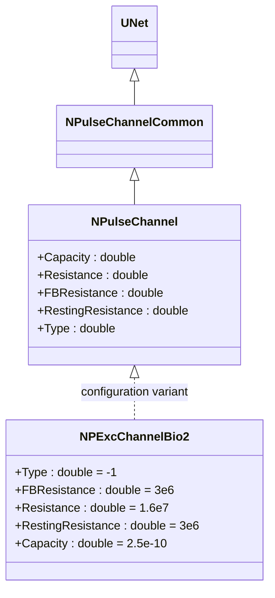
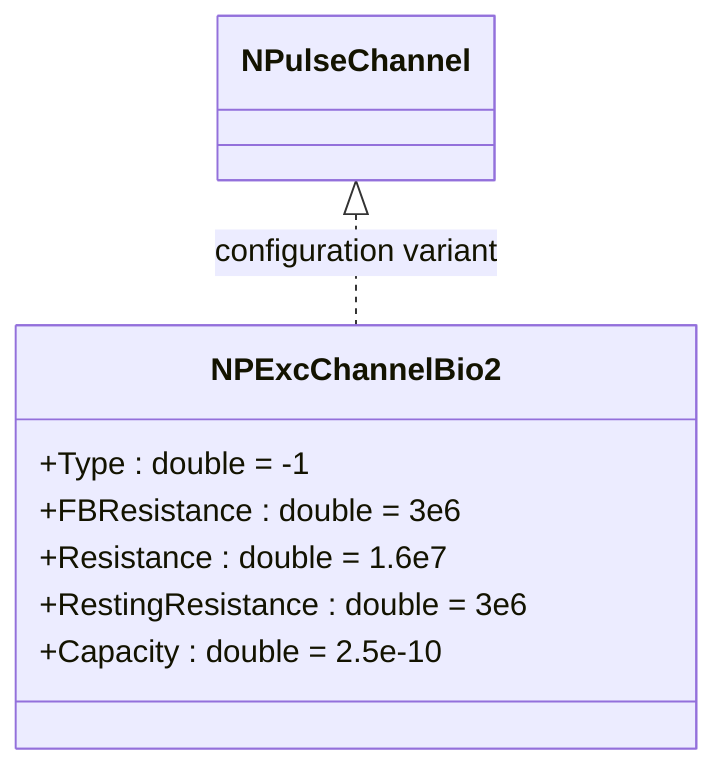

# NPExcChannelBio2 — возбуждающий биоинспирированный канал (версия 2)

## RU

### Назначение

**Класс**: `NPExcChannelBio2` — конфигурационный вариант возбуждающего канала с биологическими параметрами (версия 2).  
**Регистрация**: `NPulseLibrary.cpp` → `UploadClass("NPExcChannelBio2", ...)`.  
**Storage-инстансы**: `ClassName = "NPExcChannelBio2"` в `Bin/Configs/*/Model_*.xml`.

`NPExcChannelBio2` является конфигурационным вариантом класса `NPulseChannel` с параметрами, оптимизированными для биологических моделей (версия 2). При создании компонента с `ClassName = "NPExcChannelBio2"` создается экземпляр `NPulseChannel` с параметрами: `Type = -1` (возбуждающий), `FBResistance = 3e6` (3 МОм), `Resistance = 1.6e7` (16 МОм), `RestingResistance = 3e6` (3 МОм), `Capacity = 2.5e-10` (250 пФ).

**Использование:** Возбуждающий канал для биологических моделей (версия 2), улучшенные параметры

### UML-диаграмма классов



**Иерархия наследования:**
- `UNet` — базовая сеть Rdk Framework
- `NPulseChannelCommon` — общий импульсный канал
- `NPulseChannel` — базовый импульсный канал
- `NPExcChannelBio2` — конфигурационный вариант для биологических моделей (версия 2)

**Параметры конфигурации:**
- `Type = -1` — возбуждающий канал
- `FBResistance = 3e6` — сопротивление обратной связи (3 МОм)
- `Resistance = 1.6e7` — сопротивление мембраны (16 МОм)
- `RestingResistance = 3e6` — сопротивление покоя (3 МОм)
- `Capacity = 2.5e-10` — емкость мембраны (250 пФ)

### Свойства

`NPExcChannelBio2` использует все свойства базового класса `NPulseChannel` с параметрами:
- `Type = -1` (возбуждающий)
- `FBResistance = 3e6` (3 МОм)
- `Resistance = 1.6e7` (16 МОм)
- `RestingResistance = 3e6` (3 МОм)
- `Capacity = 2.5e-10` (250 пФ)

### Методы

`NPExcChannelBio2` использует все методы базового класса `NPulseChannel`.

### Примеры использования

#### Пример 1: Создание канала в коде C++

```cpp
// Создание возбуждающего биоинспирированного канала (версия 2)
auto channel = storage->CreateComponent("NPExcChannelBio2");
channel->SetName("ExcChannelBio2");

// Инициализация (использует параметры по умолчанию)
channel->Default();

// Использование
channel->Build();
```

### См. также

- [`NPulseChannel`](NPulseChannel.md) — базовый импульсный канал (базовый класс)
- [`NPExcChannelBio`](NPExcChannelBio.md) — возбуждающий биоинспирированный канал (версия 1)
- [`NPInhChannelBio2`](NPInhChannelBio2.md) — тормозной биоинспирированный канал (версия 2)
- [Architecture.md](../Architecture.md) — архитектура библиотеки

---

## EN

### Purpose

**Class**: `NPExcChannelBio2` — configuration variant of excitatory channel with biological parameters (version 2).  
**Registration**: `NPulseLibrary.cpp` → `UploadClass("NPExcChannelBio2", ...)`.  
**Instances**: `ClassName = "NPExcChannelBio2"` in `Bin/Configs/*/Model_*.xml`.

`NPExcChannelBio2` is a configuration variant of `NPulseChannel` class with parameters optimized for biological models (version 2). When creating a component with `ClassName = "NPExcChannelBio2"`, an instance of `NPulseChannel` is created with parameters: `Type = -1` (excitatory), `FBResistance = 3e6` (3 MOhm), `Resistance = 1.6e7` (16 MOhm), `RestingResistance = 3e6` (3 MOhm), `Capacity = 2.5e-10` (250 pF).

**Usage:** Excitatory channel for biological models (version 2), improved parameters

### UML Class Diagram



### See Also

- [`NPulseChannel`](NPulseChannel.md) — base spiking channel (base class)
- [`NPExcChannelBio`](NPExcChannelBio.md) — excitatory bio channel (version 1)
- [`NPInhChannelBio2`](NPInhChannelBio2.md) — inhibitory bio channel (version 2)
- [Architecture.md](../Architecture.md) — library architecture
