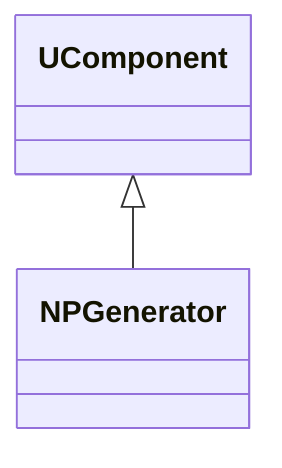
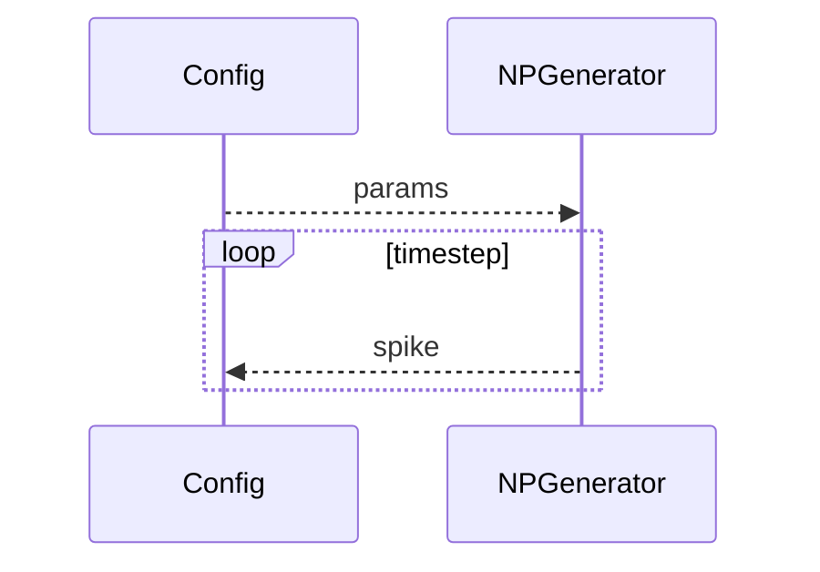
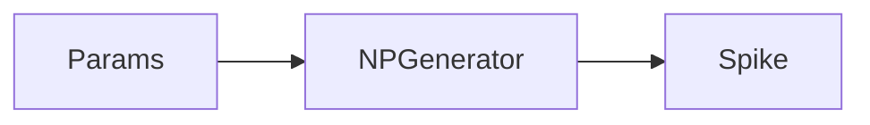
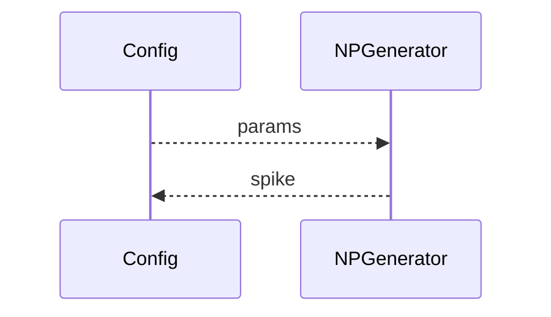

## NPGenerator — генератор импульсов (базовый)

**Класс**: `NPGenerator` — базовый генератор импульсов/спайков.  
**Регистрация**: `NPulseLibrary.cpp` → `UploadClass("NPGenerator", ...)`.  
**Storage**: `ClassName = "NPGenerator"`.

### Lifecycle
- **ADefault**: параметры генерации (частота/паттерн).
- **ABuild**: подготовка выходов.
- **AReset**: сброс генератора.
- **ACalculate**: выдача следующего импульса.

### I/O
- Вход: (опционально) управление частотой/паттерном.
- Выход: импульс/спайк.



Пояснение: диаграмма классов показывает место компонента в иерархии и ключевые связи.



Пояснение: диаграмма последовательности показывает типовой сценарий взаимодействия и порядок вызовов.



Пояснение: блок-схема показывает поток данных/сигналов (входы → компонент → выходы).

### Config snippet

```ini
[Component]
ClassName = NPGenerator
Name = PGen1
```

---

## NPGenerator — pulse generator (EN)

Base pulse/spike generator.


Description: this class diagram shows the component position in the type hierarchy and key relations.



Description: this sequence diagram shows a typical runtime interaction and call order.


Description: this flowchart shows the data/signal flow (inputs → component → outputs).
