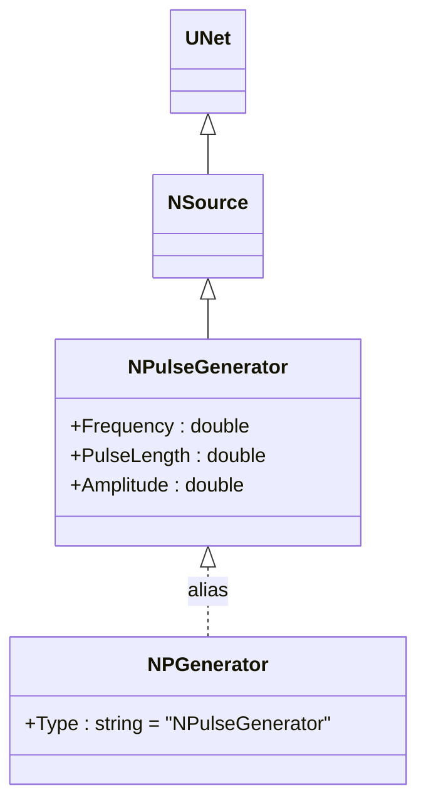
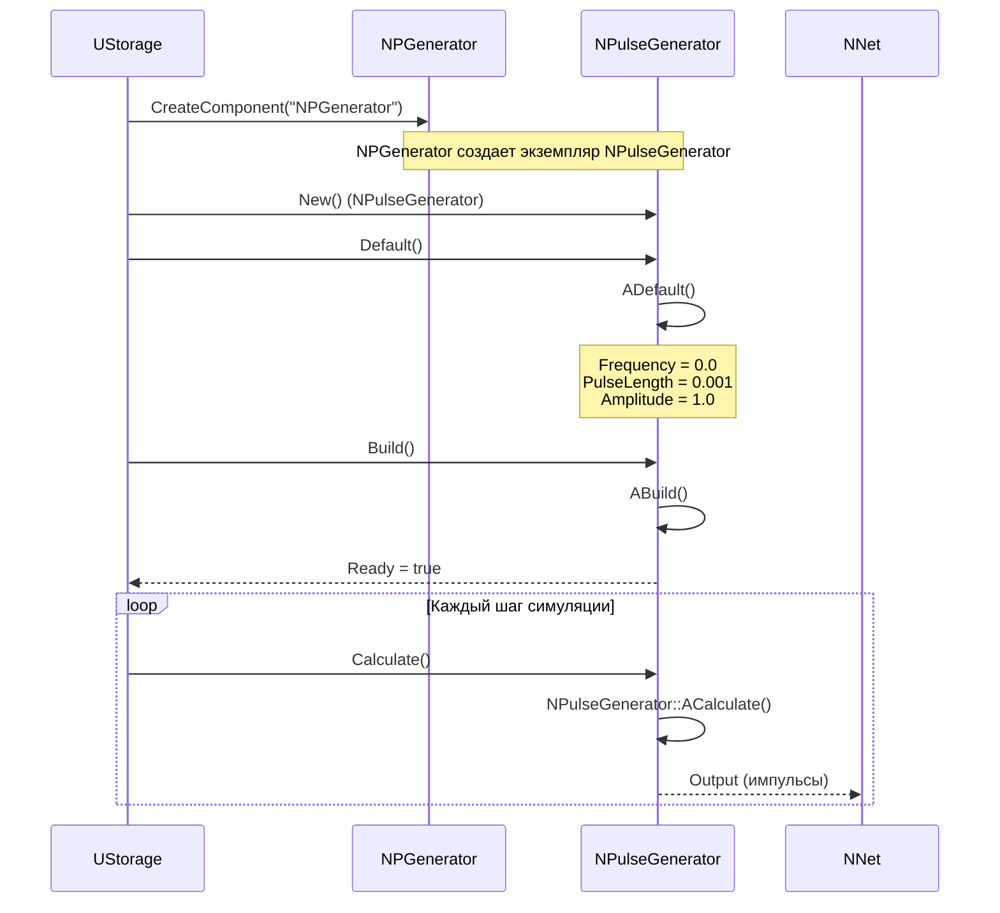
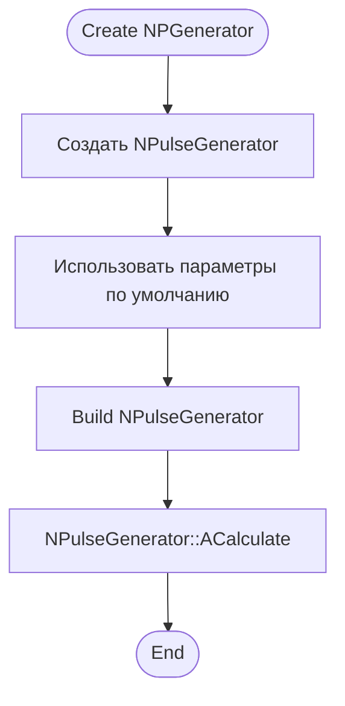
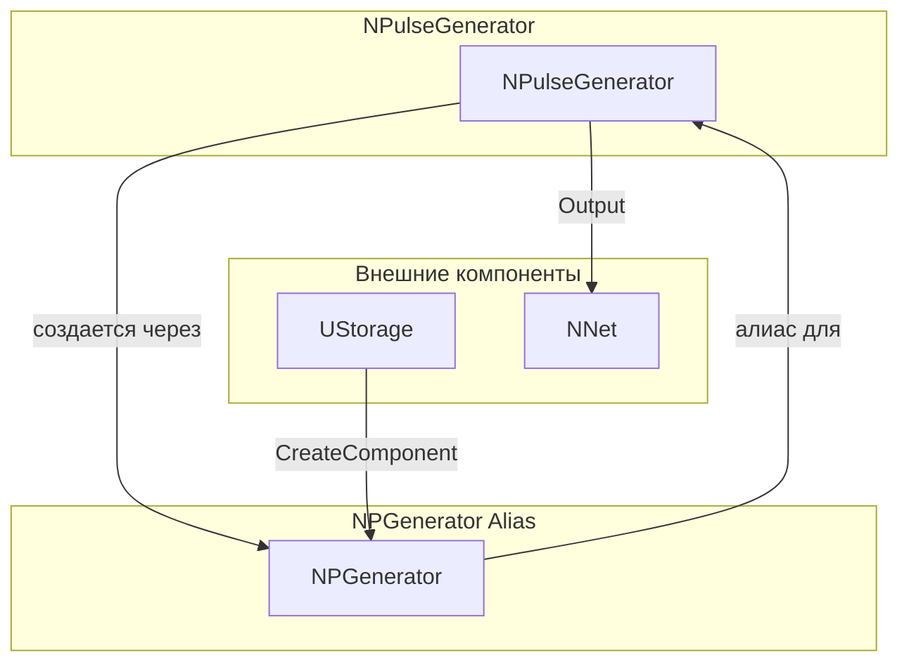
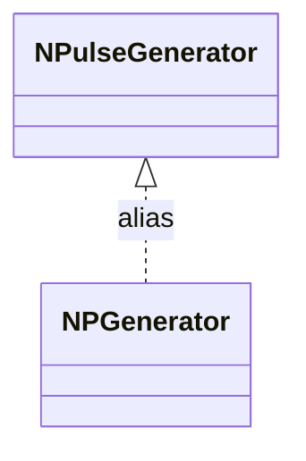
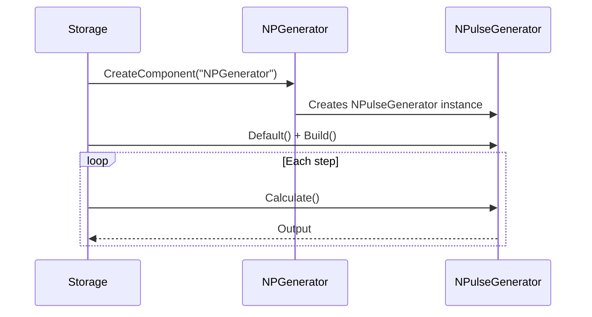
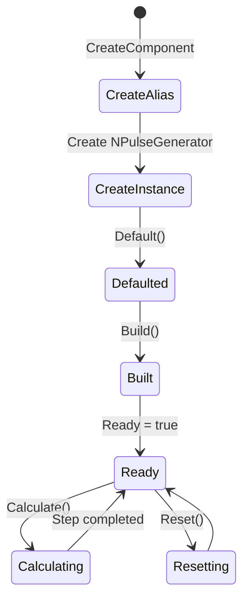
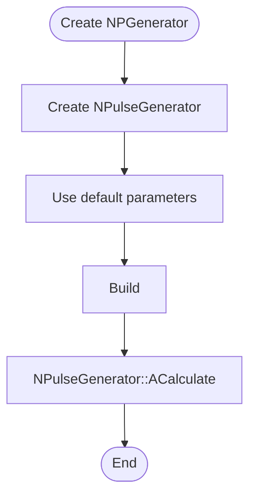
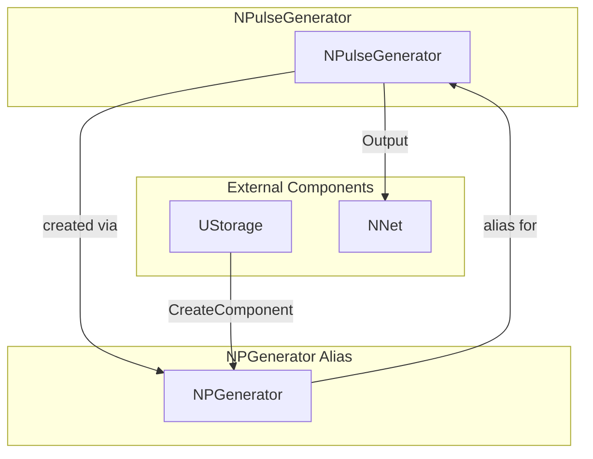

# NPGenerator — генератор импульсов (алиас)

## RU

### Назначение

**Класс**: `NPGenerator` — алиас для класса `NPulseGenerator`.  
**Префикс**: `NP` — **P**ulse (импульсный), компонент с импульсными входами/выходами.  
**Регистрация**: `NPulseLibrary.cpp` → `UploadClass("NPGenerator", ...)`.  
**Storage-инстансы**: `ClassName = "NPGenerator"` в `Bin/Configs/*/Model_*.xml`.

`NPGenerator` является алиасом (синонимом) для класса `NPulseGenerator`. При создании компонента с `ClassName = "NPGenerator"` фактически создается экземпляр класса `NPulseGenerator` с параметрами по умолчанию.

`NPulseGenerator` реализует генератор импульсов для создания входных сигналов в импульсных нейронных сетях.

**Использование:** Упрощенное именование при конфигурации, обратная совместимость

### UML-диаграмма классов



**Иерархия наследования:**
- `UNet` — базовая сеть Rdk Framework
- `NSource` — базовый источник сигналов
- `NPulseGenerator` — генератор импульсов
- `NPGenerator` — алиас для `NPulseGenerator`

### UML-диаграмма последовательности



**Жизненный цикл:**
1. **Создание**: При создании компонента с `ClassName = "NPGenerator"` фактически создается экземпляр `NPulseGenerator`
2. **Инициализация**: Используются параметры по умолчанию `NPulseGenerator`
3. **Использование**: Все методы и свойства идентичны `NPulseGenerator`

### UML-диаграмма состояний

```mermaid
stateDiagram-v2
    [*] --> CreateAlias: CreateComponent("NPGenerator")
    CreateAlias --> CreateInstance: Создание NPulseGenerator
    CreateInstance --> Defaulted: Default()
    Defaulted --> Built: Build()
    Built --> Ready: Ready = true
    Ready --> Calculating: Calculate()
    Calculating --> Ready: NPulseGenerator::ACalculate()
    Ready --> Resetting: Reset()
    Resetting --> Ready: Состояния сброшены
```

**Состояния:**
- **CreateAlias** — создание компонента через алиас
- **CreateInstance** — создание фактического экземпляра `NPulseGenerator`
- **Defaulted** — параметры установлены по умолчанию
- **Built** — структура генератора построена
- **Ready** — готов к выполнению расчетов
- **Calculating** — выполняется расчет генератора
- **Resetting** — выполняется сброс состояний

### UML-диаграмма активности



**Алгоритм работы:**
1. Создание экземпляра `NPulseGenerator` при использовании алиаса `NPGenerator`
2. Использование всех методов и свойств `NPulseGenerator`
3. Поведение идентично `NPulseGenerator`

### UML-диаграмма компонентов



**Зависимости:**
- **Базовый класс**: `NPulseGenerator` (создается через алиас)
- **Внешние компоненты**: `UStorage` (создание компонента), `NNet` (получатель выходных сигналов)

### Свойства

`NPGenerator` использует все свойства базового класса `NPulseGenerator` с параметрами по умолчанию.

### Методы

`NPGenerator` использует все методы базового класса `NPulseGenerator`.

### Примеры использования

#### Пример 1: Создание генератора в коде C++

```cpp
// Создание генератора импульсов через алиас
auto generator = storage->CreateComponent("NPGenerator");
generator->SetName("PGen");

// Инициализация (использует параметры по умолчанию)
generator->Default();

// Использование
generator->Build();
```

### Использование в конфигурациях

`NPGenerator` используется как упрощенное именование для `NPulseGenerator`:

- **Генерация импульсов**: `Bin/Configs/!OldConfigs/*/Model_*.xml` (где используется `NPGenerator` вместо `NPulseGenerator`)

**Типичные значения параметров:**
- Все параметры идентичны `NPulseGenerator`:
  - **Frequency**: 0.0-100.0 Гц (частота генерации импульсов)
  - **PulseLength**: 0.001 сек (длительность импульса)
  - **Amplitude**: 1.0 (амплитуда импульса)
  - **Delay**: 0.0 сек (задержка начала генерации)

### См. также

- [`NPulseGenerator`](NPulseGenerator.md) — генератор импульсов (базовый класс)
- [`NSource`](NSource.md) — базовый источник сигналов
- [Architecture.md](../Architecture.md) — архитектура библиотеки

---

## EN

### Purpose

**Class**: `NPGenerator` — alias for `NPulseGenerator` class.  
**Registration**: `NPulseLibrary.cpp` → `UploadClass("NPGenerator", ...)`.  
**Instances**: `ClassName = "NPGenerator"` in `Bin/Configs/*/Model_*.xml`.

`NPGenerator` is an alias (synonym) for the `NPulseGenerator` class. When creating a component with `ClassName = "NPGenerator"`, an instance of `NPulseGenerator` with default parameters is actually created.

**Usage:** Simplified naming in configurations, backward compatibility

### UML Class Diagram



### UML Sequence Diagram



### UML State Diagram



### UML Activity Diagram



### UML Component Diagram



### Properties

`NPGenerator` uses all properties of base class `NPulseGenerator`:
- `Frequency` — частота генерации импульсов (Гц)
- `PulseLength` — длительность импульса (сек)
- `Amplitude` — амплитуда импульса
- `Delay` — задержка начала генерации (сек)
- `FrequencyDeviation` — отклонение частоты (для случайной генерации)
- `AvgInterval` — средний интервал между импульсами (сек)
- `Output` — выходной сигнал (генерируемый импульс)
- `OutputPotential` — выходной потенциал
- `OutputFrequency` — выходная частота
- `OutputPulseTimes` — времена спайков

### Methods

`NPGenerator` uses all methods of base class `NPulseGenerator`:
- `ADefault()` — установка параметров по умолчанию
- `ABuild()` — сборка структуры генератора
- `AReset()` — сброс состояния генератора
- `ACalculate()` — выполнение шага генерации

### Usage in configurations

`NPGenerator` is used as simplified naming for `NPulseGenerator`:

- **Pulse generation**: `Bin/Configs/!OldConfigs/*/Model_*.xml` (where `NPGenerator` is used instead of `NPulseGenerator`)

**Typical parameter values:**
- All parameters are identical to `NPulseGenerator`:
  - **Frequency**: 0.0-100.0 Hz (pulse generation frequency)
  - **PulseLength**: 0.001 sec (pulse duration)
  - **Amplitude**: 1.0 (pulse amplitude)
  - **Delay**: 0.0 sec (generation start delay)

**Features:**
- Alias: creates `NPulseGenerator` instance with default parameters
- Same functionality as `NPulseGenerator`
- Provides backward compatibility and simplified naming

### See Also

- [`NPulseGenerator`](NPulseGenerator.md) — pulse generator (base class)
- [`NSource`](NSource.md) — base signal source
- [Architecture.md](../Architecture.md) — library architecture
