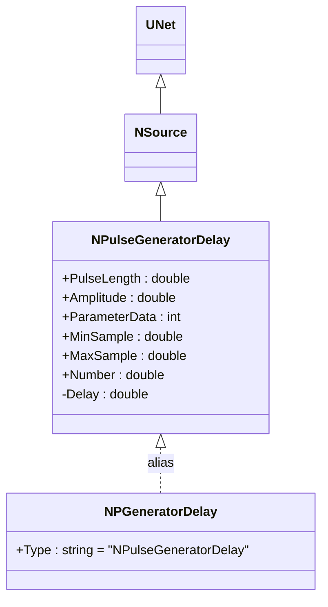
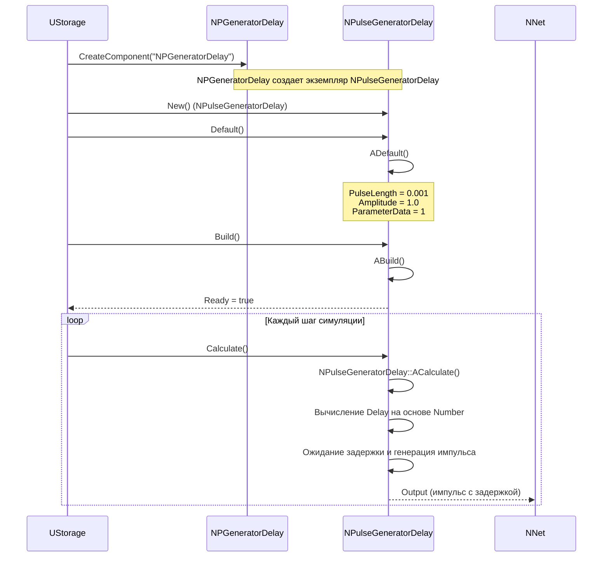
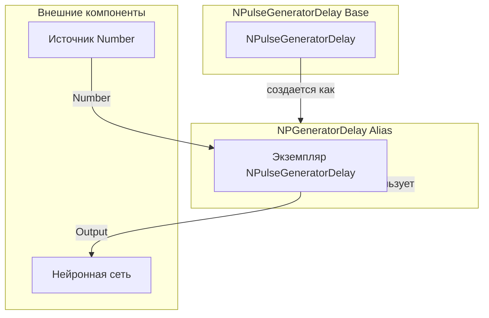
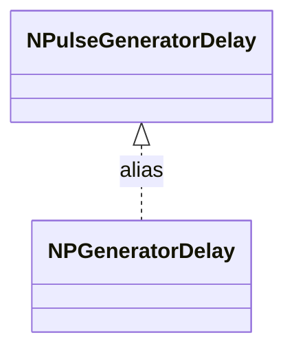
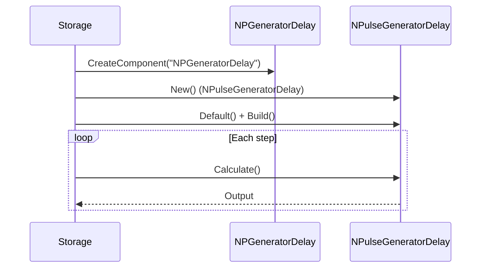
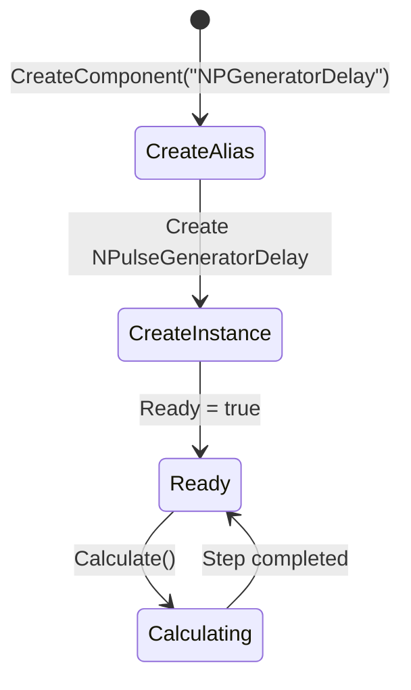
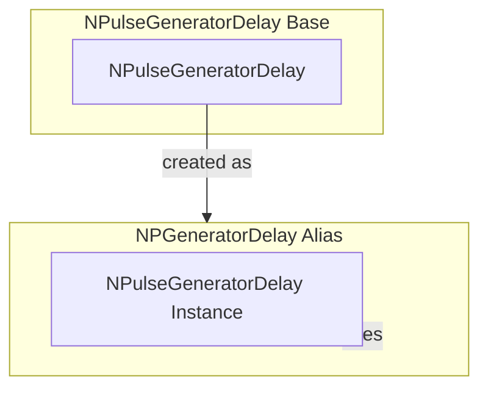

# NPGeneratorDelay — генератор импульсов с задержкой (алиас)

## RU

### Назначение

**Класс**: `NPGeneratorDelay` — алиас для класса `NPulseGeneratorDelay`.  
**Регистрация**: `NPulseLibrary.cpp` → `UploadClass("NPGeneratorDelay", ...)`.  
**Storage-инстансы**: `ClassName = "NPGeneratorDelay"` в `Bin/Configs/*/Model_*.xml`.

`NPGeneratorDelay` является алиасом (синонимом) для класса `NPulseGeneratorDelay`. При создании компонента с `ClassName = "NPGeneratorDelay"` фактически создается экземпляр класса `NPulseGeneratorDelay` с параметрами по умолчанию.

`NPulseGeneratorDelay` реализует генератор импульсов с динамической задержкой, вычисляемой на основе входного параметра `Number`.

**Использование:** Упрощенное именование при конфигурации, генерация импульсов с задержкой

### UML-диаграмма классов



**Иерархия наследования:**
- `UNet` — базовая сеть Rdk Framework
- `NSource` — базовый источник сигналов
- `NPulseGeneratorDelay` — генератор импульсов с задержкой
- `NPGeneratorDelay` — алиас для `NPulseGeneratorDelay`

### UML-диаграмма последовательности



**Жизненный цикл:**
1. **Создание**: При создании компонента с `ClassName = "NPGeneratorDelay"` фактически создается экземпляр `NPulseGeneratorDelay`
2. **Инициализация**: Используются параметры по умолчанию `NPulseGeneratorDelay`
3. **Использование**: Все методы и свойства идентичны `NPulseGeneratorDelay`

### UML-диаграмма состояний

```mermaid
stateDiagram-v2
    [*] --> CreateAlias: CreateComponent("NPGeneratorDelay")
    CreateAlias --> CreateInstance: Создание NPulseGeneratorDelay
    CreateInstance --> Defaulted: Default()
    Defaulted --> Built: Build()
    Built --> Ready: Ready = true
    Ready --> Calculating: Calculate()
    Calculating --> CalcDelay: Вычисление Delay
    CalcDelay --> WaitDelay: Ожидание задержки
    WaitDelay --> GeneratePulse: Генерация импульса
    GeneratePulse --> Ready: NPulseGeneratorDelay::ACalculate()
    Ready --> Resetting: Reset()
    Resetting --> Ready: Состояния сброшены
```

**Состояния:**
- **CreateAlias** — создание компонента через алиас
- **CreateInstance** — создание фактического экземпляра `NPulseGeneratorDelay`
- **Defaulted** — параметры установлены по умолчанию
- **Built** — структура генератора построена
- **Ready** — готов к выполнению расчетов
- **Calculating** — выполняется расчет генератора
- **CalcDelay** — вычисление задержки на основе Number
- **WaitDelay** — ожидание задержки
- **GeneratePulse** — генерация импульса
- **Resetting** — выполняется сброс состояний

### UML-диаграмма активности

```mermaid
flowchart TD
    Start([Create NPGeneratorDelay]) --> CreateInstance[Создать NPulseGeneratorDelay]
    CreateInstance --> UseDefault[Использовать параметры по умолчанию]
    UseDefault --> Build[Build()]
    Build --> Ready[Ready = true]
    Ready --> Calculate[Calculate()]
    Calculate --> CalcDelay[Вычисление Delay на основе Number]
    CalcDelay --> WaitDelay[Ожидание задержки]
    WaitDelay --> GeneratePulse[Генерация импульса]
    GeneratePulse --> End([End])
```

### UML-диаграмма компонентов



**Зависимости:**
- **Базовый класс**: `NPulseGeneratorDelay` (алиас создает экземпляр этого класса)
- **Внешние компоненты**: источник входного параметра `Number`, нейронная сеть (получатель сигналов)

### Свойства

`NPGeneratorDelay` использует все свойства базового класса `NPulseGeneratorDelay`:
- `PulseLength` (double) — длительность импульса
- `Amplitude` (double) — амплитуда импульса
- `ParameterData` (int) — параметр данных (1-4)
- `MinSample` (double) — минимальное значение в семпле
- `MaxSample` (double) — максимальное значение в семпле
- `Number` (double) — входной параметр для вычисления задержки
- `Output` (MDMatrix<double>) — выходной импульс

### Методы

`NPGeneratorDelay` использует все методы базового класса `NPulseGeneratorDelay`.

### Примеры использования

#### Пример 1: Создание генератора через алиас в коде C++

```cpp
// Создание генератора импульсов с задержкой через алиас
auto generator = storage->CreateComponent("NPGeneratorDelay");
generator->SetName("PGenDelay");

// Инициализация (использует параметры по умолчанию NPulseGeneratorDelay)
generator->Default();

// Настройка параметров
generator->PulseLength = 0.002;
generator->Amplitude = 1.5;
generator->ParameterData = 2;

// Использование
generator->Build();
```

#### Пример 2: Конфигурация XML

```xml
<PGenDelay1 Class="NPGeneratorDelay">
    <Parameters>
        <PulseLength>0.002</PulseLength>
        <Amplitude>1.5</Amplitude>
        <ParameterData>2</ParameterData>
    </Parameters>
    <Inputs>
        <Number>3.0</Number>
    </Inputs>
</PGenDelay1>
```

### Использование в конфигурациях

`NPGeneratorDelay` используется в экспериментах, требующих генерации импульсов с задержкой:

- **Генерация с задержкой**: `Bin/Configs/!OldConfigs/*/Model_*.xml` (где требуется упрощенное именование)
- **Моделирование задержек**: эксперименты с переменными задержками передачи

**Типичные значения параметров:**
- **PulseLength**: 0.001-0.01 сек
- **Amplitude**: 0.1-10.0
- **ParameterData**: 1-4

**Особенности:**
- Упрощенное именование: алиас позволяет использовать более короткое имя в конфигурациях
- Полная совместимость: все свойства и методы идентичны `NPulseGeneratorDelay`

### См. также

- [`NPulseGeneratorDelay`](NPulseGeneratorDelay.md) — генератор импульсов с задержкой (базовый класс)
- [`NPulseGenerator`](NPulseGenerator.md) — базовый генератор импульсов
- [`NPulseGeneratorMulti`](NPulseGeneratorMulti.md) — генератор множественных импульсов
- [`NPDelay`](NPDelay.md) — компонент задержки сигналов
- [Architecture.md](../Architecture.md) — архитектура библиотеки

---

## EN

### Purpose

**Class**: `NPGeneratorDelay` — alias for `NPulseGeneratorDelay` class.  
**Registration**: `NPulseLibrary.cpp` → `UploadClass("NPGeneratorDelay", ...)`.  
**Instances**: `ClassName = "NPGeneratorDelay"` in `Bin/Configs/*/Model_*.xml`.

`NPGeneratorDelay` is an alias (synonym) for `NPulseGeneratorDelay` class. When creating a component with `ClassName = "NPGeneratorDelay"`, an instance of `NPulseGeneratorDelay` is actually created with default parameters.

**Usage:** Simplified naming in configurations, pulse generation with delay

### UML Class Diagram



### UML Sequence Diagram



### UML State Diagram



### UML Activity Diagram

```mermaid
flowchart TD
    Start([Create NPGeneratorDelay]) --> CreateInstance[Create NPulseGeneratorDelay]
    CreateInstance --> UseDefault[Use default parameters]
    UseDefault --> Build[Build()]
    Build --> Ready[Ready]
    Ready --> Calculate[Calculate()]
    Calculate --> End([End])
```

### UML Component Diagram



### Properties

`NPGeneratorDelay` uses all properties of base class `NPulseGeneratorDelay`.

### Methods

`NPGeneratorDelay` uses all methods of base class `NPulseGeneratorDelay`.

### Usage in configurations

`NPGeneratorDelay` is used in experiments requiring pulse generation with delay:

- **Pulse generation with delay**: `Bin/Configs/!OldConfigs/*/Model_*.xml`
- **Delay modeling**: experiments with variable transmission delays

### See Also

- [`NPulseGeneratorDelay`](NPulseGeneratorDelay.md) — pulse generator with delay (base class)
- [`NPulseGenerator`](NPulseGenerator.md) — base pulse generator
- [`NPulseGeneratorMulti`](NPulseGeneratorMulti.md) — multiple pulse generator
- [Architecture.md](../Architecture.md) — library architecture
