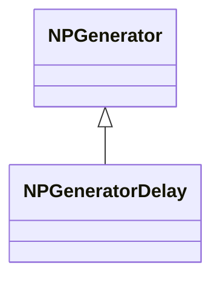
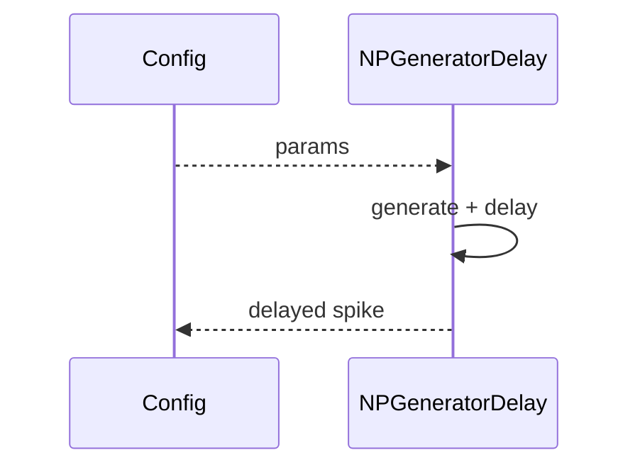
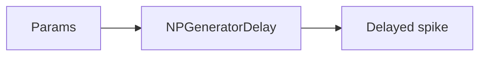
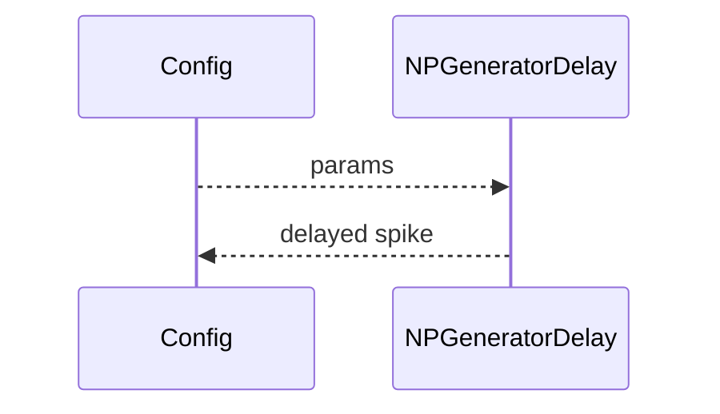

## NPGeneratorDelay — генератор с задержкой

**Класс**: `NPGeneratorDelay` — генератор импульсов с задержкой.  
**Регистрация**: `NPulseLibrary.cpp` → `UploadClass("NPGeneratorDelay", ...)`.  
**Storage**: `ClassName = "NPGeneratorDelay"`.

### Lifecycle
- **ADefault**: параметры генерации + задержка.
- **ABuild**: подготовка буфера задержки.
- **AReset**: очистка буфера.
- **ACalculate**: генерация + задержка выдачи.

### I/O
- Вход: управление.
- Выход: задержанный импульс.



Пояснение: диаграмма классов показывает место компонента в иерархии и ключевые связи.



Пояснение: диаграмма последовательности показывает типовой сценарий взаимодействия и порядок вызовов.



Пояснение: блок-схема показывает поток данных/сигналов (входы → компонент → выходы).

### Config snippet

```ini
[Component]
ClassName = NPGeneratorDelay
Name = PGenDelay1
```

---

## NPGeneratorDelay — delayed pulse generator (EN)

Pulse generator with delay buffer.


Description: this class diagram shows the component position in the type hierarchy and key relations.



Description: this sequence diagram shows a typical runtime interaction and call order.


Description: this flowchart shows the data/signal flow (inputs → component → outputs).
