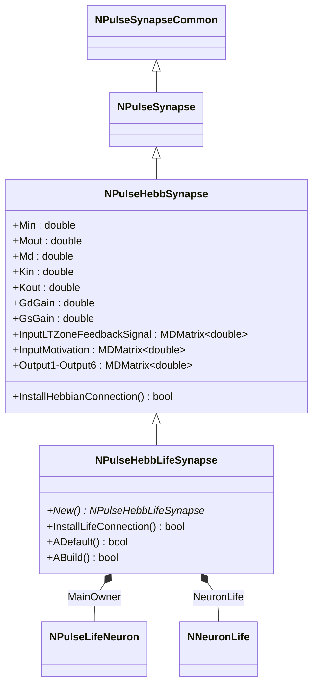
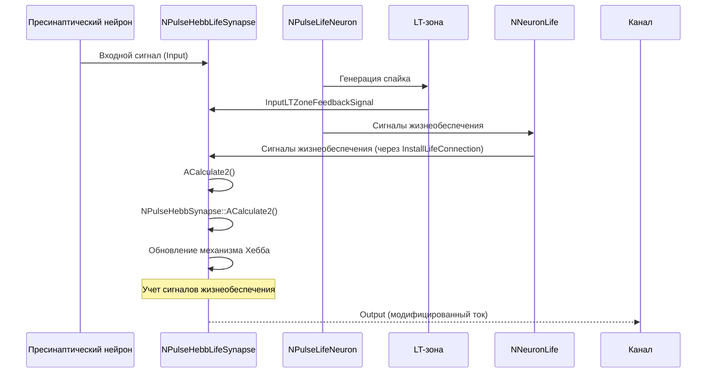
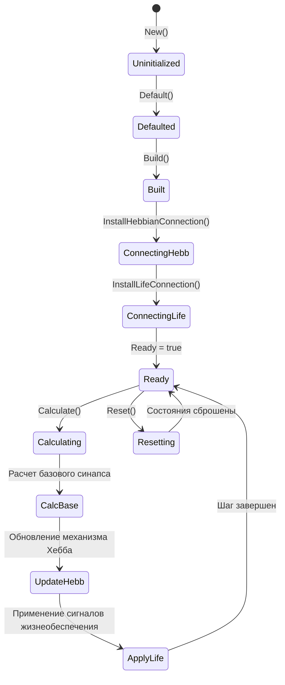
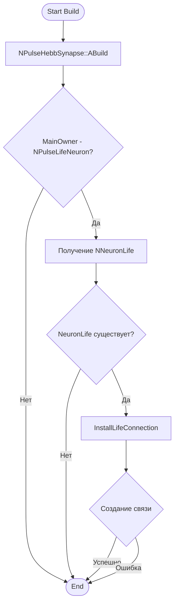
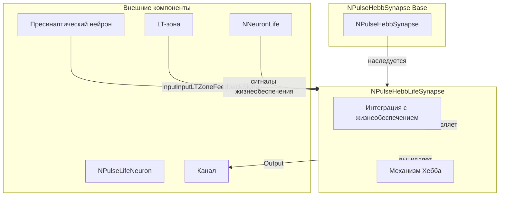
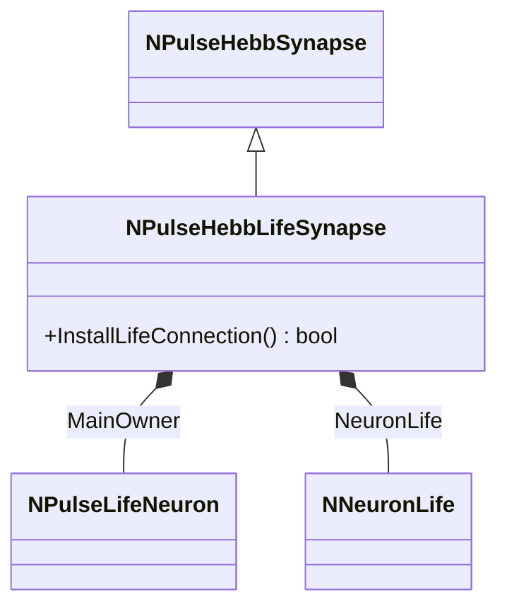
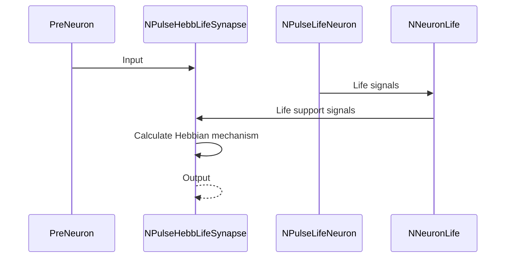

# NPHebbLifeSynapse — импульсный синапс Хебба с поддержкой жизнеобеспечения

## RU

### Назначение

**Класс**: `NPHebbLifeSynapse` — импульсный синапс с механизмом Хебба и интеграцией с моделью жизнеобеспечения нейрона.  
**Регистрация**: `NPulseLibrary.cpp` → `UploadClass("NPHebbLifeSynapse", ...)`.  
**Storage-инстансы**: `ClassName = "NPHebbLifeSynapse"` в `Bin/Configs/*/Model_*.xml`.

`NPHebbLifeSynapse` является расширением класса `NPulseHebbSynapse` с дополнительной интеграцией с моделью жизнеобеспечения нейрона (`NPulseLifeNeuron`). Наследуется от `NPulseHebbSynapse` и добавляет автоматическое подключение к системе жизнеобеспечения нейрона через метод `InstallLifeConnection()`.

**Использование:** Моделирование синаптической пластичности с учетом жизнеобеспечения нейрона, эксперименты с жизненными циклами нейронов

### UML-диаграмма классов



**Иерархия наследования:**
- `NPulseSynapseCommon` — общий импульсный синапс
- `NPulseSynapse` — импульсный синапс с моделью медиатора
- `NPulseHebbSynapse` — импульсный синапс с механизмом Хебба
- `NPulseHebbLifeSynapse` — импульсный синапс Хебба с поддержкой жизнеобеспечения

**Ключевые особенности:**
- Автоматическое подключение к системе жизнеобеспечения нейрона
- Интеграция с `NPulseLifeNeuron` и `NNeuronLife`
- Использование сигналов жизнеобеспечения для модуляции механизма Хебба

### UML-диаграмма последовательности



**Жизненный цикл:**
1. **Инициализация**: Установка параметров по умолчанию
2. **Сборка**: Вызов `NPulseHebbSynapse::ABuild()`
3. **Подключение**: Автоматическое подключение к LT-зоне и системе жизнеобеспечения
4. **Расчет**: Обновление компонентов механизма Хебба с учетом сигналов жизнеобеспечения
5. **Сброс**: Обнуление состояний

### UML-диаграмма состояний



### UML-диаграмма активности



**Алгоритм подключения к жизнеобеспечению:**
1. Проверка, что владелец синапса является `NPulseLifeNeuron`
2. Получение системы жизнеобеспечения (`NNeuronLife`)
3. Создание связи между системой жизнеобеспечения и синапсом
4. Использование сигналов жизнеобеспечения в расчетах механизма Хебба

### UML-диаграмма компонентов



### Свойства

`NPHebbLifeSynapse` использует все свойства базового класса `NPulseHebbSynapse`:
- Параметры механизма Хебба: `Min`, `Mout`, `Md`, `Kin`, `Kout`, `GdGain`, `GsGain`
- Мотивационные параметры: `ActiveMs`, `PassiveMs`, `Kmot`
- Входы: `Input`, `InputLTZoneFeedbackSignal`, `InputMotivation`
- Выходы: `Output`, `Output1`-`Output6`
- Состояния: `Win`, `Wout`, `Gd`, `Gs`, `GsSum`, `G`

### Методы

#### Публичные методы

- **`New()`** → `NPulseHebbLifeSynapse*` — создает новый экземпляр класса.

#### Защищенные методы жизненного цикла

- **`ADefault()`** → `bool` — инициализирует параметры по умолчанию. Вызывает `NPulseHebbSynapse::ADefault()`.

- **`ABuild()`** → `bool` — строит структуру синапса. Вызывает `NPulseHebbSynapse::ABuild()`, затем автоматически подключается к системе жизнеобеспечения через `InstallLifeConnection()`.

#### Защищенные методы подключения

- **`InstallLifeConnection()`** → `bool` — подключает синапс к системе жизнеобеспечения нейрона (`NNeuronLife`). Проверяет, что владелец синапса является `NPulseLifeNeuron`, получает систему жизнеобеспечения и создает необходимые связи. Возвращает `false` только при ошибке установки связи.

### Примеры использования

#### Пример 1: Создание синапса в коде C++

```cpp
// Создание синапса Хебба с поддержкой жизнеобеспечения
auto synapse = storage->CreateComponent<NPulseHebbLifeSynapse>();
synapse->SetName("HebbLifeSynapse");

// Инициализация
synapse->Default();

// Настройка параметров механизма Хебба
synapse->Min = 10.0;
synapse->Mout = 10.0;
synapse->Md = 0.001;
synapse->Kin = 100.0;
synapse->Kout = 100.0;

// Сборка (автоматически подключается к жизнеобеспечению)
synapse->Build();

// Использование
for (int step = 0; step < 10000; step++) {
    synapse->Calculate();
    double output = synapse->Output(0, 0);
    double g = synapse->Output2(0, 0);
    
    if (step % 1000 == 0) {
        std::cout << "Step " << step << ": Output = " << output 
                  << ", G = " << g << std::endl;
    }
}
```

#### Пример 2: Конфигурация XML

```xml
<Synapse1 Class="NPHebbLifeSynapse">
    <Parameters>
        <Type>1</Type>
        <PulseAmplitude>1.0</PulseAmplitude>
        <Resistance>1.0e10</Resistance>
        <Weight>1.0</Weight>
        <SecretionTC>0.001</SecretionTC>
        <DissociationTC>0.01</DissociationTC>
        <Min>10</Min>
        <Mout>10</Mout>
        <Md>0.001</Md>
        <Kin>100</Kin>
        <Kout>100</Kout>
        <GdGain>1</GdGain>
        <GsGain>10</GsGain>
    </Parameters>
</Synapse1>
```

### Использование в конфигурациях

`NPHebbLifeSynapse` используется в экспериментах с жизнеобеспечением нейронов:

- Моделирование синаптической пластичности с учетом жизнеобеспечения
- Эксперименты с жизненными циклами нейронов
- Изучение влияния жизнеобеспечения на обучение

**Особенности:**
- Автоматически подключается к системе жизнеобеспечения нейрона
- Интегрируется с `NPulseLifeNeuron` и `NNeuronLife`
- Использует сигналы жизнеобеспечения для модуляции механизма Хебба

### См. также

- [`NPulseHebbSynapse`](NPulseHebbSynapse.md) — импульсный синапс с механизмом Хебба (базовый класс)
- [`NPHebbSynapse`](NPHebbSynapse.md) — алиас для NPulseHebbSynapse
- [`NPulseLifeNeuron`](NPulseLifeNeuron.md) — импульсный нейрон с жизнеобеспечением
- [`NNeuronLife`](NNeuronLife.md) — система жизнеобеспечения нейрона
- [`NPulseSynapse`](NPulseSynapse.md) — импульсный синапс с моделью медиатора
- [Architecture.md](../Architecture.md) — архитектура библиотеки
- [Scientific-Background.md](../Scientific-Background.md) — научный фон (правило Хебба, жизнеобеспечение нейронов)

---

## EN

### Purpose

**Class**: `NPHebbLifeSynapse` — spiking synapse with Hebbian mechanism and neuron life support integration.  
**Registration**: `NPulseLibrary.cpp` → `UploadClass("NPHebbLifeSynapse", ...)`.  
**Instances**: `ClassName = "NPHebbLifeSynapse"` in `Bin/Configs/*/Model_*.xml`.

`NPHebbLifeSynapse` is an extension of `NPulseHebbSynapse` class with additional integration with neuron life support model (`NPulseLifeNeuron`). Inherits from `NPulseHebbSynapse` and adds automatic connection to neuron life support system through `InstallLifeConnection()` method.

**Usage:** Modeling synaptic plasticity with neuron life support, experiments with neuron life cycles

### UML Class Diagram



### UML Sequence Diagram



### See Also

- [`NPulseHebbSynapse`](NPulseHebbSynapse.md) — spiking synapse with Hebbian mechanism (base class)
- [`NPHebbSynapse`](NPHebbSynapse.md) — alias for NPulseHebbSynapse
- [`NPulseLifeNeuron`](NPulseLifeNeuron.md) — spiking neuron with life support
- [`NNeuronLife`](NNeuronLife.md) — neuron life support system
- [`NPulseSynapse`](NPulseSynapse.md) — spiking synapse with neurotransmitter model
- [Architecture.md](../Architecture.md) — library architecture
- [Scientific-Background.md](../Scientific-Background.md) — scientific background (Hebb's rule, neuron life support)
