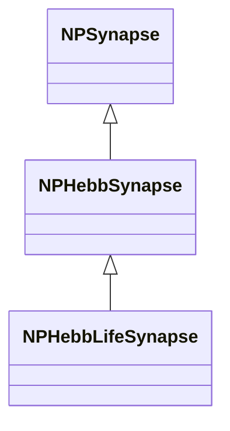
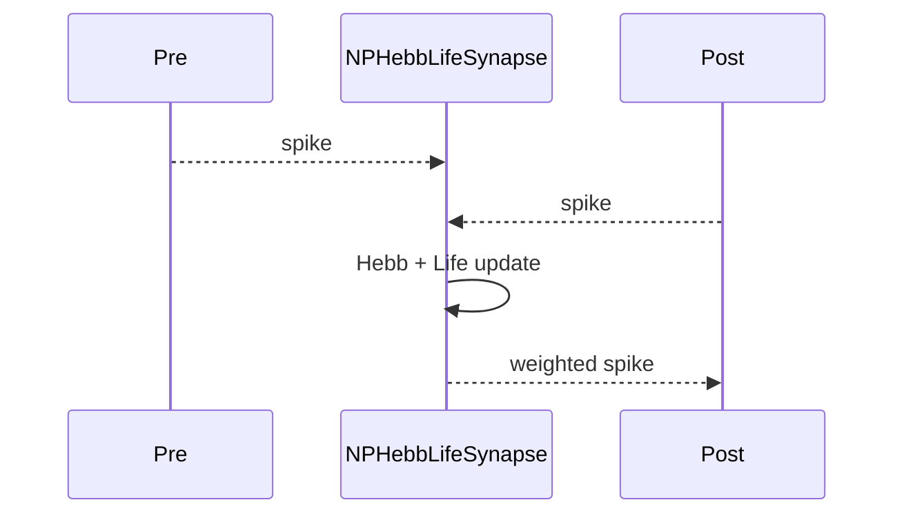
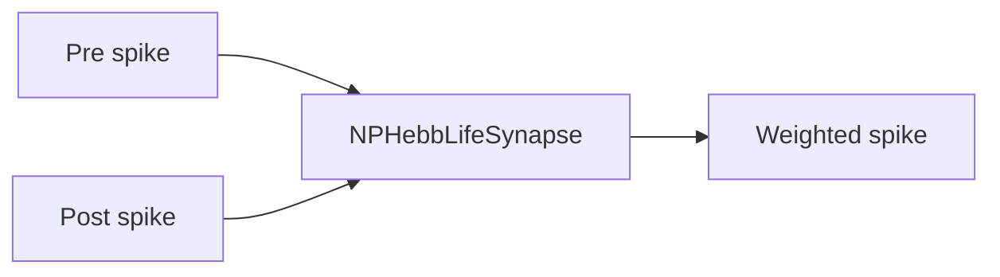
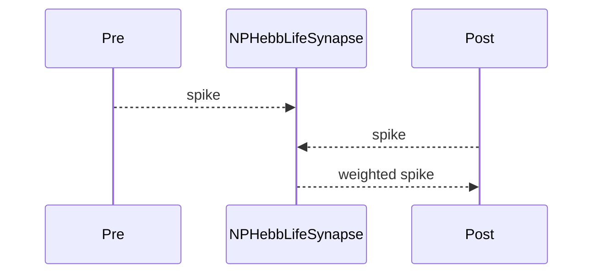

## NPHebbLifeSynapse — Hebb Life синапс

**Класс**: `NPHebbLifeSynapse` — синапс с Hebb-пластичностью и расширением Life.  
**Регистрация**: `NPulseLibrary.cpp` → `UploadClass("NPHebbLifeSynapse", ...)`.  
**Storage**: `ClassName = "NPHebbLifeSynapse"`.

### Lifecycle
- **ADefault**: параметры Hebb + Life.
- **ABuild**: подключение pre/post.
- **AReset**: сброс веса/метрик.
- **ACalculate**: передача + Hebb-обновление + Life-метрики.

### I/O
- Вход: спайки pre/post.
- Выход: взвешенный импульс + обновлённый вес.



Пояснение: диаграмма классов показывает место компонента в иерархии и ключевые связи.



Пояснение: диаграмма последовательности показывает типовой сценарий взаимодействия и порядок вызовов.



Пояснение: блок-схема показывает поток данных/сигналов (входы → компонент → выходы).

### Config snippet

```ini
[Component]
ClassName = NPHebbLifeSynapse
Name = HebbLifeSyn1
```

---

## NPHebbLifeSynapse — Hebb Life synapse (EN)

Synapse with Hebbian plasticity and Life metrics.


Description: this class diagram shows the component position in the type hierarchy and key relations.



Description: this sequence diagram shows a typical runtime interaction and call order.


Description: this flowchart shows the data/signal flow (inputs → component → outputs).
