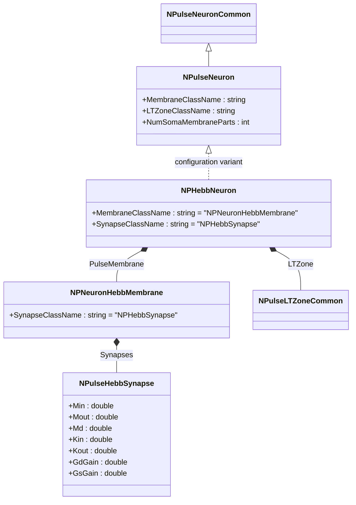
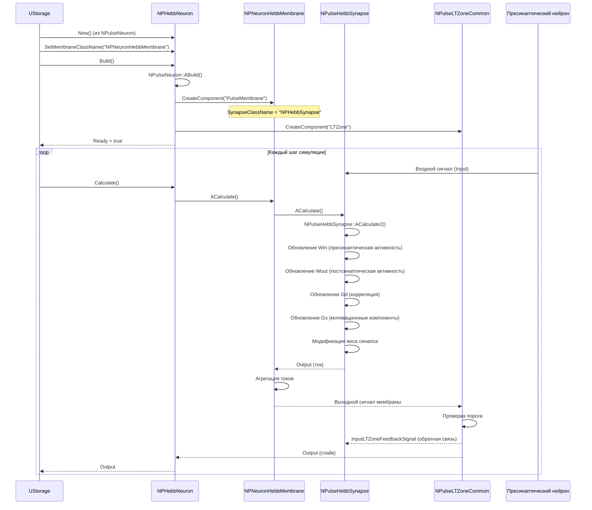
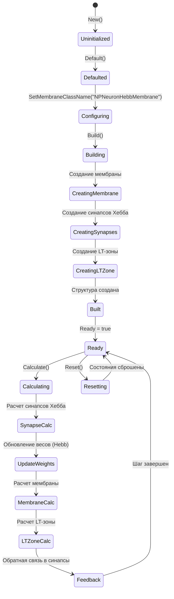
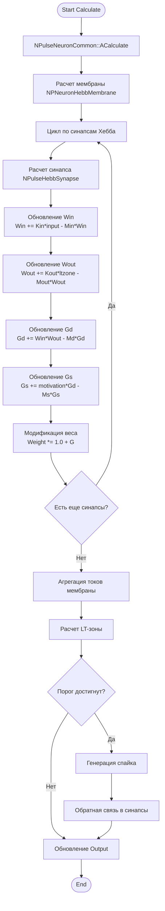
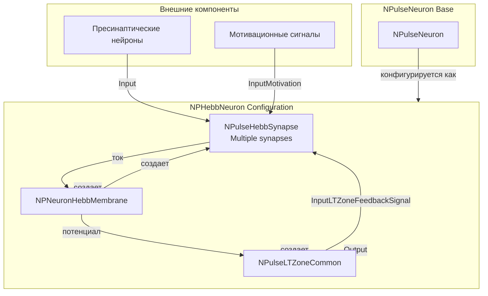
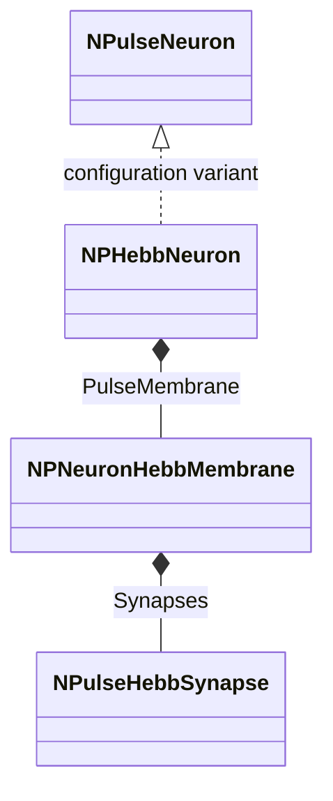
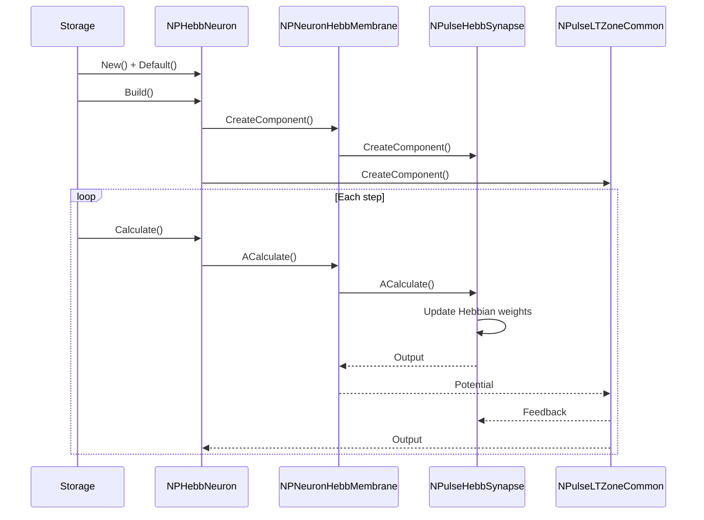
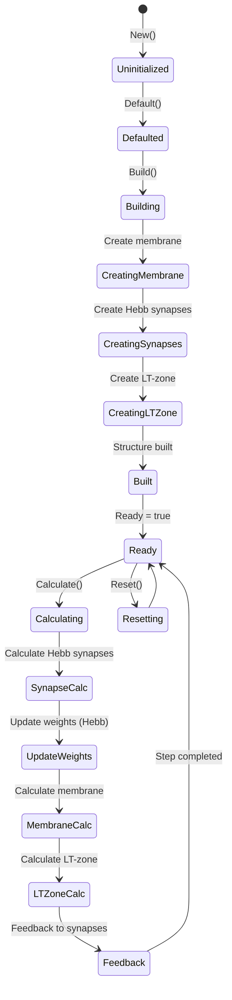
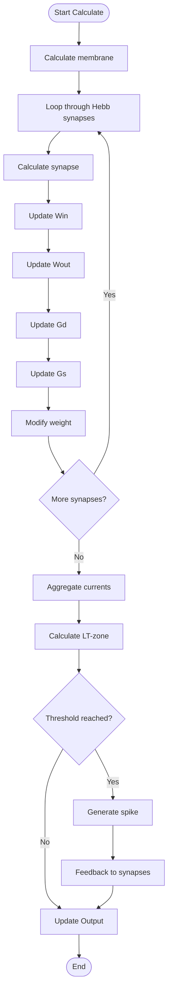
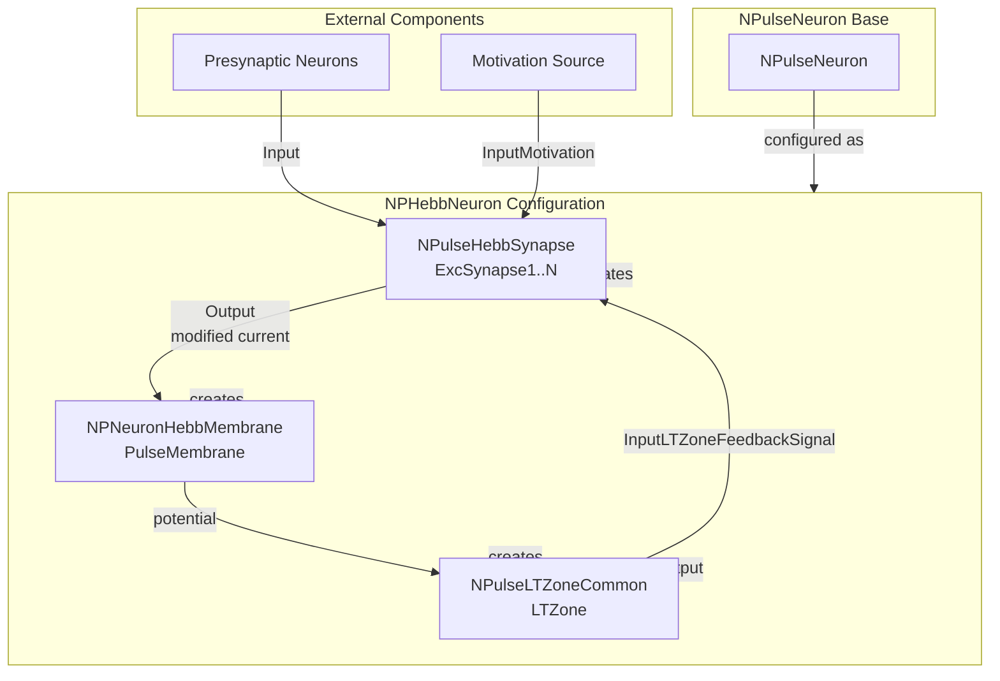

# NPHebbNeuron — нейрон с синапсами Хебба

## RU

### Назначение

**Класс**: `NPHebbNeuron` — конфигурационный вариант импульсного нейрона с мембраной, поддерживающей синапсы Хебба.  
**Аббревиатура**: `Hebb` — **Hebb**ian (геббовская пластичность, обучение по правилу Хебба).  
**Регистрация**: `NPulseLibrary.cpp` → `UploadClass("NPHebbNeuron", ...)`.  
**Storage-инстансы**: `ClassName = "NPHebbNeuron"` в `Bin/Configs/*/Model_*.xml`.

`NPHebbNeuron` является конфигурационным вариантом базового класса `NPulseNeuron` с мембраной, поддерживающей синапсы Хебба. Создается из `NPulseNeuron` с настройками:
- `MembraneClassName = "NPNeuronHebbMembrane"` — мембрана с поддержкой синапсов Хебба
- `SynapseClassName = "NPHebbSynapse"` — синапс Хебба (через мембрану)

Синапсы Хебба (`NPulseHebbSynapse`) реализуют механизм обучения Хебба с множественными выходами и мотивационными сигналами, что позволяет нейрону адаптировать веса синапсов на основе корреляции между пресинаптической и постсинаптической активностью.

**Использование:** Моделирование нейронов с обучением Хебба, эксперименты с пластичностью синапсов, обучение нейросетей

### UML-диаграмма классов



**Иерархия наследования:**
- `NPulseNeuronCommon` — общий импульсный нейрон
- `NPulseNeuron` — импульсный нейрон с параметрами структурирования
- `NPHebbNeuron` — конфигурационный вариант с синапсами Хебба

**Внутренняя структура:**
- **PulseMembrane** (`NPNeuronHebbMembrane`) — мембрана с поддержкой синапсов Хебба
- **LTZone** (`NPulseLTZoneCommon`) — стандартная LT-зона
- **Synapses** (`NPulseHebbSynapse`) — синапсы Хебба, создаваемые мембраной

### UML-диаграмма последовательности



**Жизненный цикл:**
1. **Создание**: `NPHebbNeuron` создается из `NPulseNeuron` с настройкой мембраны
2. **Настройка**: Устанавливается мембрана с поддержкой синапсов Хебба
3. **Сборка**: Автоматически создается структура нейрона с мембраной и синапсами Хебба
4. **Расчет**: На каждом шаге рассчитываются синапсы Хебба (обновление весов), мембрана и LT-зона

### UML-диаграмма состояний



**Состояния:**
- **Uninitialized** — создан, но не инициализирован
- **Defaulted** — параметры установлены по умолчанию
- **Configuring** — настройка мембраны с синапсами Хебба
- **Building** — выполняется сборка
- **CreatingMembrane** — создание мембраны с поддержкой синапсов Хебба
- **CreatingSynapses** — создание синапсов Хебба
- **CreatingLTZone** — создание LT-зоны
- **Built** — структура нейрона построена
- **Ready** — готов к выполнению расчетов
- **Calculating** — выполняется расчет нейрона
- **SynapseCalc** — расчет синапсов Хебба
- **UpdateWeights** — обновление весов по правилу Хебба
- **MembraneCalc** — расчет мембраны
- **LTZoneCalc** — расчет LT-зоны
- **Feedback** — обратная связь от LT-зоны к синапсам
- **Resetting** — выполняется сброс состояний

### UML-диаграмма активности



**Алгоритм расчета:**
1. Вызов базового расчета (`NPulseNeuronCommon::ACalculate()`)
2. Расчет мембраны: цикл по всем синапсам Хебба
3. Для каждого синапса Хебба:
   - Обновление пресинаптической активности (`Win`)
   - Обновление постсинаптической активности (`Wout`)
   - Обновление корреляции (`Gd`)
   - Обновление мотивационных компонентов (`Gs`)
   - Модификация веса синапса на основе механизма Хебба
4. Агрегация токов от всех синапсов
5. Расчет LT-зоны: проверка порога генерации спайка
6. Обратная связь от LT-зоны к синапсам для обновления `Wout`
7. Генерация спайка при достижении порога

### UML-диаграмма компонентов



**Зависимости:**
- **Базовый класс**: `NPulseNeuron` (конфигурационный вариант)
- **Внутренние компоненты**: `NPNeuronHebbMembrane` (мембрана), `NPulseHebbSynapse` (синапсы Хебба), `NPulseLTZoneCommon` (LT-зона)
- **Внешние компоненты**: пресинаптические нейроны (источники входных сигналов), мотивационные сигналы (для синапсов Хебба)

### Свойства

`NPHebbNeuron` использует все свойства базового класса `NPulseNeuron` с параметрами:
- `MembraneClassName = "NPNeuronHebbMembrane"` — мембрана с поддержкой синапсов Хебба
- `SynapseClassName = "NPHebbSynapse"` — синапс Хебба (через мембрану)

**Наследуемые свойства от NPulseNeuron:**
- Все свойства базового класса `NPulseNeuron`
- Свойства мембраны `NPNeuronHebbMembrane`
- Свойства синапсов `NPulseHebbSynapse` (Min, Mout, Md, Kin, Kout, GdGain, GsGain и др.)

### Методы

`NPHebbNeuron` использует все методы базового класса `NPulseNeuron`.

### Примеры использования

#### Пример 1: Создание нейрона Хебба в коде C++

```cpp
// Создание нейрона Хебба
auto neuron = storage->CreateComponent("NPHebbNeuron");
neuron->SetName("HebbNeuron1");

// Инициализация
neuron->Default();

// Сборка (автоматически создается мембрана с синапсами Хебба)
neuron->Build();

// Использование
for (int step = 0; step < 1000; step++) {
    neuron->Calculate();
    // Веса синапсов Хебба обновляются автоматически
}
```

#### Пример 2: Конфигурация XML

```xml
<HebbNeuron1 Class="NPHebbNeuron">
    <Parameters>
        <!-- Параметры наследуются от NPulseNeuron -->
        <!-- Мембрана автоматически использует NPNeuronHebbMembrane -->
        <!-- Синапсы автоматически используют NPHebbSynapse -->
    </Parameters>
</HebbNeuron1>
```

### Использование в конфигурациях

`NPHebbNeuron` используется в экспериментах с обучением Хебба:

- **Обучение Хебба**: `Bin/Configs/!OldConfigs/*/Model_*.xml` (где требуется обучение по правилу Хебба)

**Типичные значения параметров:**
- **MembraneClassName**: "NPNeuronHebbMembrane" (мембрана с поддержкой синапсов Хебба)
- **SynapseClassName**: "NPHebbSynapse" (синапс Хебба)
- **Параметры синапсов Хебба**: Min=10.0, Mout=10.0, Md=0.001, Kin=100.0, Kout=100.0, GdGain=1.0, GsGain=10.0

## Источники

См. [Literature-References.md](../Literature-References.md): **25**, **29**.

### См. также

- [`NPulseNeuron`](NPulseNeuron.md) — импульсный нейрон с параметрами структурирования (базовый класс)
- [`NPNeuronHebbMembrane`](NPNeuronHebbMembrane.md) — мембрана с поддержкой синапсов Хебба
- [`NPulseHebbSynapse`](NPulseHebbSynapse.md) — синапс Хебба
- [`NSPHebbNeuron`](NSPHebbNeuron.md) — мелкий нейрон с синапсами Хебба
- [`NLPHebbNeuron`](NLPHebbNeuron.md) — крупный нейрон с синапсами Хебба
- [Architecture.md](../Architecture.md) — архитектура библиотеки

---

## EN

### Purpose

**Class**: `NPHebbNeuron` — configuration variant of spiking neuron with membrane supporting Hebbian synapses.  
**Registration**: `NPulseLibrary.cpp` → `UploadClass("NPHebbNeuron", ...)`.  
**Instances**: `ClassName = "NPHebbNeuron"` in `Bin/Configs/*/Model_*.xml`.

`NPHebbNeuron` is a configuration variant of the base class `NPulseNeuron` with membrane supporting Hebbian synapses. Created from `NPulseNeuron` with settings:
- `MembraneClassName = "NPNeuronHebbMembrane"` — membrane with Hebbian synapse support
- `SynapseClassName = "NPHebbSynapse"` — Hebbian synapse (via membrane)

Hebbian synapses (`NPulseHebbSynapse`) implement Hebbian learning mechanism with multiple outputs and motivational signals, allowing the neuron to adapt synapse weights based on correlation between presynaptic and postsynaptic activity.

**Usage:** Modeling neurons with Hebbian learning, experiments with synaptic plasticity, neural network training

### UML Class Diagram



### UML Sequence Diagram



### UML State Diagram



### UML Activity Diagram



### UML Component Diagram



### Properties

`NPHebbNeuron` uses all properties of base class `NPulseNeuron` with preset values:

**Configuration parameters:**
- `MembraneClassName = "NPNeuronHebbMembrane"` — membrane with Hebbian synapse support
- `LTMembraneClassName = ""` — without LT-membrane
- `LTZoneClassName = "NPulseLTZoneCommon"` — standard LT-zone
- `NumSomaMembraneParts = 1` — one soma part

**Inherited properties from NPulseNeuron:**
- `StructureBuildMode` — structure rebuild mode
- `NumDendriteMembraneParts` — number of dendrite parts
- `TrainingPattern` — training pattern
- All other base class properties

### Methods

`NPHebbNeuron` uses all methods of base class `NPulseNeuron`:
- `ADefault()` — sets default parameters (configures as Hebb neuron)
- `ABuild()` — builds neuron structure with Hebb membrane and synapses
- `AReset()` — resets neuron state
- `ACalculate()` — performs one calculation step (Hebb learning + neuron calculation)

### Usage in configurations

`NPHebbNeuron` is used in experiments with Hebbian learning:

- **Hebbian learning**: `Bin/Configs/*/Model_*.xml` (where Hebbian learning is required)
- **Synaptic plasticity**: experiments with Hebbian synaptic plasticity
- **Associative learning**: modeling associative learning with Hebbian synapses

**Features:**
- Hebbian membrane: uses membrane optimized for Hebbian synapses
- Automatic structure: creates Hebb synapses automatically
- Motivation support: supports motivation signals for Hebb learning
- LT-zone feedback: uses LT-zone feedback for synaptic plasticity

**Typical parameter values:**
- **MembraneClassName**: "NPNeuronHebbMembrane" (membrane with Hebb support)
- **LTZoneClassName**: "NPulseLTZoneCommon" (standard LT-zone)
- **NumSomaMembraneParts**: 1 (one soma part)

### References

See [Literature-References.md](../Literature-References.md): **25**, **29**.

### See Also

- [`NPulseNeuron`](NPulseNeuron.md) — spiking neuron with structuring parameters (base class)
- [`NPNeuronHebbMembrane`](NPNeuronHebbMembrane.md) — membrane with Hebbian synapse support
- [`NPulseHebbSynapse`](NPulseHebbSynapse.md) — Hebbian synapse
- [`NSPHebbNeuron`](NSPHebbNeuron.md) — small neuron with Hebbian synapses
- [`NLPHebbNeuron`](NLPHebbNeuron.md) — large neuron with Hebbian synapses
- [Architecture.md](../Architecture.md) — library architecture
