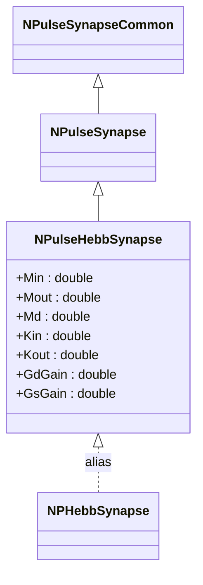
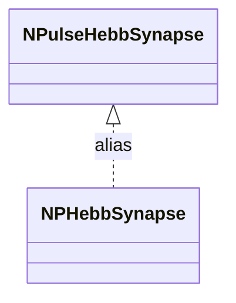

# NPHebbSynapse — синапс Хебба (алиас)

## RU

### Назначение

**Класс**: `NPHebbSynapse` — алиас для класса `NPulseHebbSynapse`.  
**Регистрация**: `NPulseLibrary.cpp` → `UploadClass("NPHebbSynapse", ...)`.  
**Storage-инстансы**: `ClassName = "NPHebbSynapse"` в `Bin/Configs/*/Model_*.xml`.

`NPHebbSynapse` является алиасом (синонимом) для класса `NPulseHebbSynapse`. При создании компонента с `ClassName = "NPHebbSynapse"` фактически создается экземпляр класса `NPulseHebbSynapse` с параметрами по умолчанию.

**Использование:** Упрощенное именование при конфигурации, обратная совместимость

### UML-диаграмма классов



**Иерархия наследования:**
- `NPulseSynapseCommon` — общий импульсный синапс
- `NPulseSynapse` — импульсный синапс с моделью медиатора
- `NPulseHebbSynapse` — импульсный синапс с механизмом Хебба
- `NPHebbSynapse` — алиас для `NPulseHebbSynapse`

### Свойства

`NPHebbSynapse` использует все свойства класса `NPulseHebbSynapse` с параметрами по умолчанию.

**Параметры по умолчанию:**
- `Min = 10.0`
- `Mout = 10.0`
- `Md = 0.001`
- `Kin = 100.0`
- `Kout = 100.0`
- `GdGain = 1.0`
- `GsGain = 10.0`
- `Resistance = 1.0e10`

### Методы

`NPHebbSynapse` использует все методы класса `NPulseHebbSynapse`.

### Примеры использования

#### Пример 1: Создание синапса в коде C++

```cpp
// Создание синапса Хебба через алиас
auto synapse = storage->CreateComponent("NPHebbSynapse");
synapse->SetName("HebbSynapse");

// Инициализация (использует параметры по умолчанию)
synapse->Default();

// Использование
synapse->Build();
for (int step = 0; step < 10000; step++) {
    synapse->Calculate();
}
```

#### Пример 2: Конфигурация XML

```xml
<Synapse1 Class="NPHebbSynapse">
    <Parameters>
        <Type>1</Type>
        <PulseAmplitude>1.0</PulseAmplitude>
        <Resistance>1.0e10</Resistance>
        <Weight>1.0</Weight>
        <Min>10</Min>
        <Mout>10</Mout>
        <Md>0.001</Md>
        <Kin>100</Kin>
        <Kout>100</Kout>
    </Parameters>
</Synapse1>
```

### Использование в конфигурациях

`NPHebbSynapse` используется как упрощенное имя для `NPulseHebbSynapse`:

- Упрощенное именование в конфигурациях
- Обратная совместимость со старыми конфигурациями
- Стандартные параметры по умолчанию

## Источники

См. [Literature-References.md](../Literature-References.md): **25**, **29**.

### См. также

- [`NPulseHebbSynapse`](NPulseHebbSynapse.md) — импульсный синапс с механизмом Хебба
- [`NPulseSynapse`](NPulseSynapse.md) — импульсный синапс с моделью медиатора
- [`NPHebbLifeSynapse`](NPHebbLifeSynapse.md) — синапс Хебба с поддержкой жизнеобеспечения
- [Architecture.md](../Architecture.md) — архитектура библиотеки

---

## EN

### Purpose

**Class**: `NPHebbSynapse` — alias for `NPulseHebbSynapse` class.  
**Registration**: `NPulseLibrary.cpp` → `UploadClass("NPHebbSynapse", ...)`.  
**Instances**: `ClassName = "NPHebbSynapse"` in `Bin/Configs/*/Model_*.xml`.

`NPHebbSynapse` is an alias (synonym) for the `NPulseHebbSynapse` class. When creating a component with `ClassName = "NPHebbSynapse"`, an instance of `NPulseHebbSynapse` with default parameters is actually created.

**Usage:** Simplified naming in configurations, backward compatibility

### UML Class Diagram



### References

See [Literature-References.md](../Literature-References.md): **25**, **29**.

### See Also

- [`NPulseHebbSynapse`](NPulseHebbSynapse.md) — spiking synapse with Hebbian mechanism
- [`NPulseSynapse`](NPulseSynapse.md) — spiking synapse with neurotransmitter model
- [`NPHebbLifeSynapse`](NPHebbLifeSynapse.md) — Hebbian synapse with life support
- [Architecture.md](../Architecture.md) — library architecture

