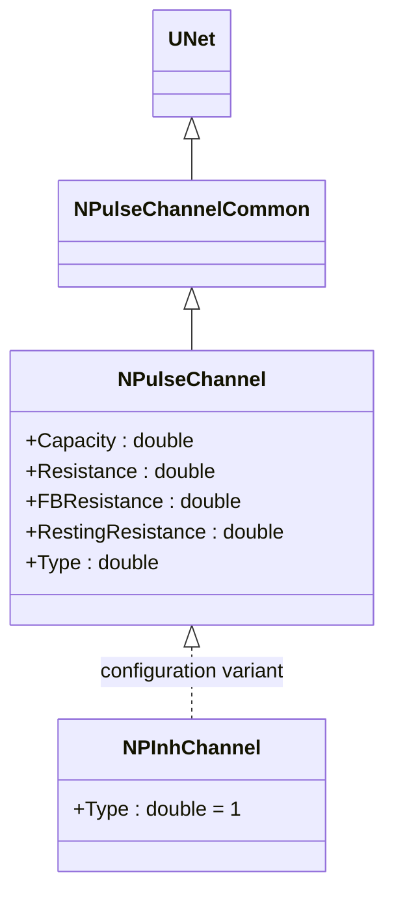
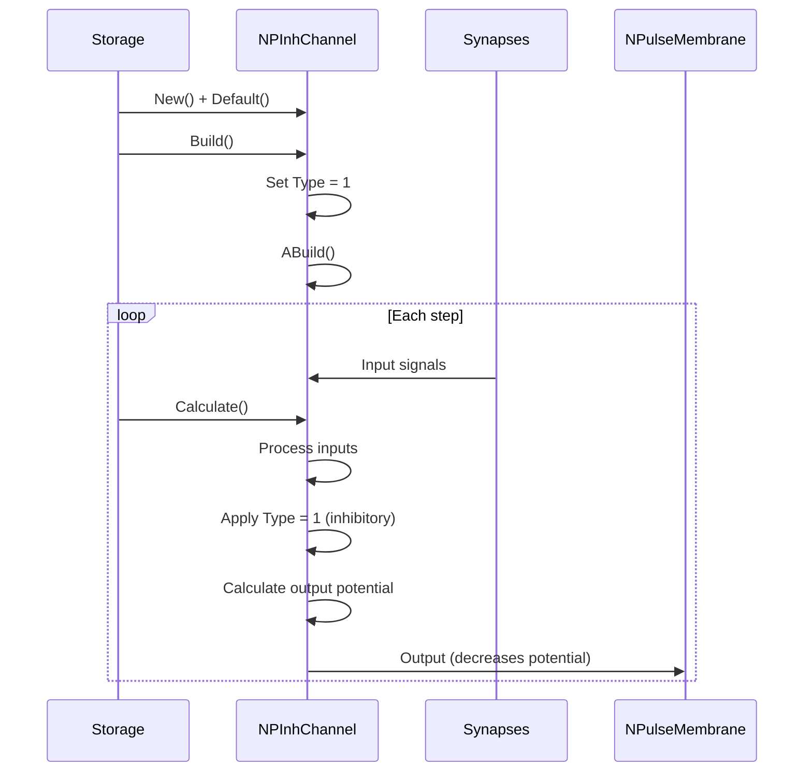
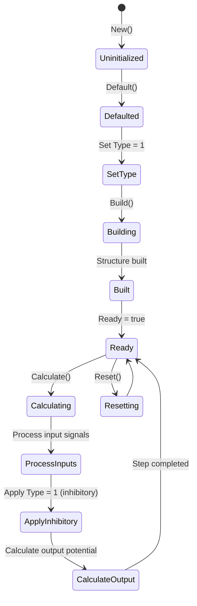
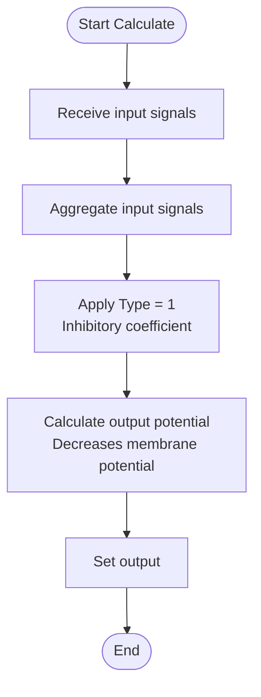
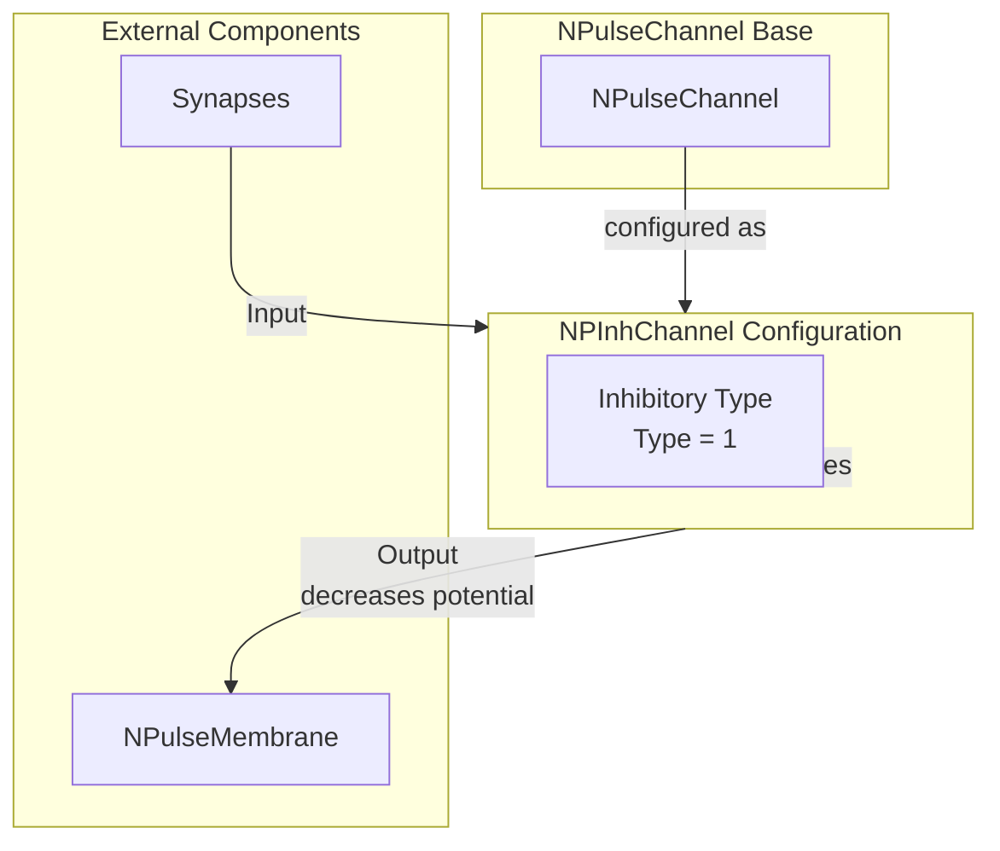

# NPInhChannel — тормозной канал

## RU

### Назначение

**Класс**: `NPInhChannel` — конфигурационный вариант тормозного канала.  
**Аббревиатура**: `Inh` — **Inh**ibitory (тормозной).  
**Регистрация**: `NPulseLibrary.cpp` → `UploadClass("NPInhChannel", ...)`.  
**Storage-инстансы**: `ClassName = "NPInhChannel"` в `Bin/Configs/*/Model_*.xml`.

`NPInhChannel` является конфигурационным вариантом класса `NPulseChannel` с параметрами для тормозного канала. При создании компонента с `ClassName = "NPInhChannel"` создается экземпляр `NPulseChannel` с параметром `Type = 1` (тормозной).

**Использование:** Тормозной канал, упрощенное именование при конфигурации

### UML-диаграмма классов



**Иерархия наследования:**
- `UNet` — базовая сеть Rdk Framework
- `NPulseChannelCommon` — общий импульсный канал
- `NPulseChannel` — базовый импульсный канал
- `NPInhChannel` — конфигурационный вариант тормозного канала

**Параметры конфигурации:**
- `Type = 1` — тормозной канал

### Свойства

`NPInhChannel` использует все свойства базового класса `NPulseChannel` с параметром:
- `Type = 1` (тормозной)

### Методы

`NPInhChannel` использует все методы базового класса `NPulseChannel`.

### Примеры использования

#### Пример 1: Создание канала в коде C++

```cpp
// Создание тормозного канала
auto channel = storage->CreateComponent("NPInhChannel");
channel->SetName("InhChannel");

// Инициализация (использует параметры по умолчанию)
channel->Default();

// Использование
channel->Build();
```

## Источники

См. [Literature-References.md](../Literature-References.md): **[A]**, **4**, **25**, **29**.

### См. также

- [`NPulseChannel`](NPulseChannel.md) — базовый импульсный канал (базовый класс)
- [`NPInhChannelBio`](NPInhChannelBio.md) — тормозной биоинспирированный канал
- [`NPExcChannel`](NPExcChannel.md) — возбуждающий канал
- [Architecture.md](../Architecture.md) — архитектура библиотеки

---

## EN

### Purpose

**Class**: `NPInhChannel` — configuration variant of inhibitory channel.  
**Registration**: `NPulseLibrary.cpp` → `UploadClass("NPInhChannel", ...)`.  
**Instances**: `ClassName = "NPInhChannel"` in `Bin/Configs/*/Model_*.xml`.

`NPInhChannel` is a configuration variant of `NPulseChannel` class with parameters for inhibitory channel. When creating a component with `ClassName = "NPInhChannel"`, an instance of `NPulseChannel` is created with parameter `Type = 1` (inhibitory).

**Usage:** Inhibitory channel, simplified naming in configurations

### UML Class Diagram


### UML Sequence Diagram



### UML State Diagram



### UML Activity Diagram



### UML Component Diagram



### Properties

`NPInhChannel` uses all properties of base class `NPulseChannel` with preset value:

**Parameters:**
- `Type = 1` — inhibitory channel

**Inherited properties:**
- `Capacity` (double) — channel capacity
- `Resistance` (double) — channel resistance
- `FBResistance` (double) — feedback resistance
- `RestingResistance` (double) — resting resistance

### Methods

`NPInhChannel` uses all methods of base class `NPulseChannel`.

### Usage in configurations

`NPInhChannel` is used in experiments with inhibitory channels:

- **Inhibitory channels**: Modeling inhibitory channels in neural networks
- **Simplified naming**: Used for simplified naming in configurations

**Features:**
- Automatically configured as inhibitory channel (`Type = 1`)
- Decreases membrane potential when input signals are present
- Simplified configuration: Channel type is preset

**Typical parameter values:**
- **Type**: 1 (inhibitory channel type)

### References

See [Literature-References.md](../Literature-References.md): **[A]**, **4**, **25**, **29**.

### See Also

- [`NPulseChannel`](NPulseChannel.md) — base spiking channel (base class)
- [`NPInhChannelBio`](NPInhChannelBio.md) — inhibitory bio channel
- [`NPExcChannel`](NPExcChannel.md) — excitatory channel
- [Architecture.md](../Architecture.md) — library architecture
