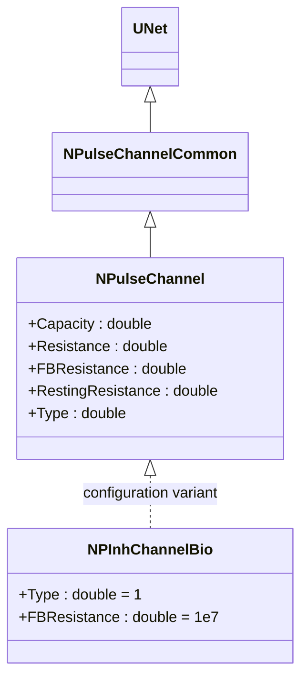
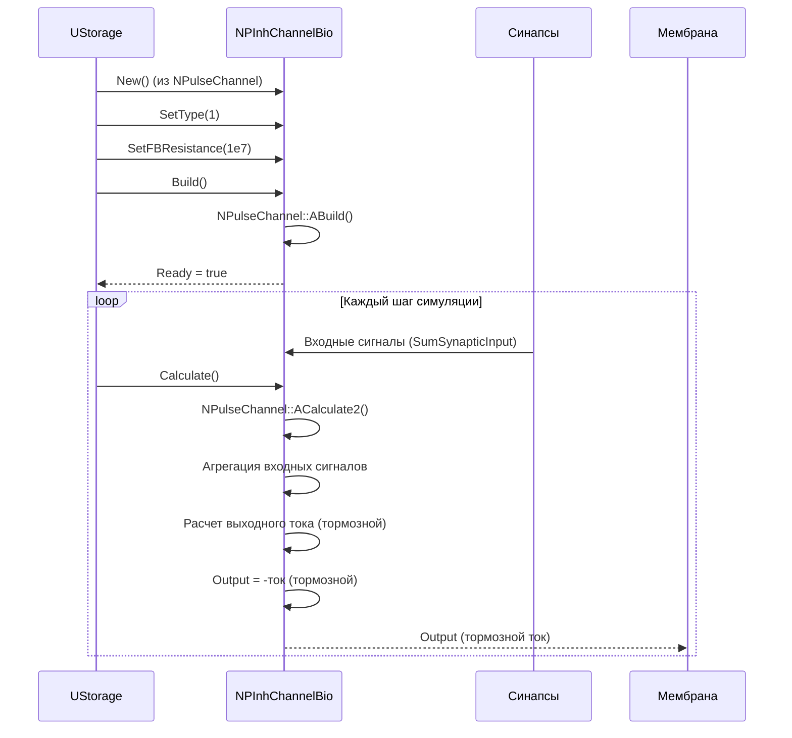
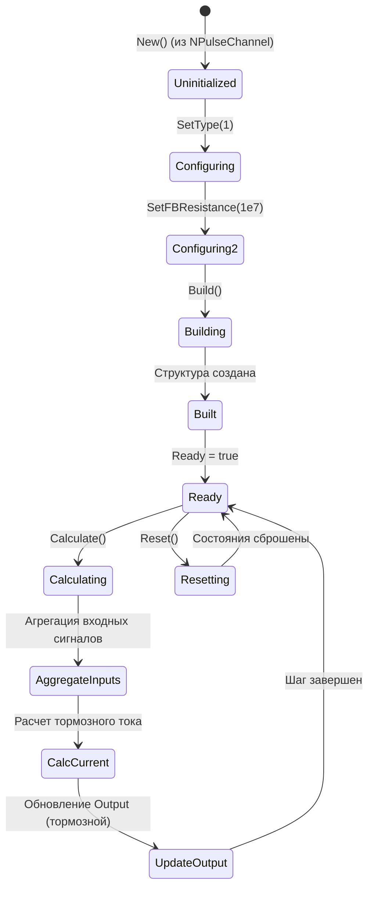
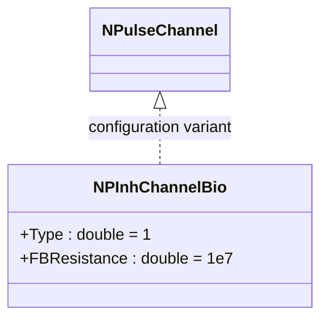
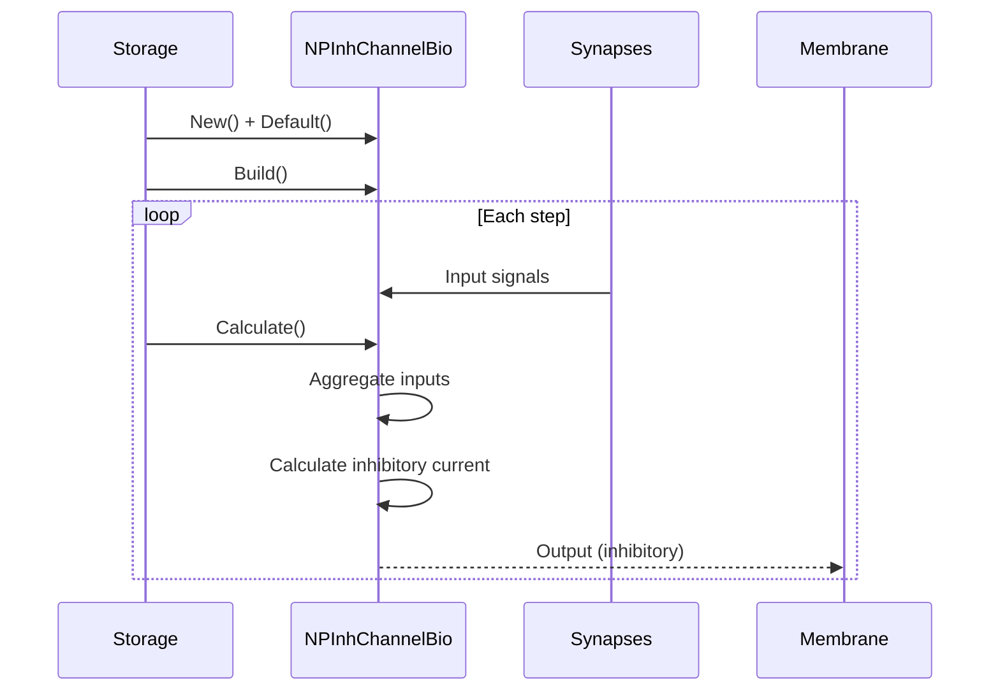
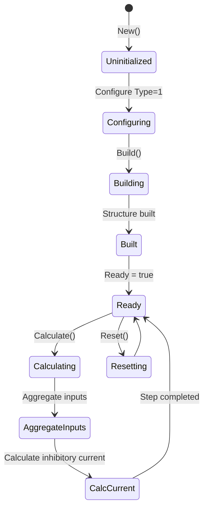

# NPInhChannelBio — тормозной биоинспирированный канал

## RU

### Назначение

**Класс**: `NPInhChannelBio` — конфигурационный вариант тормозного канала с биологическими параметрами.  
**Аббревиатуры**: `Inh` — **Inh**ibitory (тормозной); `Bio` — **Bio**logical (биологическая модель).  
**Регистрация**: `NPulseLibrary.cpp` → `UploadClass("NPInhChannelBio", ...)`.  
**Storage-инстансы**: `ClassName = "NPInhChannelBio"` в `Bin/Configs/*/Model_*.xml`.

`NPInhChannelBio` является конфигурационным вариантом класса `NPulseChannel` с параметрами, оптимизированными для биологических моделей. При создании компонента с `ClassName = "NPInhChannelBio"` создается экземпляр `NPulseChannel` с параметрами: `Type = 1` (тормозной), `FBResistance = 1e7` (10 МОм).

**Использование:** Тормозной канал для биологических моделей, оптимизированные параметры

### UML-диаграмма классов



**Иерархия наследования:**
- `UNet` — базовая сеть Rdk Framework
- `NPulseChannelCommon` — общий импульсный канал
- `NPulseChannel` — базовый импульсный канал
- `NPInhChannelBio` — конфигурационный вариант для биологических моделей

**Параметры конфигурации:**
- `Type = 1` — тормозной канал
- `FBResistance = 1e7` — сопротивление обратной связи (10 МОм)

### UML-диаграмма последовательности



**Жизненный цикл:**
1. **Создание**: `NPInhChannelBio` создается из `NPulseChannel` с настройкой параметров
2. **Настройка**: Устанавливается `Type = 1` (тормозной), `FBResistance = 1e7`
3. **Расчет**: Агрегация входных сигналов, расчет тормозного тока
4. **Выход**: Генерация тормозного тока для мембраны

### UML-диаграмма состояний



**Состояния:**
- **Uninitialized** — создан, но не инициализирован
- **Configuring** — настройка параметров (Type = 1)
- **Configuring2** — настройка FBResistance
- **Building** — выполняется сборка
- **Built** — структура канала построена
- **Ready** — готов к выполнению расчетов
- **Calculating** — выполняется расчет канала
- **AggregateInputs** — агрегация входных сигналов
- **CalcCurrent** — расчет тормозного тока
- **UpdateOutput** — обновление выходного сигнала (тормозной)
- **Resetting** — выполняется сброс состояний

### UML-диаграмма активности

```mermaid
flowchart TD
    Start([Start Calculate]) --> CallBase[NPulseChannel::ACalculate2]
    CallBase --> AggregateInputs[Агрегация SumSynapticInput]
    AggregateInputs --> CalcSum[Расчет суммы входных сигналов]
    CalcSum --> CalcCurrent[Расчет выходного тока]
    CalcCurrent --> ApplyType[Применение Type = 1 (тормозной)]
    ApplyType --> SetOutput[Output = -ток (тормозной)]
    SetOutput --> End([End])
```

**Алгоритм расчета:**
1. Вызов базового расчета (`NPulseChannel::ACalculate2()`)
2. Агрегация входных сигналов от синапсов
3. Расчет выходного тока на основе агрегированных сигналов
4. Применение типа канала (Type = 1, тормозной): выходной ток отрицательный
5. Обновление выходного сигнала

### UML-диаграмма компонентов

```mermaid
graph TB
    subgraph NPulseChannel["NPulseChannel Base"]
        BaseChannel[NPulseChannel]
    end
    
    subgraph NPInhChannelBio["NPInhChannelBio Configuration"]
        InhChannel[Тормозной канал]
        BioParams[Биологические параметры]
    end
    
    subgraph External["Внешние компоненты"]
        Synapses[Синапсы]
        Membrane[Мембрана]
    end
    
    BaseChannel -->|конфигурируется как| NPInhChannelBio
    NPInhChannelBio -->|реализует| InhChannel
    NPInhChannelBio -->|использует| BioParams
    Synapses -->|SumSynapticInput| NPInhChannelBio
    NPInhChannelBio -->|Output (тормозной ток)| Membrane
```

**Зависимости:**
- **Базовый класс**: `NPulseChannel` (конфигурационный вариант)
- **Внутренние компоненты**: тормозная логика, биологические параметры
- **Внешние компоненты**: синапсы (источники входных сигналов), мембрана (получатель тормозного тока)

### Свойства

`NPInhChannelBio` использует все свойства базового класса `NPulseChannel` с параметрами:
- `Type = 1` (тормозной)
- `FBResistance = 1e7` (10 МОм)
- Остальные параметры по умолчанию из `NPulseChannel`

### Методы

`NPInhChannelBio` использует все методы базового класса `NPulseChannel`.

### Примеры использования

#### Пример 1: Создание канала в коде C++

```cpp
// Создание тормозного биоинспирированного канала
auto channel = storage->CreateComponent("NPInhChannelBio");
channel->SetName("InhChannelBio");

// Инициализация (использует параметры по умолчанию)
channel->Default();

// Использование
channel->Build();
```

### Использование в конфигурациях

`NPInhChannelBio` используется в экспериментах с биологически реалистичными тормозными каналами:

- **Биоинспирированные модели**: `Bin/Configs/!OldConfigs/*/Model_*.xml` (где требуется биологическая реалистичность тормозных каналов)

**Типичные значения параметров:**
- **Type**: 1 (тормозной канал)
- **FBResistance**: 1e7 (10 МОм, сопротивление обратной связи)
- **Resistance**: по умолчанию из `NPulseChannel`
- **Capacity**: по умолчанию из `NPulseChannel`

## Источники

См. [Literature-References.md](../Literature-References.md): **26**, **29**, **30**.

### См. также

- [`NPulseChannel`](NPulseChannel.md) — базовый импульсный канал (базовый класс)
- [`NPInhChannelBio2`](NPInhChannelBio2.md) — тормозной биоинспирированный канал (версия 2)
- [`NPExcChannelBio`](NPExcChannelBio.md) — возбуждающий биоинспирированный канал
- [`NPInhChannel`](NPInhChannel.md) — тормозной канал
- [Architecture.md](../Architecture.md) — архитектура библиотеки

---

## EN

### Purpose

**Class**: `NPInhChannelBio` — configuration variant of inhibitory channel with biological parameters.  
**Registration**: `NPulseLibrary.cpp` → `UploadClass("NPInhChannelBio", ...)`.  
**Instances**: `ClassName = "NPInhChannelBio"` in `Bin/Configs/*/Model_*.xml`.

`NPInhChannelBio` is a configuration variant of `NPulseChannel` class with parameters optimized for biological models. When creating a component with `ClassName = "NPInhChannelBio"`, an instance of `NPulseChannel` is created with parameters: `Type = 1` (inhibitory), `FBResistance = 1e7` (10 MOhm).

**Usage:** Inhibitory channel for biological models, optimized parameters

### UML Class Diagram



### UML Sequence Diagram



### UML State Diagram



### UML Activity Diagram

```mermaid
flowchart TD
    Start([Start Calculate]) --> AggregateInputs[Aggregate input signals]
    AggregateInputs --> CalcSum[Calculate sum]
    CalcSum --> CalcCurrent[Calculate inhibitory current]
    CalcCurrent --> ApplyType[Apply Type=1 (inhibitory)]
    ApplyType --> SetOutput[Output = -current]
    SetOutput --> End([End])
```

### References

See [Literature-References.md](../Literature-References.md): **26**, **29**, **30**.

### See Also

- [`NPulseChannel`](NPulseChannel.md) — base spiking channel (base class)
- [`NPInhChannelBio2`](NPInhChannelBio2.md) — inhibitory bio channel (version 2)
- [`NPExcChannelBio`](NPExcChannelBio.md) — excitatory bio channel
- [`NPInhChannel`](NPInhChannel.md) — inhibitory channel
- [Architecture.md](../Architecture.md) — library architecture
