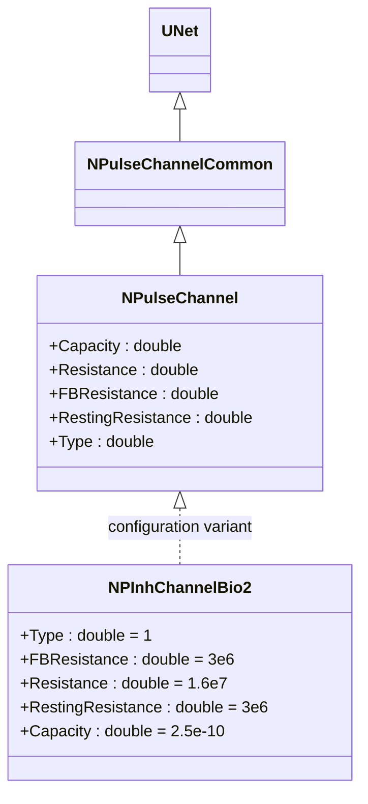
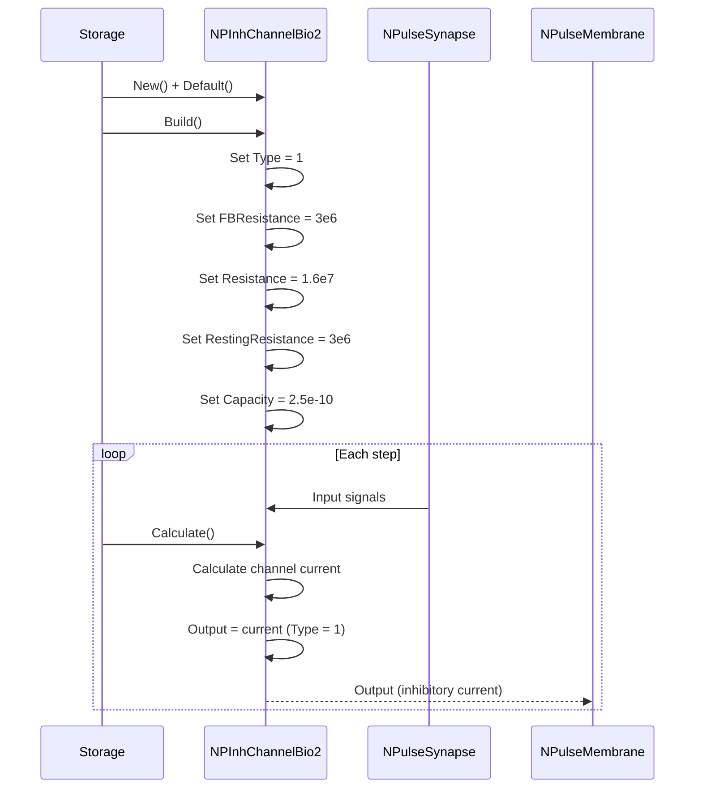
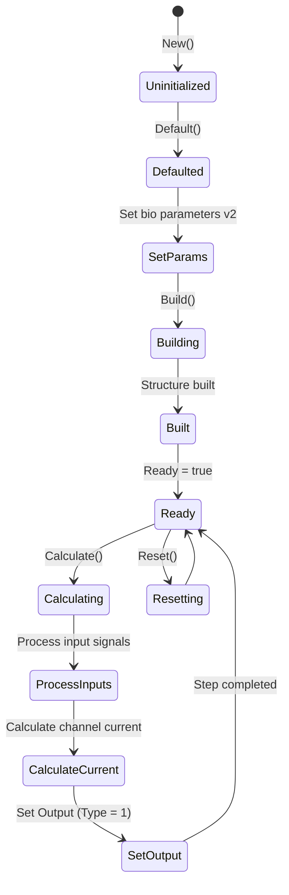
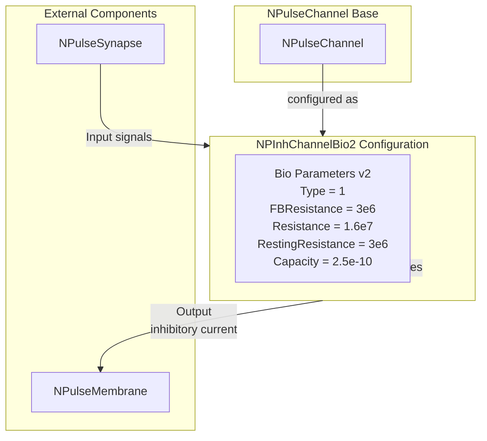

# NPInhChannelBio2 — тормозной биоинспирированный канал (версия 2)

## RU

### Назначение

**Класс**: `NPInhChannelBio2` — конфигурационный вариант тормозного канала с биологическими параметрами (версия 2).  
**Аббревиатуры**: `Inh` — **Inh**ibitory (тормозной); `Bio` — **Bio**logical (биологическая модель).  
**Регистрация**: `NPulseLibrary.cpp` → `UploadClass("NPInhChannelBio2", ...)`.  
**Storage-инстансы**: `ClassName = "NPInhChannelBio2"` в `Bin/Configs/*/Model_*.xml`.

`NPInhChannelBio2` является конфигурационным вариантом класса `NPulseChannel` с параметрами, оптимизированными для биологических моделей (версия 2). При создании компонента с `ClassName = "NPInhChannelBio2"` создается экземпляр `NPulseChannel` с параметрами: `Type = 1` (тормозной), `FBResistance = 3e6` (3 МОм), `Resistance = 1.6e7` (16 МОм), `RestingResistance = 3e6` (3 МОм), `Capacity = 2.5e-10` (250 пФ).

**Использование:** Тормозной канал для биологических моделей (версия 2), улучшенные параметры

### UML-диаграмма классов



**Иерархия наследования:**
- `UNet` — базовая сеть Rdk Framework
- `NPulseChannelCommon` — общий импульсный канал
- `NPulseChannel` — базовый импульсный канал
- `NPInhChannelBio2` — конфигурационный вариант для биологических моделей (версия 2)

**Параметры конфигурации:**
- `Type = 1` — тормозной канал
- `FBResistance = 3e6` — сопротивление обратной связи (3 МОм)
- `Resistance = 1.6e7` — сопротивление мембраны (16 МОм)
- `RestingResistance = 3e6` — сопротивление покоя (3 МОм)
- `Capacity = 2.5e-10` — емкость мембраны (250 пФ)

### Свойства

`NPInhChannelBio2` использует все свойства базового класса `NPulseChannel` с параметрами:
- `Type = 1` (тормозной)
- `FBResistance = 3e6` (3 МОм)
- `Resistance = 1.6e7` (16 МОм)
- `RestingResistance = 3e6` (3 МОм)
- `Capacity = 2.5e-10` (250 пФ)

### Методы

`NPInhChannelBio2` использует все методы базового класса `NPulseChannel`.

### Примеры использования

#### Пример 1: Создание канала в коде C++

```cpp
// Создание тормозного биоинспирированного канала (версия 2)
auto channel = storage->CreateComponent("NPInhChannelBio2");
channel->SetName("InhChannelBio2");

// Инициализация (использует параметры по умолчанию)
channel->Default();

// Использование
channel->Build();
```

## Источники

См. [Literature-References.md](../Literature-References.md): **26**, **29**, **30**.

### См. также

- [`NPulseChannel`](NPulseChannel.md) — базовый импульсный канал (базовый класс)
- [`NPInhChannelBio`](NPInhChannelBio.md) — тормозной биоинспирированный канал (версия 1)
- [`NPExcChannelBio2`](NPExcChannelBio2.md) — возбуждающий биоинспирированный канал (версия 2)
- [Architecture.md](../Architecture.md) — архитектура библиотеки

---

## EN

### Purpose

**Class**: `NPInhChannelBio2` — configuration variant of inhibitory channel with biological parameters (version 2).  
**Registration**: `NPulseLibrary.cpp` → `UploadClass("NPInhChannelBio2", ...)`.  
**Instances**: `ClassName = "NPInhChannelBio2"` in `Bin/Configs/*/Model_*.xml`.

`NPInhChannelBio2` is a configuration variant of `NPulseChannel` class with parameters optimized for biological models (version 2). When creating a component with `ClassName = "NPInhChannelBio2"`, an instance of `NPulseChannel` is created with parameters: `Type = 1` (inhibitory), `FBResistance = 3e6` (3 MOhm), `Resistance = 1.6e7` (16 MOhm), `RestingResistance = 3e6` (3 MOhm), `Capacity = 2.5e-10` (250 pF).

**Usage:** Inhibitory channel for biological models (version 2), improved parameters

### UML Class Diagram


### UML Sequence Diagram



### UML State Diagram



### UML Activity Diagram

```mermaid
flowchart TD
    Start([Start Calculate]) --> ProcessInputs[Process input signals<br/>from synapses]
    ProcessInputs --> CalculateCurrent[Calculate channel current<br/>Type = 1 (inhibitory)]
    CalculateCurrent --> ApplyResistance[Apply Resistance = 1.6e7<br/>FBResistance = 3e6<br/>RestingResistance = 3e6]
    ApplyResistance --> ApplyCapacity[Apply Capacity = 2.5e-10]
    ApplyCapacity --> SetOutput[Set Output<br/>inhibitory current]
    SetOutput --> End([End])
```

### UML Component Diagram



### Properties

`NPInhChannelBio2` uses all properties of base class `NPulseChannel` with preset values:

**Configuration parameters:**
- `Type = 1` — inhibitory channel type
- `FBResistance = 3e6` (3 MOhm) — feedback resistance
- `Resistance = 1.6e7` (16 MOhm) — channel resistance
- `RestingResistance = 3e6` (3 MOhm) — resting resistance
- `Capacity = 2.5e-10` (250 pF) — channel capacity

**Inherited properties:**
- All properties from `NPulseChannel` with bio-optimized values (version 2)

### Methods

`NPInhChannelBio2` uses all methods of base class `NPulseChannel`.

### Usage in configurations

`NPInhChannelBio2` is used in bio-inspired neuron experiments (version 2):

- **Bio-inspired models (v2)**: `Bin/Configs/*/Model_*.xml` (where improved bio inhibitory channels are required)
- **Biological realism**: Experiments with improved biologically realistic channel parameters

**Features:**
- Automatically configured with bio-optimized parameters (version 2)
- Improved parameters: Version 2 with improved biological parameters
- Inhibitory channel: Type = 1 for inhibitory currents
- Bio-optimized: Parameters optimized for bio-inspired models

**Typical parameter values:**
- **Type**: 1 (inhibitory channel)
- **FBResistance**: 3e6 (3 MOhm)
- **Resistance**: 1.6e7 (16 MOhm)
- **RestingResistance**: 3e6 (3 MOhm)
- **Capacity**: 2.5e-10 (250 pF)

### References

See [Literature-References.md](../Literature-References.md): **26**, **29**, **30**.

### See Also

- [`NPulseChannel`](NPulseChannel.md) — base spiking channel (base class)
- [`NPInhChannelBio`](NPInhChannelBio.md) — inhibitory bio channel (version 1)
- [`NPExcChannelBio2`](NPExcChannelBio2.md) — excitatory bio channel (version 2)
- [Architecture.md](../Architecture.md) — library architecture
