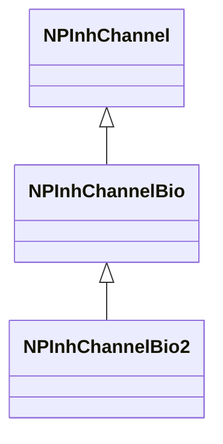
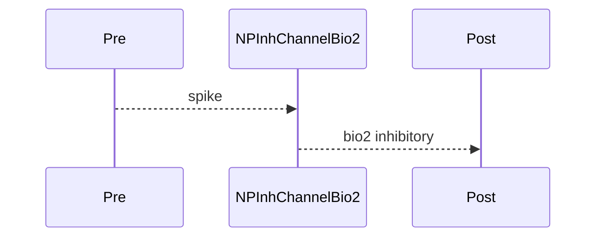

## NPInhChannelBio2 — тормозной канал (био2)

**Класс**: `NPInhChannelBio2` — ингибирующий канал с расширенными био-параметрами (вариант 2).  
**Регистрация**: `NPulseLibrary.cpp` → `UploadClass("NPInhChannelBio2", ...)`.  
**Storage**: `ClassName = "NPInhChannelBio2"`.

### Lifecycle
- **ADefault**: био2-параметры.
- **ABuild**: подключение pre/post.
- **AReset**: сброс.
- **ACalculate**: передача с био2-моделью.

### I/O
- Вход: импульс от pre.
- Выход: био2-ингибирующий сигнал.



Пояснение: диаграмма классов показывает место компонента в иерархии и ключевые связи.



Пояснение: диаграмма последовательности показывает типовой сценарий взаимодействия и порядок вызовов.


Пояснение: блок-схема показывает поток данных/сигналов (входы → компонент → выходы).

### Config snippet

```ini
[Component]
ClassName = NPInhChannelBio2
Name = InhBio2_1
```

---

## NPInhChannelBio2 — inhibitory bio2 channel (EN)

Inhibitory channel with extended bio parameters (variant 2).


Description: this class diagram shows the component position in the type hierarchy and key relations.


Description: this sequence diagram shows a typical runtime interaction and call order.


Description: this flowchart shows the data/signal flow (inputs → component → outputs).
