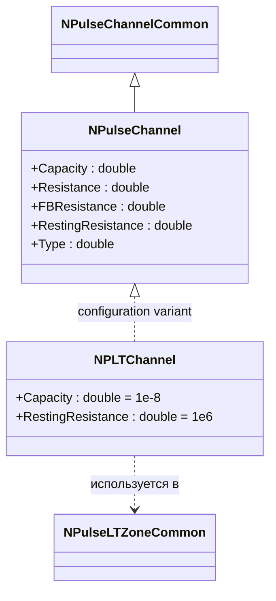
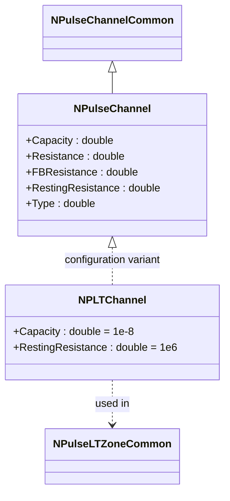
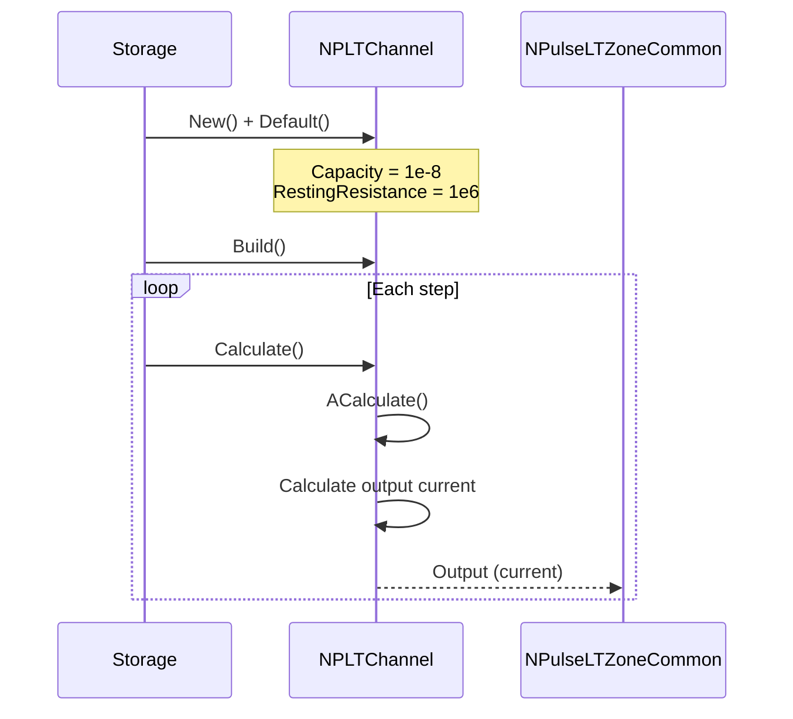
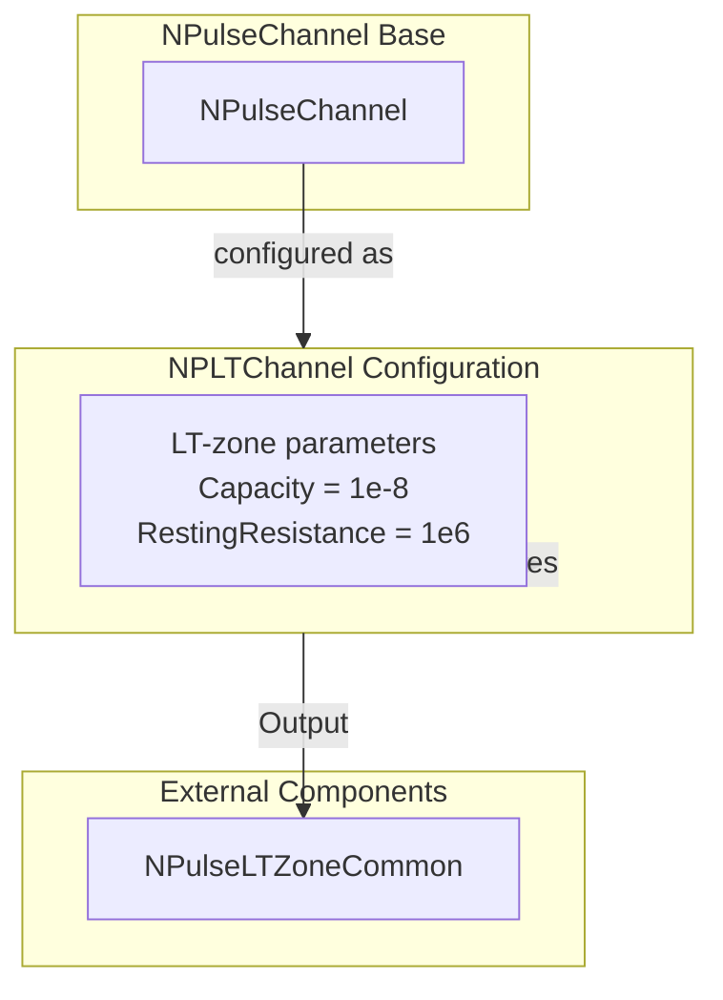

# NPLTChannel — канал низкопороговой зоны

## RU

### Назначение

**Класс**: `NPLTChannel` — конфигурационный вариант импульсного канала с параметрами для низкопороговой зоны (LT-зоны).  
**Аббревиатура**: `LT` — **L**ow **T**hreshold (низкопороговая зона).  
**Регистрация**: `NPulseLibrary.cpp` → `UploadClass("NPLTChannel", ...)`.  
**Storage-инстансы**: `ClassName = "NPLTChannel"` в `Bin/Configs/*/Model_*.xml`.

`NPLTChannel` является конфигурационным вариантом базового класса `NPulseChannel` с предустановленными параметрами для низкопороговой зоны. Создается из `NPulseChannel` с настройками:
- `Capacity = 1e-8` (10 нФ) — увеличенная емкость для LT-зоны
- `RestingResistance = 1e6` (1 МОм) — уменьшенное сопротивление покоя для LT-зоны

Эти параметры оптимизированы для работы в составе низкопороговых зон нейронов, которые отвечают за генерацию спайков при достижении порогового значения потенциала.

**Использование:** Моделирование каналов низкопороговых зон, эксперименты с пороговыми механизмами генерации спайков

### UML-диаграмма классов



**Иерархия наследования:**
- `NPulseChannelCommon` — общий импульсный канал
- `NPulseChannel` — базовый импульсный канал
- `NPLTChannel` — конфигурационный вариант для LT-зоны

**Связи:**
- Используется в `NPulseLTZoneCommon` и производных LT-зонах

### Свойства

`NPLTChannel` использует все свойства базового класса `NPulseChannel` с предустановленными значениями:

**Параметры:**
- `Capacity = 1e-8` (10 нФ) — увеличенная емкость для LT-зоны
- `RestingResistance = 1e6` (1 МОм) — уменьшенное сопротивление покоя для LT-зоны

**Остальные параметры по умолчанию:**
- `Resistance = 1.0e7` (10 МОм)
- `FBResistance = 1.0e8` (100 МОм)
- `Type = 0` (нейтральный)

**Особенности:**
- Увеличенная емкость обеспечивает более медленную динамику потенциала
- Уменьшенное сопротивление покоя обеспечивает более быструю реакцию на изменения потенциала
- Используется в составе LT-зон для пороговой генерации спайков

### Методы

`NPLTChannel` использует все методы базового класса `NPulseChannel`.

### Примеры использования

#### Пример 1: Создание канала в коде C++

```cpp
// Создание канала LT-зоны
auto channel = storage->CreateComponent("NPLTChannel");
channel->SetName("LTChannel");

// Инициализация (использует параметры для LT-зоны)
channel->Default();

// Использование
channel->Build();
```

#### Пример 2: Конфигурация XML

```xml
<Channel1 Class="NPLTChannel">
    <Parameters>
        <Type>0</Type>
        <Capacity>1.0e-8</Capacity>
        <Resistance>1.0e7</Resistance>
        <FBResistance>1.0e8</FBResistance>
        <RestingResistance>1.0e6</RestingResistance>
    </Parameters>
</Channel1>
```

### Использование в конфигурациях

`NPLTChannel` используется в экспериментах с низкопороговыми зонами:

- Моделирование каналов низкопороговых зон
- Эксперименты с пороговыми механизмами генерации спайков
- Изучение динамики потенциала в LT-зонах

**Особенности:**
- Параметры оптимизированы для работы в составе LT-зон
- Увеличенная емкость обеспечивает более медленную динамику
- Уменьшенное сопротивление покоя обеспечивает более быструю реакцию

## Источники

См. [Literature-References.md](../Literature-References.md): **[A]**, **4**, **25**, **29**.

### См. также

- [`NPulseChannel`](NPulseChannel.md) — базовый импульсный канал
- [`NPulseLTZoneCommon`](NPulseLTZoneCommon.md) — общая импульсная LT-зона
- [`NPLTExcChannel`](NPLTExcChannel.md) — возбуждающий LT-канал
- [`NPLTInhChannel`](NPLTInhChannel.md) — тормозной LT-канал
- [`NPLTSynChannel`](NPLTSynChannel.md) — синаптический LT-канал
- [Architecture.md](../Architecture.md) — архитектура библиотеки
- [Scientific-Background.md](../Scientific-Background.md) — научный фон (низкопороговые зоны, генерация спайков)

---

## EN

### Purpose

**Class**: `NPLTChannel` — configuration variant of spiking channel with parameters for low-threshold zone (LT-zone).  
**Registration**: `NPulseLibrary.cpp` → `UploadClass("NPLTChannel", ...)`.  
**Instances**: `ClassName = "NPLTChannel"` in `Bin/Configs/*/Model_*.xml`.

`NPLTChannel` is a configuration variant of the base class `NPulseChannel` with preset parameters for low-threshold zone. Created from `NPulseChannel` with settings:
- `Capacity = 1e-8` (10 nF) — increased capacitance for LT-zone
- `RestingResistance = 1e6` (1 MΩ) — decreased resting resistance for LT-zone

These parameters are optimized for work in low-threshold zones of neurons, which are responsible for spike generation when threshold potential value is reached.

**Usage:** Modeling low-threshold zone channels, experiments with threshold spike generation mechanisms

### UML Class Diagram



### UML Sequence Diagram



### UML State Diagram

```mermaid
stateDiagram-v2
    [*] --> Uninitialized: New()
    Uninitialized --> Defaulted: Default()
    Note over Defaulted: Capacity = 1e-8<br/>RestingResistance = 1e6
    Defaulted --> Built: Build()
    Built --> Ready: Ready = true
    Ready --> Calculating: Calculate()
    Calculating --> CalcCurrent: Calculate current
    CalcCurrent --> Ready: Step completed
    Ready --> Resetting: Reset()
    Resetting --> Ready
```

### UML Activity Diagram

```mermaid
flowchart TD
    Start([Start Calculate]) --> AggregateInputs[Aggregate inputs]
    AggregateInputs --> CalcCurrent[Calculate output current]
    Note over CalcCurrent: Capacity = 1e-8<br/>RestingResistance = 1e6
    CalcCurrent --> UpdatePotential[Update potential]
    UpdatePotential --> End([End])
```

### UML Component Diagram



### Properties

`NPLTChannel` uses all properties of base class `NPulseChannel` with preset values:

**Parameters:**
- `Capacity = 1e-8` (10 nF) — increased capacitance for LT-zone
- `RestingResistance = 1e6` (1 MΩ) — decreased resting resistance for LT-zone

**Other default parameters:**
- `Resistance = 1.0e7` (10 MΩ)
- `FBResistance = 1.0e8` (100 MΩ)
- `Type = 0` (neutral)

**Features:**
- Increased capacitance provides slower potential dynamics
- Decreased resting resistance provides faster response to potential changes
- Used in LT-zones for threshold spike generation

### Methods

`NPLTChannel` uses all methods of base class `NPulseChannel`.

### Usage in configurations

`NPLTChannel` is used in experiments with low-threshold zone channels:

- **LT-zone channels**: Modeling channels in low-threshold zones
- **Threshold mechanisms**: Experiments with threshold spike generation mechanisms

**Features:**
- Automatically configured with LT-zone optimized parameters
- Used in LT-zones for threshold spike generation
- Optimized for low-threshold zone dynamics

**Typical parameter values:**
- **Capacity**: 1e-8 (10 nF) — increased for LT-zone
- **RestingResistance**: 1e6 (1 MΩ) — decreased for LT-zone

### References

See [Literature-References.md](../Literature-References.md): **[A]**, **4**, **25**, **29**.

### See Also

- [`NPulseChannel`](NPulseChannel.md) — base spiking channel
- [`NPulseLTZoneCommon`](NPulseLTZoneCommon.md) — common spiking LT-zone
- [`NPLTExcChannel`](NPLTExcChannel.md) — excitatory LT-channel
- [`NPLTInhChannel`](NPLTInhChannel.md) — inhibitory LT-channel
- [`NPLTSynChannel`](NPLTSynChannel.md) — synaptic LT-channel
- [Architecture.md](../Architecture.md) — library architecture

