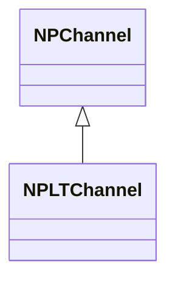
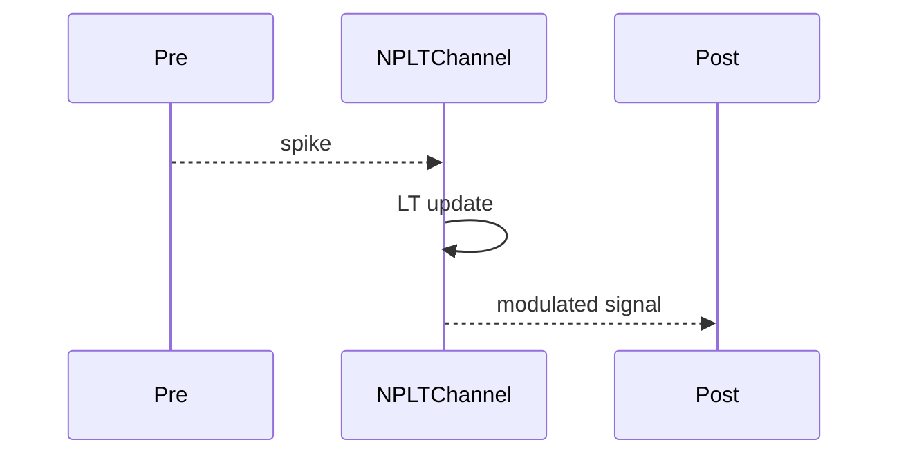
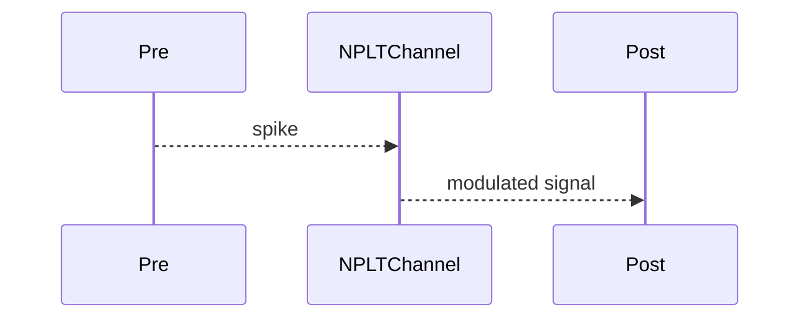

## NPLTChannel — LT-канал

**Класс**: `NPLTChannel` — канал с долговременной пластичностью (LT).  
**Регистрация**: `NPulseLibrary.cpp` → `UploadClass("NPLTChannel", ...)`.  
**Storage**: `ClassName = "NPLTChannel"`.

### Lifecycle
- **ADefault**: параметры LT.
- **ABuild**: подключение pre/post.
- **AReset**: сброс LT-состояния.
- **ACalculate**: передача + обновление LT.

### I/O
- Вход: импульс от pre.
- Выход: модифицированный сигнал (LT-эффект).



Пояснение: диаграмма классов показывает место компонента в иерархии и ключевые связи.



Пояснение: диаграмма последовательности показывает типовой сценарий взаимодействия и порядок вызовов.


Пояснение: блок-схема показывает поток данных/сигналов (входы → компонент → выходы).

### Config snippet

```ini
[Component]
ClassName = NPLTChannel
Name = LTCh1
```

---

## NPLTChannel — long-term channel (EN)

Channel with long-term plasticity modulation.


Description: this class diagram shows the component position in the type hierarchy and key relations.



Description: this sequence diagram shows a typical runtime interaction and call order.


Description: this flowchart shows the data/signal flow (inputs → component → outputs).
