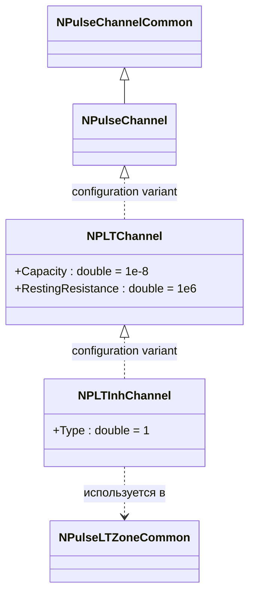
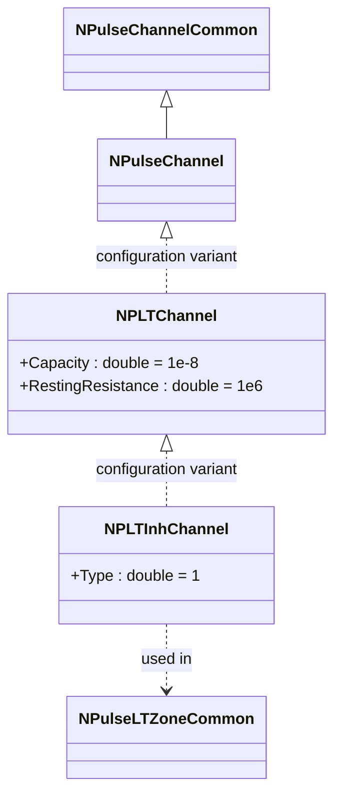
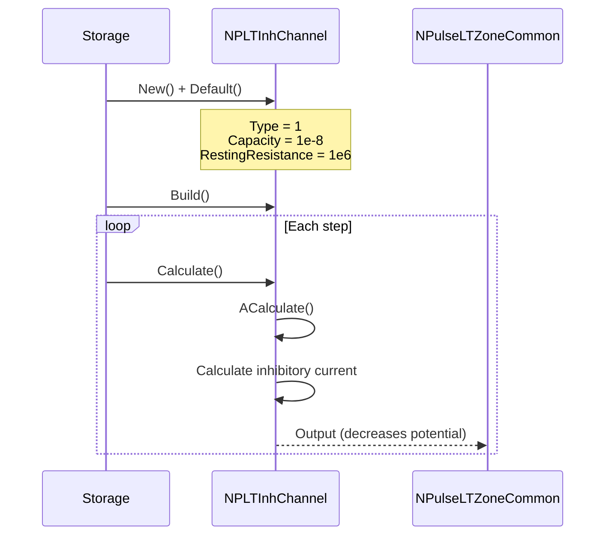
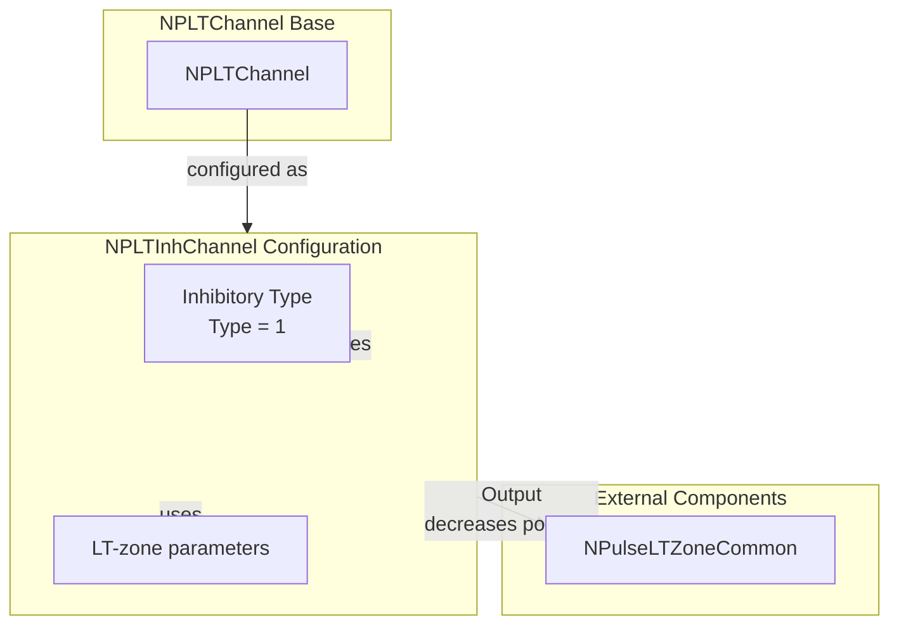

# NPLTInhChannel — тормозной LT-канал

## RU

### Назначение

**Класс**: `NPLTInhChannel` — конфигурационный вариант LT-канала с типом тормозного канала.  
**Аббревиатуры**: `LT` — **L**ow **T**hreshold (низкопороговая зона); `Inh` — **Inh**ibitory (тормозной).  
**Регистрация**: `NPulseLibrary.cpp` → `UploadClass("NPLTInhChannel", ...)`.  
**Storage-инстансы**: `ClassName = "NPLTInhChannel"` в `Bin/Configs/*/Model_*.xml`.

`NPLTInhChannel` является конфигурационным вариантом базового класса `NPLTChannel` с предустановленным типом тормозного канала. Создается из `NPLTChannel` с настройкой:
- `Type = 1` — тормозной канал

Тормозной LT-канал уменьшает потенциал LT-зоны при наличии входных сигналов, препятствуя генерации спайков.

**Использование:** Моделирование тормозных LT-каналов, эксперименты с тормозной LT-пластичностью

### UML-диаграмма классов



**Иерархия наследования:**
- `NPulseChannelCommon` — общий импульсный канал
- `NPulseChannel` — базовый импульсный канал
- `NPLTChannel` — конфигурационный вариант для LT-зоны
- `NPLTInhChannel` — конфигурационный вариант для тормозного LT-канала

### Свойства

`NPLTInhChannel` использует все свойства базового класса `NPLTChannel` с предустановленным значением:

**Параметры:**
- `Type = 1` — тормозной канал
- `Capacity = 1e-8` (10 нФ) — увеличенная емкость для LT-зоны
- `RestingResistance = 1e6` (1 МОм) — сопротивление покоя для LT-зоны

**Остальные параметры по умолчанию:**
- `Resistance = 1.0e7` (10 МОм)
- `FBResistance = 1.0e8` (100 МОм)

### Методы

`NPLTInhChannel` использует все методы базового класса `NPLTChannel`.

### Примеры использования

#### Пример 1: Создание канала в коде C++

```cpp
// Создание тормозного LT-канала
auto channel = storage->CreateComponent("NPLTInhChannel");
channel->SetName("LTInhChannel");

// Инициализация (использует Type = 1, Capacity = 1e-8, RestingResistance = 1e6)
channel->Default();

// Использование
channel->Build();
```

#### Пример 2: Конфигурация XML

```xml
<Channel1 Class="NPLTInhChannel">
    <Parameters>
        <Type>1</Type>
        <Capacity>1e-8</Capacity>
        <Resistance>1.0e7</Resistance>
        <FBResistance>1.0e8</FBResistance>
        <RestingResistance>1e6</RestingResistance>
    </Parameters>
</Channel1>
```

### Использование в конфигурациях

`NPLTInhChannel` используется в экспериментах с тормозными LT-каналами:

- Моделирование тормозных LT-каналов
- Эксперименты с тормозной LT-пластичностью
- Изучение подавления генерации спайков в LT-зонах

**Особенности:**
- Автоматически настроен как тормозной канал (`Type = 1`)
- Уменьшает потенциал LT-зоны при наличии входных сигналов
- Использует параметры, оптимизированные для LT-зон

## Источники

См. [Literature-References.md](../Literature-References.md): **[A]**, **4**, **25**, **29**.

### См. также

- [`NPLTChannel`](NPLTChannel.md) — LT-канал (базовый класс)
- [`NPLTExcChannel`](NPLTExcChannel.md) — возбуждающий LT-канал
- [`NPLTSynChannel`](NPLTSynChannel.md) — LT-синаптический канал
- [`NPulseLTZoneCommon`](NPulseLTZoneCommon.md) — общая импульсная LT-зона
- [`NPulseChannel`](NPulseChannel.md) — базовый импульсный канал
- [Architecture.md](../Architecture.md) — архитектура библиотеки

---

## EN

### Purpose

**Class**: `NPLTInhChannel` — configuration variant of LT-channel with inhibitory channel type.  
**Registration**: `NPulseLibrary.cpp` → `UploadClass("NPLTInhChannel", ...)`.  
**Instances**: `ClassName = "NPLTInhChannel"` in `Bin/Configs/*/Model_*.xml`.

`NPLTInhChannel` is a configuration variant of the base class `NPLTChannel` with preset inhibitory channel type. Created from `NPLTChannel` with setting:
- `Type = 1` — inhibitory channel

Inhibitory LT-channel decreases LT-zone potential when input signals are present, preventing spike generation.

**Usage:** Modeling inhibitory LT-channels, experiments with inhibitory LT plasticity

### UML Class Diagram



### UML Sequence Diagram



### UML State Diagram

```mermaid
stateDiagram-v2
    [*] --> Uninitialized: New()
    Uninitialized --> Defaulted: Default()
    Note over Defaulted: Type = 1<br/>Capacity = 1e-8<br/>RestingResistance = 1e6
    Defaulted --> Built: Build()
    Built --> Ready: Ready = true
    Ready --> Calculating: Calculate()
    Calculating --> CalcInhCurrent: Calculate inhibitory current
    CalcInhCurrent --> Ready: Step completed
    Ready --> Resetting: Reset()
    Resetting --> Ready
```

### UML Activity Diagram

```mermaid
flowchart TD
    Start([Start Calculate]) --> AggregateInputs[Aggregate inputs]
    AggregateInputs --> CalcInhCurrent[Calculate inhibitory current]
    Note over CalcInhCurrent: Type = 1<br/>Capacity = 1e-8<br/>RestingResistance = 1e6
    CalcInhCurrent --> DecreasePotential[Decrease LT-zone potential]
    DecreasePotential --> End([End])
```

### UML Component Diagram



### Properties

`NPLTInhChannel` uses all properties of base class `NPLTChannel` with preset value:

**Parameters:**
- `Type = 1` — inhibitory channel
- `Capacity = 1e-8` (10 nF) — increased capacitance for LT-zone
- `RestingResistance = 1e6` (1 MΩ) — resting resistance for LT-zone

**Other default parameters:**
- `Resistance = 1.0e7` (10 MΩ)
- `FBResistance = 1.0e8` (100 MΩ)

### Methods

`NPLTInhChannel` uses all methods of base class `NPLTChannel`.

### Usage in configurations

`NPLTInhChannel` is used in experiments with inhibitory LT-channels:

- **Inhibitory LT-channels**: Modeling inhibitory channels in LT-zones
- **Inhibitory LT plasticity**: Experiments with inhibitory LT plasticity
- **Spike suppression**: Studying spike suppression in LT-zones

**Features:**
- Automatically configured as inhibitory channel (`Type = 1`)
- Decreases LT-zone potential when input signals are present
- Uses parameters optimized for LT-zones

**Typical parameter values:**
- **Type**: 1 (inhibitory channel type)
- **Capacity**: 1e-8 (10 nF) — increased for LT-zone
- **RestingResistance**: 1e6 (1 MΩ) — decreased for LT-zone

### References

See [Literature-References.md](../Literature-References.md): **[A]**, **4**, **25**, **29**.

### See Also

- [`NPLTChannel`](NPLTChannel.md) — LT-channel (base class)
- [`NPLTExcChannel`](NPLTExcChannel.md) — excitatory LT-channel
- [`NPLTSynChannel`](NPLTSynChannel.md) — LT-synaptic channel
- [`NPulseLTZoneCommon`](NPulseLTZoneCommon.md) — common spiking LT-zone
- [`NPulseChannel`](NPulseChannel.md) — base spiking channel
- [Architecture.md](../Architecture.md) — library architecture

