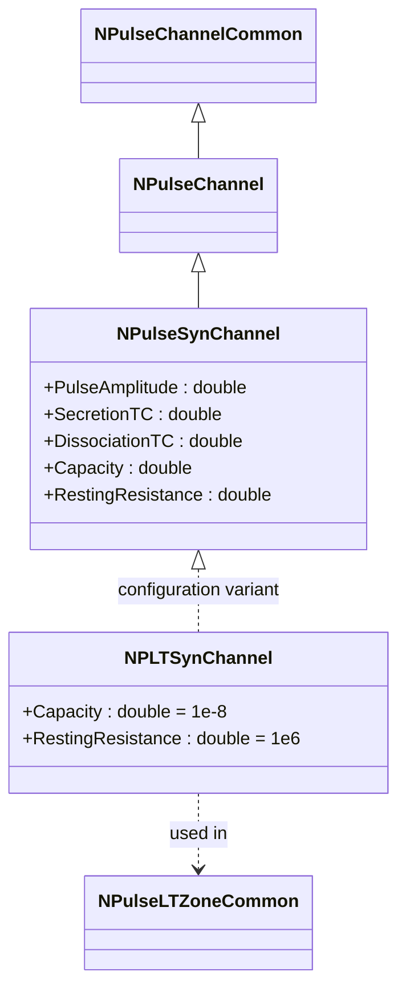
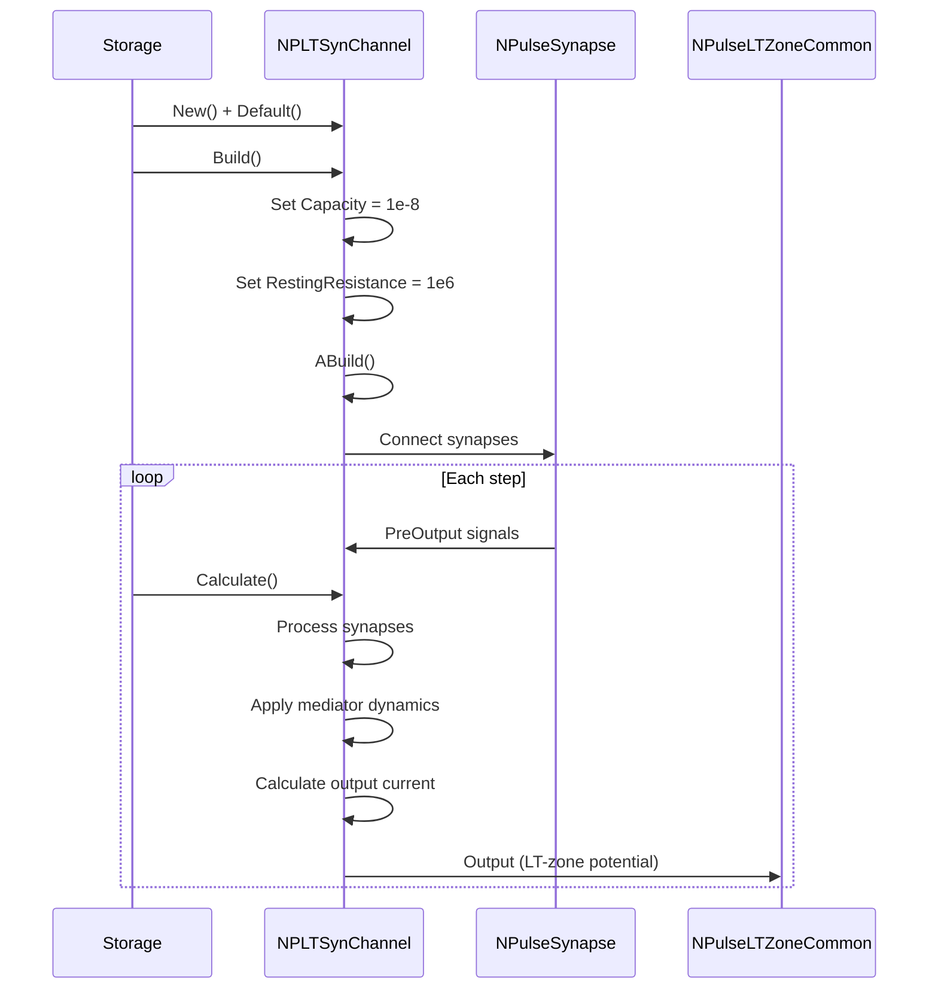
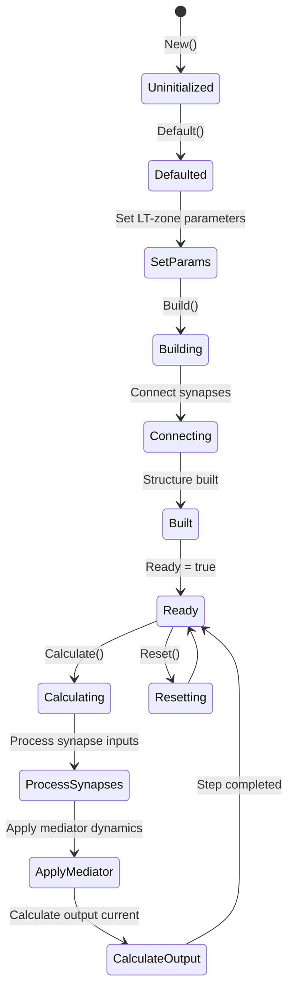
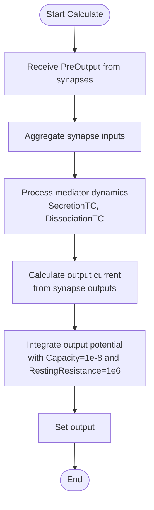
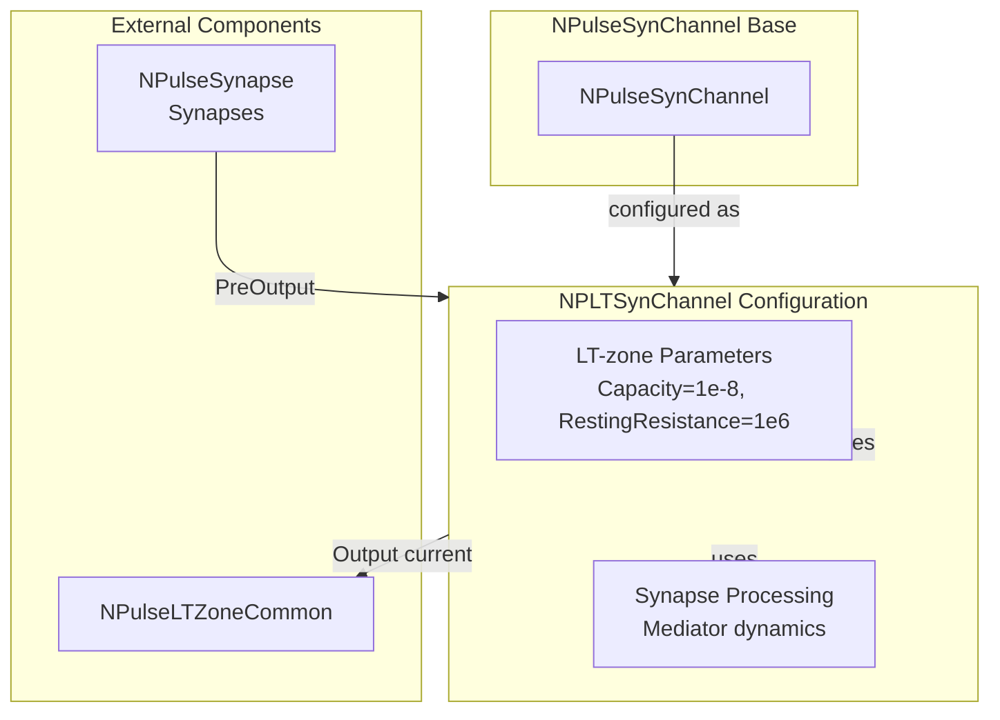

# NPLTSynChannel — LT-синаптический канал

## RU

### Назначение

**Класс**: `NPLTSynChannel` — конфигурационный вариант синаптического импульсного канала с параметрами для LT-зоны.  
**Аббревиатуры**: `LT` — **L**ow **T**hreshold (низкопороговая зона); `Syn` — **Syn**apse (синапс).  
**Регистрация**: `NPulseLibrary.cpp` → `UploadClass("NPLTSynChannel", ...)`.  
**Storage-инстансы**: `ClassName = "NPLTSynChannel"` в `Bin/Configs/*/Model_*.xml`.

`NPLTSynChannel` является конфигурационным вариантом базового класса `NPulseSynChannel` с предустановленными параметрами для LT-зоны. Создается из `NPulseSynChannel` с настройками:
- `Capacity = 1e-8` (10 нФ) — увеличенная емкость для LT-зоны
- `RestingResistance = 1e6` (1 МОм) — сопротивление покоя для LT-зоны

Комбинирует функциональность синаптического канала (обработка синапсов с моделью медиатора) с параметрами, оптимизированными для LT-зон.

**Использование:** Моделирование синаптических каналов в LT-зонах, эксперименты с LT-пластичностью и синаптической передачей

### UML-диаграмма классов


**Иерархия наследования:**
- `NPulseChannelCommon` — общий импульсный канал
- `NPulseChannel` — базовый импульсный канал
- `NPulseSynChannel` — синаптический импульсный канал
- `NPLTSynChannel` — конфигурационный вариант для LT-зоны

**Связи:**
- Используется в LT-зонах для обработки синаптических входов

### Свойства

`NPLTSynChannel` использует все свойства базового класса `NPulseSynChannel` с предустановленными значениями:

**Параметры:**
- `Capacity = 1e-8` (10 нФ) — увеличенная емкость для LT-зоны
- `RestingResistance = 1e6` (1 МОм) — сопротивление покоя для LT-зоны

**Остальные параметры по умолчанию:**
- `PulseAmplitude = 1.0`
- `SecretionTC = 0.001` (1 мс)
- `DissociationTC = 0.01` (10 мс)
- `SynapseResistance = 1.0e8` (100 МОм)
- `Resistance = 1.0e7` (10 МОм)
- `FBResistance = 1.0e8` (100 МОм)
- `Type = 0` (нейтральный)

**Особенности:**
- Комбинирует функциональность синаптического канала с параметрами LT-зоны
- Обрабатывает синапсы с моделью медиатора
- Использует увеличенную емкость и уменьшенное сопротивление покоя для LT-зон

### Методы

`NPLTSynChannel` использует все методы базового класса `NPulseSynChannel`.

### Примеры использования

#### Пример 1: Создание канала в коде C++

```cpp
// Создание LT-синаптического канала
auto channel = storage->CreateComponent("NPLTSynChannel");
channel->SetName("LTSynChannel");

// Инициализация (использует параметры для LT-зоны)
channel->Default();

// Использование
channel->Build();
```

#### Пример 2: Конфигурация XML

```xml
<Channel1 Class="NPLTSynChannel">
    <Parameters>
        <Type>0</Type>
        <Capacity>1e-8</Capacity>
        <Resistance>1.0e7</Resistance>
        <FBResistance>1.0e8</FBResistance>
        <RestingResistance>1e6</RestingResistance>
        <PulseAmplitude>1.0</PulseAmplitude>
        <SecretionTC>0.001</SecretionTC>
        <DissociationTC>0.01</DissociationTC>
        <SynapseResistance>1.0e8</SynapseResistance>
    </Parameters>
</Channel1>
```

### Использование в конфигурациях

`NPLTSynChannel` используется в экспериментах с синаптическими каналами в LT-зонах:

- Моделирование синаптических каналов в LT-зонах
- Эксперименты с LT-пластичностью и синаптической передачей
- Изучение влияния синаптических входов на генерацию спайков

**Особенности:**
- Комбинирует обработку синапсов с параметрами LT-зоны
- Использует модель динамики медиатора для синапсов
- Параметры оптимизированы для работы в LT-зонах

## Источники

См. [Literature-References.md](../Literature-References.md): **[A]**, **4**, **25**, **29**.

### См. также

- [`NPulseSynChannel`](NPulseSynChannel.md) — синаптический импульсный канал (базовый класс)
- [`NPLTChannel`](NPLTChannel.md) — LT-канал
- [`NPLTSynExcChannel`](NPLTSynExcChannel.md) — возбуждающий LT-синаптический канал
- [`NPLTSynInhChannel`](NPLTSynInhChannel.md) — тормозной LT-синаптический канал
- [`NPulseLTZoneCommon`](NPulseLTZoneCommon.md) — общая импульсная LT-зона
- [`NPulseSynapse`](NPulseSynapse.md) — импульсный синапс
- [Architecture.md](../Architecture.md) — архитектура библиотеки
- [Scientific-Background.md](../Scientific-Background.md) — научный фон (LT-пластичность, синаптическая передача)

---

## EN

### Purpose

**Class**: `NPLTSynChannel` — configuration variant of synaptic spiking channel with parameters for LT-zone.  
**Registration**: `NPulseLibrary.cpp` → `UploadClass("NPLTSynChannel", ...)`.  
**Instances**: `ClassName = "NPLTSynChannel"` in `Bin/Configs/*/Model_*.xml`.

`NPLTSynChannel` is a configuration variant of the base class `NPulseSynChannel` with preset parameters for LT-zone. Created from `NPulseSynChannel` with settings:
- `Capacity = 1e-8` (10 nF) — increased capacitance for LT-zone
- `RestingResistance = 1e6` (1 MΩ) — resting resistance for LT-zone

Combines synaptic channel functionality (processing synapses with neurotransmitter model) with parameters optimized for LT-zones.

**Usage:** Modeling synaptic channels in LT-zones, experiments with LT plasticity and synaptic transmission

### UML Class Diagram



### UML Sequence Diagram



### UML State Diagram



### UML Activity Diagram



### UML Component Diagram



### Properties

`NPLTSynChannel` uses all properties of base class `NPulseSynChannel` with preset values:

**Parameters:**
- `Capacity = 1e-8` (10 nF) — increased capacitance for LT-zone
- `RestingResistance = 1e6` (1 MΩ) — resting resistance for LT-zone

**Other default parameters:**
- `PulseAmplitude = 1.0`
- `SecretionTC = 0.001` (1 ms)
- `DissociationTC = 0.01` (10 ms)
- `SynapseResistance = 1.0e8` (100 MΩ)
- `Resistance = 1.0e7` (10 MΩ)
- `FBResistance = 1.0e8` (100 MΩ)
- `Type = 0` (neutral)

**Features:**
- Combines synaptic channel functionality with LT-zone parameters
- Processes synapses with mediator model
- Uses increased capacitance and decreased resting resistance for LT-zones

### Methods

`NPLTSynChannel` uses all methods of base class `NPulseSynChannel`.

### Usage in configurations

`NPLTSynChannel` is used in experiments with synaptic channels in LT-zones:

- **Synaptic channels in LT-zones**: Modeling synaptic channels in LT-zones
- **LT plasticity**: Experiments with LT plasticity and synaptic transmission
- **Spike generation**: Studying influence of synaptic inputs on spike generation

**Features:**
- Combines synapse processing with LT-zone parameters
- Uses mediator dynamics model for synapses
- Parameters optimized for work in LT-zones

**Typical parameter values:**
- **Capacity**: 1e-8 (10 nF) — increased for LT-zone
- **RestingResistance**: 1e6 (1 MΩ) — decreased for LT-zone
- **SecretionTC**: 0.001 (1 ms time constant)
- **DissociationTC**: 0.01 (10 ms time constant)

### References

See [Literature-References.md](../Literature-References.md): **[A]**, **4**, **25**, **29**.

### See Also

- [`NPulseSynChannel`](NPulseSynChannel.md) — synaptic spiking channel (base class)
- [`NPLTChannel`](NPLTChannel.md) — LT-channel
- [`NPLTSynExcChannel`](NPLTSynExcChannel.md) — excitatory LT-synaptic channel
- [`NPLTSynInhChannel`](NPLTSynInhChannel.md) — inhibitory LT-synaptic channel
- [`NPulseLTZoneCommon`](NPulseLTZoneCommon.md) — common spiking LT-zone
- [`NPulseSynapse`](NPulseSynapse.md) — spiking synapse
- [Architecture.md](../Architecture.md) — library architecture

