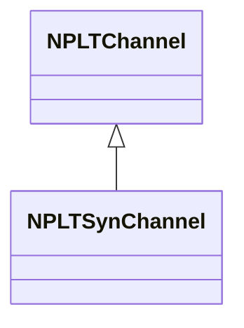
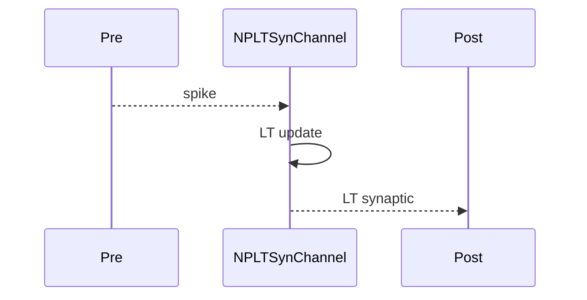
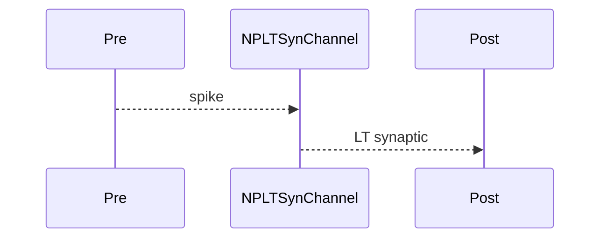

## NPLTSynChannel — LT синаптический канал

**Класс**: `NPLTSynChannel` — синаптический канал с LT-пластичностью.  
**Регистрация**: `NPulseLibrary.cpp` → `UploadClass("NPLTSynChannel", ...)`.  
**Storage**: `ClassName = "NPLTSynChannel"`.

### Lifecycle
- **ADefault**: параметры LT + синапс.
- **ABuild**: подключение pre/post.
- **AReset**: сброс LT-состояния.
- **ACalculate**: передача + LT-обновление.

### I/O
- Вход: импульс от pre.
- Выход: LT-модифицированный синаптический сигнал.



Пояснение: диаграмма классов показывает место компонента в иерархии и ключевые связи.



Пояснение: диаграмма последовательности показывает типовой сценарий взаимодействия и порядок вызовов.


Пояснение: блок-схема показывает поток данных/сигналов (входы → компонент → выходы).

### Config snippet

```ini
[Component]
ClassName = NPLTSynChannel
Name = LTSyn1
```

---

## NPLTSynChannel — LT synaptic channel (EN)

Synaptic channel with long-term plasticity.


Description: this class diagram shows the component position in the type hierarchy and key relations.



Description: this sequence diagram shows a typical runtime interaction and call order.


Description: this flowchart shows the data/signal flow (inputs → component → outputs).
