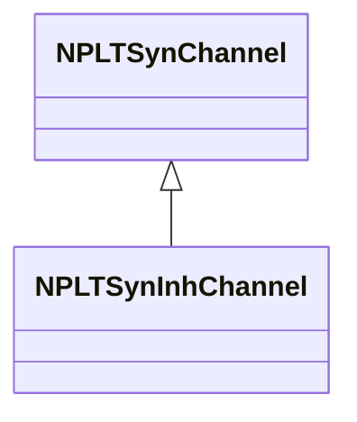
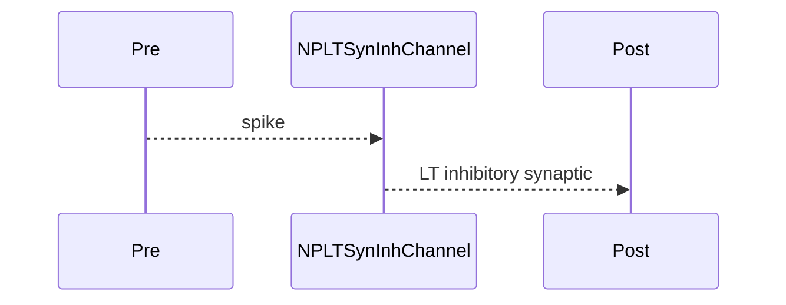

## NPLTSynInhChannel — LT синаптический тормозной канал

**Класс**: `NPLTSynInhChannel` — синаптический ингибирующий канал с LT.  
**Регистрация**: `NPulseLibrary.cpp` → `UploadClass("NPLTSynInhChannel", ...)`.  
**Storage**: `ClassName = "NPLTSynInhChannel"`.

### Lifecycle
- **ADefault**: параметры LT + синапс + торможение.
- **ABuild**: подключение pre/post.
- **AReset**: сброс LT.
- **ACalculate**: передача ингибирующего сигнала + LT.

### I/O
- Вход: импульс от pre.
- Выход: LT-модифицированный ингибирующий синаптический сигнал.



Пояснение: диаграмма классов показывает место компонента в иерархии и ключевые связи.



Пояснение: диаграмма последовательности показывает типовой сценарий взаимодействия и порядок вызовов.


Пояснение: блок-схема показывает поток данных/сигналов (входы → компонент → выходы).

### Config snippet

```ini
[Component]
ClassName = NPLTSynInhChannel
Name = LTSynInh1
```

---

## NPLTSynInhChannel — LT inhibitory synaptic channel (EN)

Inhibitory synaptic channel with long-term plasticity.


Description: this class diagram shows the component position in the type hierarchy and key relations.


Description: this sequence diagram shows a typical runtime interaction and call order.


Description: this flowchart shows the data/signal flow (inputs → component → outputs).
