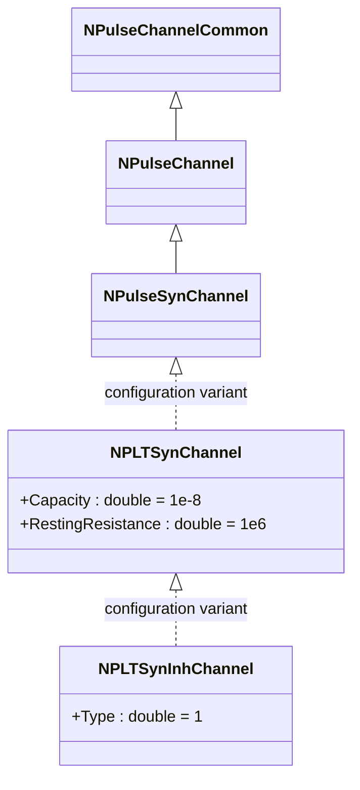
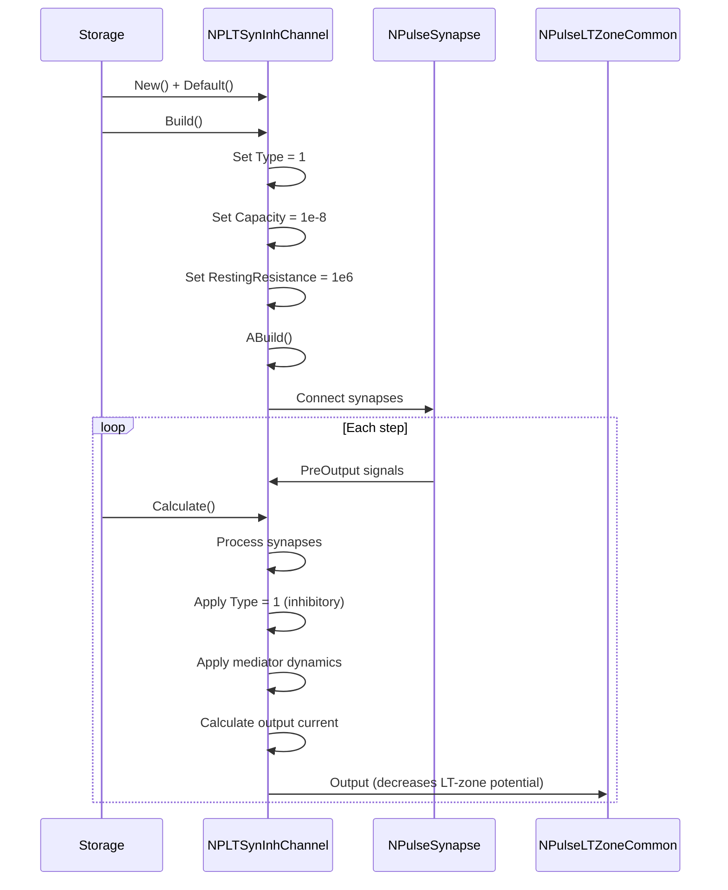
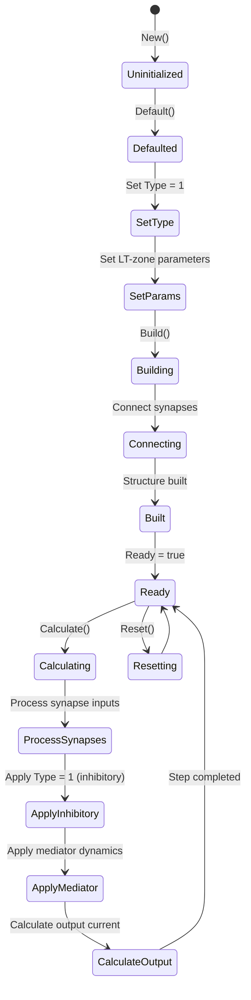
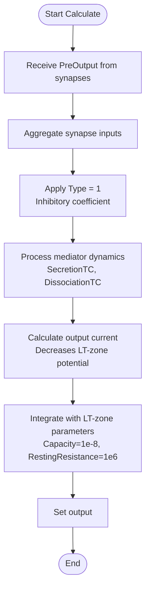
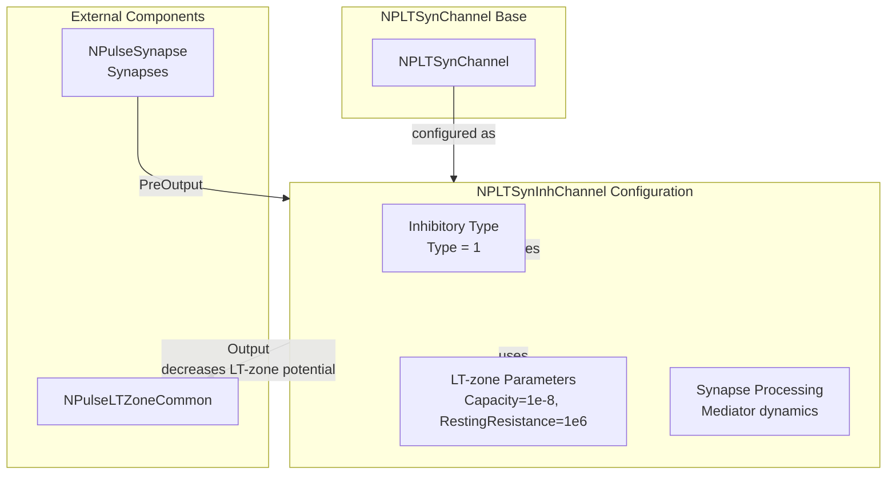

# NPLTSynInhChannel — тормозной LT-синаптический канал

## RU

### Назначение

**Класс**: `NPLTSynInhChannel` — конфигурационный вариант LT-синаптического канала с типом тормозного канала.  
**Аббревиатуры**: `LT` — **L**ow **T**hreshold (низкопороговая зона); `Syn` — **Syn**apse (синапс); `Inh` — **Inh**ibitory (тормозной).  
**Регистрация**: `NPulseLibrary.cpp` → `UploadClass("NPLTSynInhChannel", ...)`.  
**Storage-инстансы**: `ClassName = "NPLTSynInhChannel"` в `Bin/Configs/*/Model_*.xml`.

`NPLTSynInhChannel` является конфигурационным вариантом базового класса `NPLTSynChannel` с предустановленным типом тормозного канала. Создается из `NPLTSynChannel` с настройкой:
- `Type = 1` — тормозной канал

Тормозной LT-синаптический канал уменьшает потенциал LT-зоны при наличии входных сигналов от синапсов, препятствуя генерации спайков.

**Использование:** Моделирование тормозных синаптических каналов в LT-зонах, эксперименты с тормозной LT-пластичностью

### UML-диаграмма классов



**Иерархия наследования:**
- `NPulseChannelCommon` — общий импульсный канал
- `NPulseChannel` — базовый импульсный канал
- `NPulseSynChannel` — синаптический импульсный канал
- `NPLTSynChannel` — конфигурационный вариант для LT-зоны
- `NPLTSynInhChannel` — конфигурационный вариант для тормозного LT-синаптического канала

### Свойства

`NPLTSynInhChannel` использует все свойства базового класса `NPLTSynChannel` с предустановленным значением:

**Параметры:**
- `Type = 1` — тормозной канал
- `Capacity = 1e-8` (10 нФ) — увеличенная емкость для LT-зоны
- `RestingResistance = 1e6` (1 МОм) — сопротивление покоя для LT-зоны

**Остальные параметры по умолчанию:**
- `PulseAmplitude = 1.0`
- `SecretionTC = 0.001` (1 мс)
- `DissociationTC = 0.01` (10 мс)
- `SynapseResistance = 1.0e8` (100 МОм)
- `Resistance = 1.0e7` (10 МОм)
- `FBResistance = 1.0e8` (100 МОм)

### Методы

`NPLTSynInhChannel` использует все методы базового класса `NPLTSynChannel`.

### Примеры использования

#### Пример 1: Создание канала в коде C++

```cpp
// Создание тормозного LT-синаптического канала
auto channel = storage->CreateComponent("NPLTSynInhChannel");
channel->SetName("LTSynInhChannel");

// Инициализация (использует Type = 1, параметры для LT-зоны)
channel->Default();

// Использование
channel->Build();
```

#### Пример 2: Конфигурация XML

```xml
<Channel1 Class="NPLTSynInhChannel">
    <Parameters>
        <Type>1</Type>
        <Capacity>1e-8</Capacity>
        <Resistance>1.0e7</Resistance>
        <FBResistance>1.0e8</FBResistance>
        <RestingResistance>1e6</RestingResistance>
        <PulseAmplitude>1.0</PulseAmplitude>
        <SecretionTC>0.001</SecretionTC>
        <DissociationTC>0.01</DissociationTC>
        <SynapseResistance>1.0e8</SynapseResistance>
    </Parameters>
</Channel1>
```

### Использование в конфигурациях

`NPLTSynInhChannel` используется в экспериментах с тормозными синаптическими каналами в LT-зонах:

- Моделирование тормозных синаптических каналов в LT-зонах
- Эксперименты с тормозной LT-пластичностью
- Изучение подавления генерации спайков в LT-зонах

**Особенности:**
- Автоматически настроен как тормозной канал (`Type = 1`)
- Уменьшает потенциал LT-зоны при наличии входных сигналов от синапсов
- Комбинирует обработку синапсов с параметрами LT-зоны

## Источники

См. [Literature-References.md](../Literature-References.md): **[A]**, **4**, **25**, **29**.

### См. также

- [`NPLTSynChannel`](NPLTSynChannel.md) — LT-синаптический канал (базовый класс)
- [`NPLTSynExcChannel`](NPLTSynExcChannel.md) — возбуждающий LT-синаптический канал
- [`NPulseSynChannel`](NPulseSynChannel.md) — синаптический импульсный канал
- [`NPLTChannel`](NPLTChannel.md) — LT-канал
- [`NPulseLTZoneCommon`](NPulseLTZoneCommon.md) — общая импульсная LT-зона
- [Architecture.md](../Architecture.md) — архитектура библиотеки

---

## EN

### Purpose

**Class**: `NPLTSynInhChannel` — configuration variant of LT-synaptic channel with inhibitory channel type.  
**Registration**: `NPulseLibrary.cpp` → `UploadClass("NPLTSynInhChannel", ...)`.  
**Instances**: `ClassName = "NPLTSynInhChannel"` in `Bin/Configs/*/Model_*.xml`.

`NPLTSynInhChannel` is a configuration variant of the base class `NPLTSynChannel` with preset inhibitory channel type. Created from `NPLTSynChannel` with setting:
- `Type = 1` — inhibitory channel

Inhibitory LT-synaptic channel decreases LT-zone potential when input signals from synapses are present, preventing spike generation.

**Usage:** Modeling inhibitory synaptic channels in LT-zones, experiments with inhibitory LT plasticity

### UML Class Diagram


### UML Sequence Diagram



### UML State Diagram



### UML Activity Diagram



### UML Component Diagram



### Properties

`NPLTSynInhChannel` uses all properties of base class `NPLTSynChannel` with preset value:

**Parameters:**
- `Type = 1` — inhibitory channel
- `Capacity = 1e-8` (10 nF) — increased capacitance for LT-zone
- `RestingResistance = 1e6` (1 MΩ) — resting resistance for LT-zone

**Other default parameters:**
- `PulseAmplitude = 1.0`
- `SecretionTC = 0.001` (1 ms)
- `DissociationTC = 0.01` (10 ms)
- `SynapseResistance = 1.0e8` (100 MΩ)
- `Resistance = 1.0e7` (10 MΩ)
- `FBResistance = 1.0e8` (100 MΩ)

### Methods

`NPLTSynInhChannel` uses all methods of base class `NPLTSynChannel`.

### Usage in configurations

`NPLTSynInhChannel` is used in experiments with inhibitory synaptic channels in LT-zones:

- **Inhibitory LT-synaptic channels**: Modeling inhibitory channels in LT-zones
- **Inhibitory LT plasticity**: Experiments with inhibitory LT plasticity
- **Spike suppression**: Studying suppression of spike generation in LT-zones

**Features:**
- Automatically configured as inhibitory channel (`Type = 1`)
- Decreases LT-zone potential when input signals from synapses are present
- Combines synapse processing with LT-zone parameters

**Typical parameter values:**
- **Type**: 1 (inhibitory channel type)
- **Capacity**: 1e-8 (10 nF) — increased for LT-zone
- **RestingResistance**: 1e6 (1 MΩ) — decreased for LT-zone

### References

See [Literature-References.md](../Literature-References.md): **[A]**, **4**, **25**, **29**.

### See Also

- [`NPLTSynChannel`](NPLTSynChannel.md) — LT-synaptic channel (base class)
- [`NPLTSynExcChannel`](NPLTSynExcChannel.md) — excitatory LT-synaptic channel
- [`NPulseSynChannel`](NPulseSynChannel.md) — synaptic spiking channel
- [`NPLTChannel`](NPLTChannel.md) — LT-channel
- [`NPulseLTZoneCommon`](NPulseLTZoneCommon.md) — common spiking LT-zone
- [Architecture.md](../Architecture.md) — library architecture

