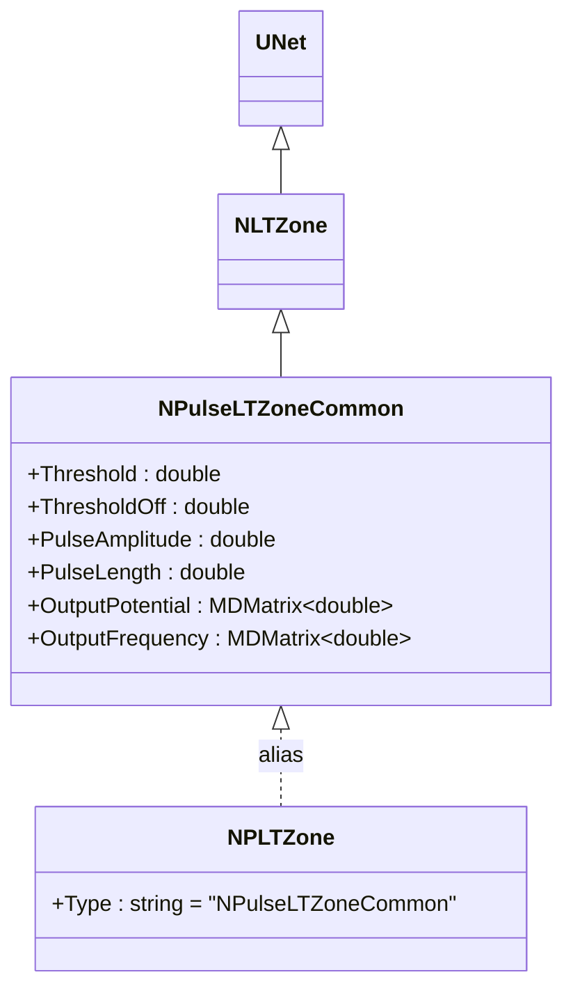
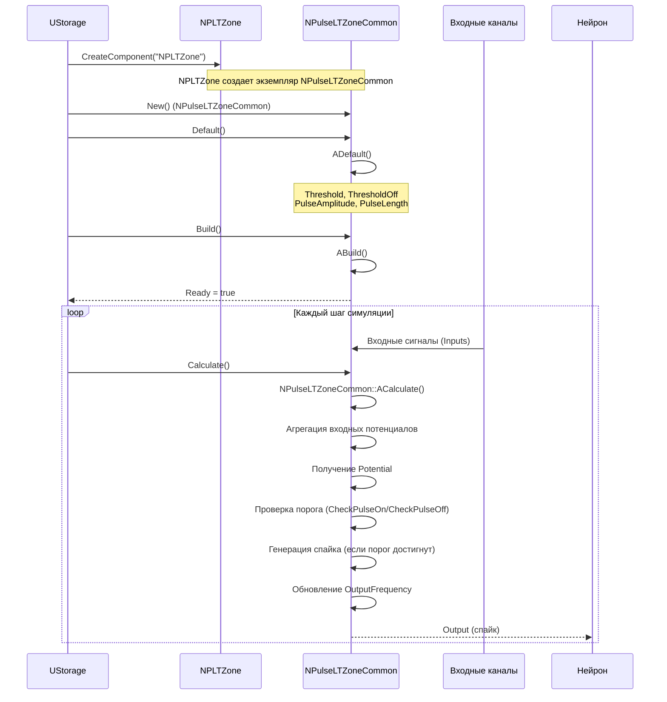
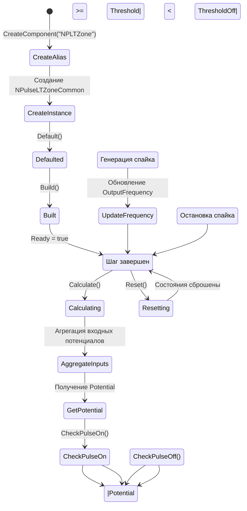
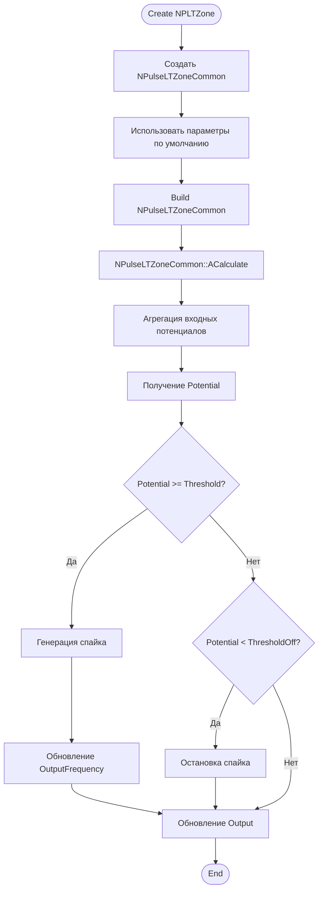
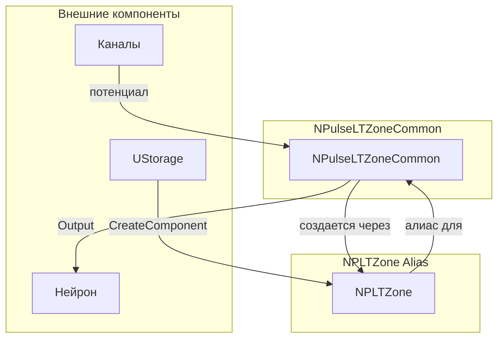
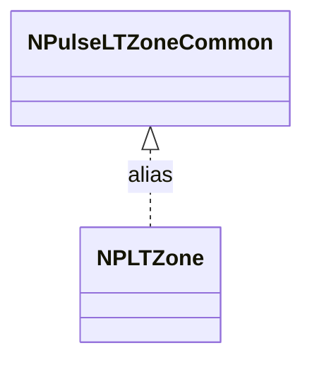
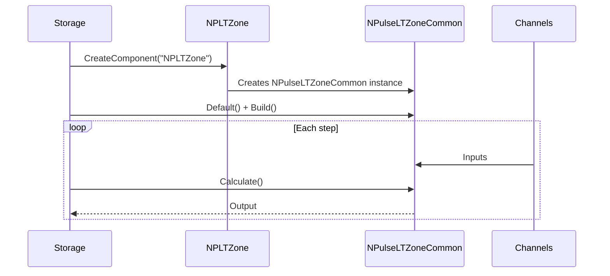
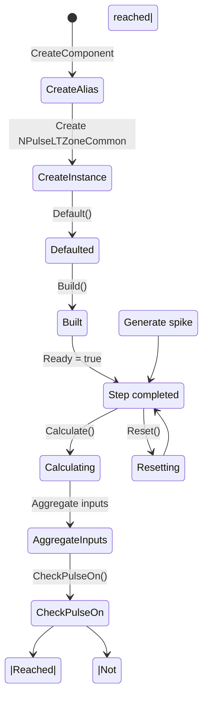
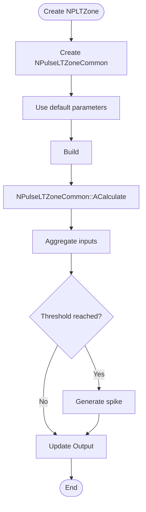
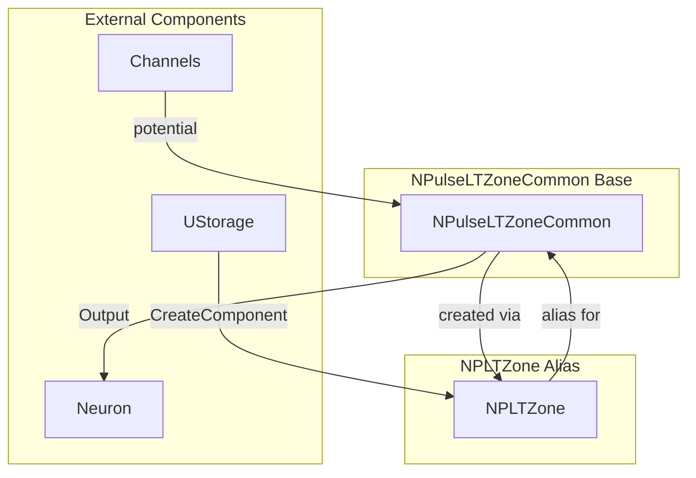

# NPLTZone — импульсная LT-зона (алиас)

## RU

### Назначение

**Класс**: `NPLTZone` — алиас для класса `NPulseLTZoneCommon`.  
**Префикс**: `NP` — **P**ulse (импульсный), компонент с импульсными входами/выходами; `LT` — **L**ow **T**hreshold (низкопороговая зона).  
**Регистрация**: `NPulseLibrary.cpp` → `UploadClass("NPLTZone", ...)`.  
**Storage-инстансы**: `ClassName = "NPLTZone"` в `Bin/Configs/*/Model_*.xml`.

`NPLTZone` является алиасом (синонимом) для класса `NPulseLTZoneCommon`. При создании компонента с `ClassName = "NPLTZone"` фактически создается экземпляр класса `NPulseLTZoneCommon` с параметрами по умолчанию.

`NPulseLTZoneCommon` реализует низкопороговую зону (LT-зона) для генерации спайков. Отслеживает входные потенциалы, определяет момент генерации спайка на основе пороговых значений, и управляет генерацией импульсов.

**Использование:** Упрощенное именование при конфигурации, обратная совместимость

### UML-диаграмма классов



**Иерархия наследования:**
- `UNet` — базовая сеть Rdk Framework
- `NLTZone` — базовая LT-зона
- `NPulseLTZoneCommon` — общая импульсная LT-зона
- `NPLTZone` — алиас для `NPulseLTZoneCommon`

### UML-диаграмма последовательности



**Жизненный цикл:**
1. **Создание**: При создании компонента с `ClassName = "NPLTZone"` фактически создается экземпляр `NPulseLTZoneCommon`
2. **Инициализация**: Используются параметры по умолчанию `NPulseLTZoneCommon`
3. **Использование**: Все методы и свойства идентичны `NPulseLTZoneCommon`

### UML-диаграмма состояний



**Состояния:**
- **CreateAlias** — создание компонента через алиас
- **CreateInstance** — создание фактического экземпляра `NPulseLTZoneCommon`
- **Defaulted** — параметры установлены по умолчанию
- **Built** — структура LT-зоны построена
- **Ready** — готов к выполнению расчетов
- **Calculating** — выполняется расчет LT-зоны
- **AggregateInputs** — агрегация входных потенциалов
- **GetPotential** — получение потенциала от каналов
- **CheckPulseOn** — проверка порога генерации спайка
- **CheckPulseOff** — проверка порога остановки спайка
- **GeneratingSpike** — генерация спайка
- **UpdateFrequency** — обновление частоты спайков
- **StopSpike** — остановка спайка
- **Resetting** — выполняется сброс состояний

### UML-диаграмма активности



**Алгоритм работы:**
1. Создание экземпляра `NPulseLTZoneCommon` при использовании алиаса `NPLTZone`
2. Использование всех методов и свойств `NPulseLTZoneCommon`
3. Поведение идентично `NPulseLTZoneCommon`

### UML-диаграмма компонентов



**Зависимости:**
- **Базовый класс**: `NPulseLTZoneCommon` (создается через алиас)
- **Внешние компоненты**: `UStorage` (создание компонента), каналы (источники входных сигналов), нейрон (получатель выходных сигналов)

### Свойства

`NPLTZone` использует все свойства базового класса `NPulseLTZoneCommon` с параметрами по умолчанию.

### Методы

`NPLTZone` использует все методы базового класса `NPulseLTZoneCommon`.

### Примеры использования

#### Пример 1: Создание LT-зоны в коде C++

```cpp
// Создание импульсной LT-зоны через алиас
auto ltZone = storage->CreateComponent("NPLTZone");
ltZone->SetName("LTZone");

// Инициализация (использует параметры по умолчанию)
ltZone->Default();

// Использование
ltZone->Build();
```

### Использование в конфигурациях

`NPLTZone` используется как упрощенное именование для `NPulseLTZoneCommon`:

- **Генерация спайков**: `Bin/Configs/!OldConfigs/*/Model_*.xml` (где используется `NPLTZone` вместо `NPulseLTZoneCommon`)

**Типичные значения параметров:**
- Все параметры идентичны `NPulseLTZoneCommon`:
  - **Threshold**: порог генерации спайка
  - **ThresholdOff**: порог остановки спайка
  - **PulseAmplitude**: амплитуда спайка
  - **PulseLength**: длительность спайка

### Использование в конфигурациях

`NPLTZone` используется как упрощенное именование для `NPulseLTZoneCommon`:

- **LT-зоны**: `Bin/Configs/!OldConfigs/*/Model_*.xml` (где используется `NPLTZone` вместо `NPulseLTZoneCommon`)

**Типичные значения параметров:**
- Все параметры идентичны `NPulseLTZoneCommon`:
  - **Threshold**: -0.055 (-55 мВ, порог генерации спайка)
  - **ThresholdOff**: -0.07 (-70 мВ, порог остановки спайка)
  - **PulseAmplitude**: 1.0 (амплитуда спайка)
  - **PulseLength**: 0.001 (1 мс, длительность спайка)

### См. также

- [`NPulseLTZoneCommon`](NPulseLTZoneCommon.md) — общая импульсная LT-зона (базовый класс)
- [`NPulseLTZone`](NPulseLTZone.md) — импульсная LT-зона
- [`NCLTZone`](NCLTZone.md) — классическая LT-зона
- [Architecture.md](../Architecture.md) — архитектура библиотеки

---

## EN

### Purpose

**Class**: `NPLTZone` — alias for `NPulseLTZoneCommon` class.  
**Registration**: `NPulseLibrary.cpp` → `UploadClass("NPLTZone", ...)`.  
**Instances**: `ClassName = "NPLTZone"` in `Bin/Configs/*/Model_*.xml`.

`NPLTZone` is an alias (synonym) for the `NPulseLTZoneCommon` class. When creating a component with `ClassName = "NPLTZone"`, an instance of `NPulseLTZoneCommon` with default parameters is actually created.

**Usage:** Simplified naming in configurations, backward compatibility

### UML Class Diagram



### UML Sequence Diagram



### UML State Diagram



### UML Activity Diagram



### UML Component Diagram



### Properties

`NPLTZone` uses all properties of `NPulseLTZoneCommon` class with default parameters:

**Inherited from NPulseLTZoneCommon:**
- `Threshold` (double) — spike generation threshold
- `ThresholdOff` (double) — spike termination threshold
- `UseAveragePotential` (bool) — use averaging for potentials
- `Inputs` (vector<MDMatrix<double>>) — input signals from channels
- `Output` (MDMatrix<double>) — output signal (spike amplitude)
- `Potential` (double) — current LT-zone potential
- `NumChannelsInGroup` (int) — number of channels in group
- `PulseAmplitude` (double) — pulse amplitude
- `PulseLength` (double) — pulse length
- `AvgInterval` (double) — averaging interval for frequency
- `OutputPotential` (MDMatrix<double>) — output potential
- `OutputFrequency` (MDMatrix<double>) — output frequency
- `OutputPulseTimes` (MDMatrix<double>) — pulse times

### Methods

`NPLTZone` uses all methods of `NPulseLTZoneCommon` class:
- `SetPulseAmplitude(value)` → `bool` — set pulse amplitude
- `CheckPulseOn()` → `bool` — check if pulse should be generated
- `CheckPulseOff()` → `bool` — check if pulse should be terminated
- `ADefault()` → `bool` — initialize default parameters
- `ABuild()` → `bool` — build LT-zone structure
- `AReset()` → `bool` — reset LT-zone state
- `ACalculate()` → `bool` — perform one calculation step

### Usage in configurations

`NPLTZone` is used as a simplified alias for `NPulseLTZoneCommon`:

- **Simplified naming**: `Bin/Configs/!OldConfigs/*/Model_*.xml` (where `NPLTZone` is used instead of `NPulseLTZoneCommon`)
- **Backward compatibility**: maintains compatibility with older configurations

**Typical parameter values:**
- All parameters are identical to `NPulseLTZoneCommon`:
  - **Threshold**: -0.055 (-55 mV, spike generation threshold)
  - **ThresholdOff**: -0.07 (-70 mV, spike termination threshold)
  - **PulseAmplitude**: 1.0 (spike amplitude)
  - **PulseLength**: 0.001 (1 ms, spike duration)

**Features:**
- Alias: provides simplified naming for `NPulseLTZoneCommon`
- Backward compatibility: maintains compatibility with existing configurations
- Default parameters: uses default parameters from `NPulseLTZoneCommon`

### See Also

- [`NPulseLTZoneCommon`](NPulseLTZoneCommon.md) — common spiking LT-zone (base class)
- [`NPulseLTZone`](NPulseLTZone.md) — spiking LT-zone
- [`NCLTZone`](NCLTZone.md) — classic LT-zone
- [Architecture.md](../Architecture.md) — library architecture
