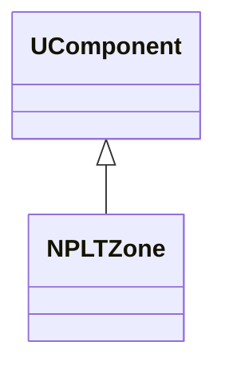
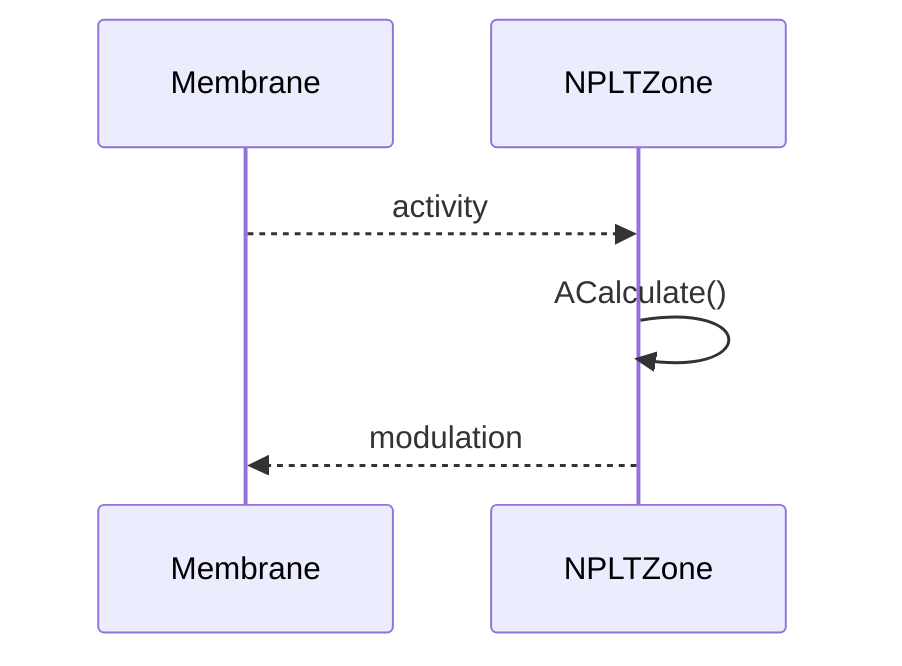
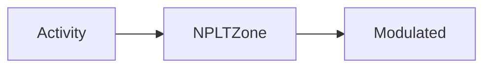
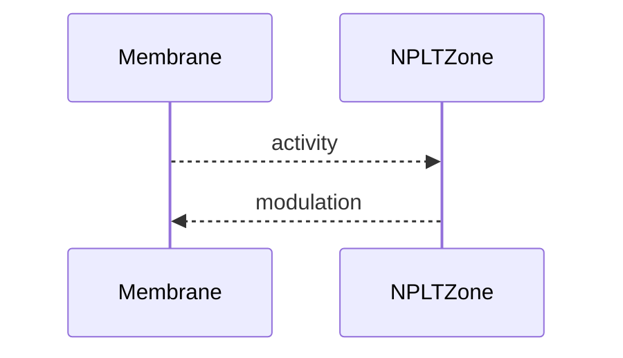

## NPLTZone — LT-зона (базовая)

**Класс**: `NPLTZone` — базовая зона долговременной пластичности.  
**Регистрация**: `NPulseLibrary.cpp` → `UploadClass("NPLTZone", ...)`.  
**Storage**: `ClassName = "NPLTZone"`.

### Lifecycle
- **ADefault**: параметры LT (пороги/усиление).
- **ABuild**: подключение к мембранам/каналам.
- **AReset**: сброс LT-состояния.
- **ACalculate**: обновление LT по активности.

### I/O
- Вход: активность/потенциалы.
- Выход: модифицированные сигналы/коэффициенты.



Пояснение: диаграмма классов показывает место компонента в иерархии и ключевые связи.



Пояснение: диаграмма последовательности показывает типовой сценарий взаимодействия и порядок вызовов.



Пояснение: блок-схема показывает поток данных/сигналов (входы → компонент → выходы).

### Config snippet

```ini
[Component]
ClassName = NPLTZone
Name = LTZone1
```

---

## NPLTZone — long-term zone (EN)

Base long-term plasticity zone.


Description: this class diagram shows the component position in the type hierarchy and key relations.



Description: this sequence diagram shows a typical runtime interaction and call order.


Description: this flowchart shows the data/signal flow (inputs → component → outputs).
