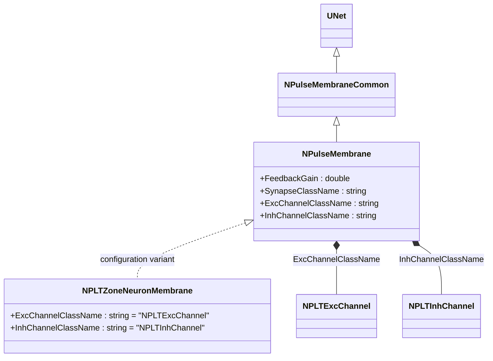
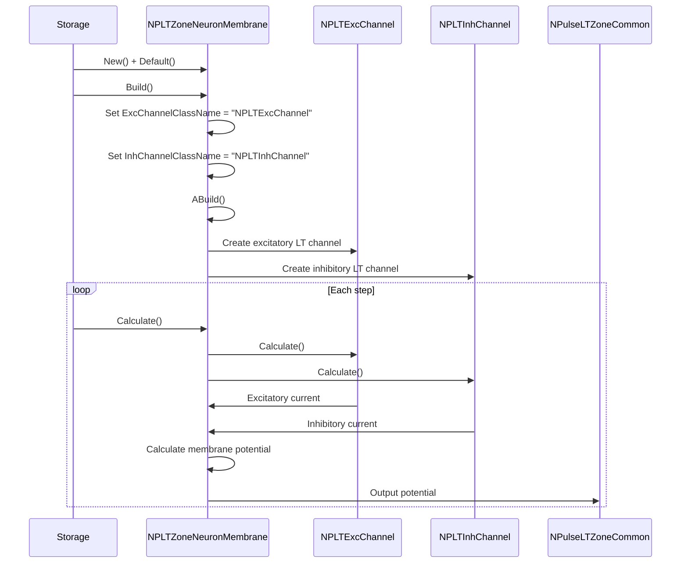
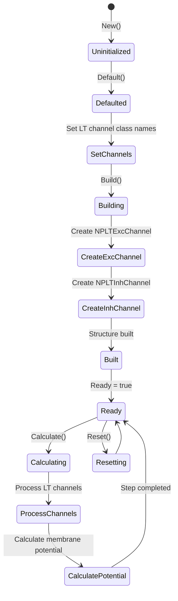
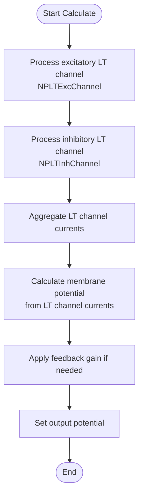

# NPLTZoneNeuronMembrane — мембрана нейрона с LT-зоной

## RU

### Назначение

**Класс**: `NPLTZoneNeuronMembrane` — конфигурационный вариант импульсной мембраны для нейронов с низкопороговой зоной (LT-зоной).  
**Аббревиатура**: `LT` — **L**ow **T**hreshold (низкопороговая зона).  
**Регистрация**: `NPulseLibrary.cpp` → `UploadClass("NPLTZoneNeuronMembrane", ...)`.  
**Storage-инстансы**: `ClassName = "NPLTZoneNeuronMembrane"` в `Bin/Configs/*/Model_*.xml`.

`NPLTZoneNeuronMembrane` является конфигурационным вариантом класса `NPulseMembrane` с параметрами для нейронов с LT-зоной. При создании компонента с `ClassName = "NPLTZoneNeuronMembrane"` создается экземпляр `NPulseMembrane` с параметрами:
- `ExcChannelClassName = "NPLTExcChannel"` — возбуждающий LT-канал
- `InhChannelClassName = "NPLTInhChannel"` — тормозной LT-канал

**Использование:** Мембрана нейрона с LT-зоной, низкопороговая пластичность

### UML-диаграмма классов



**Иерархия наследования:**
- `UNet` — базовая сеть Rdk Framework
- `NPulseMembraneCommon` — общая импульсная мембрана
- `NPulseMembrane` — базовая импульсная мембрана
- `NPLTZoneNeuronMembrane` — конфигурационный вариант для нейронов с LT-зоной

**Параметры конфигурации:**
- `ExcChannelClassName = "NPLTExcChannel"` — возбуждающий LT-канал
- `InhChannelClassName = "NPLTInhChannel"` — тормозной LT-канал

### Свойства

`NPLTZoneNeuronMembrane` использует все свойства базового класса `NPulseMembrane` с параметрами:
- `ExcChannelClassName = "NPLTExcChannel"`
- `InhChannelClassName = "NPLTInhChannel"`

### Методы

`NPLTZoneNeuronMembrane` использует все методы базового класса `NPulseMembrane`.

### Примеры использования

#### Пример 1: Создание мембраны в коде C++

```cpp
// Создание мембраны для нейрона с LT-зоной
auto membrane = storage->CreateComponent("NPLTZoneNeuronMembrane");
membrane->SetName("LTMembrane");

// Инициализация (использует параметры по умолчанию)
membrane->Default();

// Использование
membrane->Build();
```

## Источники

См. [Literature-References.md](../Literature-References.md): **[A]**, **4**, **25**, **29**.

### См. также

- [`NPulseMembrane`](NPulseMembrane.md) — базовая импульсная мембрана (базовый класс)
- [`NPLTZoneSynNeuronMembrane`](NPLTZoneSynNeuronMembrane.md) — мембрана для syn-нейронов с LT-зоной
- [`NPLTExcChannel`](NPLTExcChannel.md) — возбуждающий LT-канал
- [`NPLTInhChannel`](NPLTInhChannel.md) — тормозной LT-канал
- [`NPulseLTZoneCommon`](NPulseLTZoneCommon.md) — общая LT-зона
- [Architecture.md](../Architecture.md) — архитектура библиотеки

---

## EN

### Purpose

**Class**: `NPLTZoneNeuronMembrane` — configuration variant of spiking membrane for neurons with low-threshold zone (LT-zone).  
**Registration**: `NPulseLibrary.cpp` → `UploadClass("NPLTZoneNeuronMembrane", ...)`.  
**Instances**: `ClassName = "NPLTZoneNeuronMembrane"` in `Bin/Configs/*/Model_*.xml`.

`NPLTZoneNeuronMembrane` is a configuration variant of `NPulseMembrane` class with parameters for neurons with LT-zone. When creating a component with `ClassName = "NPLTZoneNeuronMembrane"`, an instance of `NPulseMembrane` is created with parameters:
- `ExcChannelClassName = "NPLTExcChannel"` — excitatory LT channel
- `InhChannelClassName = "NPLTInhChannel"` — inhibitory LT channel

**Usage:** Neuron membrane with LT-zone, low-threshold plasticity

### UML Class Diagram


### UML Sequence Diagram



### UML State Diagram



### UML Activity Diagram



### UML Component Diagram

```mermaid
graph TB
    subgraph NPulseMembrane["NPulseMembrane Base"]
        BaseMembrane[NPulseMembrane]
    end
    
    subgraph NPLTZoneNeuronMembrane["NPLTZoneNeuronMembrane Configuration"]
        ExcChannelConfig["ExcChannelClassName<br/>= #quot;NPLTExcChannel#quot;"]
        InhChannelConfig["InhChannelClassName<br/>= #quot;NPLTInhChannel#quot;"]
    end
    
    subgraph Channels["LT Channels"]
        ExcChannel["NPLTExcChannel<br/>Excitatory LT Channel"]
        InhChannel["NPLTInhChannel<br/>Inhibitory LT Channel"]
    end
    
    subgraph External["External Components"]
        LTZone[NPulseLTZoneCommon]
        Neuron[Neuron]
    end
    
    BaseMembrane -->|configured as| NPLTZoneNeuronMembrane
    NPLTZoneNeuronMembrane -->|creates| ExcChannel
    NPLTZoneNeuronMembrane -->|creates| InhChannel
    ExcChannel -->|Excitatory current| NPLTZoneNeuronMembrane
    InhChannel -->|Inhibitory current| NPLTZoneNeuronMembrane
    NPLTZoneNeuronMembrane -->|Output potential| LTZone
    NPLTZoneNeuronMembrane -->|Output potential| Neuron
```



### Properties

`NPLTZoneNeuronMembrane` uses all properties of base class `NPulseMembrane` with parameters:
- `ExcChannelClassName = "NPLTExcChannel"` — excitatory LT channel
- `InhChannelClassName = "NPLTInhChannel"` — inhibitory LT channel

**Configuration parameters:**
- `ExcChannelClassName = "NPLTExcChannel"` — preset excitatory LT channel class name
- `InhChannelClassName = "NPLTInhChannel"` — preset inhibitory LT channel class name

### Methods

`NPLTZoneNeuronMembrane` uses all methods of base class `NPulseMembrane`.

### Usage in configurations

`NPLTZoneNeuronMembrane` is used in experiments with neurons with LT-zones:

- **Neurons with LT-zones**: Modeling neurons with low-threshold zones
- **LT plasticity**: Experiments with low-threshold plasticity

**Features:**
- Automatically configured with LT channels (`NPLTExcChannel` and `NPLTInhChannel`)
- Simplified configuration: Channel class names are preset
- LT-zone support: Optimized for neurons with LT-zones

**Typical parameter values:**
- **ExcChannelClassName**: "NPLTExcChannel" (excitatory LT channel)
- **InhChannelClassName**: "NPLTInhChannel" (inhibitory LT channel)

### References

See [Literature-References.md](../Literature-References.md): **[A]**, **4**, **25**, **29**.

### See Also

- [`NPulseMembrane`](NPulseMembrane.md) — base spiking membrane (base class)
- [`NPLTZoneSynNeuronMembrane`](NPLTZoneSynNeuronMembrane.md) — membrane for syn-neurons with LT-zone
- [`NPLTExcChannel`](NPLTExcChannel.md) — excitatory LT channel
- [`NPLTInhChannel`](NPLTInhChannel.md) — inhibitory LT channel
- [`NPulseLTZoneCommon`](NPulseLTZoneCommon.md) — common LT-zone
- [Architecture.md](../Architecture.md) — library architecture
