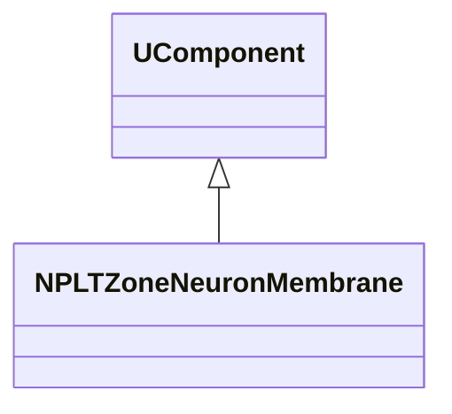
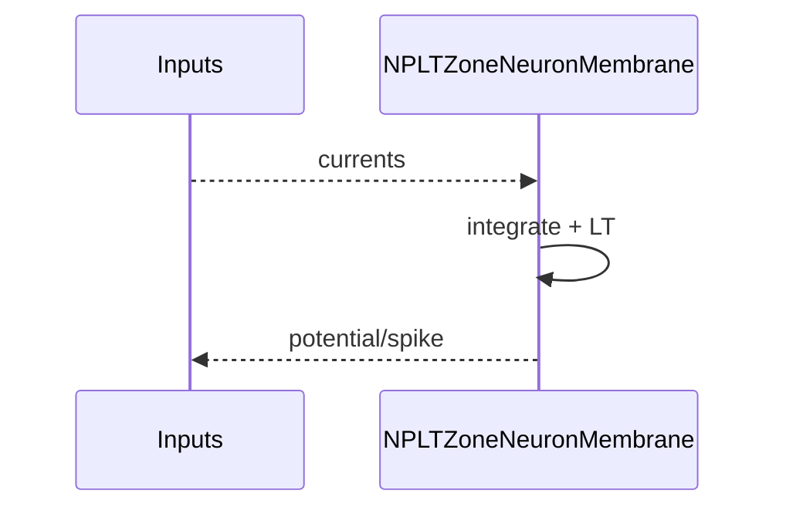
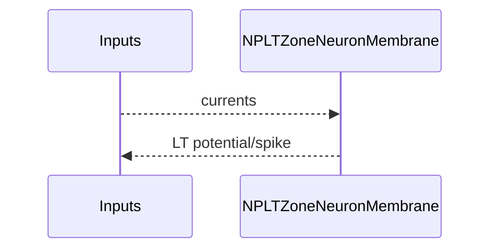

## NPLTZoneNeuronMembrane — LT-зона мембраны нейрона

**Класс**: `NPLTZoneNeuronMembrane` — мембрана нейрона с LT-зоной.  
**Регистрация**: `NPulseLibrary.cpp` → `UploadClass("NPLTZoneNeuronMembrane", ...)`.  
**Storage**: `ClassName = "NPLTZoneNeuronMembrane"`.

### Lifecycle
- **ADefault**: параметры мембраны + LT.
- **ABuild**: подключение каналов/синапсов.
- **AReset**: сброс потенциала + LT.
- **ACalculate**: обновление потенциала + LT-модуляция.

### I/O
- Вход: токи/сигналы.
- Выход: потенциал/спайк (LT-модифицированный).



Пояснение: диаграмма классов показывает место компонента в иерархии и ключевые связи.



Пояснение: диаграмма последовательности показывает типовой сценарий взаимодействия и порядок вызовов.


Пояснение: блок-схема показывает поток данных/сигналов (входы → компонент → выходы).

### Config snippet

```ini
[Component]
ClassName = NPLTZoneNeuronMembrane
Name = LTMem1
```

---

## NPLTZoneNeuronMembrane — LT zone neuron membrane (EN)

Neuron membrane with integrated long-term plasticity zone.


Description: this class diagram shows the component position in the type hierarchy and key relations.



Description: this sequence diagram shows a typical runtime interaction and call order.


Description: this flowchart shows the data/signal flow (inputs → component → outputs).
