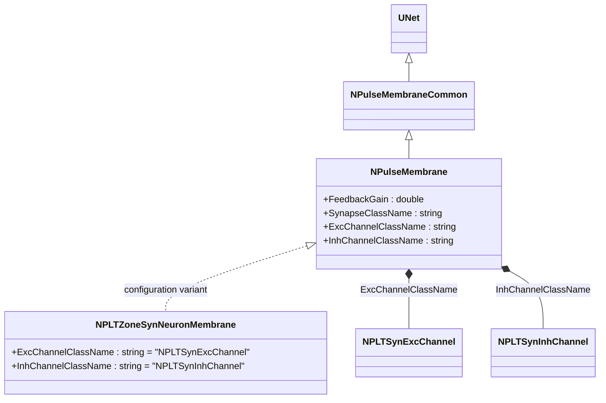
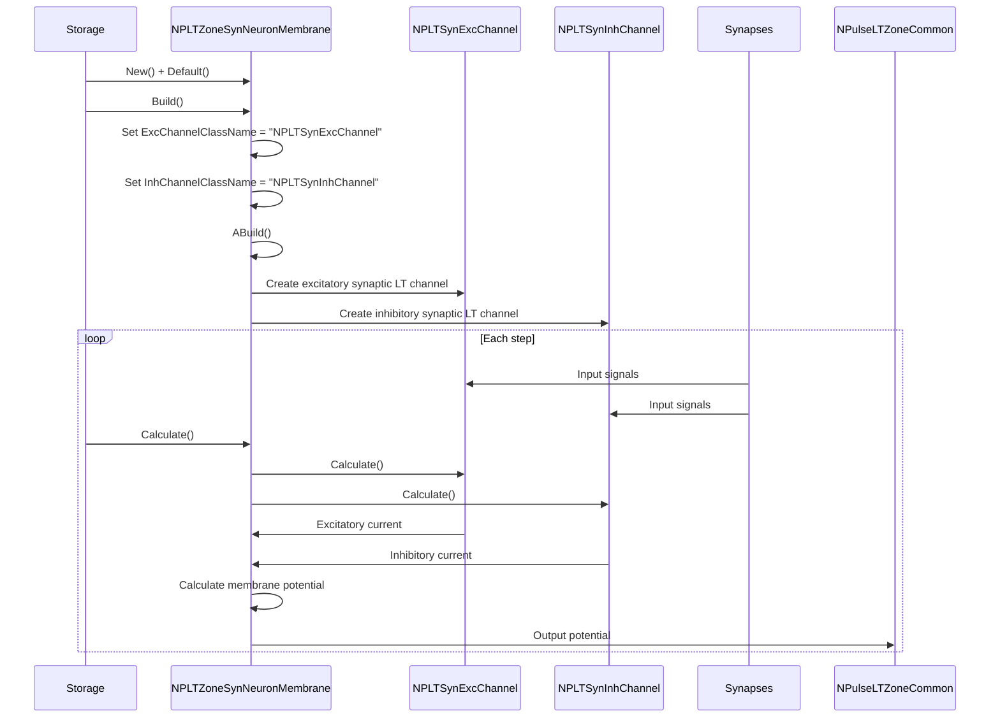
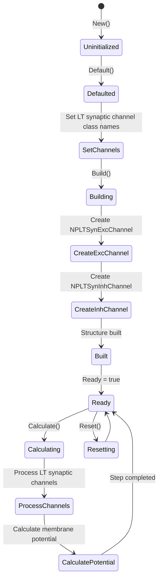
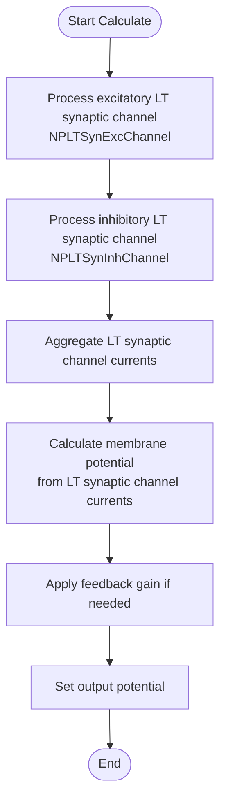

# NPLTZoneSynNeuronMembrane — мембрана syn-нейрона с LT-зоной

## RU

### Назначение

**Класс**: `NPLTZoneSynNeuronMembrane` — конфигурационный вариант импульсной мембраны для syn-нейронов с низкопороговой зоной (LT-зоной).  
**Аббревиатуры**: `LT` — **L**ow **T**hreshold (низкопороговая зона); `Syn` — **Syn**apse (синапс).  
**Регистрация**: `NPulseLibrary.cpp` → `UploadClass("NPLTZoneSynNeuronMembrane", ...)`.  
**Storage-инстансы**: `ClassName = "NPLTZoneSynNeuronMembrane"` в `Bin/Configs/*/Model_*.xml`.

`NPLTZoneSynNeuronMembrane` является конфигурационным вариантом класса `NPulseMembrane` с параметрами для syn-нейронов с LT-зоной. При создании компонента с `ClassName = "NPLTZoneSynNeuronMembrane"` создается экземпляр `NPulseMembrane` с параметрами:
- `ExcChannelClassName = "NPLTSynExcChannel"` — возбуждающий синаптический LT-канал
- `InhChannelClassName = "NPLTSynInhChannel"` — тормозной синаптический LT-канал

**Использование:** Мембрана syn-нейрона с LT-зоной, низкопороговая пластичность для синаптических каналов

### UML-диаграмма классов



**Иерархия наследования:**
- `UNet` — базовая сеть Rdk Framework
- `NPulseMembraneCommon` — общая импульсная мембрана
- `NPulseMembrane` — базовая импульсная мембрана
- `NPLTZoneSynNeuronMembrane` — конфигурационный вариант для syn-нейронов с LT-зоной

**Параметры конфигурации:**
- `ExcChannelClassName = "NPLTSynExcChannel"` — возбуждающий синаптический LT-канал
- `InhChannelClassName = "NPLTSynInhChannel"` — тормозной синаптический LT-канал

### Свойства

`NPLTZoneSynNeuronMembrane` использует все свойства базового класса `NPulseMembrane` с параметрами:
- `ExcChannelClassName = "NPLTSynExcChannel"`
- `InhChannelClassName = "NPLTSynInhChannel"`

### Методы

`NPLTZoneSynNeuronMembrane` использует все методы базового класса `NPulseMembrane`.

### Примеры использования

#### Пример 1: Создание мембраны в коде C++

```cpp
// Создание мембраны для syn-нейрона с LT-зоной
auto membrane = storage->CreateComponent("NPLTZoneSynNeuronMembrane");
membrane->SetName("LTSynMembrane");

// Инициализация (использует параметры по умолчанию)
membrane->Default();

// Использование
membrane->Build();
```

## Источники

См. [Literature-References.md](../Literature-References.md): **[A]**, **4**, **25**, **29**.

### См. также

- [`NPulseMembrane`](NPulseMembrane.md) — базовая импульсная мембрана (базовый класс)
- [`NPLTZoneNeuronMembrane`](NPLTZoneNeuronMembrane.md) — мембрана нейрона с LT-зоной
- [`NPLTSynExcChannel`](NPLTSynExcChannel.md) — возбуждающий синаптический LT-канал
- [`NPLTSynInhChannel`](NPLTSynInhChannel.md) — тормозной синаптический LT-канал
- [`NPulseLTZoneCommon`](NPulseLTZoneCommon.md) — общая LT-зона
- [Architecture.md](../Architecture.md) — архитектура библиотеки

---

## EN

### Purpose

**Class**: `NPLTZoneSynNeuronMembrane` — configuration variant of spiking membrane for syn-neurons with low-threshold zone (LT-zone).  
**Registration**: `NPulseLibrary.cpp` → `UploadClass("NPLTZoneSynNeuronMembrane", ...)`.  
**Instances**: `ClassName = "NPLTZoneSynNeuronMembrane"` in `Bin/Configs/*/Model_*.xml`.

`NPLTZoneSynNeuronMembrane` is a configuration variant of `NPulseMembrane` class with parameters for syn-neurons with LT-zone. When creating a component with `ClassName = "NPLTZoneSynNeuronMembrane"`, an instance of `NPulseMembrane` is created with parameters:
- `ExcChannelClassName = "NPLTSynExcChannel"` — excitatory synaptic LT channel
- `InhChannelClassName = "NPLTSynInhChannel"` — inhibitory synaptic LT channel

**Usage:** Syn-neuron membrane with LT-zone, low-threshold plasticity for synaptic channels

### UML Class Diagram


### UML Sequence Diagram



### UML State Diagram



### UML Activity Diagram



### UML Component Diagram

```mermaid
graph TB
    subgraph NPulseMembrane["NPulseMembrane Base"]
        BaseMembrane[NPulseMembrane]
    end
    
    subgraph NPLTZoneSynNeuronMembrane["NPLTZoneSynNeuronMembrane Configuration"]
        ExcChannelConfig[ExcChannelClassName<br/>= "NPLTSynExcChannel"]
        InhChannelConfig[InhChannelClassName<br/>= "NPLTSynInhChannel"]
    end
    
    subgraph Channels["LT Synaptic Channels"]
        ExcChannel[NPLTSynExcChannel<br/>Excitatory LT Synaptic Channel]
        InhChannel[NPLTSynInhChannel<br/>Inhibitory LT Synaptic Channel]
    end
    
    subgraph External["External Components"]
        Synapses[Synapses]
        LTZone[NPulseLTZoneCommon]
        Neuron[Neuron]
    end
    
    BaseMembrane -->|configured as| NPLTZoneSynNeuronMembrane
    NPLTZoneSynNeuronMembrane -->|creates| ExcChannel
    NPLTZoneSynNeuronMembrane -->|creates| InhChannel
    Synapses -->|Input| ExcChannel
    Synapses -->|Input| InhChannel
    ExcChannel -->|Excitatory current| NPLTZoneSynNeuronMembrane
    InhChannel -->|Inhibitory current| NPLTZoneSynNeuronMembrane
    NPLTZoneSynNeuronMembrane -->|Output potential| LTZone
    NPLTZoneSynNeuronMembrane -->|Output potential| Neuron
```

### Properties

`NPLTZoneSynNeuronMembrane` uses all properties of base class `NPulseMembrane` with parameters:
- `ExcChannelClassName = "NPLTSynExcChannel"` — excitatory synaptic LT channel
- `InhChannelClassName = "NPLTSynInhChannel"` — inhibitory synaptic LT channel

**Configuration parameters:**
- `ExcChannelClassName = "NPLTSynExcChannel"` — preset excitatory synaptic LT channel class name
- `InhChannelClassName = "NPLTSynInhChannel"` — preset inhibitory synaptic LT channel class name

### Methods

`NPLTZoneSynNeuronMembrane` uses all methods of base class `NPulseMembrane`.

### Usage in configurations

`NPLTZoneSynNeuronMembrane` is used in experiments with syn-neurons with LT-zones:

- **Syn-neurons with LT-zones**: Modeling syn-neurons with low-threshold zones
- **LT plasticity**: Experiments with low-threshold plasticity for synaptic channels

**Features:**
- Automatically configured with LT synaptic channels (`NPLTSynExcChannel` and `NPLTSynInhChannel`)
- Simplified configuration: Channel class names are preset
- LT-zone support: Optimized for syn-neurons with LT-zones

**Typical parameter values:**
- **ExcChannelClassName**: "NPLTSynExcChannel" (excitatory synaptic LT channel)
- **InhChannelClassName**: "NPLTSynInhChannel" (inhibitory synaptic LT channel)

### References

See [Literature-References.md](../Literature-References.md): **[A]**, **4**, **25**, **29**.

### See Also

- [`NPulseMembrane`](NPulseMembrane.md) — base spiking membrane (base class)
- [`NPLTZoneNeuronMembrane`](NPLTZoneNeuronMembrane.md) — neuron membrane with LT-zone
- [`NPLTSynExcChannel`](NPLTSynExcChannel.md) — excitatory synaptic LT channel
- [`NPLTSynInhChannel`](NPLTSynInhChannel.md) — inhibitory synaptic LT channel
- [`NPulseLTZoneCommon`](NPulseLTZoneCommon.md) — common LT-zone
- [Architecture.md](../Architecture.md) — library architecture
