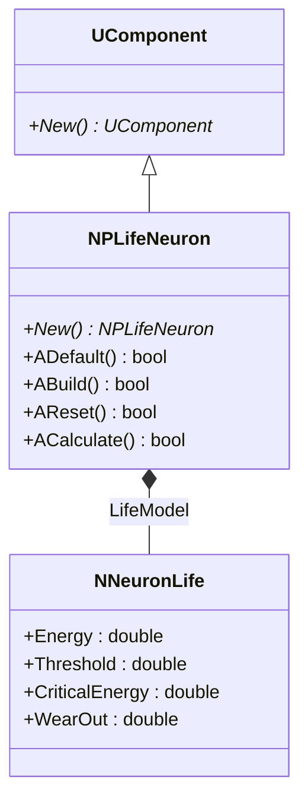
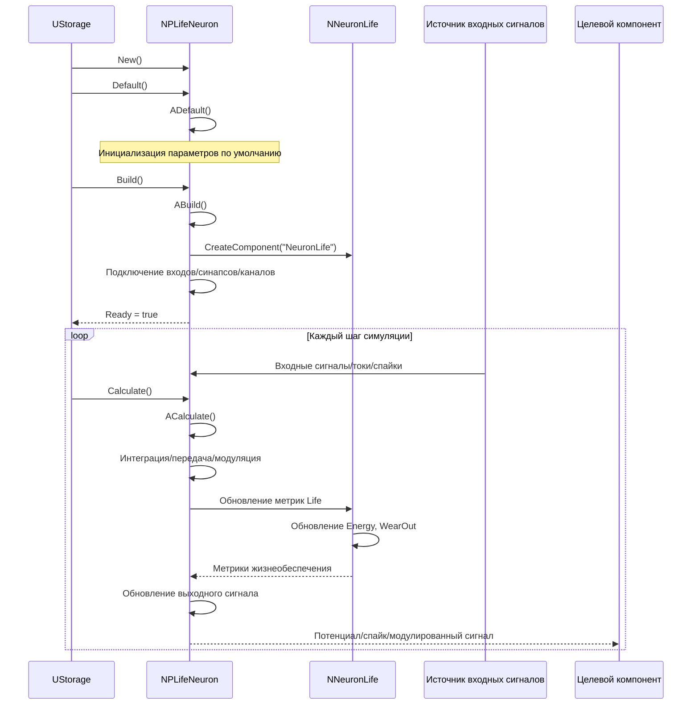
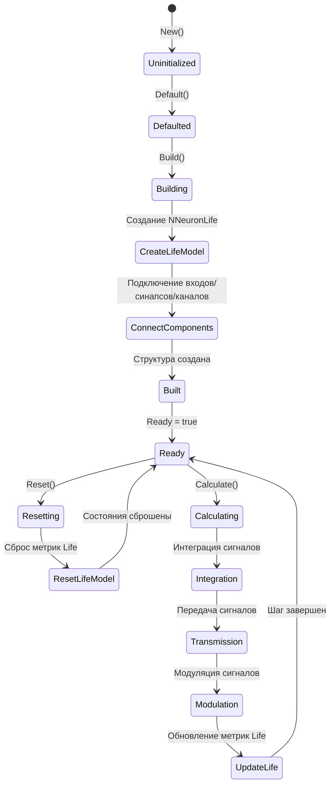
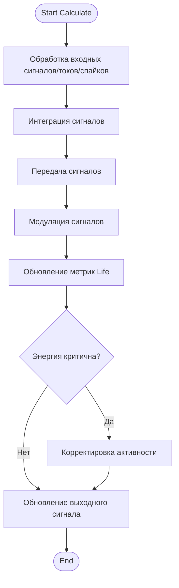
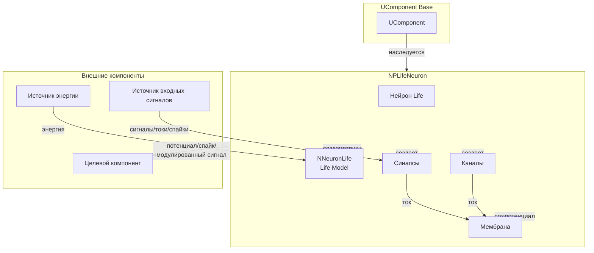
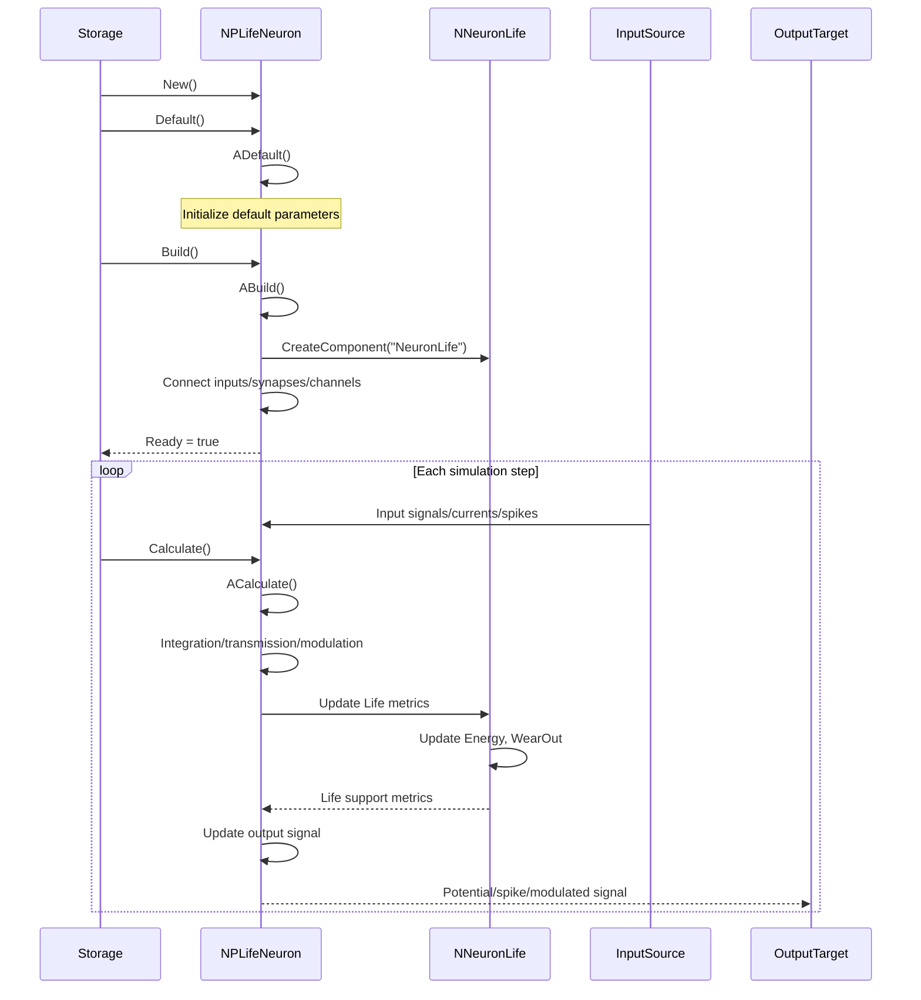
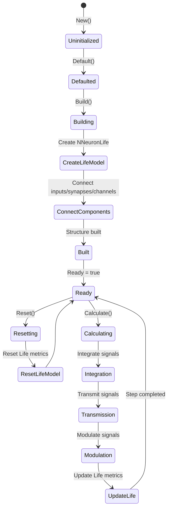
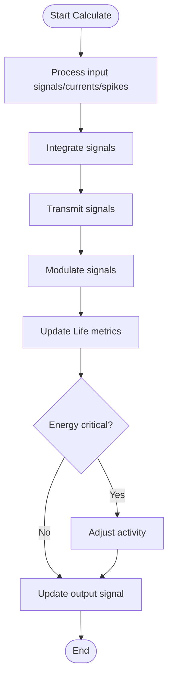
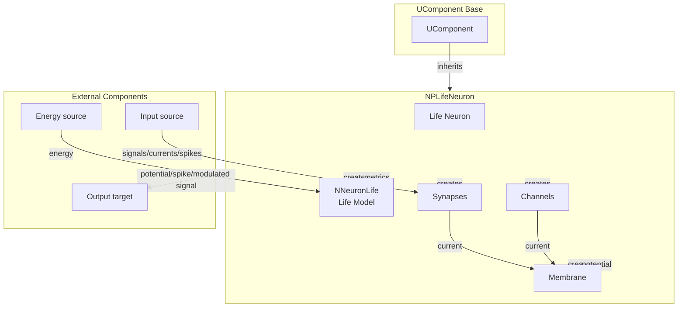

# NPLifeNeuron — нейрон Life (pulse)

## RU

### Назначение

**Класс**: `NPLifeNeuron` — пульсовый нейрон с метриками Life.
**Регистрация**: `NPulseLibrary.cpp` → `UploadClass("NPLifeNeuron", ...)`.
**Storage-инстансы**: `ClassName = "NPLifeNeuron"` в `Bin/Configs/*/Model_*.xml`.

`NPLifeNeuron` является пульсовым нейроном с метриками жизнеобеспечения (Life). Наследуется от `UComponent` и интегрирует модель жизнеобеспечения для отслеживания энергии, износа и других метрик жизнедеятельности нейрона.

**Использование:** Моделирование нейронов с метриками жизнеобеспечения, эксперименты с энергией и износом

### UML-диаграмма классов



**Иерархия наследования:**
- `UComponent` — базовый компонент Rdk Framework
- `NPLifeNeuron` — пульсовый нейрон с метриками Life

**Внутренняя структура:**
- **LifeModel** (`NNeuronLife`) — модель жизнеобеспечения нейрона

### UML-диаграмма последовательности



**Жизненный цикл:**
1. **Инициализация**: Установка параметров по умолчанию
2. **Сборка**: Подключение входов, синапсов, каналов и создание модели Life
3. **Расчет**: Интеграция сигналов, передача, модуляция и обновление метрик Life
4. **Сброс**: Сброс состояния/потенциалов и метрик Life

### UML-диаграмма состояний



**Состояния:**
- **Uninitialized** — создан, но не инициализирован
- **Defaulted** — параметры установлены по умолчанию
- **Building** — выполняется сборка структуры
- **CreateLifeModel** — создание модели жизнеобеспечения
- **ConnectComponents** — подключение входов, синапсов, каналов
- **Built** — структура нейрона построена
- **Ready** — готов к выполнению расчетов
- **Calculating** — выполняется расчет нейрона
- **Integration** — интеграция сигналов
- **Transmission** — передача сигналов
- **Modulation** — модуляция сигналов
- **UpdateLife** — обновление метрик Life
- **Resetting** — выполняется сброс состояний
- **ResetLifeModel** — сброс метрик Life

### UML-диаграмма активности



**Алгоритм расчета:**
1. Обработка входных сигналов/токов/спайков
2. Интеграция сигналов
3. Передача сигналов
4. Модуляция сигналов
5. Обновление метрик Life (энергия, износ)
6. Проверка критичности энергии
7. Корректировка активности при необходимости
8. Обновление выходного сигнала

### UML-диаграмма компонентов



**Зависимости:**
- **Базовый класс**: `UComponent`
- **Внутренние компоненты**: `NNeuronLife` (модель жизнеобеспечения), мембрана, каналы, синапсы
- **Внешние компоненты**: источники входных сигналов, источник энергии, целевые компоненты

### Свойства

`NPLifeNeuron` использует свойства модели жизнеобеспечения (`NNeuronLife`):

**Параметры жизнеобеспечения (в NNeuronLife):**
- `Energy` (double) — текущая энергия нейрона
- `Threshold` (double) — порог жизнедеятельности
- `CriticalEnergy` (double) — критический уровень энергии
- `WearOut` (double) — износ нейрона

### Методы

- `New()` → `NPLifeNeuron*` — создает новый экземпляр нейрона
- `ADefault()` → `bool` — установка параметров по умолчанию
- `ABuild()` → `bool` — сборка структуры нейрона (подключение входов/синапсов/каналов)
- `AReset()` → `bool` — сброс состояния/потенциалов и метрик Life
- `ACalculate()` → `bool` — выполнение шага расчета (интеграция/передача/модуляция)
- `GetNeuronLife()` → `NNeuronLife*` — получение модели жизнеобеспечения

### Примеры использования

#### Пример 1: Создание нейрона Life в коде C++

```cpp
// Создание пульсового нейрона с метриками Life
auto neuron = storage->CreateComponent("NPLifeNeuron");
neuron->SetName("NPLifeNeuron1");

// Инициализация
neuron->Default();

// Использование
neuron->Build();
for (int step = 0; step < 1000; step++) {
    neuron->Calculate();
}
```

#### Пример 2: Конфигурация XML

```xml
<Neuron1 Class="NPLifeNeuron">
    <Parameters>
        <!-- Параметры жизнеобеспечения -->
    </Parameters>
</Neuron1>
```

### Использование в конфигурациях

`NPLifeNeuron` используется для моделирования нейронов с метриками жизнеобеспечения:

- **Life-модели**: `Bin/Configs/*/Model_*.xml` (где требуется отслеживание метрик жизнедеятельности)
- **Энергетические модели**: эксперименты с энергией и износом нейронов

**Особенности:**
- Метрики жизнеобеспечения: отслеживание энергии, износа и других метрик
- Энергетическая модель: интеграция модели жизнеобеспечения
- Корректировка активности: автоматическая корректировка при критических уровнях энергии

## Источники

См. [Literature-References.md](../Literature-References.md): **neuromodeler.ru** (жизнеобеспечение), **15**.

### См. также

- [`NNeuronLife`](NNeuronLife.md) — модель жизнеобеспечения нейрона
- [`NSPLifeNeuron`](NSPLifeNeuron.md) — SP-нейрон с метриками Life
- [`NLPLifeNeuron`](NLPLifeNeuron.md) — LP-нейрон с метриками Life
- [Architecture.md](../Architecture.md) — архитектура библиотеки

---

## EN

### Purpose

**Class**: `NPLifeNeuron` — spiking neuron with Life metrics.
**Registration**: `NPulseLibrary.cpp` → `UploadClass("NPLifeNeuron", ...)`.
**Instances**: `ClassName = "NPLifeNeuron"` in `Bin/Configs/*/Model_*.xml`.

`NPLifeNeuron` is a spiking neuron with life support metrics. It inherits from `UComponent` and integrates a life support model for tracking energy, wear out, and other neuron vitality metrics.

**Usage:** Modeling neurons with life support metrics, experiments with energy and wear out

### UML Class Diagram


### UML Sequence Diagram



### UML State Diagram



### UML Activity Diagram



### UML Component Diagram



### Properties

`NPLifeNeuron` uses properties of the life support model (`NNeuronLife`):

**Life support parameters (in NNeuronLife):**
- `Energy` (double) — current neuron energy
- `Threshold` (double) — life threshold
- `CriticalEnergy` (double) — critical energy level
- `WearOut` (double) — neuron wear out

### Methods

- `New()` → `NPLifeNeuron*` — creates new neuron instance
- `ADefault()` → `bool` — sets default parameters
- `ABuild()` → `bool` — builds neuron structure (connects inputs/synapses/channels)
- `AReset()` → `bool` — resets state/potentials and Life metrics
- `ACalculate()` → `bool` — performs calculation step (integration/transmission/modulation)
- `GetNeuronLife()` → `NNeuronLife*` — gets life support model

### Usage in configurations

`NPLifeNeuron` is used for modeling neurons with life support metrics:

- **Life models**: `Bin/Configs/*/Model_*.xml` (where life support metrics tracking is required)
- **Energy models**: experiments with energy and wear out for neurons

**Features:**
- Life support metrics: tracks energy, wear out, and other metrics
- Energy model: integrates life support model
- Activity adjustment: automatically adjusts activity at critical energy levels

### References

See [Literature-References.md](../Literature-References.md): **neuromodeler.ru** (life support), **15**.

### See Also

- [`NNeuronLife`](NNeuronLife.md) — neuron life support model
- [`NSPLifeNeuron`](NSPLifeNeuron.md) — SP neuron with Life metrics
- [`NLPLifeNeuron`](NLPLifeNeuron.md) — LP neuron with Life metrics
- [Architecture.md](../Architecture.md) — library architecture
