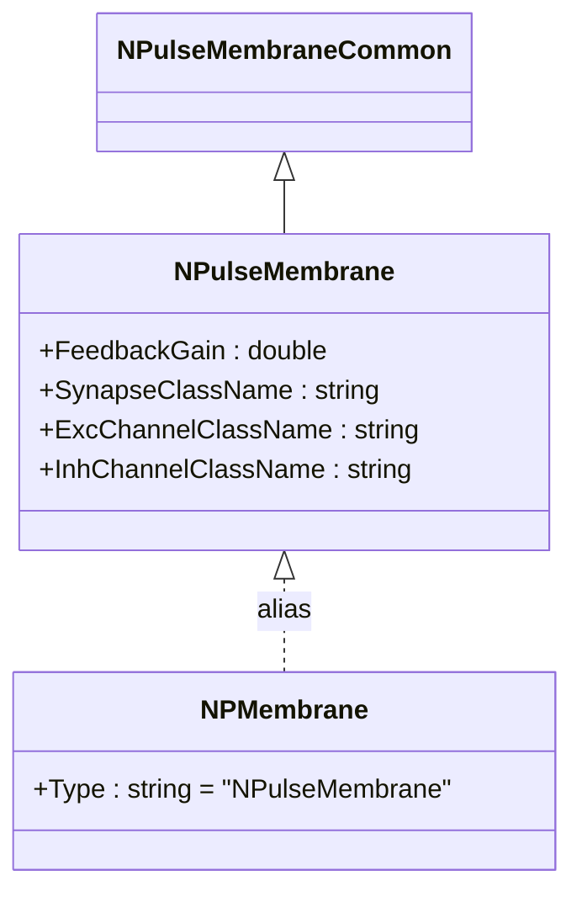
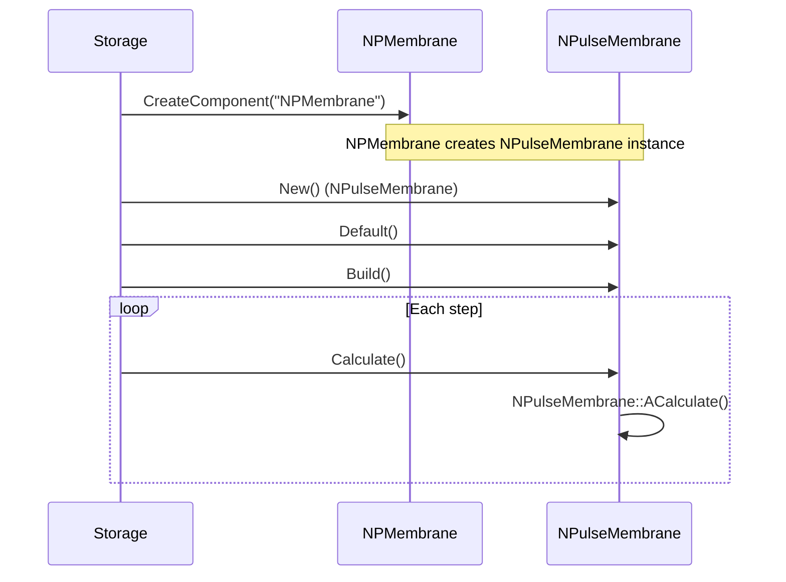
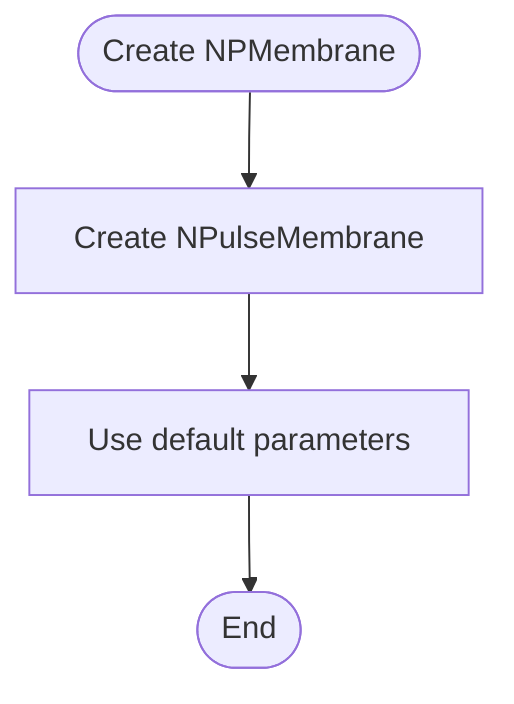
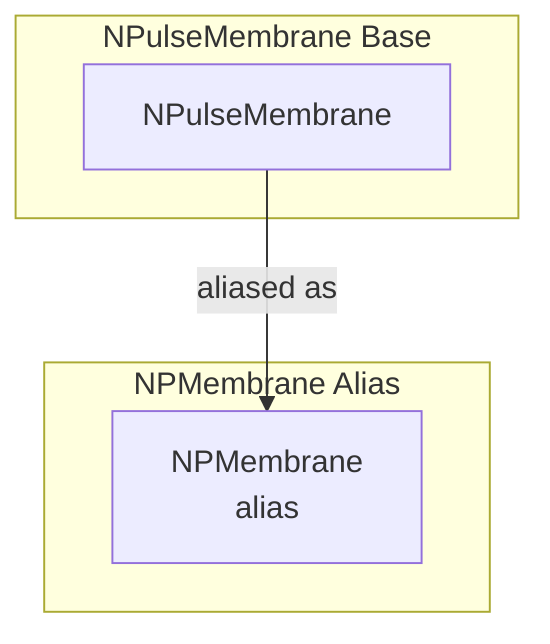

# NPMembrane — импульсная мембрана (алиас)

## RU

### Назначение

**Класс**: `NPMembrane` — алиас для класса `NPulseMembrane`.  
**Регистрация**: `NPulseLibrary.cpp` → `UploadClass("NPMembrane", ...)`.  
**Storage-инстансы**: `ClassName = "NPMembrane"` в `Bin/Configs/*/Model_*.xml`.

`NPMembrane` является алиасом (синонимом) для класса `NPulseMembrane`. При создании компонента с `ClassName = "NPMembrane"` фактически создается экземпляр класса `NPulseMembrane` с параметрами по умолчанию.

`NPulseMembrane` реализует базовую импульсную мембрану с управлением возбуждающими и тормозными каналами и синапсами.

**Использование:** Упрощенное именование при конфигурации, обратная совместимость

### UML-диаграмма классов



**Иерархия наследования:**
- `NPulseMembraneCommon` — общая импульсная мембрана
- `NPulseMembrane` — базовая импульсная мембрана
- `NPMembrane` — алиас для `NPulseMembrane`

### Свойства

`NPMembrane` использует все свойства базового класса `NPulseMembrane` с параметрами по умолчанию.

### Методы

`NPMembrane` использует все методы базового класса `NPulseMembrane`.

### Примеры использования

#### Пример 1: Создание мембраны в коде C++

```cpp
// Создание импульсной мембраны через алиас
auto membrane = storage->CreateComponent("NPMembrane");
membrane->SetName("PMembrane");

// Инициализация (использует параметры по умолчанию)
membrane->Default();

// Использование
membrane->Build();
```

## Источники

См. [Literature-References.md](../Literature-References.md): **[A]**, **4**, **25**, **29**.

### См. также

- [`NPulseMembrane`](NPulseMembrane.md) — базовая импульсная мембрана (базовый класс)
- [`NPulseMembraneCommon`](NPulseMembraneCommon.md) — общая импульсная мембрана
- [Architecture.md](../Architecture.md) — архитектура библиотеки

---

## EN

### Purpose

**Class**: `NPMembrane` — alias for `NPulseMembrane` class.  
**Registration**: `NPulseLibrary.cpp` → `UploadClass("NPMembrane", ...)`.  
**Instances**: `ClassName = "NPMembrane"` in `Bin/Configs/*/Model_*.xml`.

`NPMembrane` is an alias (synonym) for the `NPulseMembrane` class. When creating a component with `ClassName = "NPMembrane"`, an instance of `NPulseMembrane` with default parameters is actually created.

**Usage:** Simplified naming in configurations, backward compatibility

### UML Class Diagram


### UML Sequence Diagram



### UML State Diagram

```mermaid
stateDiagram-v2
    [*] --> CreateAlias: CreateComponent("NPMembrane")
    CreateAlias --> CreateInstance: Create NPulseMembrane
    CreateInstance --> Defaulted: Default()
    Defaulted --> Built: Build()
    Built --> Ready: Ready = true
    Ready --> Calculating: Calculate()
    Calculating --> Ready: NPulseMembrane::ACalculate()
    Ready --> Resetting: Reset()
    Resetting --> Ready
```

### UML Activity Diagram



### UML Component Diagram



### Properties

`NPMembrane` uses all properties of base class `NPulseMembrane` with default parameters.

### Methods

`NPMembrane` uses all methods of base class `NPulseMembrane`.

### Usage in configurations

`NPMembrane` is used as a simplified name for `NPulseMembrane`:

- **Simplified naming**: Used for simplified naming in configurations
- **Backward compatibility**: Maintains compatibility with old configurations
- **Default parameters**: Uses standard default parameters

**Features:**
- Alias: creates `NPulseMembrane` instance when used
- Simplified configuration: easier to use in XML configs
- Backward compatibility: supports legacy configurations

### References

See [Literature-References.md](../Literature-References.md): **[A]**, **4**, **25**, **29**.

### See Also

- [`NPulseMembrane`](NPulseMembrane.md) — base spiking membrane (base class)
- [`NPulseMembraneCommon`](NPulseMembraneCommon.md) — common spiking membrane
- [Architecture.md](../Architecture.md) — library architecture
