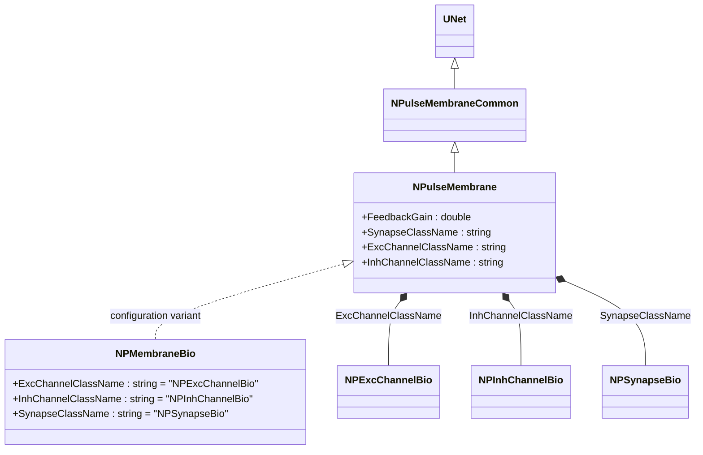
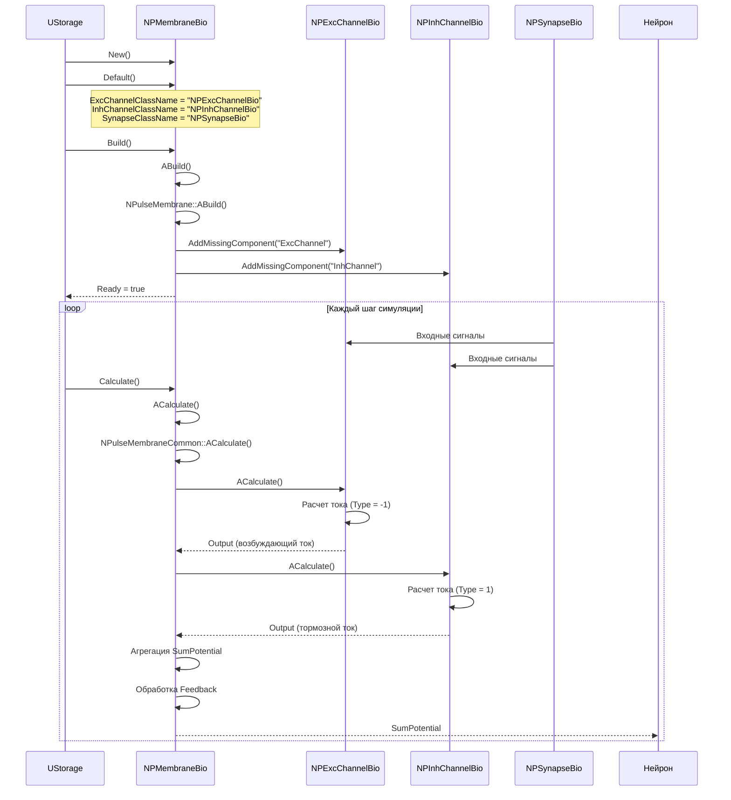
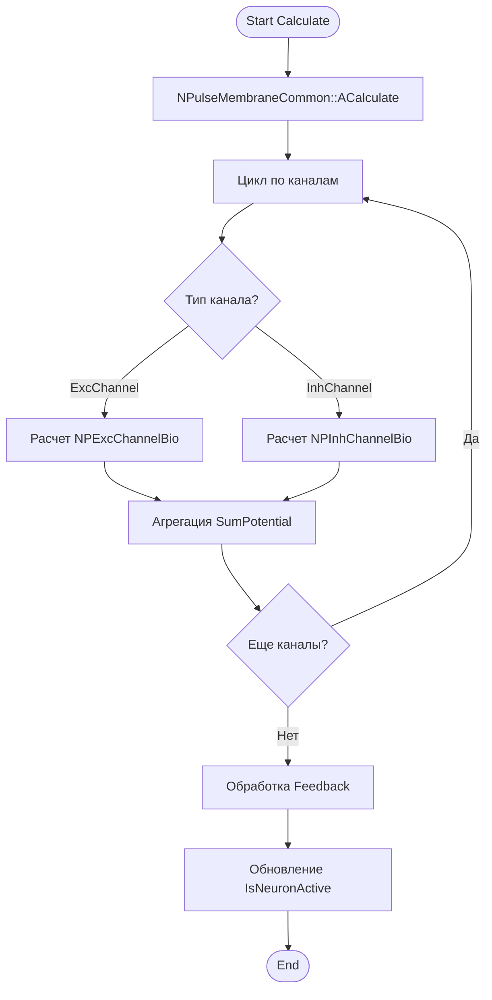
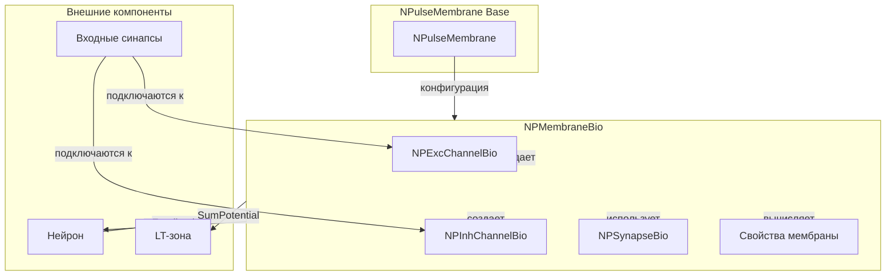
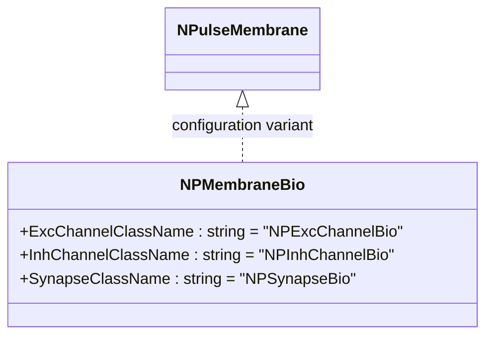
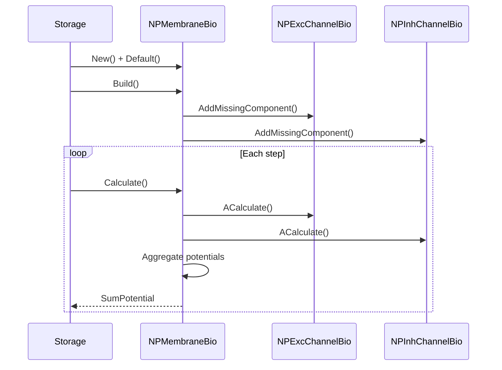
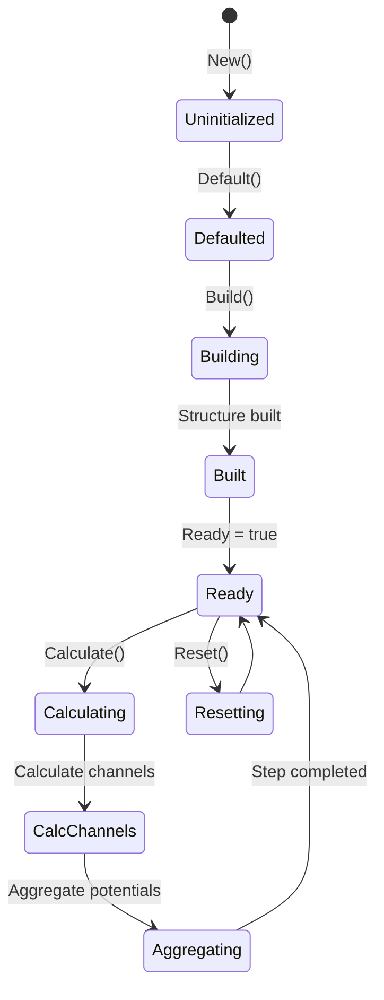
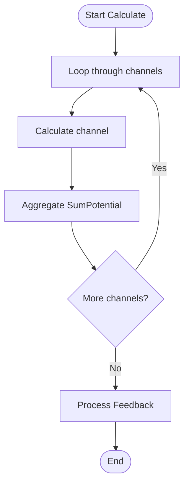

# NPMembraneBio — биоинспирированная импульсная мембрана

## RU

### Назначение

**Класс**: `NPMembraneBio` — конфигурационный вариант импульсной мембраны с биологическими параметрами.  
**Регистрация**: `NPulseLibrary.cpp` → `UploadClass("NPMembraneBio", ...)`.  
**Storage-инстансы**: `ClassName = "NPMembraneBio"` в `Bin/Configs/*/Model_*.xml`.

`NPMembraneBio` является конфигурационным вариантом класса `NPulseMembrane` с параметрами, оптимизированными для биологических моделей. При создании компонента с `ClassName = "NPMembraneBio"` создается экземпляр `NPulseMembrane` с параметрами:
- `ExcChannelClassName = "NPExcChannelBio"` — возбуждающий биоинспирированный канал
- `InhChannelClassName = "NPInhChannelBio"` — тормозной биоинспирированный канал
- `SynapseClassName = "NPSynapseBio"` — биоинспирированный синапс

**Использование:** Биоинспирированная импульсная мембрана, оптимизированные параметры для биологических моделей

### UML-диаграмма классов



**Иерархия наследования:**
- `UNet` — базовая сеть Rdk Framework
- `NPulseMembraneCommon` — общая импульсная мембрана
- `NPulseMembrane` — базовая импульсная мембрана
- `NPMembraneBio` — конфигурационный вариант для биологических моделей

**Параметры конфигурации:**
- `ExcChannelClassName = "NPExcChannelBio"` — возбуждающий биоинспирированный канал
- `InhChannelClassName = "NPInhChannelBio"` — тормозной биоинспирированный канал
- `SynapseClassName = "NPSynapseBio"` — биоинспирированный синапс

### UML-диаграмма последовательности



**Жизненный цикл:**
1. **Инициализация**: Установка биоинспирированных параметров (имена классов каналов и синапсов)
2. **Сборка**: Автоматическое создание возбуждающего и тормозного каналов с биоинспирированными параметрами
3. **Расчет**: На каждом шаге рассчитываются каналы, агрегируются потенциалы
4. **Выход**: Генерация суммарного потенциала для передачи в нейрон

### UML-диаграмма состояний

```mermaid
stateDiagram-v2
    [*] --> Uninitialized: New()
    Uninitialized --> Defaulted: Default()
    Note over Defaulted: ExcChannelClassName = "NPExcChannelBio"<br/>InhChannelClassName = "NPInhChannelBio"<br/>SynapseClassName = "NPSynapseBio"
    Defaulted --> Building: Build()
    Building --> CreatingExcChannel: Создание ExcChannel
    CreatingExcChannel --> CreatingInhChannel: Создание InhChannel
    CreatingInhChannel --> Linking: Создание связей
    Linking --> Built: Структура создана
    Built --> Ready: Ready = true
    Ready --> Calculating: Calculate()
    Calculating --> CalcExcChannel: Расчет возбуждающего канала
    CalcExcChannel --> CalcInhChannel: Расчет тормозного канала
    CalcInhChannel --> Aggregating: Агрегация потенциалов
    Aggregating --> ProcessingFeedback: Обработка Feedback
    ProcessingFeedback --> Ready: Шаг завершен
    Ready --> Resetting: Reset()
    Resetting --> Ready: Состояния сброшены
```

**Состояния:**
- **Uninitialized** — создан, но не инициализирован
- **Defaulted** — биоинспирированные параметры установлены по умолчанию
- **Building** — выполняется сборка структуры
- **CreatingExcChannel** — создание возбуждающего биоинспирированного канала
- **CreatingInhChannel** — создание тормозного биоинспирированного канала
- **Linking** — создание связей между компонентами
- **Built** — структура мембраны построена
- **Ready** — готов к выполнению расчетов
- **Calculating** — выполняется расчет мембраны
- **CalcExcChannel** — расчет возбуждающего канала
- **CalcInhChannel** — расчет тормозного канала
- **Aggregating** — агрегация потенциалов от каналов
- **ProcessingFeedback** — обработка обратной связи
- **Resetting** — выполняется сброс состояний

### UML-диаграмма активности



**Алгоритм расчета:**
1. Вызов базового метода `NPulseMembraneCommon::ACalculate()`
2. Расчет всех каналов (возбуждающих и тормозных с биоинспирированными параметрами)
3. Агрегация потенциалов от каналов в `SumPotential`
4. Обработка обратной связи (`Feedback`)
5. Обновление флага активности нейрона (`IsNeuronActive`)

### UML-диаграмма компонентов



**Зависимости:**
- **Базовый класс**: `NPulseMembrane` (конфигурационный вариант)
- **Внутренние компоненты**: `NPExcChannelBio` (возбуждающий канал), `NPInhChannelBio` (тормозной канал), `NPSynapseBio` (синапсы)
- **Внешние компоненты**: входные синапсы (подключаются к каналам), нейрон (получатель `SumPotential`, источник обратной связи), LT-зона (получатель `SumPotential`)

### Свойства

`NPMembraneBio` использует все свойства базового класса `NPulseMembrane` с параметрами:
- `ExcChannelClassName = "NPExcChannelBio"`
- `InhChannelClassName = "NPInhChannelBio"`
- `SynapseClassName = "NPSynapseBio"`

### Методы

`NPMembraneBio` использует все методы базового класса `NPulseMembrane`.

### Примеры использования

#### Пример 1: Создание мембраны в коде C++

```cpp
// Создание биоинспирированной мембраны
auto membrane = storage->CreateComponent("NPMembraneBio");
membrane->SetName("PMembraneBio");

// Инициализация (использует параметры по умолчанию)
membrane->Default();

// Использование
membrane->Build();
```

### Использование в конфигурациях

`NPMembraneBio` используется в экспериментах с биологически реалистичными параметрами:

- **Когнитивная навигация**: `Bin/Configs/User/CognitiveNavigation/*/Model_*.xml`
- **Биоинспирированные модели**: Эксперименты с биологически реалистичными мембранами

**Типичные значения параметров:**
- **ExcChannelClassName**: "NPExcChannelBio" (возбуждающий биоинспирированный канал)
- **InhChannelClassName**: "NPInhChannelBio" (тормозной биоинспирированный канал)
- **SynapseClassName**: "NPSynapseBio" (биоинспирированный синапс)

### См. также

- [`NPulseMembrane`](NPulseMembrane.md) — базовая импульсная мембрана (базовый класс)
- [`NPMembraneBio2`](NPMembraneBio2.md) — биоинспирированная мембрана (версия 2)
- [`NPExcChannelBio`](NPExcChannelBio.md) — возбуждающий биоинспирированный канал
- [`NPInhChannelBio`](NPInhChannelBio.md) — тормозной биоинспирированный канал
- [`NPSynapseBio`](NPSynapseBio.md) — биоинспирированный синапс
- [`NPulseMembraneCommon`](NPulseMembraneCommon.md) — общая импульсная мембрана
- [Architecture.md](../Architecture.md) — архитектура библиотеки

---

## EN

### Purpose

**Class**: `NPMembraneBio` — configuration variant of spiking membrane with biological parameters.  
**Registration**: `NPulseLibrary.cpp` → `UploadClass("NPMembraneBio", ...)`.  
**Instances**: `ClassName = "NPMembraneBio"` in `Bin/Configs/*/Model_*.xml`.

`NPMembraneBio` is a configuration variant of `NPulseMembrane` class with parameters optimized for biological models. When creating a component with `ClassName = "NPMembraneBio"`, an instance of `NPulseMembrane` is created with parameters:
- `ExcChannelClassName = "NPExcChannelBio"` — excitatory bio channel
- `InhChannelClassName = "NPInhChannelBio"` — inhibitory bio channel
- `SynapseClassName = "NPSynapseBio"` — bio synapse

**Usage:** Bio-inspired spiking membrane, optimized parameters for biological models

### UML Class Diagram



### UML Sequence Diagram



### UML State Diagram



### UML Activity Diagram



### See Also

- [`NPulseMembrane`](NPulseMembrane.md) — base spiking membrane (base class)
- [`NPMembraneBio2`](NPMembraneBio2.md) — bio membrane (version 2)
- [`NPExcChannelBio`](NPExcChannelBio.md) — excitatory bio channel
- [`NPInhChannelBio`](NPInhChannelBio.md) — inhibitory bio channel
- [`NPSynapseBio`](NPSynapseBio.md) — bio synapse
- [`NPulseMembraneCommon`](NPulseMembraneCommon.md) — common spiking membrane
- [Architecture.md](../Architecture.md) — library architecture
