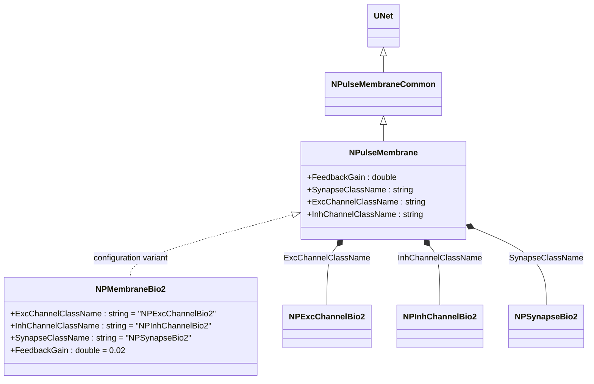
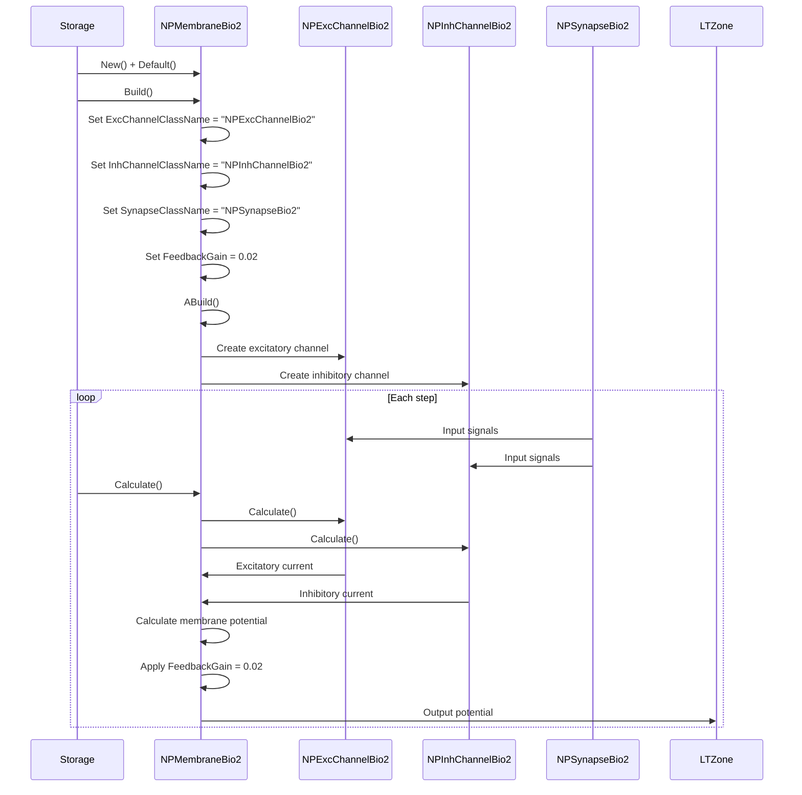
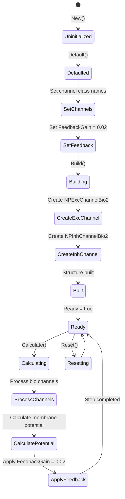
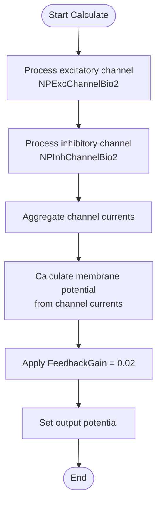

# NPMembraneBio2 — биоинспирированная импульсная мембрана (версия 2)

## RU

### Назначение

**Класс**: `NPMembraneBio2` — конфигурационный вариант импульсной мембраны с биологическими параметрами (версия 2).  
**Аббревиатура**: `Bio` — **Bio**logical (биологическая модель).  
**Регистрация**: `NPulseLibrary.cpp` → `UploadClass("NPMembraneBio2", ...)`.  
**Storage-инстансы**: `ClassName = "NPMembraneBio2"` в `Bin/Configs/*/Model_*.xml`.

`NPMembraneBio2` является конфигурационным вариантом класса `NPulseMembrane` с параметрами, оптимизированными для биологических моделей (версия 2). При создании компонента с `ClassName = "NPMembraneBio2"` создается экземпляр `NPulseMembrane` с параметрами:
- `ExcChannelClassName = "NPExcChannelBio2"` — возбуждающий биоинспирированный канал (версия 2)
- `InhChannelClassName = "NPInhChannelBio2"` — тормозной биоинспирированный канал (версия 2)
- `SynapseClassName = "NPSynapseBio2"` — биоинспирированный синапс (версия 2)
- `FeedbackGain = 0.02` — коэффициент обратной связи

**Использование:** Биоинспирированная импульсная мембрана (версия 2), улучшенные параметры для биологических моделей

### UML-диаграмма классов



**Иерархия наследования:**
- `UNet` — базовая сеть Rdk Framework
- `NPulseMembraneCommon` — общая импульсная мембрана
- `NPulseMembrane` — базовая импульсная мембрана
- `NPMembraneBio2` — конфигурационный вариант для биологических моделей (версия 2)

**Параметры конфигурации:**
- `ExcChannelClassName = "NPExcChannelBio2"` — возбуждающий биоинспирированный канал (версия 2)
- `InhChannelClassName = "NPInhChannelBio2"` — тормозной биоинспирированный канал (версия 2)
- `SynapseClassName = "NPSynapseBio2"` — биоинспирированный синапс (версия 2)
- `FeedbackGain = 0.02` — коэффициент обратной связи

### Свойства

`NPMembraneBio2` использует все свойства базового класса `NPulseMembrane` с параметрами:
- `ExcChannelClassName = "NPExcChannelBio2"`
- `InhChannelClassName = "NPInhChannelBio2"`
- `SynapseClassName = "NPSynapseBio2"`
- `FeedbackGain = 0.02`

### Методы

`NPMembraneBio2` использует все методы базового класса `NPulseMembrane`.

### Примеры использования

#### Пример 1: Создание мембраны в коде C++

```cpp
// Создание биоинспирированной мембраны (версия 2)
auto membrane = storage->CreateComponent("NPMembraneBio2");
membrane->SetName("PMembraneBio2");

// Инициализация (использует параметры по умолчанию)
membrane->Default();

// Использование
membrane->Build();
```

## Источники

См. [Literature-References.md](../Literature-References.md): **26**, **29**, **30**.

### См. также

- [`NPulseMembrane`](NPulseMembrane.md) — базовая импульсная мембрана (базовый класс)
- [`NPMembraneBio`](NPMembraneBio.md) — биоинспирированная мембрана (версия 1)
- [`NPExcChannelBio2`](NPExcChannelBio2.md) — возбуждающий биоинспирированный канал (версия 2)
- [`NPInhChannelBio2`](NPInhChannelBio2.md) — тормозной биоинспирированный канал (версия 2)
- [Architecture.md](../Architecture.md) — архитектура библиотеки

---

## EN

### Purpose

**Class**: `NPMembraneBio2` — configuration variant of spiking membrane with biological parameters (version 2).  
**Registration**: `NPulseLibrary.cpp` → `UploadClass("NPMembraneBio2", ...)`.  
**Instances**: `ClassName = "NPMembraneBio2"` in `Bin/Configs/*/Model_*.xml`.

`NPMembraneBio2` is a configuration variant of `NPulseMembrane` class with parameters optimized for biological models (version 2). When creating a component with `ClassName = "NPMembraneBio2"`, an instance of `NPulseMembrane` is created with parameters:
- `ExcChannelClassName = "NPExcChannelBio2"` — excitatory bio channel (version 2)
- `InhChannelClassName = "NPInhChannelBio2"` — inhibitory bio channel (version 2)
- `SynapseClassName = "NPSynapseBio2"` — bio synapse (version 2)
- `FeedbackGain = 0.02` — feedback gain

**Usage:** Bio-inspired spiking membrane (version 2), improved parameters for biological models

### UML Class Diagram


### UML Sequence Diagram



### UML State Diagram



### UML Activity Diagram



### UML Component Diagram

```mermaid
graph TB
    subgraph NPulseMembrane["NPulseMembrane Base"]
        BaseMembrane[NPulseMembrane]
    end
    
    subgraph NPMembraneBio2["NPMembraneBio2 Configuration"]
        ExcChannelConfig[ExcChannelClassName<br/>= "NPExcChannelBio2"]
        InhChannelConfig[InhChannelClassName<br/>= "NPInhChannelBio2"]
        SynapseConfig[SynapseClassName<br/>= "NPSynapseBio2"]
        FeedbackConfig[FeedbackGain = 0.02]
    end
    
    subgraph Channels["Bio Channels"]
        ExcChannel[NPExcChannelBio2<br/>Excitatory Channel]
        InhChannel[NPInhChannelBio2<br/>Inhibitory Channel]
    end
    
    subgraph Synapses["Synapses"]
        Synapse[NPSynapseBio2<br/>Bio Synapse]
    end
    
    subgraph External["External Components"]
        PreNeurons[Presynaptic Neurons]
        LTZone[LT-Zone]
    end
    
    BaseMembrane -->|configured as| NPMembraneBio2
    NPMembraneBio2 -->|creates| ExcChannel
    NPMembraneBio2 -->|creates| InhChannel
    PreNeurons -->|Input| Synapse
    Synapse -->|current| ExcChannel
    Synapse -->|current| InhChannel
    ExcChannel -->|Excitatory current| NPMembraneBio2
    InhChannel -->|Inhibitory current| NPMembraneBio2
    NPMembraneBio2 -->|Output potential| LTZone
```

### Properties

`NPMembraneBio2` uses all properties of base class `NPulseMembrane` with preset values:

**Configuration parameters:**
- `ExcChannelClassName = "NPExcChannelBio2"` — excitatory bio channel (version 2)
- `InhChannelClassName = "NPInhChannelBio2"` — inhibitory bio channel (version 2)
- `SynapseClassName = "NPSynapseBio2"` — bio synapse (version 2)
- `FeedbackGain = 0.02` — feedback gain

**Inherited properties:**
- `FeedbackGain` (double) — feedback gain coefficient (preset to 0.02)
- `SynapseClassName` (string) — synapse class name (preset to "NPSynapseBio2")
- `ExcChannelClassName` (string) — excitatory channel class name (preset to "NPExcChannelBio2")
- `InhChannelClassName` (string) — inhibitory channel class name (preset to "NPInhChannelBio2")

### Methods

`NPMembraneBio2` uses all methods of base class `NPulseMembrane`.

### Usage in configurations

`NPMembraneBio2` is used in bio-inspired neuron experiments (version 2):

- **Bio-inspired models (v2)**: `Bin/Configs/*/Model_*.xml` (where improved bio parameters are required)
- **Biological realism**: Experiments with improved biological parameters

**Features:**
- Automatically configured with bio channels and synapses (version 2)
- Improved parameters: Uses version 2 of bio channels and synapses
- Feedback gain: Preset feedback gain (0.02) for membrane dynamics
- Simplified configuration: All class names and parameters are preset

**Typical parameter values:**
- **ExcChannelClassName**: "NPExcChannelBio2" (excitatory bio channel v2)
- **InhChannelClassName**: "NPInhChannelBio2" (inhibitory bio channel v2)
- **SynapseClassName**: "NPSynapseBio2" (bio synapse v2)
- **FeedbackGain**: 0.02 (feedback gain coefficient)

### References

See [Literature-References.md](../Literature-References.md): **26**, **29**, **30**.

### See Also

- [`NPulseMembrane`](NPulseMembrane.md) — base spiking membrane (base class)
- [`NPMembraneBio`](NPMembraneBio.md) — bio membrane (version 1)
- [`NPExcChannelBio2`](NPExcChannelBio2.md) — excitatory bio channel (version 2)
- [`NPInhChannelBio2`](NPInhChannelBio2.md) — inhibitory bio channel (version 2)
- [Architecture.md](../Architecture.md) — library architecture
